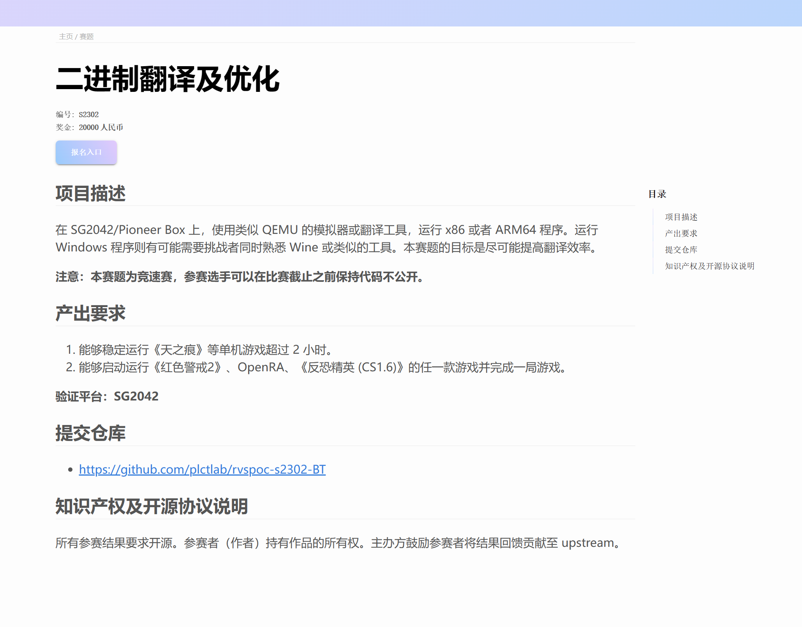
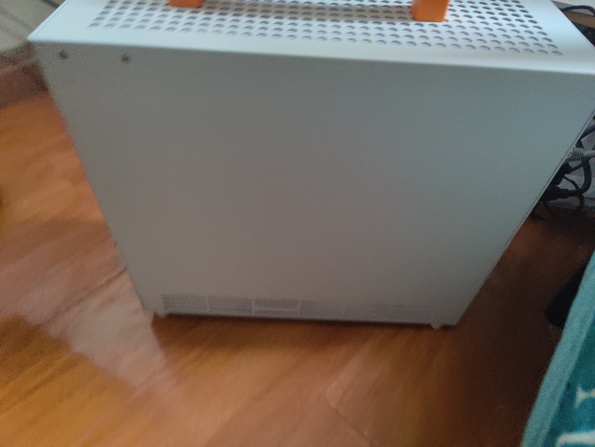

# 二进制翻译及优化快速上手

## RISC-V 软件移植及优化锦标赛

### S2302: 二进制翻译及优化

### 快速上手

<br> </br>
<br> </br>

#### RVSPOC 组委会 李程

#### 2024/1/16

## 直播回放

[S2302 B 站直播回放](https://www.bilibili.com/video/BV1YQ4y1w7aJ/)

## 题目介绍



## 二进制翻译介绍

静态转换

动态转换

### 相关开源项目:

* [QEMU](https://www.qemu.org/)
* [Box64](https://github.com/ptitSeb/box64)
* [FEX-EMU](https://github.com/FEX-Emu/FEX)
* [Instrew](https://github.com/aengelke/instrew)

**wine(Wine is not an Emulator) 不是一个二进制翻译的程序，它是一个兼容层。**

* [Wine](https://www.winehq.org/)

*本次的赛事产出要求中部分游戏仅限 Windows 下运行，需要考虑 Wine。*

## 本次演示的环境

### Pioneer 

宣传信息见官方链接:

[官方链接](https://milkv.io/zh/pioneer)

实际硬件:

| CPU | RAM | GPU |
| -------- | -------- | -------- |
| SG2042（64c）     | 128G     |  RX550(自行更换)   |

实拍图:





*注意: 底部的脚垫非常容易掉。*


## 使用 Box64 在 SG2042 上运行游戏

### Box64 的介绍

> Linux 上的用户空间的 x86_64 应用模拟器 (支持运行原生库）

> 由于 Box64 使用一些“系统”库的原生版本，如 libc、libm、SDL 和 OpenGL 等，因此很容易与大多数应用程序集成和使用，并且在许多情况下性能会相当不错。可以在这里查看一些性能测试的样例。

> Box64 集成了适用于 ARM64 和 RV64 平台的 DynaRec（动态重编译器），速度可以比纯解释模式快 5 到 10 倍。可以在这里找到有关 DynaRec 工作原理的一些信息。

[更多信息查阅](https://github.com/ptitSeb/box64/blob/main/README_CN.md)

*感谢 ksco 老师和其他贡献者等对 Box64 项目的贡献。*

### 编译 Box64

在 SG2042 上编译 Box64:

```bash
git clone https://github.com/ptitSeb/box64
cd box64
mkdir build; cd build; cmake .. -D RV64=1 -D CMAKE_BUILD_TYPE=RelWithDebInfo -D WITH_MOLD=1
mold -run make -j60 
sudo make install
```

*注意: 默认情况链接的时间比较耗时。*

* -DRV64 中包含了 RV64_DYNAREC=1 开启 RV 下的动态重编译
* -D WITH_MOLD=1 使用 MOLD 进行链接

### 通过 Box64 运行游戏

*本次演示所有游戏均自购与 GOG.com, Steam 的情况参考 Box64 说明如下:*

> 关于 Steam 的注意事项
> 请注意，Steam 是 32/64 位混合的应用，所以你需要 box86 才能运行，因为客户端应用程序是 32 位的。它还使用 64 位本地服务器，它的 steamwebhelper 无法被关闭（即使是在最小模式）而且会吃掉大量的内存。对于内存小于 6 GB 的机型，你将会需要创建 swapfile 来运行 Steam。


#### 安装游戏：

以 Bridge_constructor 为例:

```bash
BOX64_bash/home/plctlab/box64/tests/bash box64 bridge_constructor_2_0_44985.sh
```

#### 运行:

```bash
BOX64_bash/home/plctlab/box64/tests/bash box64 ~/GOG\ Games/Bridge\ Constructor/start.sh
```

#### 造桥大师

不太像能玩的样子。点击 Build 没有反应。


#### 火炬之光 2

勉强能玩，帧数很低。


#### 人力资源资源机器

完全可以玩。


#### 星露谷物语

加载很慢，概率闪退。


### 通过 Box64 + wine 运行 Windows 程序

*需要注意的是这里安装的是 X86-64 架构的 Wine*

当前的 pioneer 是 fedora。
下载 X64 架构的 RPM 包后用 rpm2cpio 解压 
[wine下载](https://wiki.winehq.org/Download)

```bash
mkdir $HOME/wine
wget https://dl.winehq.org/wine-builds/fedora/38/x86_64/wine-stable64-8.0.2-1.1.x86_64.rpm
rpm2cpio wine-stable64-8.0.2-1.1.x86_64.rpm | cpio -idv
sudo ln -s $HOME/wine/opt/wine-stable/bin/winecfg /usr/local/bin/winecfg
sudo ln -s $HOME/wine/opt/wine-stable/bin/wine64 /usr/local/bin/wine64
sudo ln -s $HOME/wine/opt/wine-stable/bin/winecfg /usr/local/bin/winecfg
sudo ln -s $HOME/wine/opt/wine-stable/bin/wineboot /usr/local/bin/wineboot
sudo ln -s $HOME/wine/opt/wine-stable/bin/wineserver /usr/local/bin/wineserver
box64 wine64 wineboot
```

*购买的 Windows 游戏没有 Wine 起来。没有做更多尝试。使用 Rufus （前几期视频介绍过的镜像工具）Windows 便携版测试*

#### 启动 rufus


