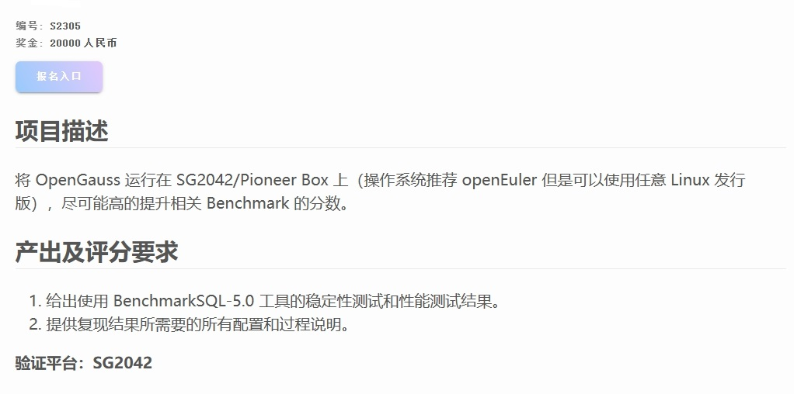
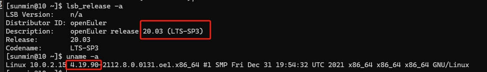
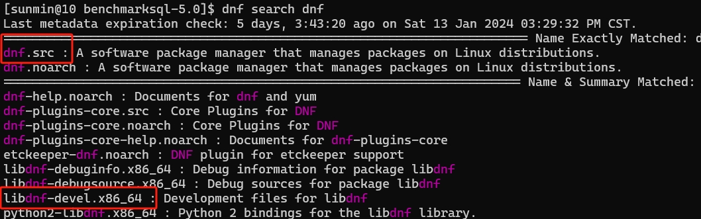
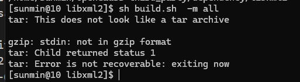
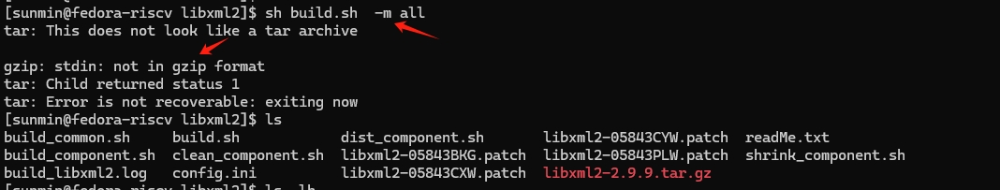

### RISC-V Software Porting and Optimization Championship 

## 赛事介绍

#### 比赛官网：https://rvspoc.org/

#### FAQ：https://rvspoc.org/faq/

#### 往期直播：https://space.bilibili.com/296494084/channel/collectiondetail?sid=1979605

#### 工作邮箱：rvspoc@cyberlimes.cn

#### 讲解主题：openGauss 数据库移植和优化

#### RVSPOC 组委会 孙敏
#### 日期：2024 1.19

<br /><br /><br /><br /><br /><br /><br /><br /><br /><br /><br /><br /><br />


##  赛题描述

### openGauss 数据库移植和优化

https://rvspoc.org/s2305/


<br /><br /><br /><br /><br /><br /><br />

**温馨提示！**

openGauss 的主仓库位于[gitee]( https://gitee.com/opengauss), 该仓库的镜像位于[github](https://github.com/opengauss-mirror)

## 内容介绍

* openGauss 简介

* 硬件与开发环境准备 

* 在 VirtualBox 中演示 openGauss

* 在 Pioneer Box 中演示 openGauss

* 总结

<br /><br /><br /><br /><br /><br /><br />

## openGauss 数据库简介

### 产品定位

- openGauss 是一款极致性能、安全、可靠的关系型 (OLTP) 开源数据库。采用协议“木兰宽松许可证” (Mulan PSL V2)，用户可以自由复制、使用、修改、分发，不论修改与否。

- 支持 SQL2003 标准语法，支持**主备部署**的高可用关系型数据库。


### 文档框架

- openGauss 5.0.0 是 openGauss 发布的第三个 LTS 版本，该版本生命周期为 3 年，发行时间是 2023 年 3 月 31 日。


https://docs-opengauss.osinfra.cn/zh/docs/5.0.0/docs/AboutopenGauss/%E5%85%B3%E4%BA%8EopenGauss.html


### 官方推荐编译环境

- openGauss 支持的操作系统（Linux 64 位）
- 内存: 8GB
- 可用磁盘 120GB （轻量版）

| 架构  | 操作系统                                 |
| -------- | ----------------------------------- |
| x86_64    | openEuler 20.03 LTS                      |
| x86_64    | openEuler 22.03 LTS                      |
| x86_64    | CentOS 7.6                      |
| x86_64    | FusionOS 22                       | 
| aarch64    | openEuler 20.03 LTS                      | 
| aarch64    | openEuler 22.03 LTS                     |
| aarch64    | Kylin-V10                     | 
| aarch64    | FusionOS 22                      |


https://docs-opengauss.osinfra.cn/zh/docs/5.0.0-lite/docs/CompilationGuide/%E6%90%AD%E5%BB%BA%E7%BC%96%E8%AF%91%E7%8E%AF%E5%A2%83.html


### 编译环境

#### SG2042 实验环境 

##### 网络资源

- RISC-V 通用云开发空间
  https://cloud.sophgo.com/developer/cloudSpace/spaceDetail/16

- EPCC RISC-V testbed
  https://riscv.epcc.ed.ac.uk/documentation/getting_started/

#### 竞赛推荐环境

- SG2042/(Pioneer Box) :white_check_mark:

- RISC-V 软件移植及优化锦标赛 联合实验平台 (ssh)

#### VirtualBox 环境配置 :white_check_mark: 

- 准备 openEuler-20.03-LTS-SP3-x86_64 虚拟环境



- 需要配置好网络


## 从源码编译 openGauss(VirtualBox)

### 为什么要在 VirtualBox 中做演示

- 官方推荐的环境
- 熟悉编译及优化流程

### 安装依赖包

```
sudo dnf install  libaio-devel flex bison ncurses-devel glibc-devel patch openeuler-lsb.x86_64 readline-devel cmake pam-devel libffi-devel tar python3-devel perl  -y
```


### 安装并配置 git 和 git-lfs

```
sudo dnf install git
sudo rpm -ivh git-lfs-3.4.1-1.el7.x86_64.rpm
```


https://packagecloud.io/github/git-lfs/packages/el/7/git-lfs-3.4.1-1.el7.x86_64.rpm/download


### 开源软件编译 (openGauss-third_party)

- 仓库地址 https://github.com/opengauss-mirror
- openGauss-third_party 源码获取
  ```
  git clone git@github.com:opengauss-mirror/openGauss-third_party.git
  ```
- third_party 整体编译
  ```
  cd openGauss-third_party/build
  #查看系统自带 gcc 版本信息
  gcc -v
  bash build_all.sh
  ```
  
- 尝试单个编译 third_party 中的依赖 （openssl）
  ```
  cd /home/sunmin/smin/openGauss-third_party/dependency/openssl
  python3 build.py -m all -f openssl-1.1.1g.tar.gz -t "comm|llt"
  ```

- 手动下载 openssl-1.1.1g.tar.gz 之后重新编译
  ```
  wget https://www.openssl.org/source/openssl-1.1.1g.tar.gz
  python3 build.py -m all -f openssl-1.1.1g.tar.gz -t "comm|llt"
  ```
  


- 尝试单个编译 third_party 中的依赖 （libxml2）
  ```
  cd /home/sunmin/openGauss-third_party/dependency/libxml2
  sh build.sh  -m all
  ```
  

- 下载正确的 tar 包之后，再次编译 libxml2
  ```
  rm libxml2-2.9.9.tar.gz
  wget ftp://xmlsoft.org/libxml2/libxml2-2.9.9.tar.gz
  sh build.sh  -m all
  ```
  


### 查看 openGauss-third_party binaryLibs
- 下载 x86_64 二进制包
  ```
  cd ~/
  wget https://opengauss.obs.cn-south-1.myhuaweicloud.com/5.0.0/binarylibs/openGauss-third_party_binarylibs_openEuler_x86_64.tar.gz
  tar -xvf openGauss-third_party_binarylibs_openEuler_x86_64.tar.gz
  ```

- 对比 二进制包与我们自己编译的 openGauss-third_party
  ```
  cd openGauss-third_party_binarylibs_openEuler_x86_64
  find ~/openGauss-third_party/ -name openssl
  find . -name openssl
  ```
  

### 编译 openGauss-server

- openGauss-server 源码
  ```
  git clone git@github.com:opengauss-mirror/openGauss-server.git
  cd openGauss-server
  git checkout --track remotes/origin/5.0.0
  ```

#### 一键式脚本编译

- 编译轻量版
  ```
  cd /home/sunmin/openGauss-server
  cd build/script
  sh cmake_package_mini.sh -m release -3rd /home/sunmin/openGauss-third_party_binarylibs_openEuler_x86_64
  ```
- 编译企业版
  ```
  cd /home/sunmin/openGauss-server
  sh build.sh -m release -3rd /home/sunmin/openGauss-third_party_binarylibs_openEuler_x86_64
  ```

#### 手动编译

- 环境变量
  ```
  export CODE_BASE=/home/sunmin/openGauss-server    # openGauss-server的路径
  export BINARYLIBS=/home/sunmin/openGauss-third_party_binarylibs_openEuler_x86_64 # binarylibs的路径
  export GAUSSHOME=$CODE_BASE/dest/
  export GCC_PATH=$BINARYLIBS/buildtools/gcc7.3/
  export CC=$GCC_PATH/gcc/bin/gcc
  export CXX=$GCC_PATH/gcc/bin/g++
  export LD_LIBRARY_PATH=$GAUSSHOME/lib:$GCC_PATH/gcc/lib64:$GCC_PATH/isl/lib:$GCC_PATH/mpc/lib/:$GCC_PATH/mpfr/lib/:$GCC_PATH/gmp/lib/:$LD_LIBRARY_PATH
  export PATH=$GAUSSHOME/bin:$GCC_PATH/gcc/bin:$PATH
  ```
- 手动配置 gcc 7.3.0, 尝试在 build-tmp 文件夹完成编译

  ```
  cd /home/sunmin/openGauss-server
  mkdir build-tmp
  cd build-tmp
  ../configure --gcc-version=7.3.0 CC=g++ CFLAGS='-O0' --prefix=$GAUSSHOME --3rd=$BINARYLIBS --enable-debug --enable-cassert --enable-thread-safety --with-readline --without-zlib

  make -j4
  ```
  

- 手动配置 gcc 7.3.0, 在主文件夹完成编译
  ```
  cd /home/sunmin/openGauss-server
  ./configure --gcc-version=7.3.0 CC=g++ CFLAGS='-O0' --prefix=$GAUSSHOME --3rd=$BINARYLIBS --enable-debug --enable-cassert --enable-thread-safety --with-readline --without-zlib
  make -j4
  ```
  


#### 安装 openGauss 轻量版

- 准备安装包
  ```
  cd /home/sunmin/openGauss-server/
  mkdir Lite-5.0.0-install
  cd Lite-5.0.0-install
  cp ../output/openGauss-Lite-5.0.0-openEuler-x86_64.tar.gz .
  tar -xvf openGauss-Lite-5.0.0-openEuler-x86_64.tar.gz
  ```
- 准备两个空的文件夹
  ```
  mkdir install
  mkdir data
  ```
- 安装
  ```
  echo Happy12345 | sh ./install.sh --mode single -D ./data/ -R ./install --start
  ```

- 查看 openGauss 进程
  ```
  ps ux | grep gaussdb
  source ~/.bashrc
  ```

- 通过 gs_ctl 命令查询数据库
  ```
  type gs_ctl
  gs_ctl query -D ./data/
  ```

- postgres 的数据库配置文件
  数据库配置文件位于：`./data/postgresql.conf`，数据库默认端口号是: 5432

- 访问 openGauss
  ```
  gsql -d postgres -p 5432
  ```

- 查看数据库列表
  ```
  \l
  ```
- 卸载 openGauss 环境
  ```
  sh uninstall.sh --delete-data
  ```

- 数据库教程
  https://docs-opengauss.osinfra.cn/zh/docs/5.0.0-lite/docs/BriefTutorial/%E7%AE%80%E5%8D%95%E6%95%B0%E6%8D%AE%E7%AE%A1%E7%90%86.html

#### 配置 TPCC 性能测试 BenchmarkSQL-5.0

- https://sourceforge.net/projects/benchmarksql/
- https://repo1.maven.org/maven2/org/opengauss/opengauss-jdbc/5.0.0/opengauss-jdbc-5.0.0.jar

- 详细指南
https://docs-opengauss.osinfra.cn/zh/docs/5.0.0/docs/PerformanceTuningGuide/%E6%90%AD%E5%BB%BA%E6%80%A7%E8%83%BD%E6%B5%8B%E8%AF%95%E7%8E%AF%E5%A2%83.html


## 从源码编译 openGauss（Pioneer Box）

### 演示环境对比

| 差异点  | Pioneer Box | VirtualBox |
| -------- | ------------------- | ----------- |
| CPU    |  RISCV64 / 64 核                      |  x86_64 / 4 核             | 
| 操作系统    | fedora-riscv 6.1.31                      | openEuler-x86_64 20.03 （Linux 4.19.90）             | 
| native gcc    | 13.2.1                      |  7.3       |

### 开源软件编译 (openGauss-third_party)

#### 依赖

```
sudo dnf install  libaio-devel flex bison ncurses-devel glibc-devel patch redhat-lsb-core.riscv64 readline-devel cmake pam-devel libffi-devel tar python3-devel  perl -y
```

#### 手动编译 gcc 7.3.0 或 gcc 10.3.0

- gcc 7.3.0 源码下载

  ```
  wget https://github.com/gcc-mirror/gcc/archive/refs/tags/releases/gcc-7.3.0.tar.gz

  tar -xvf  gcc-7.3.0.tar.gz
  cd gcc-releases-gcc-7.3.0/
  ```
- 配置与编译
  ```
  mkdir build
  cd build
  #查看 本机 gcc 版本信息
  gcc -v
  ../configure --target=riscv64-unknown-linux-gnu CXXFLAGS='-g -O2 -DTHEAD_VERSION_NUMBER=2.6.1 ' --with-system-zlib --enable-shared --enable-tls --enable-languages=c,c++,fortran --disable-libmudflap --disable-libssp --disable-libquadmath --enable-libsanitizer --disable-nls --disable-bootstrap --enable-multilib --with-abi=lp64d --with-arch=rv64gc 'CFLAGS_FOR_TARGET=-O2   -mcmodel=medany' 'CXXFLAGS_FOR_TARGET=-O2   -mcmodel=medany'
  make -j64
  ```


- gcc 10.3.0 编译

  ```
  ../configure --disable-multilib
  make -j64
  ```
  


#### third_party 源码编译

- openGauss-third_party
  ```
  git clone git@github.com:opengauss-mirror/openGauss-third_party.git
  ```
- third_party 整体编译
  ```
  cd openGauss-third_party/build
  bash build_all.sh
  ```

- 查看 third_party 的依赖情况
  ```
  cd /home/sunmin/smin/openGauss-third_party/
  ls 
  ```
- 尝试单个编译 third_party 中的依赖（libxml2）
  ```
  /home/sunmin/smin/openGauss-third_party/dependency/libxml2
  sh build.sh  -m all
  ```
  

- 下载正确的 tar 包之后，再次编译 libxml2
  ```
  mv libxml2-2.9.9.tar.gz libxml2-2.9.9.tar.gz.old
  wget ftp://xmlsoft.org/libxml2/libxml2-2.9.9.tar.gz
  sh build.sh  -m all
  ```
  

- 尝试单个编译 third_party 中的依赖（openssl）
  ```
  cd /home/sunmin/smin/openGauss-third_party/dependency/openssl
  python3 build.py -m all -f openssl-1.1.1g.tar.gz -t "comm|llt"
  ```
  

- 尝试手动解决上述问题
  ```
  cd /home/sunmin/smin/openGauss-third_party/dependency/openssl/openssl-1.1.1g
  ./config no-afalgeng
  make -j
  ```
  


#### 软件安装编译（openGauss-server）

##### openGauss-server 源码

```
git clone git@github.com:opengauss-mirror/openGauss-server.git
cd openGauss-server
git checkout --track remotes/origin/5.0.0
```

##### 一键编译脚本
```
cd build/script
sh build.sh -m debug -3rd ???
```

##### 手动编译 openGauss-server
- 环境变量
  ```
  export CODE_BASE=???  # openGauss-server的路径
  export BINARYLIBS=??? # binarylibs的路径
  export GAUSSHOME=$CODE_BASE/dest/
  export GCC_PATH=$BINARYLIBS/buildtools/gcc7.3/
  export CC=$GCC_PATH/gcc/bin/gcc
  export CXX=$GCC_PATH/gcc/bin/g++
  export LD_LIBRARY_PATH=$GAUSSHOME/lib:$GCC_PATH/gcc/lib64:$GCC_PATH/isl/lib:$GCC_PATH/mpc/lib/:$GCC_PATH/mpfr/lib/:$GCC_PATH/gmp/lib/:$LD_LIBRARY_PATH
  export PATH=$GAUSSHOME/bin:$GCC_PATH/gcc/bin:$PATH
  ```

- 在临时文件夹下做编译操作
  ```
  mkdir build-tmp
  cd build-tmp
  ../configure --gcc-version=13.2.1 --enable-debug
  ```

https://docs-opengauss.osinfra.cn/zh/docs/5.0.0/docs/CompilationGuide/%E7%89%88%E6%9C%AC%E7%BC%96%E8%AF%91.html

## 总结

### VirtualBox 中的编译情况分析

- 基于 native gcc 编译 binaryLibs 中的模块 :white_check_mark:
- 基于官方释放的 binaryLibs 编译 openGauss-server :white_check_mark:
- 安装配置 openGauss-server :white_check_mark:
- 配置 TPCC 性能测试 BenchmarkSQL-5.0
- BenchmarkSQL-5.0 稳定性测试和性能测试结果 :x:

### 在 SG2042(Pioneer Box) 移植情况分析

- 从源码编译 gcc7.3.0/gcc10.3.0 :x:
- 基于 native gcc 编译 binaryLibs 中的模块 :white_check_mark:
- 基于 native gcc 编译 openGauss-server :x:
- 基于 binaryLibs 编译 openGauss-server :x:
- 安装配置 openGauss-server :x:
- 配置 TPCC 性能测试 BenchmarkSQL-5.0 :x:
- BenchmarkSQL-5.0 稳定性测试和性能测试结果 :x:

### 实用信息

- https://forum.openeuler.org/t/topic/1152 SG2042 服务器板卡适配 openEuler 23.03

- https://docs-opengauss.osinfra.cn/zh/docs/latest-lite/docs/TechnicalWhitePaper/%E4%BA%A7%E5%93%81%E5%AE%9A%E4%BD%8D.html

- https://docs-opengauss.osinfra.cn/zh/docs/latest-lite/docs/ReleaseNotes/%E7%89%88%E6%9C%AC%E4%BD%BF%E7%94%A8%E6%B3%A8%E6%84%8F%E4%BA%8B%E9%A1%B9.html


- https://docs-opengauss.osinfra.cn/zh/docs/latest-lite/docs/ReleaseNotes/%E7%89%88%E6%9C%AC%E4%BB%8B%E7%BB%8D.html

- https://docs-opengauss.osinfra.cn/zh/docs/5.0.0-lite/docs/InstallationGuide/%E5%87%86%E5%A4%87%E8%BD%AF%E7%A1%AC%E4%BB%B6%E5%AE%89%E8%A3%85%E7%8E%AF%E5%A2%83.html

- https://docs-opengauss.osinfra.cn/zh/docs/5.0.0-lite/docs/CompilationGuide/%E6%90%AD%E5%BB%BA%E7%BC%96%E8%AF%91%E7%8E%AF%E5%A2%83.html
