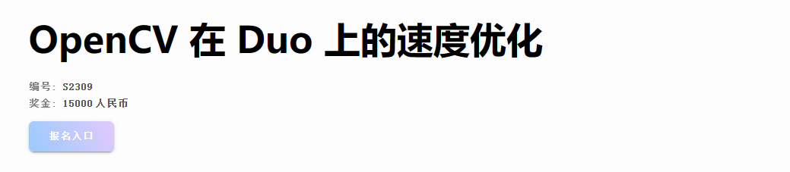
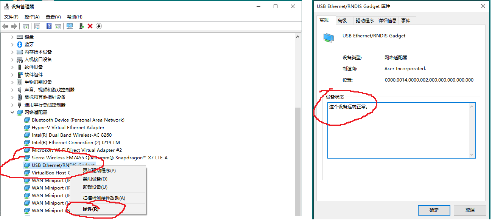
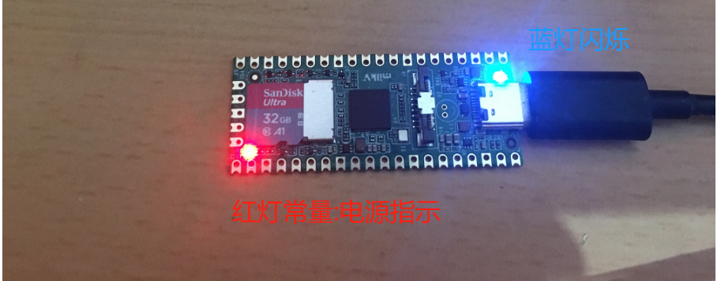
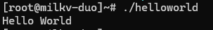
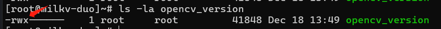
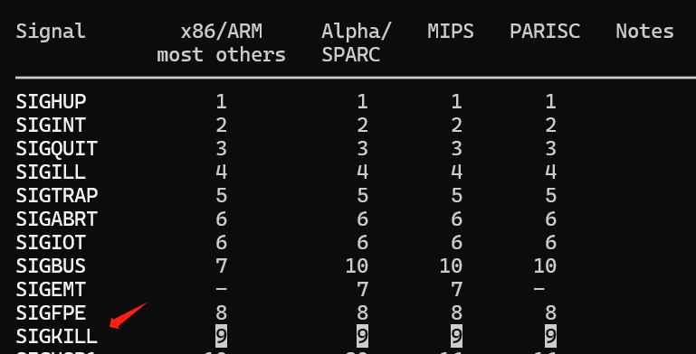
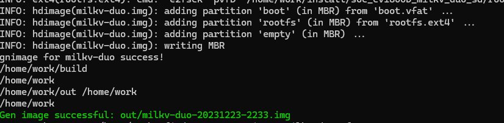
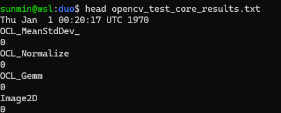

# RISC-V 软件移植及优化锦标赛 S2309


### RISC-V Software Porting and Optimization Championship 


## 赛事介绍

#### 官网：https://rvspoc.org/

#### FAQ：https://rvspoc.org/faq/

#### 工作邮箱：rvspoc@cyberlimes.cn

#### 讲解主题：OpenCV 在 Duo 上的速度优化

#### 直播回放地址: https://www.bilibili.com/video/BV15g4y1k7Lp/


#### RVSPOC 组委会: 孙敏

<br /><br /><br /><br /><br /><br /><br /><br /><br /><br /><br /><br /><br />

## S2309 赛题描述

https://rvspoc.org/s2309/



* 本次竞赛旨在提升 **OpenCV** 在 **Milk-V Duo** 平台上的性能，参赛者需要将 OpenCV 库移植到 Milk-V Duo 平台上，并尽可能提升其性能。

* 评审标准将聚焦于正确性和性能两个方面：正确性评价使用 OpenCV 各模块的回归测试 (**build/bin/opencv\_test\_\***) 进行评估。

* 性能评价使用 OpenCV 各模块的性能测试 (**build/bin/opencv\_perf_\***) 进行评估。

* 最终，组委会将根据参赛作品的**回归测试通过率和性能数据**进行评分，两者将按照预设的加权比例计算出最终得分，得分最高的参赛者将获得胜利。

<br /><br /><br /><br /><br /><br /><br /><br /><br /><br /><br /><br /><br />


<br /><br /><br /><br /><br /><br /><br /><br /><br />


## 内容介绍

* 准备硬件与开发环境

* Duo 上的 Hello World

* duo-app-sdk 下载与简单试用

* OpenCV 源码下载与编译

* Duo 上运行 OpenCV 应用程序

* 如何扩展可用内存以增强应用程序运行效率

* 回归测试总结

* 参考链接

* 实用脚本

* core 模块回归测试结果 


<br /><br /><br /><br /><br /><br /><br />


## 准备开发环境

### 参考硬件配置

* X86 PC: 8 核处理器+ 32GB 内存 + 512GB 磁盘

* Duo 开发板: CPU（C906） + RAM（64MB)

* SDCard: 32GB + SD Card reader

* USB Type-A to Type-C 线:  RNDIS driver needed


<br /><br /><br /><br /><br /><br /><br />

### 参考软件配置

* Host OS: WSL(Ubuntu20.04) on Windows 10

* Milk-v Duo 操作系统镜像

* OpenCV 4.8.1 源码

* Duo-App-SDK

* 镜像烧录工具 rufus

* RNDIS 驱动

* 环境变量\$DUO_HOME, \$RISCV_ROOT_PATH

* Linux 基础软件：vi ssh gcc make libxml2-utils

<br /><br /><br /><br /><br /><br /><br />

#### 安装驱动 

* PC 端 USBNet 驱动安装 参照：https://milkv.io/docs/duo/getting-started/setup



### 烧录镜像

* 下载 Milk-v Duo 官方镜像并且烧录到 SD 卡 https://github.com/milkv-duo/duo-buildroot-sdk/releases/download/Duo-V1.0.6/milkv-duo-v1.0.6-2023-1201.img.zip


### 验证镜像


* 开发板上电开机



* PC 端通过 Type-C 线，以 ssh 协议连接到开发板

    - 确保 USBnet 可用
    
```
ping 192.168.42.1

``` 


* 开发板打印 Hello World

```
echo Hello World
```

* 建议修改开发板上的时钟信息(可选操作，断电后失效)

```
date -s '2023-12-22 13:43:11'
```

* 查看操作系统信息以及指令集支持信息

```
uname -a
cat /proc/cpuinfo
```


## 创建环境变量及shell函数(可选)

* 环境变量

``` bash
#确保我们的工作文件夹存在
mkdir -p /home/${USER}/duo

#创建 Duo 文件夹环境变量
export DUO_HOME=/home/${USER}/duo

#所有的优化工作都在这个文件夹进行
cd $DUO_HOME

#创建工具链的环境变量
export RISCV_ROOT_PATH=$DUO_HOME/duo-sdk
```

* shell 函数以及快捷指令

    - alias duo='ssh root@192.168.42.1'
    - toduo 上传文件到 Duo 开发板
    - fromduo 从开发板下载文件到$DUO_HOME


## duo-app-sdk 快速上手

### 获取 duo-app-sdk

``` bash

wget https://github.com/milkv-duo/duo-app-sdk/releases/download/duo-app-sdk-v1.2.0/duo-sdk-v1.2.0.tar.gz
tar -xvf duo-sdk-v1.2.0.tar.gz

```

### 从源码编译运行 Hello World

* 查看 gcc 版本，确保系统能找到正确的编译器

```
$RISCV_ROOT_PATH/riscv64-linux-musl-x86_64/bin/riscv64-unknown-linux-musl-gcc -v

Using built-in specs.
COLLECT_GCC=/home/sunmin/duo/duo-sdk/riscv64-linux-musl-x86_64/bin/riscv64-unknown-linux-musl-gcc
COLLECT_LTO_WRAPPER=/home/sunmin/duo/duo-sdk/riscv64-linux-musl-x86_64/bin/../libexec/gcc/riscv64-unknown-linux-musl/10.2.0/lto-wrapper
Target: riscv64-unknown-linux-musl
....
Thread model: posix
Supported LTO compression algorithms: zlib
gcc version 10.2.0 (Xuantie-900 linux-5.10.4 musl gcc Toolchain V2.6.1 B-20220906)

```

* 准备Hello World 源码

```
cd $DUO_HOME
cat helloworld.c
#include "stdio.h"
int main(){
        printf("Hello World\n");
        return 0;
}
```

* 编译 Hello World
```
 $RISCV_ROOT_PATH/riscv64-linux-musl-x86_64/bin/riscv64-unknown-linux-musl-gcc -march=rv64gcv0p7_zfh_xtheadc -mabi=lp64d -mtune=c906 helloworld.c -o helloworld
 #把二进制文件上传到开发板
toduo helloworld
```

* 在开发板执行 helloworld 程序  
```
./helloworld
```


## OpenCV 编译环境


* 从官方下载 OpenCV 4.8.1 源码
```
cd $DUO_HOME
wget -q https://github.com/opencv/opencv/archive/4.8.1.zip
unzip 4.8.1.zip
cd opencv-4.8.1

```
### OpenCV cmake

* 新建 riscv64-unknown-linux-musl.toolchain.cmake 文件

```
touch platforms/linux/riscv64-unknown-linux-musl.toolchain.cmake

```

* 修改 riscv64-unknown-linux-musl.toolchain.cmake 文件内容为如下

```
set(CMAKE_SYSTEM_NAME Linux)
set(CMAKE_SYSTEM_PROCESSOR riscv64)

if(DEFINED ENV{RISCV_ROOT_PATH})
    file(TO_CMAKE_PATH $ENV{RISCV_ROOT_PATH} RISCV_ROOT_PATH)
else()
    message(FATAL_ERROR "RISCV_ROOT_PATH env must be defined")
endif()

set(RISCV_ROOT_PATH ${RISCV_ROOT_PATH} CACHE STRING "root path to riscv toolchain")

set(CMAKE_CXX_COMPILER "${RISCV_ROOT_PATH}/riscv64-linux-musl-x86_64/bin/riscv64-unknown-linux-musl-g++")
set(CMAKE_C_COMPILER "${RISCV_ROOT_PATH}/riscv64-linux-musl-x86_64/bin/riscv64-unknown-linux-musl-gcc")

#在编译器选项中开启rvv 0.7.1,针对c906 cpu做优化
set(CMAKE_C_FLAGS "-march=rv64gcv0p7_zfh_xtheadc -mabi=lp64d -mtune=c906")
set(CMAKE_CXX_FLAGS "-march=rv64gcv0p7_zfh_xtheadc -mabi=lp64d -mtune=c906")

```

* 查看 OpenCV 对 cmake 要求
```
vi cmake/OpenCVMinDepVersions.cmake
```

* 创建 build 文件夹

``` 
mkdir build && cd build
```

* 调用 cmake

```
 cmake -DCMAKE_TOOLCHAIN_FILE=../platforms/linux/riscv64-unknown-linux-musl.toolchain.cmake -DCMAKE_C_FLAGS="-fno-rtti -fno-exceptions" -DCMAKE_INSTALL_PREFIX=install -DCMAKE_BUILD_TYPE=Release -DBUILD_opencv_world=OFF -DOPENCV_DISABLE_FILESYSTEM_SUPPORT=ON ..
```
* 查看 cmake 输出

``` bash
-- The CXX compiler identification is GNU 10.2.0
-- The C compiler identification is GNU 10.2.0
...
--
--   Platform:
--     Timestamp:                   2023-12-16T09:22:59Z
--     Host:                        Linux 5.15.133.1-microsoft-standard-WSL2 x86_64
--     Target:                      Linux riscv64
--     CMake:                       3.16.3
--     CMake generator:             Unix Makefiles
--     CMake build tool:            /usr/bin/make
--     Configuration:               Release
--
--   CPU/HW features:
--     Baseline:                    RVV
--       requested:                 DETECT
...
--   OpenCV modules:
--     To be built:                 calib3d core dnn features2d flann gapi highgui imgcodecs imgproc ml objdetect photo stitching ts video videoio
--     Disabled:                    world
--     Disabled by dependency:      -
--     Unavailable:                 java python2 python3
--     Applications:                tests perf_tests apps
...
--   OpenCL:                        YES (no extra features)
--     Include path:                /home/sunmin/duo/opencv-4.8.1/3rdparty/include/opencl/1.2
--     Link libraries:              Dynamic load
--
--   Python (for build):            /usr/bin/python2.7
--
--   Install to:                    /home/sunmin/duo/opencv-4.8.1/build/install
-- -----------------------------------------------------------------
--
-- Configuring done
-- Generating done
-- Build files have been written to: /home/sunmin/duo/opencv-4.8.1/build
```
### 编译 opencv_test_core opencv_perf_core opencv_version

* core 模块回归测试与性能测试的 CMakeLists.txt

 ```
vi ../modules/core/CMakeLists.txt
#回归测试 cmake函数
ocv_add_accuracy_tests
#性能测试 cmake函数
ocv_add_perf_tests
```

* version 应用程序的 CMakeLists.txt

``` bash
 cat ../apps/version/CMakeLists.txt
ocv_add_application(opencv_version MODULES opencv_core SRCS opencv_version.cpp)
if(WIN32)
  ocv_add_application(opencv_version_win32 MODULES opencv_core SRCS opencv_version.cpp)
  target_compile_definitions(opencv_version_win32 PRIVATE "OPENCV_WIN32_API=1")
endif()
```

* 开启 8 个线程去编译,参考耗时： 8 分钟
``` bash
make -j8 opencv_test_core opencv_perf_core opencv_version
```
``` bash
Scanning dependencies of target opencv_test_core
[ 94%] Building CXX object modules/core/CMakeFiles/opencv_test_core.dir/test/ocl/test_channels.cpp.o
[ 94%] Building CXX object modules/core/CMakeFiles/opencv_test_core.dir/test/ocl/test_dft.cpp.o
...
Scanning dependencies of target opencv_perf_core
[ 94%] Building CXX object modules/core/CMakeFiles/opencv_perf_core.dir/perf/opencl/perf_arithm.cpp.o
...
[ 94%] Building CXX object modules/core/CMakeFiles/opencv_perf_core.dir/perf/perf_cvround.cpp.o
[ 97%] Building CXX object modules/core/CMakeFiles/opencv_perf_core.dir/perf/perf_dft.cpp.o
Scanning dependencies of target opencv_version
[100%] Building CXX object apps/version/CMakeFiles/opencv_version.dir/opencv_version.cpp.o
[100%] Linking CXX executable ../../bin/opencv_version
```

#### 查看生成的可执行文件

```
\ls -lh ./bin/opencv_version
\ls -lh ./bin/opencv_perf_core
\ls -lh ./bin/opencv_test_core
file ./bin/opencv_version
file ./bin/opencv_perf_core
file ./bin/opencv_test_core
```


#### 将可执行文件拷贝到开发板 


```
toduo ./bin/opencv_version 
toduo ./bin/opencv_test_core 
toduo ./bin/opencv_perf_core
```
#### 在开发板查看 opencv 的版本信息
```
#连接开发板
duo
cd /root
```

* 确保动解释器(动态链接库)存在
```
ls -la /lib/ld-musl-riscv64v0p7_xthead.so.1
```


* 确保文件可执行
```
ls -la opencv_version
```


* 开发板运行 opencv_version


* 如果报错日志特别多，可以保存到文件

```
./opencv_version 2>&1 | tee -a log.txt
```

* PC 端把需要用到的动态链接库拷贝到开发板

```
tar -cvf lib.tar lib/
toduo lib.tar

```

* 手动增加动态链接库的路径

```
tar -xvf lib.tar
LD_LIBRARY_PATH=./lib/ ./opencv_version

```


#### 在开发板上运行回归测试（示例）

* 在开发板运行回归测试

```
$ LD_LIBRARY_PATH=./lib/ time ./opencv_test_core

CTEST_FULL_OUTPUT
OpenCV version: 4.8.1
OpenCV VCS version: 05ce703-dirty
Build type: Release
Compiler: /home/sunmin/duo/duo-sdk/riscv64-linux-musl-x86_64/bin/riscv64-unknown-linux-musl-g++  (ver 10.2.0)
Parallel framework: pthreads (nthreads=1)
CPU features: RVV
OpenCL is disabled
TEST: Skip tests with tags: 'mem_6gb', 'verylong'
[==========] Running 11646 tests from 261 test cases.
[----------] Global test environment set-up.
...
[ RUN      ] Core_DS_Seq.sort_invert
Command terminated by signal 9
real    0m 44.34s
user    0m 31.08s
sys     0m 1.77s

```

* 在PC端查看错误信号 signal 9

```
man 7 signal
```


#### 在开发板过滤回归测试用例

* gtest 用法
```
LD_LIBRARY_PATH=./lib ./opencv_test_core  --help | less
```

* 生成回归测试清单

```
#尝试生成全部清单会失败
#LD_LIBRARY_PATH=./lib ./opencv_test_core  --gtest_list_tests --gtest_output=xml
#随机筛选，回归测试用例，生成清单
LD_LIBRARY_PATH=./lib ./opencv_test_core  --gtest_list_tests --gtest_filter="*Spectrums*" --gtest_output=xml

```

* 查看回归测试清单(*Spectrums*)


* 尝试运行一小部分回归测试

```
LD_LIBRARY_PATH=./lib time ./opencv_test_core  --gtest_filter="*Spectrums*" --gtest_output=xml
```

### 运行性能测试 (failed)

```
LD_LIBRARY_PATH=./lib time ./opencv_perf_core --gtest_filter="*Size_MatType_countNonZero*"  --gtest_output=xml
```


## 扩大可用内存

* 先关机断电再拔出内存卡（避免烧卡）

```
halt -f
```

* 参照 Milk-V 官方教程 编译大内存镜像约 55 MB 可用

https://milkv.io/docs/duo/getting-started/buildroot-sdk#2-compiled-using-docker
```
cd $DUO_HOME
wget https://github.com/milkv-duo/duo-buildroot-sdk/archive/refs/tags/Duo-V1.0.7.tar.gz

tar -xvf Duo-V1.0.7.tar.gz && cd duo-buildroot-sdk-Duo-V1.0.7

#查看当前正在运行的容器
sudo docker ps -a

#如果容器不存在则创建
#docker run -itd --name duodocker -v $(pwd):/home/work milkvtech/milkv-duo:latest /bin/bash

#如果容器已经创建成功，直接打开
sudo docker start duodocker
sudo docker exec -it duodocker /bin/bash

```

* 以下9条命令在 docker 容器中执行

```
cd /home/work
vi build/boards/cv180x/cv1800b_milkv_duo_sd/memmap.py
```


```
./build.sh milkv-duo
source device/milkv-duo-python/boardconfig.sh

source build/milkvsetup.sh
defconfig cv1800b_milkv_duo_sd
clean_all
build_all
pack_sd_image
```


### ssh 连接开发板 登录方式和之前一样

```
duo
或
ssh root@192.168.42.1
```

### 建议修改一下系统时钟
```
date -s '2023-12-26 20:33:11'
```

### 查看可用内存

```
[root@milkv-duo]~# free -h
              total        used        free      shared  buff/cache   available
Mem:          55.3M       22.2M       12.2M      260.0K       20.9M       29.2M
Swap:             0

```

### 配置公钥，免去频繁输密码的烦恼 (参考文末公钥配置指南)


### 再次运行回归测试 opencv_test_core


* 把二进制文件以及运行库拷贝到开发板

```
cd $DUO_HOME/opencv-4.8.1/build
tar -cvf lib.tar lib/
toduo lib.tar
toduo ./bin/opencv_version
toduo ./bin/opencv_test_core
toduo ./bin/opencv_perf_core

```

* 开发板配置$LD_IBRARY_PATH

```
export LD_LIBRARY_PATH='/root/lib/:$LD_LIBRARY_PATH'
```

* 再次生成完整的回归测试清单

```
tar -xvf lib.tar
./opencv_test_core  --gtest_list_tests --gtest_output=xml

mv test_detail.xml opencv_test_core_list.xml
```
* 把回归测试清单下载到 PC 端

```
fromduo opencv_test_core_list.xml
```


* 开发板尝试运行全部回归测试

```
$ time ./opencv_test_core

CTEST_FULL_OUTPUT
OpenCV version: 4.8.1
OpenCV VCS version: unknown
Build type: Release
Compiler: /home/sunmin/duo/duo-sdk/riscv64-linux-musl-x86_64/bin/riscv64-unknown-linux-musl-g++  (ver 10.2.0)
Parallel framework: pthreads (nthreads=1)
CPU features: RVV
OpenCL is disabled
TEST: Skip tests with tags: 'mem_6gb', 'verylong'

[ RUN      ] Core_DS_Seq.sort_invert
[       OK ] Core_DS_Seq.sort_invert (151123 ms)
[----------] 2 tests from Core_DS_Seq (168377 ms total)

[----------] 1 test from Core_DS_Set
[ RUN      ] Core_DS_Set.basic_operations
[       OK ] Core_DS_Set.basic_operations (25803 ms)
[----------] 1 test from Core_DS_Set (25805 ms total)
...
[----------] 2 tests from Core_SparseMat
[ RUN      ] Core_SparseMat.footprint
before: node size=32 bytes, data size=0 Mbytes
Command terminated by signal 9
real    7m 54.34s
user    7m 37.15s
sys     0m 12.36s
```

* 筛选一部分回归测试

```
time ./opencv_test_core  --gtest_filter="*Spectrums*" --gtest_output=xml

mv test_detail.xml opencv_test_core_Spectrums.xml
```

* 在 PC 端查看测试结果
```
fromduo opencv_test_core_Spectrums.xml
```

#### 通过 bash/ash 脚本执行回归测试

* 在 PC 端解析测试清单到 text 文本
```
$ cat xml-to-txt.sh

#!/bin/bash
core_list=opencv_test_core_list.txt
core_names=opencv_test_core_names.txt
xmllint --xpath '/testsuites/testsuite/@name' opencv_test_core_list.xml > $core_list

while read -r line
do
        IFS=\" read -r f1 f2  <<<"$line"
        echo $f2 >> $core_names
done <"$core_list"
rm $core_list
```

* 开发板解析 text 文本 依次完成测试项
耗时约8个小时

```

[root@milkv-duo]~# cat core-test.sh
#!/bin/ash
input=opencv_test_core_names.txt
output=opencv_test_core_results.txt
tmp_dir=testdetail
mkdir -p $tmp_dir
rm -f $tmp_dir/*
date >>  $output
export LD_LIBRARY_PATH='/root/lib/:$LD_LIBRARY_PATH'
while read -r line
do
                #把测试名称保存到文件
        echo $line >> $output
                #把每一项的测试详情保存到文件
        ./opencv_test_core  --gtest_filter="*$line*" 2>&1 | tee -a $tmp_dir/"$line"_detail.txt
                #把测试是否通过的结果保存到文件
        echo $? >> $output
done <"$input"
echo "Test end @" >> $output
date >>  $output
```
* 在 PC 端统计回归测试通过率

```
fromduo opencv_test_core_results.txt
head opencv_test_core_results.txt

```


## 测试总结

### 在 55MB 内存、无 swap 分区条件下的 OpenCV4.8.1 回归测试与性能测试结果

| 准确性模块  |    通过率(%)                              | 备注| 性能模块 | 性能数据      | 备注 |
| -------- | ----------------------------------- | ------------------- | ----------- | ----------| ----- |
| opencv_test_core    | 90.63                   | |  opencv_perf_core             | NA | |
| opencv_test_calib3d    |       NA                |  | opencv_perf_calib3d             | NA | |
| opencv_test_dnn    |    NA                   |  |  opencv_perf_dnn             | NA | |
| ...    |                       |  | ...             |  | |

### 需要选手们按照评分标准去优化


## 参考脚本

* 环境变量配置脚本 duo-env.sh

``` bash
#使用之前需要 source duo-env.sh
export DUO_HOME=/home/${USER}/duo
export RISCV_ROOT_PATH=$DUO_HOME/duo-sdk

alias duo='ssh root@192.168.42.1'

#上传文件/文件夹到 Duo 开发板
toduo ()
{
    scp -r $1 root@192.168.42.1:/root/
}

#从 Duo 开发板下载文件/文件夹到 $DUO_HOME
fromduo ()
{    
     #如果用户不指定文件名，则列出 Duo 上的文件
     if [ -z "$1" ]; then
        echo "Woops！请指定文件或者文件夹"
            ssh root@192.168.42.1 ls -la /root
        else
            scp -r $1 root@192.168.42.1:/root/$1 $DUO_HOME $1
     fi
}
```


### 公钥配置指南

* 在 PC 端生成 ssh 公钥

```
ssh-keygen -t rsa -b 4096 -C "your_email@domain.com"
```

* 在开发板配置公钥 (重新连接生效)

```
cd /root
mkdir -p .ssh
#把 PC 端的公钥添加或者追加到 Duo 的信任列表
vi .ssh/authorized_keys
```

* 在 PC 端验证公钥是否添加成功

```
ssh root@192.168.42.1
```

### 开发板 配置 $LD_LIBRARY_PATH 环境变量

```
cat /root/.profile

export LD_LIBRARY_PATH='/root/lib/:$LD_LIBRARY_PATH'
```


## 参考链接

* Duo 系统镜像源码
https://github.com/milkv-duo/duo-buildroot-sdk/releases/


* Duo-App-SDK 
https://github.com/milkv-duo/duo-app-sdk
 
* 镜像烧录工具 https://github.com/pbatard/rufus/releases/download/v4.3/rufus-4.3.exe

* USBNet(RNDIS)驱动   https://raw.githubusercontent.com/milkv-duo/duo-files/main/others/RNDIS_drivers_20231018.zip

- OpenCV 在 RISC-V 平台的优化思路 https://plctlab.github.io/opencv/Optimize_OpenCV_for_RISC-V.html

- T-Head OpenCV(4.5.4) https://www.xrvm.cn/community/download?id=4222789219212398592
<br /><br /><br /><br /><br /><br /><br />

## 致谢

- opencv-mobile(4.8.1) 
https://github.com/nihui/opencv-mobile

- 对 Duo 做了特别支持

https://github.com/nihui/opencv-mobile?tab=readme-ov-file#opencv-mobile-package-for-development-boards

- opencv-mobile 作者亲自写的教程
https://community.milkv.io/t/opencv-mobile-opencv-milkv-duo/557

- 注意：默认 disable 了 OpenCV 各个模块的`test/perf` 测试程序

<br /><br /><br /><br /><br /><br /><br />


## core模块回归测试结果

[opencv_test_core_results.txt](./opencv_test_core_results.md)
