# RetroArch 移植与优化


|              | PR1                  | PR2                  | PR3                  |
| ------------ | -------------------- | -------------------- | -------------------- |
| RetroArch 前端 | Y                    | Y                    | Y                    |
| PPSSPP       | Y                    | Y                    | Y                    |
| Flycast      | N                    | N                    | Y                    |
| 额外的核心        | Y                    | Y                    | Y                    |
| 提交时间         | 2024-07-07T16:09:24Z | 2024-08-01T11:39:31Z | 2024-08-02T19:06:53Z |


## 环境准备
### 核心列表

预期的一些移植核心和原游戏机名对照，用于 ROM 的查找和下载


| 核心名称          | 模拟游戏机       |
| ------------- | ----------- |
| bsnes-mercury | SNES        |
| Beetle PSX    | PS1         |
| Beetle VB     | Virtual boy |
| DeSmuME       | NDS         |
| Gambatte      | GB/C        |
| mGBA          | GBA         |
| Mupen64Plus   | N64         |
| Nestopia      | NES         |
| Snes9x        | SNES/SFC    |
| PPSSPP        | PSP         |
| flycast       | DC          |

### 游戏列表

将游戏以游戏机名称分类，放入 roms 文件夹中。BIOS 放入 BIOS 文件夹等待使用。

```bash
roms/
├── DC
│   ├── BH_VERONICA_PLUS_FULL_CN7_A_BY_YZB.cdi
│   └── LAST_BLADE2_C_HACK_BY_YZB.cdi
├── GBA
│   ├── GBA-earth2.gba
│   └── GBA-earth3.gba
├── GBC
│   ├── GBC-e时代热血格斗.gbc
│   ├── GBC-ff4.gb
│   └── GBC-sakura.gbc
├── N64
│   ├── N64-00201b2c.z64
│   ├── N64-sin.z64
│   └── N64-zelda.z64
├── NDS
│   ├── NDS-Crystal.nds
│   ├── NDS-pokmon.nds
│   └── NDS-Rockman.nds
├── NES
│   ├── NES-魂斗罗.nes
│   ├── NES-忍者龙剑传3 HACK修正版.nes
│   └── NES-星之卡比 无敌hack版星之卡比.nes
├── PS1
│   ├── tc5.bin
│   └── tc5.cue
├── PSP
│   └── PSP-cvn-ultraz.iso
├── SFC
│   ├── SFC-littlegost.sfc
│   ├── SFC-sanguo.smc
│   └── SFC-supermario.smc
└── VB
    ├── vb-Golf (USA).vb
    ├── vb-Mario Clash (Japan, USA).vb
    └── vb-Mario's Tennis (Japan, USA).vb
```

### 验证环境:

```bash
debian@revyos-pioneer:~$ neofetch 
       _,met$$$$$gg.          debian@revyos-pioneer 
    ,g$$$$$$$$$$$$$$$P.       --------------------- 
  ,g$$P"     """Y$$.".        OS: Debian GNU/Linux 12 (bookworm) riscv64 
 ,$$P'              `$$$.     Host: Sophgo Mango 
',$$P       ,ggs.     `$$b:   Kernel: 6.6.20-pioneer 
`d$$'     ,$P"'   .    $$$    Uptime: 27 mins 
 $$P      d$'     ,    $$P    Packages: 1261 (dpkg) 
 $$:      $$.   -    ,d$$'    Shell: bash 5.2.15 
 $$;      Y$b._   _,d$P'      Resolution: 1920x1080 
 Y$$.    `.`"Y$$$$P"'         Terminal: /dev/pts/0 
 `$$b      "-.__              CPU: (64) 
  `Y$$                        GPU: AMD ATI Radeon HD 6450/7450/8450 / R5 230 OE 
   `Y$$.                      Memory: 865MiB / 127915MiB 
     `$$b.
       `Y$$b.                                         
          `"Y$b._                                     
              `"""
```


## PR1 验证

### 环境配置和安装过程

```bash
# Retro 前端和多个核心
sudo apt install retroarch libretro-beetle-pce-fast libretro-beetle-psx libretro-desmume libretro-genesisplusgx libretro-mgba libretro-nestopia libretro-snes9x
# PPSSPP
sudo apt install git ninja-build g++ build-essential cmake libgl1-mesa-dev libsdl2-dev libsdl2-ttf-dev libfontconfig1-dev libvulkan-dev libglew-dev -y
git clone --recursive https://github.com/hrydgard/ppsspp.git
cd ppsspp && mkdir build && cd build
cmake -DLIBRETRO=ON -GNinja ../
ninja
```

### Retro 前端验证:
#### retroarch 正常启动

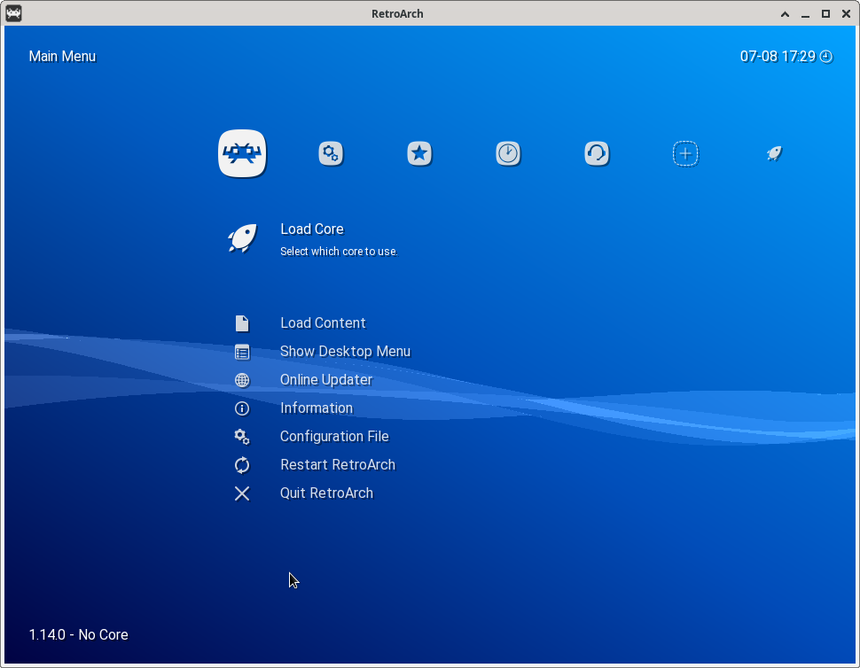

#### 加载游戏和BIOS(PS1)

复制准备好的 BIOS 文件到 ~/.config/retroarch/system，启动 retroarch 后手动扫描准备好的 roms 文件夹。

### PPSSPP 验证

将编译出的 ppsspp ppsspp_libretro.so 复制到 /usr/lib/riscv64-linux-gnu/libretro/

启动后即可在 retroarch 中见到 ppsspp 核心

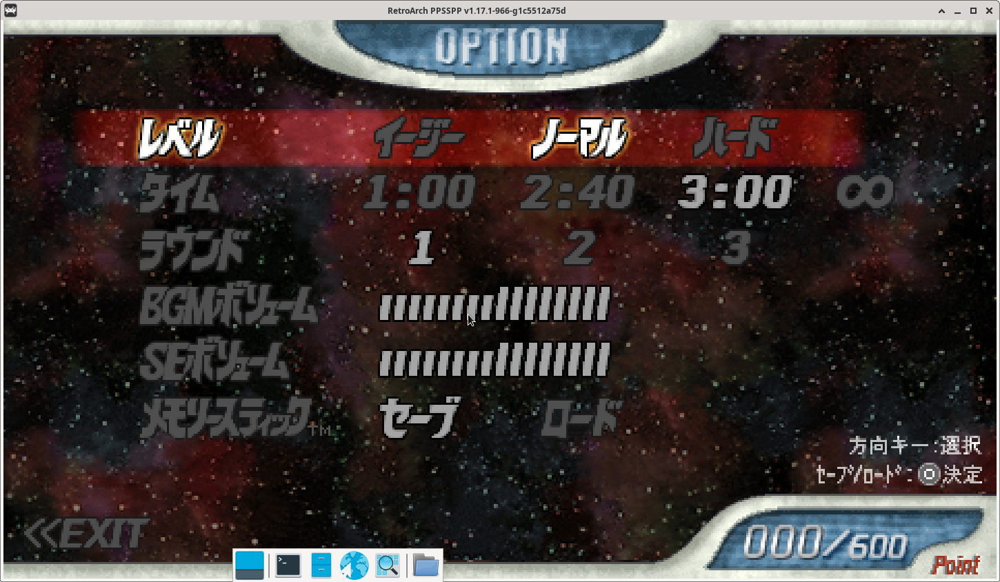


### Flycast 验证

**未移植 flycast**

### 额外的核心

*本项目只作为额外加分使用，不验证选手提交的所额外有核心，不以核心更多而增加更多分数。*

#### gba


#### NDS
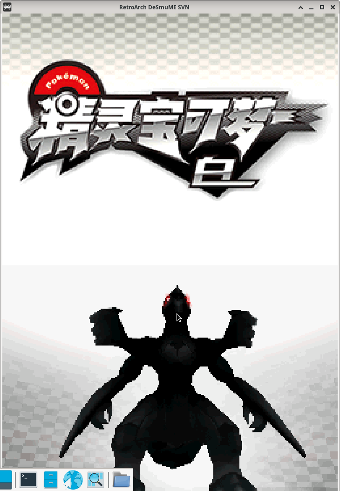
#### NES
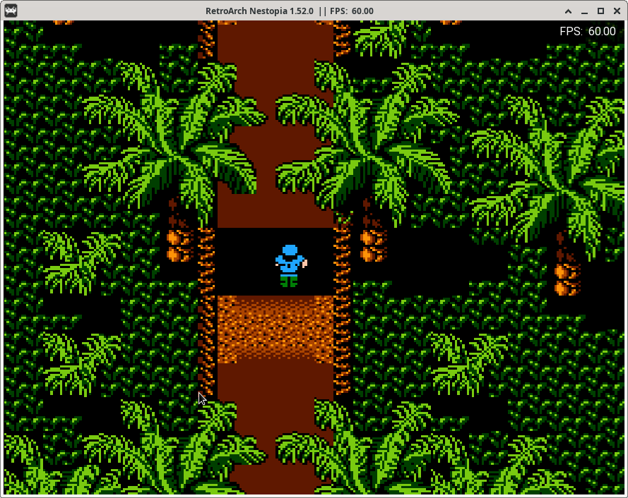
#### PS1

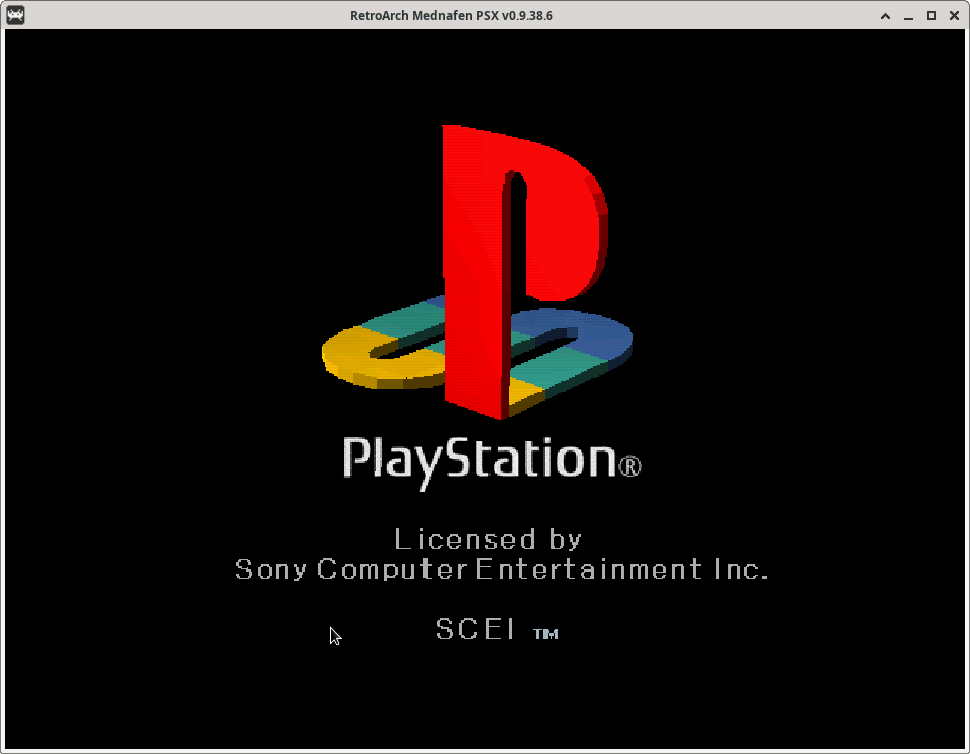

### 环境清理

**同台机器验证避免出现干扰**

```bash
rm -rf ~/.config/retroarch/
rm -rf /usr/lib/riscv64-linux-gnu/libretro/ppsspp ppsspp_libretro.so
sudo apt purge retroarch libretro-beetle-pce-fast libretro-beetle-psx libretro-desmume libretro-genesisplusgx libretro-mgba libretro-nestopia libretro-snes9x
# 重启确保干净
sudo reboot
```
## PR2 验证

### 环境配置和安装过程

```bash
# 更换仓库为 Debian 官方仓库，避免使用 revyos 原有的 retroarch
sudo cp /etc/apt/sources.list /etc/apt/sources.list.bk
sudo cat /etc/apt/sources.list
deb http://mirrors.ustc.edu.cn/debian sid main contrib non-free non-free-firmware
sudo apt update
sudo apt install retroarch

mkdir PR2 && cd PR2
git clone https://github.com/libretro/libretro-super
cd libretro-super 
./libretro-fetch.sh ppsspp
./libretro-build.sh ppsspp
cp dist/unix/*.so ~/.config/retroarch/cores
# 安装 Debian 仓库的核心
sudo apt install retroarch libretro-beetle-psx libretro-desmume libretro-mgba libretro-nestopia libretro-snes9x

cp dist/unix/ppsspp_libretro.so ~/.config/retroarch/cores/
cp ~/BIOS/* ~/.config/retroarch/system/
```

### Retro 前端验证:

#### 第一种方案

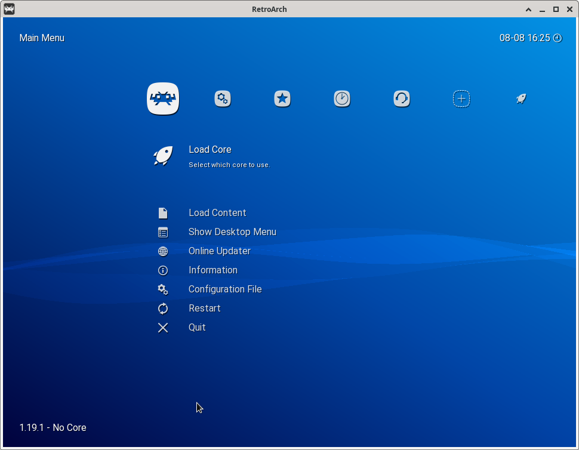

#### 第二种方案

**由于这与我们预期的提交方式不符，非公开方式提交。因此本项无效。**

### PPSSPP 验证

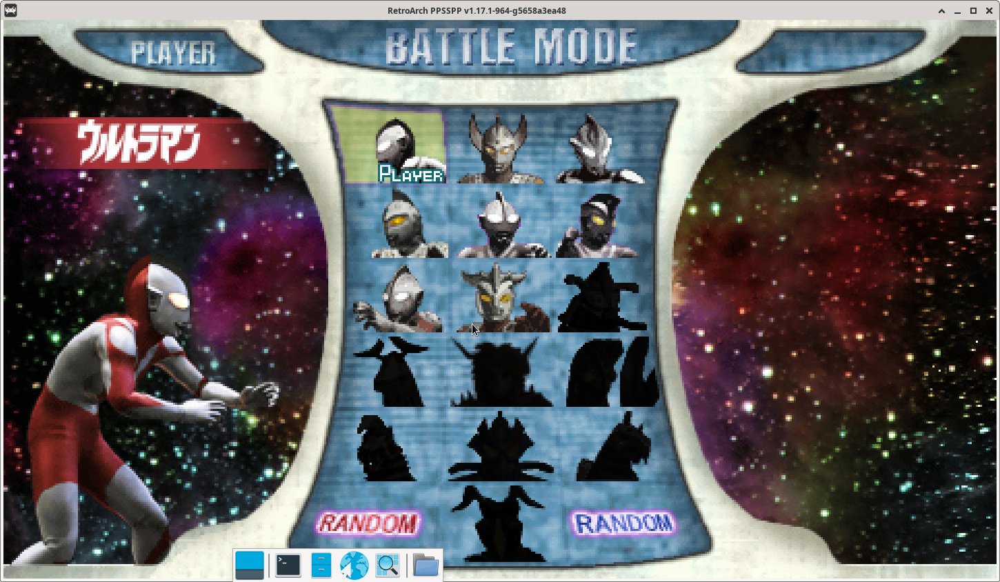
### Flycast 验证

**未移植 flycast**

### 额外的核心

*本项目只作为额外加分使用，不验证选手提交的所额外有核心，不以核心更多而增加更多分数。*

#### gba

#### NDS
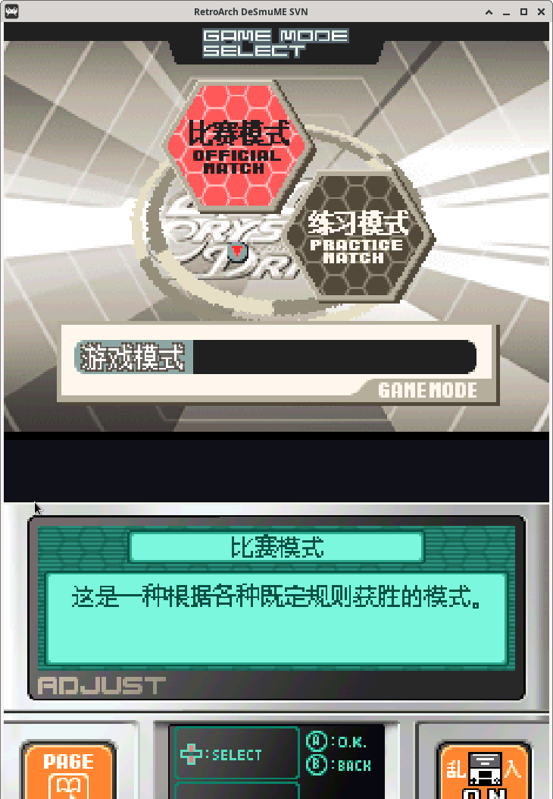
#### NES
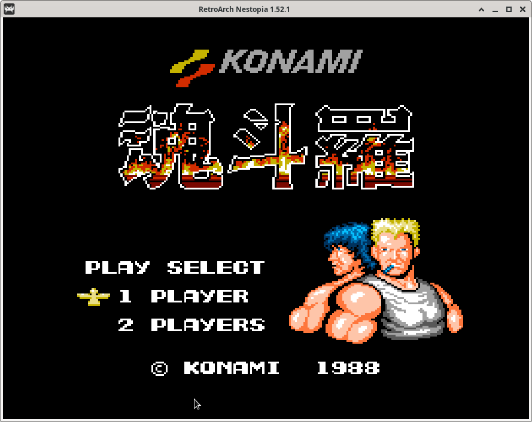
#### PS1


### 环境清理

**同台机器验证避免出现干扰**

```bash
rm -rf ~/.config/retroarch/
sudo apt purge retroarch
sudo apt autoremove
# 重启确保干净
sudo reboot
```

## PR3 验证

### 环境配置和安装过程

```bash
# 安装依赖(已针对环境自行修改)
sudo apt install git build-essential libxkbcommon-dev zlib1g-dev libfreetype6-dev libegl1-mesa-dev libgles2-mesa-dev libgbm-dev nvidia-cg-doc libavcodec-dev libsdl2-dev libsdl-image1.2-dev libxml2-dev yasm libcurl4-openssl-dev libpcap-dev libx11-xcb-dev cmake

# 创建目录

mkdir PR3 && cd PR3

# 编译 retroarch
git clone https://github.com/CatMe0w/rvspoc-P2425-RetroArch
cd rvspoc-P2425-RetroArch
./configure
make clean
make -j50

# 编译 PPSSPP
 git clone https://github.com/CatMe0w/libretro-super
cd libretro-super
./libretro-fetch.sh ppsspp
./libretro-build.sh ppsspp

# 编译 flycast
git clone https://github.com/CatMe0w/libretro-super
cd libretro-super
./libretro-fetch.sh flycast
./libretro-build.sh flycast

# 编译额外核心
./libretro-fetch.sh nestopia snes9x mgba mednafen_psx mednafen_psx_hw mupen64plus_next
./libretro-build.sh nestopia snes9x mgba mednafen_psx mednafen_psx_hw mupen64plus_next
```

### Retro 前端验证:

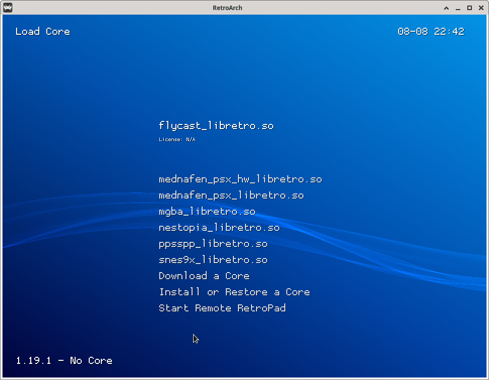

### PPSSPP 验证


### Flycast 验证

#### 源码方式编译库嵌入 retro 运行
结果: **Trace Breakpoint trap**
结论: 失败

#### 直接拷贝选手发布的二进制库到 retroarch 目录
结果: 段错误
结论: 失败
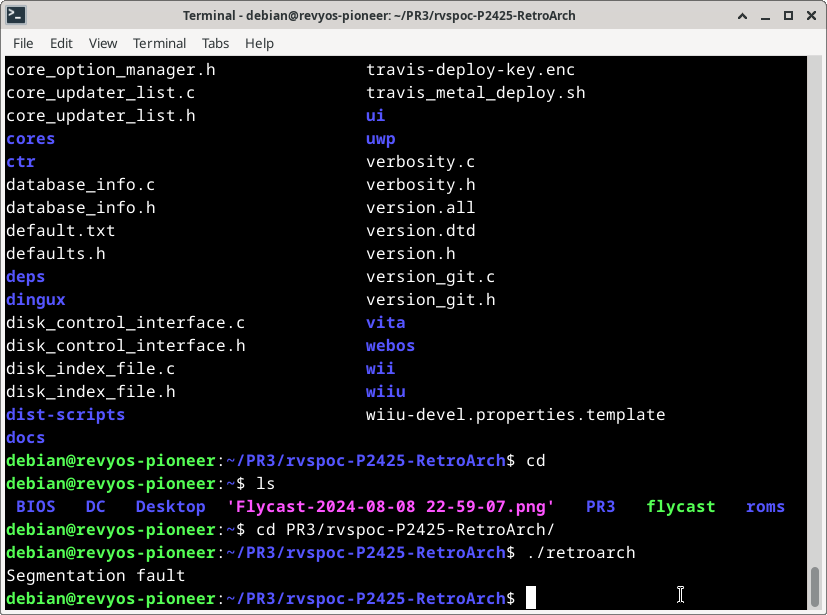
#### 使用选手编译的独立的 flycast
结果: 成功加载游戏画面
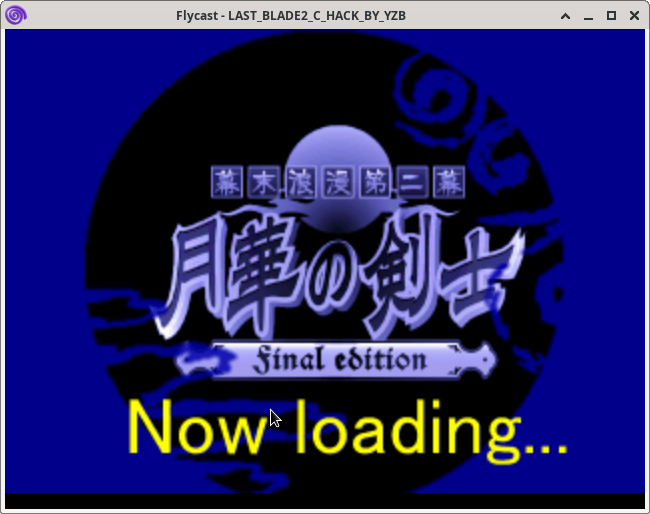
#### 源码编译独立的 flycast
结果: 无法按照预期编译
```bash
-- Found ZLIB: /usr/lib/riscv64-linux-gnu/libz.so (found suitable version "1.2.13", minimum required is "1.1.2")
CMake Error at core/deps/libzip/cmake/Findzstd.cmake:123 (file):
  file STRINGS file
  "/home/debian/PR3/flycast/core/deps/libchdr/deps/zstd-1.5.6/lib/zstd.h"
  cannot be read.
Call Stack (most recent call first):
  core/deps/libzip/CMakeLists.txt:242 (find_package)


CMake Error at core/deps/libzip/cmake/Findzstd.cmake:128 (file):
  file STRINGS file
  "/home/debian/PR3/flycast/core/deps/libchdr/deps/zstd-1.5.6/lib/zstd.h"
  cannot be read.
Call Stack (most recent call first):
  core/deps/libzip/CMakeLists.txt:242 (find_package)


CMake Error at core/deps/libzip/cmake/Findzstd.cmake:133 (file):
  file STRINGS file
  "/home/debian/PR3/flycast/core/deps/libchdr/deps/zstd-1.5.6/lib/zstd.h"
  cannot be read.
Call Stack (most recent call first):
  core/deps/libzip/CMakeLists.txt:242 (find_package)


-- Found zstd: /usr/lib/riscv64-linux-gnu/libzstd.so (Required is at least version "1.3.6")
CMake Error at CMakeLists.txt:1341 (add_subdirectory):
  The source directory

    /home/debian/PR3/flycast/core/deps/Vulkan-Headers

  does not contain a CMakeLists.txt file.


CMake Error at CMakeLists.txt:1344 (add_subdirectory):
  The source directory

    /home/debian/PR3/flycast/core/deps/VulkanMemoryAllocator
```

### 额外的核心

*本项目只作为额外加分使用，不验证选手提交的所额外有核心，不以核心更多而增加更多分数。*

#### GBA

#### NES

#### PS1

#### SNES
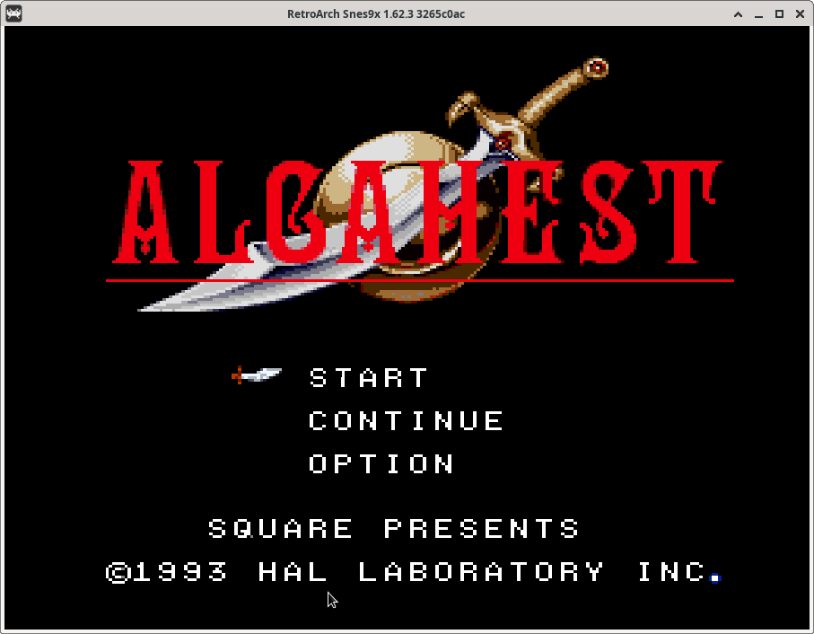
