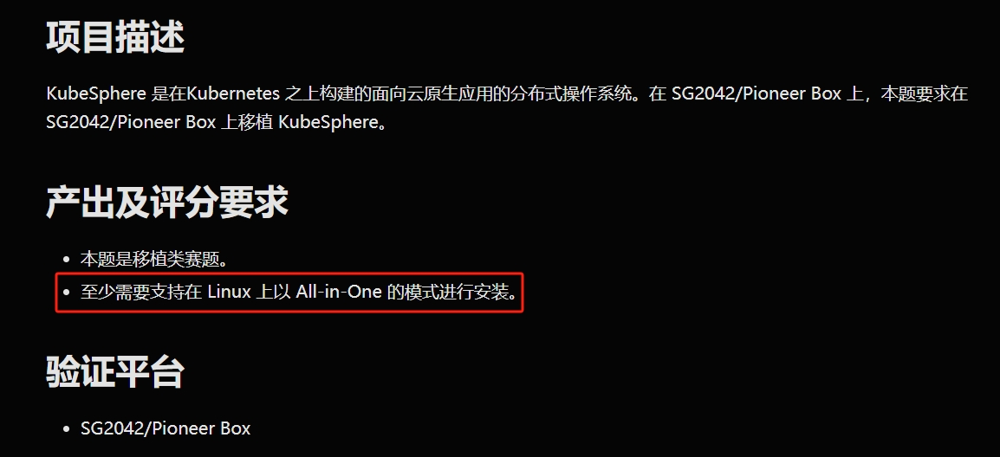
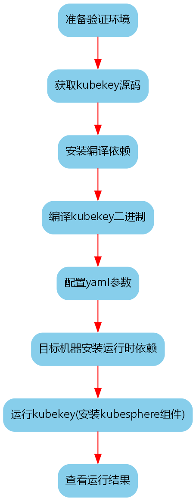
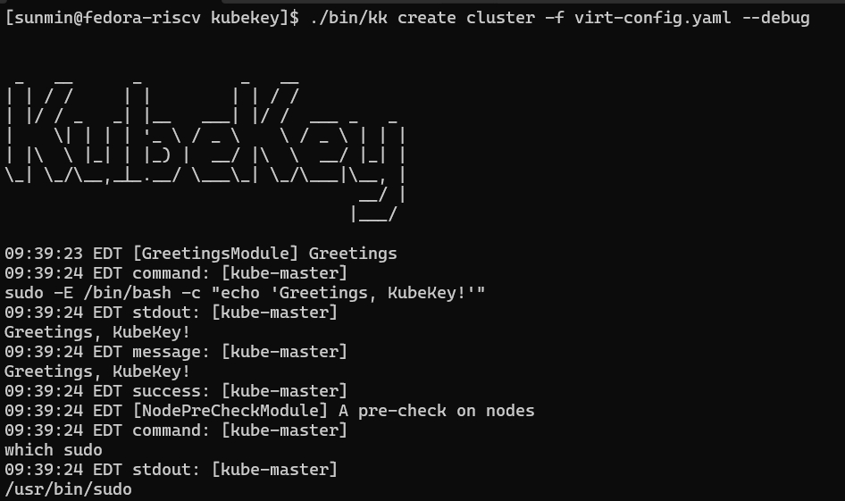
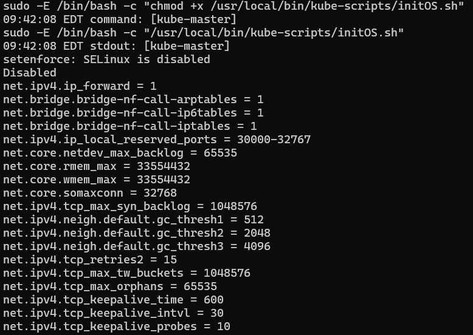
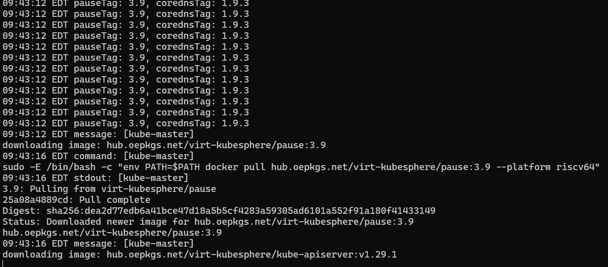
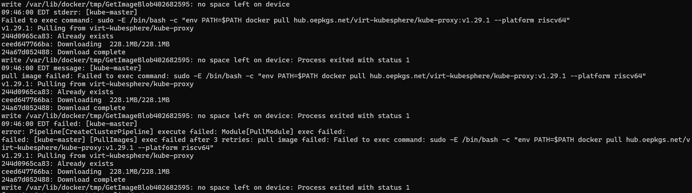
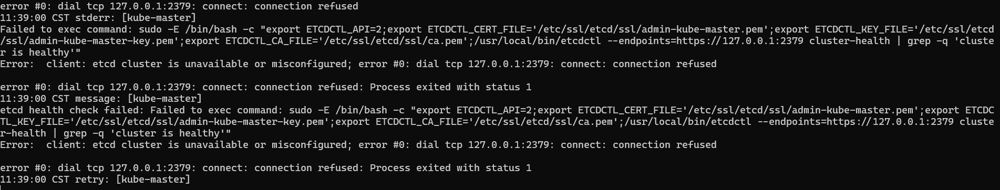
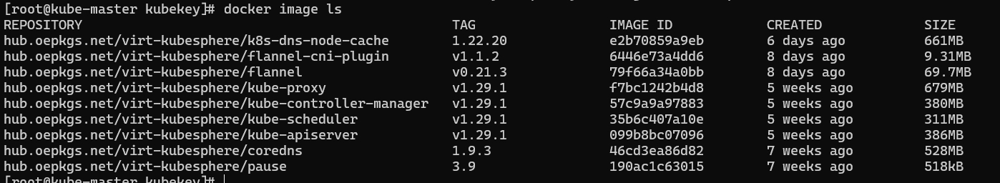

# KubeSphere 移植

备注！

本赛题截止的提交时间是 AoE 时间的 8 月 31 日，对应北京时间 9 月 1 日的 20:00。

- 评分要求



- PR1 
https://github.com/rv2036/rvspoc-P2426-kubesphere/pull/1

- PR1 关联仓库
https://github.com/TimePrinciple/kubekey


|    仓库          |       提交时间            | 
| ------------ | -------------------- |
|PR1 | Sat Aug 31 23:55:36 2024 +0800|
|PR1 关联仓库 | Sun Sep 1 19:14:58 2024 +0800|

- 验证结果
  - 选手移植的 kubekey 源码可以成功编译且运行在 PioneerBox 上
  - 通过 kubekey 可以在目标平台以 `All in One` 方式部署 k8s 及  KubeSphere 组件
  - 在目标平台部署的组件及二进制，可以在目标平台运行

- 验证步骤


## 验证环境

- 硬件平台: PioneerBox
```
$ cat /proc/cpuinfo
processor       : 0
hart            : 3
isa             : rv64imafdcv
mmu             : sv39
mvendorid       : 0x5b7
marchid         : 0x0
mimpid          : 0x0

$ neofetch
             .',;::::;,'.                sunmin@fedora-riscv
         .';:cccccccccccc:;,.            -------------------
      .;cccccccccccccccccccccc;.         OS: Fedora release 38 (Thirty Eight) riscv64
    .:cccccccccccccccccccccccccc:.       Host: Sophgo Mango
  .;ccccccccccccc;.:dddl:.;ccccccc;.     Kernel: 6.1.31
 .:ccccccccccccc;OWMKOOXMWd;ccccccc:.    Uptime: 8 mins
.:ccccccccccccc;KMMc;cc;xMMc:ccccccc:.   Packages: 2578 (rpm)
,cccccccccccccc;MMM.;cc;;WW::cccccccc,   Shell: bash 5.2.15
:cccccccccccccc;MMM.;cccccccccccccccc:   Terminal: /dev/pts/0
:ccccccc;oxOOOo;MMM0OOk.;cccccccccccc:   CPU: (64)
cccccc:0MMKxdd:;MMMkddc.;cccccccccccc;   GPU: AMD ATI Radeon HD 6450/7450/8450 / R5 230 OEM
ccccc:XM0';cccc;MMM.;cccccccccccccccc'   Memory: 1189MiB / 128883MiB
ccccc;MMo;ccccc;MMW.;ccccccccccccccc;
ccccc;0MNc.ccc.xMMd:ccccccccccccccc;
cccccc;dNMWXXXWM0::cccccccccccccc:,
cccccccc;.:odl:.;cccccccccccccc:,.
:cccccccccccccccccccccccccccc:'.
.:cccccccccccccccccccccc:;,..
  '::cccccccccccccc::;,.
```


- OS 版本信息
```
$ lsb_release -a
LSB Version:    :core-4.1-%{archname}:core-4.1-noarch:cxx-4.1-%{archname}:cxx-4.1-noarch:desktop-4.1-%{archname}:desktop-4.1-noarch:languages-4.1-%{archname}:languages-4.1-noarch:printing-4.1-%{archname}:printing-4.1-noarch
Distributor ID: Fedora
Description:    Fedora release 38 (Thirty Eight)
Release:        38
Codename:       ThirtyEight
```


### 编译依赖安装
```
#在编译机器安装 golang（我这里安装的是 1.20.8）
sudo dnf install go
```

### 获取源码

```bash
git clone https://github.com/TimePrinciple/kubekey.git
cd kubekey
git checkout introduce-riscv64-architecture
```

### 编译

- 根据自己的情况设置代理
```bash
export GOPROXY=https://goproxy.cn
```

- 执行编译命令

```
#由于网络情况，本命令可能需要执行多次
make kk
```
以下错误来自 `git describe`,可以忽略:
`fatal: No names found, cannot describe anything.`

- 查看编译产物
```
$ file bin/kk
bin/kk: ELF 64-bit LSB executable, UCB RISC-V, double-float ABI, version 1 (SYSV), statically linked, Go BuildID=RR11N0PmOkByR5ffca0g/pMrNqPskOqLj01NGwcV1/HGl2T_98vGsI0qp3V5Ie/Z6VTkhjhfAv-9VWNCmlG, with debug_info, not stripped
[smin@kube-master kubekey]$ ls -lah bin/kk
-rwxr-xr-x 1 smin smin 78M Sep  9 14:15 bin/kk
$ l kube/v1.29.1/riscv64/
total 217M
-rw-r--r-- 1 smin smin  51M Sep 10 11:36 kubectl
drwxr-xr-x 2 smin smin 4.0K Sep 10 11:36 .
-rw-r--r-- 1 smin smin 118M Sep 10 11:36 kubelet
-rw-r--r-- 1 smin smin  49M Sep 10 11:36 kubeadm
drwxr-xr-x 3 smin smin 4.0K Sep  9 14:07 ..
```


### 运行(以 All-in-One 的模式安装 k8s 以及  KubeSphere)

- 首先在目标机器安装依赖

备注：我这里目标机器和编译机器是同一台

```bash
$ sudo dnf install -y socat conntrack-tools
``` 

- 修改 virt-config.yaml 配置文件

需在文件中指定待部署机器IP，用户名和密码,用于从编译机器 `ssh` 到目标机器

- 配置文件备注
  - user,password: 对应目标机器上的用户名和密码,需要有 sudo 权限

```diff
$ git diff virt-config.yaml
diff --git a/virt-config.yaml b/virt-config.yaml
index b0e36329..9b4920ca 100644
--- a/virt-config.yaml
+++ b/virt-config.yaml
@@ -5,7 +5,7 @@ metadata:
 spec:
   hosts:
   ##You should complete the ssh information of the hosts
-    - {name: kube-master, address: 10.211.102.11, internalAddress: 10.211.102.11, user: root, password: "openEuler12#$", arch: riscv64}
+    - {name: kube-master, address: 192.168.0.106, internalAddress: 192.168.0.106, user: root, password: "openEuler12#$", arch: riscv64}
   roleGroups:
     etcd:
     - kube-master
@@ -18,7 +18,7 @@ spec:
     #internalLoadbalancer: haproxy
     ##If the external loadbalancer was used, 'address' should be set to loadbalancer's ip.
     domain: lb.kubesphere.local
-    address: "10.211.102.11"
+    address: "192.168.0.106"
     port: 6443
   kubernetes:
     version: v1.29.1
```

- 在目标机器安装自动安装  KubeSphere 组件
```
./bin/kk create cluster -f virt-config.yaml --debug
```








### 查看运行结果

  备注！这部分的命令需要在目标机器执行!
  
  - 查看以 `All in One` 方式安装的二进制
    ```
    $ ls /usr/local/bin/
    etcd  etcdctl  etcdutl  helm  kube-scripts  kubeadm  kubectl  kubelet
    [root@kube-master ~]# ls /usr/local/bin/kube-scripts/
    etcd-backup.sh  initOS.sh

    $ /usr/local/bin/etcd --version
    etcd Version: 3.5.13
    Git SHA: c9063a0dc
    Go Version: go1.21.4
    Go OS/Arch: linux/riscv64

    $ /usr/local/bin/helm version
    version.BuildInfo{Version:"v3.14.3", GitCommit:"f03cc04caaa8f6d7c3e67cf918929150cf6f3f12", GitTreeState:"clean", GoVersion:"go1.21.4"}

    $ /usr/local/bin/kubectl version
    Client Version: v1.29.1
    Kustomize Version: v5.0.4-0.20230601165947-6ce0bf390ce3
    The connection to the server localhost:8080 was refused - did you specify the right host or port?
    ```
  - 查看以 `All in One` 方式安装的 docker 镜像



