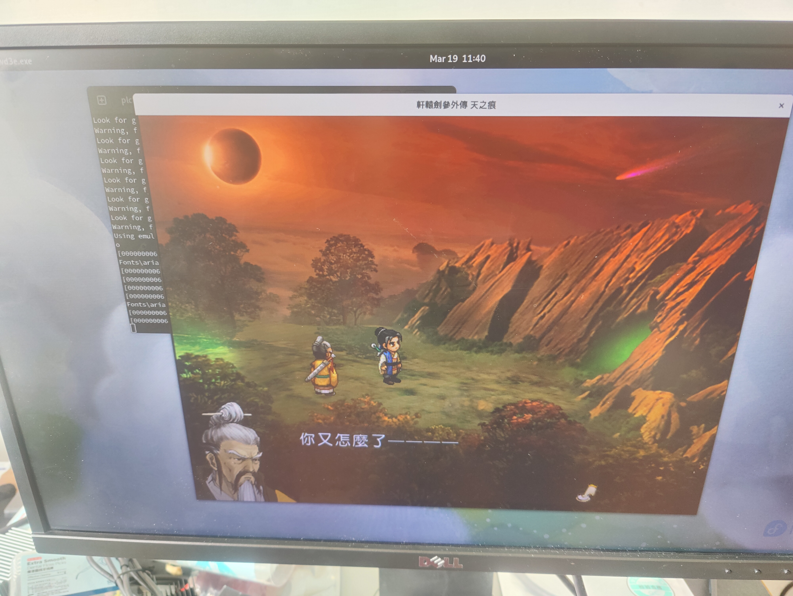
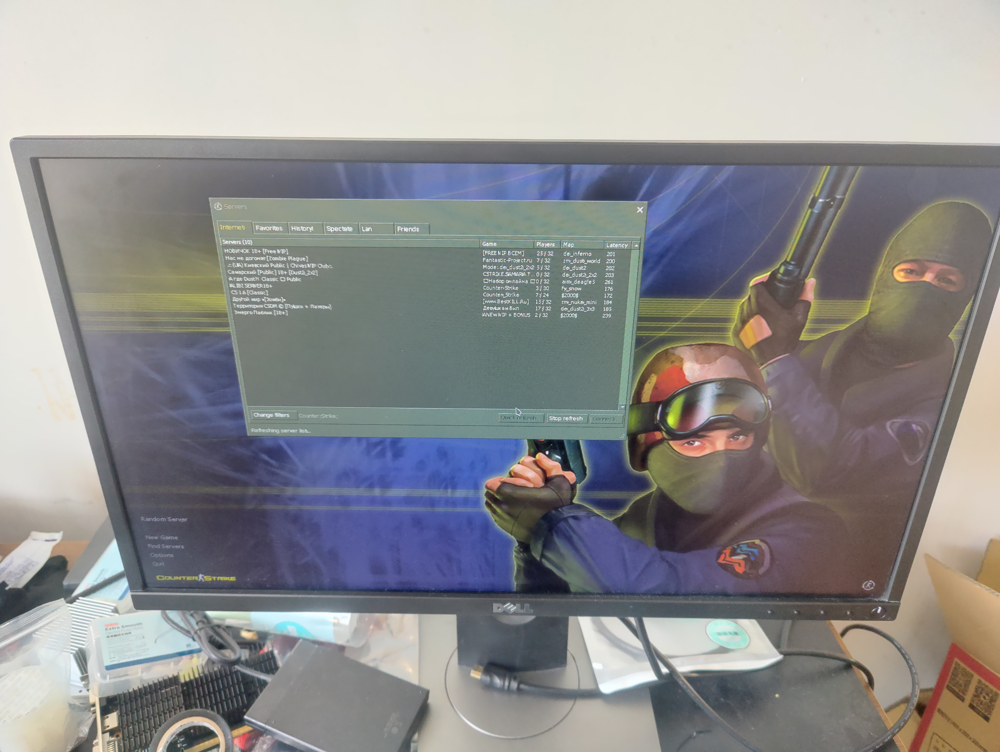
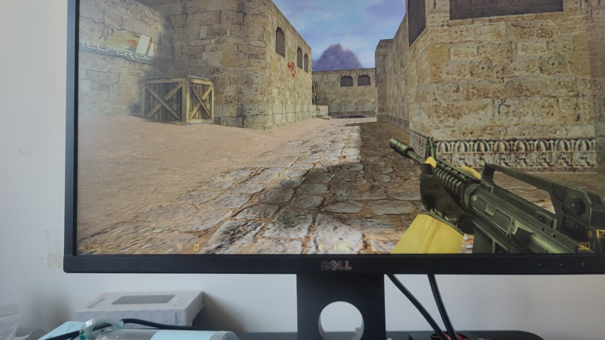

# S2302 二进制翻译验证

## 验证者

[李程](https://github.com/shiptux)

## 产出要求

1. 能够稳定运行《天之痕》等单机游戏超过 2 小时。
2. 能够启动运行《红色警戒2》、OpenRA、《反恐精英 (CS1.6)》的任一款游戏并完成一局游戏。

## 当前提交

https://github.com/plctlab/rvspoc-s2302-BT/pull/1

## 验证结果

### 验证环境

SG2042 pioneer box

**同时测试了选手的代码内容和二进制内容，两项有一项通过下表就会填通过。**

PASS: 验证通过
FAILED: 验证失败
NONE: 选手提交中未有此项目

|  PR | PR1 |
| -------- | -------- |
| PR 创建时间     | 2024-02-26T10:31:51Z | 
| 最后更新时间     | 2024-02-26T10:30:46Z | 
| 天之痕    | PASS     |
| RA2     | NONE     | 
| OpenRA     | NONE     |
| CS 1.6   | PASS     |

#### PR 验证:

##### 安装依赖

```shell=
sudo apt install gcc cmake mold
```

##### 获取 Box64 

```bash
git clone https://github.com/ptitSeb/box64.git 
cd box64
```

##### 编译

```shell=
mkdir build
cd build
cmake .. -DRV64=1 -DCMAKE_BUILD_TYPE=RelWithDebInfo -DWITH_MOLD=1
mold -run make -j`nproc`
```

##### 安装

```shell=
sudo make install
sudo systemctl restart systemd-binfmt
```

##### 测试是否安装成功：运行 `box64 --help` 应该可以看到类似的输出

```plain!
Dynarec for RISC-V With extension: I M A F D C XTheadBa XTheadBb XTheadBs XTheadCondMov XTheadMemIdx XTheadMemPair XTheadFMemIdx XTheadMac PageSize:4096 Running on unknown riscv64 cpu with 64 Cores
Params database has 59 entries
Params database has 71 entries
This is Box64, The Linux x86_64 emulator with a twist
Usage is 'box64 [options] path/to/software [args]' to launch x86_64 software.
 options are:
    '-v'|'--version' to print box64 version and quit
    '-h'|'--help' to print this and quit
    '-f'|'--flags' to print box64 flags and quit
```

##### 获取 Wine

测试使用的 Wine 9.3 来自 box86 网站

> - [下载链接](https://box86.org/wine93_39bits.7z)
> - sha256: 5b73630de811ab3d489e0a8bc120924e0208830a5746a0820fe73cede1ddb3c1
```shell=
wget https://box86.org/wine93_39bits.7z
tar -xf wine93_39bits.7z
# 将 wine 加入 $PATH 中
export PATH=$PATH:$(pwd)/wine93_39bits/wine93/bin/
```

PE 文件（`.exe`）的运行方法

```shell=
# path/to/game.exe 替换为实际的 .exe 文件路径
wine path/to/game.exe
```

##### 运行游戏

###### 轩辕剑叁外传天之痕

**此处需要使用最新的 main 分支验证**

```bash
cd SWD3E/SWD3E/
wine swd3e.exe
```

**CG 阶段有些贴图错误。实际运行战斗，跑图存档均比较流畅，挂机了 9 小时未发生崩溃。**





###### CS 1.6

重新编译并安装 box64 使用 `ff6cc844821439a8f50b68b27e6f1ac5264579c8` 这个提交。
并记得 sudo systemctl restart systemd-binfmt.

初次安装

```bash
wine cs16-eng.exe
```

后续再次进入游戏可以

```bash
cd .wine/drive_c/Games/Counter-Strike\ 1.6/
wine hl.exe
```

**能够正常启动单人模式，但不能添加 bot，否则则会出现卡死。可以正常连接服务器进行游玩或者观战，但是高概率被踢出，可能是游戏环境无法通过 VAC 验证。**






