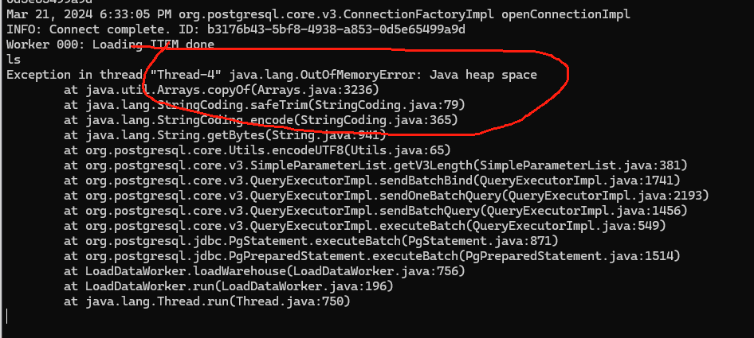
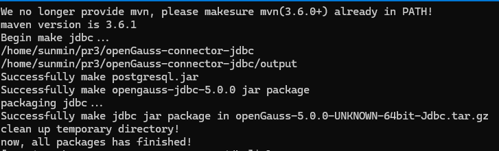
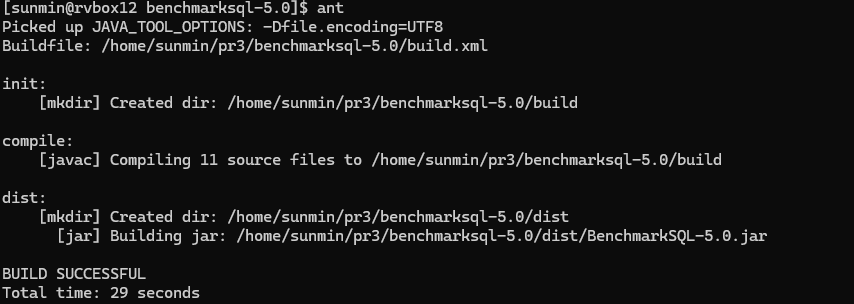

# S2305 选手产出验证

## 验证者

孙敏 + Ryan

## 产出要求

- 给出使用 BenchmarkSQL-5.0 工具的稳定性测试和性能测试结果。

- 提供复现结果所需要的所有配置和过程说明。

## 当前提交

pr1 和 pr2 是同一个小队的提交，他们的移植、优化思路是：

- 在 2042 上搭建 openEuler 的 docker 环境（openEuler 22.03 RISC-V）
- 在 docker 环境完成编译（包括第三方库和 openGauss-server 轻量版）
- 在 docker 环境部署 openGauss-server 和 benchmark 测试

    ~~https://github.com/plctlab/rvspoc-s2305-openGauss-server/pull/1
nexplorer-3e~~

    https://github.com/plctlab/rvspoc-s2305-openGauss-server/pull/2  nexplorer-3e 

pr3 的移植思路是：

- 在 Pioneerbox Fedora 38 环境完成所有的工作

    https://github.com/plctlab/rvspoc-s2305-openGauss-server/pull/3 zhangfeiv0

## 验证结果

|  模块名称 |           PR1/PR2  | PR3 | 基准测试 | 备注 |
| --------            | -------- | -------- |-------- |-------- |
| openGauss版本    |     5.1.0 轻量版     | 5.1.0 标准版 | 5.0.0 轻量版        | 无|
| 验证环境 |  docker（openEuler 22.03 RISC-V）on pioneerbox | Fedora 38 on pioneerbox    |   openEuler20.03 x86_64 virtualbox     | 无|
| 是否移植成功    |     Y     | Y | NA        | 无|
| benchmark结果    |     见附件[1]     | 见附件[2] | 见附件[3]        | 无|


附件[1] pr2 测试结果 

https://github.com/plctlab/rvspoc/tree/main/Results/Verifications/S2305/pr2-my_result_2024-03-25_122945

附件[2] pr3 测试结果 

https://github.com/plctlab/rvspoc/tree/main/Results/Verifications/S2305/pr3-my_result_2024-03-25_114402

附件[3] 基准测试结果 
https://github.com/plctlab/rvspoc/tree/main/Results/Verifications/S2305/base-my_result_2024-03-24_204024


### 验证总体思路

- 所有 pr 都提供了详细说明，按照选手的要求进行部署和测试

- 所有的 benchmark 测试都在空载的情况下进行

- 按照作者的说明 pr1/pr2 需要用到 openEuler 22.03 操作系统，我们基于 PioneerBox 上的 openEuler docker 环境进行验证

- pr3 直接在 PioneerBox 原生系统 Fedora 验证

- 在运行 benchmark 测试时，采用相同的配置文件 props.pg
```
db=postgres
driver=org.postgresql.Driver
conn=jdbc:postgresql://localhost:5432/tpcc1000?prepareThreshold=1&batchMode=on&fetchsize=10
user=bot
password=Gaussdba@Mpp

warehouses=4
loadWorkers=10

terminals=37
//To run specified transactions per terminal- runMins must equal zero
runTxnsPerTerminal=10
//To run for specified minutes- runTxnsPerTerminal must equal zero
runMins=0
//Number of total transactions per minute
limitTxnsPerMin=300

//Set to true to run in 4.x compatible mode. Set to false to use the
//entire configured database evenly.
terminalWarehouseFixed=true

//The following five values must add up to 100
//The default percentages of 45, 43, 4, 4 & 4 match the TPC-C spec
newOrderWeight=45
paymentWeight=43
orderStatusWeight=4
deliveryWeight=4
stockLevelWeight=4

// Directory name to create for collecting detailed result data.
// Comment this out to suppress.
resultDirectory=my_result_%tY-%tm-%td_%tH%tM%tS
osCollectorScript=./misc/os_collector_linux.py
osCollectorInterval=1
//osCollectorSSHAddr=user@dbhost
osCollectorDevices=net_eth0 blk_sda
```
### 基准测试

- 测试环境 openEuler20.04 x86_64  on virtualbox
- opengauss版本 5.0.0 轻量版 单节点

- 生成测试数据库及测试数据


- 开始测试
```
20:40:24,401 [main] INFO   jTPCC : Term-00,
20:40:24,404 [main] INFO   jTPCC : Term-00, +-------------------------------------------------------------+
20:40:24,406 [main] INFO   jTPCC : Term-00,      BenchmarkSQL v5.0
20:40:24,406 [main] INFO   jTPCC : Term-00, +-------------------------------------------------------------+
20:40:24,406 [main] INFO   jTPCC : Term-00,  (c) 2003, Raul Barbosa
20:40:24,409 [main] INFO   jTPCC : Term-00,  (c) 2004-2016, Denis Lussier
20:40:24,413 [main] INFO   jTPCC : Term-00,  (c) 2016, Jan Wieck
20:40:24,414 [main] INFO   jTPCC : Term-00, +-------------------------------------------------------------+
20:40:24,414 [main] INFO   jTPCC : Term-00,
20:40:24,414 [main] INFO   jTPCC : Term-00, db=postgres
20:40:24,414 [main] INFO   jTPCC : Term-00, driver=org.postgresql.Driver
20:40:24,414 [main] INFO   jTPCC : Term-00, conn=jdbc:postgresql://localhost:5432/tpcc1000?prepareThreshold=1&batchMode=on&fetchsize=10
20:40:24,414 [main] INFO   jTPCC : Term-00, user=bot
20:40:24,415 [main] INFO   jTPCC : Term-00,
20:40:24,415 [main] INFO   jTPCC : Term-00, warehouses=4
20:40:24,415 [main] INFO   jTPCC : Term-00, terminals=37
20:40:24,417 [main] INFO   jTPCC : Term-00, runTxnsPerTerminal=10
20:40:24,417 [main] INFO   jTPCC : Term-00, limitTxnsPerMin=300
20:40:24,417 [main] INFO   jTPCC : Term-00, terminalWarehouseFixed=true
20:40:24,417 [main] INFO   jTPCC : Term-00,
20:40:24,417 [main] INFO   jTPCC : Term-00, newOrderWeight=45
20:40:24,417 [main] INFO   jTPCC : Term-00, paymentWeight=43
20:40:24,417 [main] INFO   jTPCC : Term-00, orderStatusWeight=4
20:40:24,417 [main] INFO   jTPCC : Term-00, deliveryWeight=4
20:40:24,417 [main] INFO   jTPCC : Term-00, stockLevelWeight=4
20:40:24,417 [main] INFO   jTPCC : Term-00,
20:40:24,417 [main] INFO   jTPCC : Term-00, resultDirectory=my_result_%tY-%tm-%td_%tH%tM%tS
20:40:24,417 [main] INFO   jTPCC : Term-00, osCollectorScript=./misc/os_collector_linux.py
20:40:24,418 [main] INFO   jTPCC : Term-00,
20:40:24,450 [main] INFO   jTPCC : Term-00, copied prp.pg to my_result_2024-03-24_204024/run.properties
20:40:24,450 [main] INFO   jTPCC : Term-00, created my_result_2024-03-24_204024/data/runInfo.csv for runID 1
20:40:24,451 [main] INFO   jTPCC : Term-00, writing per transaction results to my_result_2024-03-24_204024/data/result.csv
20:40:24,453 [main] INFO   jTPCC : Term-00, osCollectorScript=./misc/os_collector_linux.py
20:40:24,453 [main] INFO   jTPCC : Term-00, osCollectorInterval=1
20:40:24,453 [main] INFO   jTPCC : Term-00, osCollectorSSHAddr=null
20:40:24,453 [main] INFO   jTPCC : Term-00, osCollectorDevices=net_eth0 blk_sda
20:40:24,535 [main] INFO   jTPCC : Term-00,
Mar 24, 2024 8:40:24 PM org.postgresql.core.v3.ConnectionFactoryImpl openConnectionImpl
INFO: [54039d4f-4081-4524-b43c-6a0326e142c1] Try to connect. IP: localhost:5432
Traceback (most recent call last):
  File "<stdin>", line 299, in <module>
  File "<stdin>", line 90, in main
  File "<stdin>", line 269, in initNetDevice
IOError: [Errno 2] No such file or directory: '/sys/class/net/eth0/statistics/rx_packets'
20:40:24,647 [Thread-1] ERROR  OSCollector$CollectData : OSCollector, unexpected EOF while reading from external helper process
Mar 24, 2024 8:40:24 PM org.postgresql.core.v3.ConnectionFactoryImpl openConnectionImpl
INFO: [127.0.0.1:44940/ocalhost/127.0.0.1:5432] Connection is established. ID: 54039d4f-4081-4524-b43c-6a0326e142c1
Mar 24, 2024 8:40:24 PM org.postgresql.core.v3.ConnectionFactoryImpl openConnectionImpl
INFO: Connect complete. ID: 54039d4f-4081-4524-b43c-6a0326e142c1
20:40:24,875 [main] INFO   jTPCC : Term-00, C value for C_LAST during load: 158
20:40:24,876 [main] INFO   jTPCC : Term-00, C value for C_LAST this run:    251
20:40:24,876 [main] INFO   jTPCC : Term-00,
Mar 24, 2024 8:40:24 PM org.postgresql.core.v3.ConnectionFactoryImpl openConnectionImpl144MB
INFO: [6a811609-f160-4e49-9291-9f58bd1aec10] Try to connect. IP: localhost:5432
Mar 24, 2024 8:40:24 PM org.postgresql.core.v3.ConnectionFactoryImpl openConnectionImpl
INFO: [127.0.0.1:44942/ocalhost/127.0.0.1:5432] Connection is established. ID: 6a811609-f160-4e49-9291-9f58bd1aec10
Mar 24, 2024 8:40:24 PM org.postgresql.core.v3.ConnectionFactoryImpl openConnectionImpl
INFO: Connect complete. ID: 6a811609-f160-4e49-9291-9f58bd1aec10
Mar 24, 2024 8:40:24 PM org.postgresql.core.v3.ConnectionFactoryImpl openConnectionImpl
INFO: [048ac42e-51a9-4334-9a0d-44d7d8845bf4] Try to connect. IP: localhost:5432
Mar 24, 2024 8:40:25 PM org.postgresql.core.v3.ConnectionFactoryImpl openConnectionImpl
INFO: [127.0.0.1:44944/ocalhost/127.0.0.1:5432] Connection is established. ID: 048ac42e-51a9-4334-9a0d-44d7d8845bf4
Mar 24, 2024 8:40:25 PM org.postgresql.core.v3.ConnectionFactoryImpl openConnectionImpl
INFO: Connect complete. ID: 048ac42e-51a9-4334-9a0d-44d7d8845bf4
Mar 24, 2024 8:40:25 PM org.postgresql.core.v3.ConnectionFactoryImpl openConnectionImpl
INFO: [310f0a1f-17c5-4749-9030-8ac8b1ef59b9] Try to connect. IP: localhost:5432
Mar 24, 2024 8:40:25 PM org.postgresql.core.v3.ConnectionFactoryImpl openConnectionImpl
INFO: [127.0.0.1:44946/ocalhost/127.0.0.1:5432] Connection is established. ID: 310f0a1f-17c5-4749-9030-8ac8b1ef59b9
Mar 24, 2024 8:40:25 PM org.postgresql.core.v3.ConnectionFactoryImpl openConnectionImpl
INFO: Connect complete. ID: 310f0a1f-17c5-4749-9030-8ac8b1ef59b9
Mar 24, 2024 8:40:25 PM org.postgresql.core.v3.ConnectionFactoryImpl openConnectionImpl
INFO: [d0e89dc2-4ebb-4d13-a439-e67a2cad13a5] Try to connect. IP: localhost:5432
Mar 24, 2024 8:40:25 PM org.postgresql.core.v3.ConnectionFactoryImpl openConnectionImpl
INFO: [127.0.0.1:44948/ocalhost/127.0.0.1:5432] Connection is established. ID: d0e89dc2-4ebb-4d13-a439-e67a2cad13a5
Mar 24, 2024 8:40:25 PM org.postgresql.core.v3.ConnectionFactoryImpl openConnectionImpl
INFO: Connect complete. ID: d0e89dc2-4ebb-4d13-a439-e67a2cad13a5
Mar 24, 2024 8:40:25 PM org.postgresql.core.v3.ConnectionFactoryImpl openConnectionImpl
INFO: [2bc1c1da-dc6d-4877-a987-b211d52bf619] Try to connect. IP: localhost:5432
Mar 24, 2024 8:40:25 PM org.postgresql.core.v3.ConnectionFactoryImpl openConnectionImpl
INFO: [127.0.0.1:44950/ocalhost/127.0.0.1:5432] Connection is established. ID: 2bc1c1da-dc6d-4877-a987-b211d52bf619
Mar 24, 2024 8:40:25 PM org.postgresql.core.v3.ConnectionFactoryImpl openConnectionImpl
INFO: Connect complete. ID: 2bc1c1da-dc6d-4877-a987-b211d52bf619
Mar 24, 2024 8:40:25 PM org.postgresql.core.v3.ConnectionFactoryImpl openConnectionImpl
INFO: [f21cc937-d551-4ef1-982a-171a6db209a9] Try to connect. IP: localhost:5432
Mar 24, 2024 8:40:25 PM org.postgresql.core.v3.ConnectionFactoryImpl openConnectionImpl
INFO: [127.0.0.1:44952/ocalhost/127.0.0.1:5432] Connection is established. ID: f21cc937-d551-4ef1-982a-171a6db209a9
Mar 24, 2024 8:40:25 PM org.postgresql.core.v3.ConnectionFactoryImpl openConnectionImpl
INFO: Connect complete. ID: f21cc937-d551-4ef1-982a-171a6db209a9
Mar 24, 2024 8:40:25 PM org.postgresql.core.v3.ConnectionFactoryImpl openConnectionImpl
INFO: [6268b6e6-3110-43e0-9a5c-ec77fd277ac6] Try to connect. IP: localhost:5432
Mar 24, 2024 8:40:25 PM org.postgresql.core.v3.ConnectionFactoryImpl openConnectionImpl
INFO: [127.0.0.1:44954/ocalhost/127.0.0.1:5432] Connection is established. ID: 6268b6e6-3110-43e0-9a5c-ec77fd277ac6
Mar 24, 2024 8:40:25 PM org.postgresql.core.v3.ConnectionFactoryImpl openConnectionImpl
INFO: Connect complete. ID: 6268b6e6-3110-43e0-9a5c-ec77fd277ac6
Mar 24, 2024 8:40:25 PM org.postgresql.core.v3.ConnectionFactoryImpl openConnectionImpl
INFO: [2f75a52b-f95c-49eb-929b-694ae0b53362] Try to connect. IP: localhost:5432
Mar 24, 2024 8:40:25 PM org.postgresql.core.v3.ConnectionFactoryImpl openConnectionImpl
INFO: [127.0.0.1:44956/ocalhost/127.0.0.1:5432] Connection is established. ID: 2f75a52b-f95c-49eb-929b-694ae0b53362
Mar 24, 2024 8:40:25 PM org.postgresql.core.v3.ConnectionFactoryImpl openConnectionImpl
INFO: Connect complete. ID: 2f75a52b-f95c-49eb-929b-694ae0b53362
Mar 24, 2024 8:40:25 PM org.postgresql.core.v3.ConnectionFactoryImpl openConnectionImpl
INFO: [e59b64e2-6096-43b4-b5f7-38e5b372137c] Try to connect. IP: localhost:5432
Mar 24, 2024 8:40:25 PM org.postgresql.core.v3.ConnectionFactoryImpl openConnectionImpl
INFO: [127.0.0.1:44958/ocalhost/127.0.0.1:5432] Connection is established. ID: e59b64e2-6096-43b4-b5f7-38e5b372137c
Mar 24, 2024 8:40:25 PM org.postgresql.core.v3.ConnectionFactoryImpl openConnectionImpl
INFO: Connect complete. ID: e59b64e2-6096-43b4-b5f7-38e5b372137c
Mar 24, 2024 8:40:25 PM org.postgresql.core.v3.ConnectionFactoryImpl openConnectionImpl
INFO: [d74ca4c5-1a77-4d7f-b4e6-bcd65ab3e279] Try to connect. IP: localhost:5432
Mar 24, 2024 8:40:25 PM org.postgresql.core.v3.ConnectionFactoryImpl openConnectionImpl
INFO: [127.0.0.1:44960/ocalhost/127.0.0.1:5432] Connection is established. ID: d74ca4c5-1a77-4d7f-b4e6-bcd65ab3e279
Mar 24, 2024 8:40:25 PM org.postgresql.core.v3.ConnectionFactoryImpl openConnectionImpl
INFO: Connect complete. ID: d74ca4c5-1a77-4d7f-b4e6-bcd65ab3e279
Mar 24, 2024 8:40:25 PM org.postgresql.core.v3.ConnectionFactoryImpl openConnectionImpl
INFO: [b5b281de-52d9-4987-8854-13a89a21390e] Try to connect. IP: localhost:5432
Mar 24, 2024 8:40:25 PM org.postgresql.core.v3.ConnectionFactoryImpl openConnectionImpl
INFO: [127.0.0.1:44962/ocalhost/127.0.0.1:5432] Connection is established. ID: b5b281de-52d9-4987-8854-13a89a21390e
Mar 24, 2024 8:40:25 PM org.postgresql.core.v3.ConnectionFactoryImpl openConnectionImpl
INFO: Connect complete. ID: b5b281de-52d9-4987-8854-13a89a21390e
Mar 24, 2024 8:40:25 PM org.postgresql.core.v3.ConnectionFactoryImpl openConnectionImpl
INFO: [766191ee-37d1-4847-9dc4-13fb4c04abc8] Try to connect. IP: localhost:5432
Mar 24, 2024 8:40:25 PM org.postgresql.core.v3.ConnectionFactoryImpl openConnectionImpl
INFO: [127.0.0.1:44964/ocalhost/127.0.0.1:5432] Connection is established. ID: 766191ee-37d1-4847-9dc4-13fb4c04abc8
Mar 24, 2024 8:40:25 PM org.postgresql.core.v3.ConnectionFactoryImpl openConnectionImpl
INFO: Connect complete. ID: 766191ee-37d1-4847-9dc4-13fb4c04abc8
Mar 24, 2024 8:40:25 PM org.postgresql.core.v3.ConnectionFactoryImpl openConnectionImpl
INFO: [81891163-69d9-4440-821f-49166ef5b27a] Try to connect. IP: localhost:5432
Mar 24, 2024 8:40:25 PM org.postgresql.core.v3.ConnectionFactoryImpl openConnectionImpl
INFO: [127.0.0.1:44966/ocalhost/127.0.0.1:5432] Connection is established. ID: 81891163-69d9-4440-821f-49166ef5b27a
Mar 24, 2024 8:40:25 PM org.postgresql.core.v3.ConnectionFactoryImpl openConnectionImpl
INFO: Connect complete. ID: 81891163-69d9-4440-821f-49166ef5b27a
Mar 24, 2024 8:40:25 PM org.postgresql.core.v3.ConnectionFactoryImpl openConnectionImpl
INFO: [8865908e-e395-4bab-a5c4-7510834f545c] Try to connect. IP: localhost:5432
Mar 24, 2024 8:40:25 PM org.postgresql.core.v3.ConnectionFactoryImpl openConnectionImpl
INFO: [127.0.0.1:44968/ocalhost/127.0.0.1:5432] Connection is established. ID: 8865908e-e395-4bab-a5c4-7510834f545c
Mar 24, 2024 8:40:25 PM org.postgresql.core.v3.ConnectionFactoryImpl openConnectionImpl
INFO: Connect complete. ID: 8865908e-e395-4bab-a5c4-7510834f545c
Mar 24, 2024 8:40:25 PM org.postgresql.core.v3.ConnectionFactoryImpl openConnectionImpl
INFO: [1ee84a77-95ee-42bb-957b-b7a029bc0833] Try to connect. IP: localhost:5432
Mar 24, 2024 8:40:25 PM org.postgresql.core.v3.ConnectionFactoryImpl openConnectionImpl
INFO: [127.0.0.1:44970/ocalhost/127.0.0.1:5432] Connection is established. ID: 1ee84a77-95ee-42bb-957b-b7a029bc0833
Mar 24, 2024 8:40:25 PM org.postgresql.core.v3.ConnectionFactoryImpl openConnectionImpl
INFO: Connect complete. ID: 1ee84a77-95ee-42bb-957b-b7a029bc0833
Mar 24, 2024 8:40:25 PM org.postgresql.core.v3.ConnectionFactoryImpl openConnectionImpl
INFO: [eecce42d-1e81-454f-82d5-56ee36e6ac92] Try to connect. IP: localhost:5432
Mar 24, 2024 8:40:25 PM org.postgresql.core.v3.ConnectionFactoryImpl openConnectionImpl
INFO: [127.0.0.1:44972/ocalhost/127.0.0.1:5432] Connection is established. ID: eecce42d-1e81-454f-82d5-56ee36e6ac92
Mar 24, 2024 8:40:25 PM org.postgresql.core.v3.ConnectionFactoryImpl openConnectionImpl
INFO: Connect complete. ID: eecce42d-1e81-454f-82d5-56ee36e6ac92
Mar 24, 2024 8:40:25 PM org.postgresql.core.v3.ConnectionFactoryImpl openConnectionImpl
INFO: [2ab6d0f8-c71c-4c15-baeb-4086f21b47c2] Try to connect. IP: localhost:5432
Mar 24, 2024 8:40:25 PM org.postgresql.core.v3.ConnectionFactoryImpl openConnectionImpl
INFO: [127.0.0.1:44974/ocalhost/127.0.0.1:5432] Connection is established. ID: 2ab6d0f8-c71c-4c15-baeb-4086f21b47c2
Mar 24, 2024 8:40:25 PM org.postgresql.core.v3.ConnectionFactoryImpl openConnectionImpl
INFO: Connect complete. ID: 2ab6d0f8-c71c-4c15-baeb-4086f21b47c2
Mar 24, 2024 8:40:25 PM org.postgresql.core.v3.ConnectionFactoryImpl openConnectionImpl
INFO: [83708719-70a4-474f-bdba-5571b9d32dd9] Try to connect. IP: localhost:5432
Mar 24, 2024 8:40:25 PM org.postgresql.core.v3.ConnectionFactoryImpl openConnectionImpl
INFO: [127.0.0.1:44976/ocalhost/127.0.0.1:5432] Connection is established. ID: 83708719-70a4-474f-bdba-5571b9d32dd9
Mar 24, 2024 8:40:25 PM org.postgresql.core.v3.ConnectionFactoryImpl openConnectionImpl
INFO: Connect complete. ID: 83708719-70a4-474f-bdba-5571b9d32dd9
Mar 24, 2024 8:40:25 PM org.postgresql.core.v3.ConnectionFactoryImpl openConnectionImpl
INFO: [4a2289f2-21c6-4858-bd27-1be342e112ac] Try to connect. IP: localhost:5432
Mar 24, 2024 8:40:25 PM org.postgresql.core.v3.ConnectionFactoryImpl openConnectionImpl
INFO: [127.0.0.1:44978/ocalhost/127.0.0.1:5432] Connection is established. ID: 4a2289f2-21c6-4858-bd27-1be342e112ac
Mar 24, 2024 8:40:26 PM org.postgresql.core.v3.ConnectionFactoryImpl openConnectionImpl
INFO: Connect complete. ID: 4a2289f2-21c6-4858-bd27-1be342e112ac
Mar 24, 2024 8:40:26 PM org.postgresql.core.v3.ConnectionFactoryImpl openConnectionImpl
INFO: [8b0715e5-6fa9-4af3-acd7-21a9bc0c05f3] Try to connect. IP: localhost:5432
Mar 24, 2024 8:40:26 PM org.postgresql.core.v3.ConnectionFactoryImpl openConnectionImpl
INFO: [127.0.0.1:44980/ocalhost/127.0.0.1:5432] Connection is established. ID: 8b0715e5-6fa9-4af3-acd7-21a9bc0c05f3
Mar 24, 2024 8:40:26 PM org.postgresql.core.v3.ConnectionFactoryImpl openConnectionImpl
INFO: Connect complete. ID: 8b0715e5-6fa9-4af3-acd7-21a9bc0c05f3
Mar 24, 2024 8:40:26 PM org.postgresql.core.v3.ConnectionFactoryImpl openConnectionImpl
INFO: [a723dd90-86cf-4fcc-89b9-3a3581c4efd7] Try to connect. IP: localhost:5432
Mar 24, 2024 8:40:26 PM org.postgresql.core.v3.ConnectionFactoryImpl openConnectionImpl
INFO: [127.0.0.1:44982/ocalhost/127.0.0.1:5432] Connection is established. ID: a723dd90-86cf-4fcc-89b9-3a3581c4efd7
Mar 24, 2024 8:40:26 PM org.postgresql.core.v3.ConnectionFactoryImpl openConnectionImpl
INFO: Connect complete. ID: a723dd90-86cf-4fcc-89b9-3a3581c4efd7
Mar 24, 2024 8:40:26 PM org.postgresql.core.v3.ConnectionFactoryImpl openConnectionImpl
INFO: [5e667b3e-e6fd-43ab-b029-8ac31a25f1da] Try to connect. IP: localhost:5432
Mar 24, 2024 8:40:26 PM org.postgresql.core.v3.ConnectionFactoryImpl openConnectionImpl
INFO: [127.0.0.1:44984/ocalhost/127.0.0.1:5432] Connection is established. ID: 5e667b3e-e6fd-43ab-b029-8ac31a25f1da
Mar 24, 2024 8:40:26 PM org.postgresql.core.v3.ConnectionFactoryImpl openConnectionImpl
INFO: Connect complete. ID: 5e667b3e-e6fd-43ab-b029-8ac31a25f1da
Mar 24, 2024 8:40:26 PM org.postgresql.core.v3.ConnectionFactoryImpl openConnectionImpl
INFO: [fc2c1cb6-9f76-41bd-9bdd-8e4a3da45920] Try to connect. IP: localhost:5432
Mar 24, 2024 8:40:26 PM org.postgresql.core.v3.ConnectionFactoryImpl openConnectionImpl
INFO: [127.0.0.1:44986/ocalhost/127.0.0.1:5432] Connection is established. ID: fc2c1cb6-9f76-41bd-9bdd-8e4a3da45920
Mar 24, 2024 8:40:26 PM org.postgresql.core.v3.ConnectionFactoryImpl openConnectionImpl
INFO: Connect complete. ID: fc2c1cb6-9f76-41bd-9bdd-8e4a3da45920
Mar 24, 2024 8:40:26 PM org.postgresql.core.v3.ConnectionFactoryImpl openConnectionImpl
INFO: [907b9298-eaa4-472e-9077-f855e736e103] Try to connect. IP: localhost:5432
Mar 24, 2024 8:40:26 PM org.postgresql.core.v3.ConnectionFactoryImpl openConnectionImpl
INFO: [127.0.0.1:44988/ocalhost/127.0.0.1:5432] Connection is established. ID: 907b9298-eaa4-472e-9077-f855e736e103
Mar 24, 2024 8:40:26 PM org.postgresql.core.v3.ConnectionFactoryImpl openConnectionImpl
INFO: Connect complete. ID: 907b9298-eaa4-472e-9077-f855e736e103
Mar 24, 2024 8:40:26 PM org.postgresql.core.v3.ConnectionFactoryImpl openConnectionImpl
INFO: [9a30c504-0b2d-4fae-a368-82179602b667] Try to connect. IP: localhost:5432
Mar 24, 2024 8:40:26 PM org.postgresql.core.v3.ConnectionFactoryImpl openConnectionImpl
INFO: [127.0.0.1:44990/ocalhost/127.0.0.1:5432] Connection is established. ID: 9a30c504-0b2d-4fae-a368-82179602b667
Mar 24, 2024 8:40:26 PM org.postgresql.core.v3.ConnectionFactoryImpl openConnectionImpl
INFO: Connect complete. ID: 9a30c504-0b2d-4fae-a368-82179602b667
Mar 24, 2024 8:40:26 PM org.postgresql.core.v3.ConnectionFactoryImpl openConnectionImpl
INFO: [65039d81-6295-4c8a-939c-7067a35aea07] Try to connect. IP: localhost:5432
Mar 24, 2024 8:40:26 PM org.postgresql.core.v3.ConnectionFactoryImpl openConnectionImpl
INFO: [127.0.0.1:44992/ocalhost/127.0.0.1:5432] Connection is established. ID: 65039d81-6295-4c8a-939c-7067a35aea07
Mar 24, 2024 8:40:26 PM org.postgresql.core.v3.ConnectionFactoryImpl openConnectionImpl
INFO: Connect complete. ID: 65039d81-6295-4c8a-939c-7067a35aea07
Mar 24, 2024 8:40:26 PM org.postgresql.core.v3.ConnectionFactoryImpl openConnectionImpl
INFO: [10d80d11-18f8-4420-a628-07c033e83bce] Try to connect. IP: localhost:5432
Mar 24, 2024 8:40:26 PM org.postgresql.core.v3.ConnectionFactoryImpl openConnectionImpl
INFO: [127.0.0.1:44994/ocalhost/127.0.0.1:5432] Connection is established. ID: 10d80d11-18f8-4420-a628-07c033e83bce
Mar 24, 2024 8:40:26 PM org.postgresql.core.v3.ConnectionFactoryImpl openConnectionImpl
INFO: Connect complete. ID: 10d80d11-18f8-4420-a628-07c033e83bce
Mar 24, 2024 8:40:26 PM org.postgresql.core.v3.ConnectionFactoryImpl openConnectionImpl
INFO: [27ec6efc-82d3-4298-8ba7-2b6d34635454] Try to connect. IP: localhost:5432
Mar 24, 2024 8:40:26 PM org.postgresql.core.v3.ConnectionFactoryImpl openConnectionImpl
INFO: [127.0.0.1:44996/ocalhost/127.0.0.1:5432] Connection is established. ID: 27ec6efc-82d3-4298-8ba7-2b6d34635454
Mar 24, 2024 8:40:26 PM org.postgresql.core.v3.ConnectionFactoryImpl openConnectionImpl
INFO: Connect complete. ID: 27ec6efc-82d3-4298-8ba7-2b6d34635454
Mar 24, 2024 8:40:26 PM org.postgresql.core.v3.ConnectionFactoryImpl openConnectionImpl
INFO: [6fa27630-199e-4bb9-9ee6-4467f1ece54a] Try to connect. IP: localhost:5432
Mar 24, 2024 8:40:26 PM org.postgresql.core.v3.ConnectionFactoryImpl openConnectionImpl
INFO: [127.0.0.1:44998/ocalhost/127.0.0.1:5432] Connection is established. ID: 6fa27630-199e-4bb9-9ee6-4467f1ece54a
Mar 24, 2024 8:40:26 PM org.postgresql.core.v3.ConnectionFactoryImpl openConnectionImpl
INFO: Connect complete. ID: 6fa27630-199e-4bb9-9ee6-4467f1ece54a
Mar 24, 2024 8:40:26 PM org.postgresql.core.v3.ConnectionFactoryImpl openConnectionImpl
INFO: [d7b14244-438c-4fa5-b7b1-6106632ffbea] Try to connect. IP: localhost:5432
Mar 24, 2024 8:40:26 PM org.postgresql.core.v3.ConnectionFactoryImpl openConnectionImpl
INFO: [127.0.0.1:45000/ocalhost/127.0.0.1:5432] Connection is established. ID: d7b14244-438c-4fa5-b7b1-6106632ffbea
Mar 24, 2024 8:40:26 PM org.postgresql.core.v3.ConnectionFactoryImpl openConnectionImpl
INFO: Connect complete. ID: d7b14244-438c-4fa5-b7b1-6106632ffbea
Mar 24, 2024 8:40:26 PM org.postgresql.core.v3.ConnectionFactoryImpl openConnectionImpl
INFO: [c1734860-e344-4a79-8bcc-2ab81e9378a1] Try to connect. IP: localhost:5432
Mar 24, 2024 8:40:26 PM org.postgresql.core.v3.ConnectionFactoryImpl openConnectionImpl
INFO: [127.0.0.1:45002/ocalhost/127.0.0.1:5432] Connection is established. ID: c1734860-e344-4a79-8bcc-2ab81e9378a1
Mar 24, 2024 8:40:26 PM org.postgresql.core.v3.ConnectionFactoryImpl openConnectionImpl
INFO: Connect complete. ID: c1734860-e344-4a79-8bcc-2ab81e9378a1
Mar 24, 2024 8:40:26 PM org.postgresql.core.v3.ConnectionFactoryImpl openConnectionImpl
INFO: [46ec9e99-8e25-4d6b-bbef-6dd088113223] Try to connect. IP: localhost:5432
Mar 24, 2024 8:40:26 PM org.postgresql.core.v3.ConnectionFactoryImpl openConnectionImpl
INFO: [127.0.0.1:45004/ocalhost/127.0.0.1:5432] Connection is established. ID: 46ec9e99-8e25-4d6b-bbef-6dd088113223
Mar 24, 2024 8:40:26 PM org.postgresql.core.v3.ConnectionFactoryImpl openConnectionImpl
INFO: Connect complete. ID: 46ec9e99-8e25-4d6b-bbef-6dd088113223
Mar 24, 2024 8:40:26 PM org.postgresql.core.v3.ConnectionFactoryImpl openConnectionImpl
INFO: [ccb7bdc5-bbe9-4d94-8f4d-c3854a3e0986] Try to connect. IP: localhost:5432
Mar 24, 2024 8:40:26 PM org.postgresql.core.v3.ConnectionFactoryImpl openConnectionImpl
INFO: [127.0.0.1:45006/ocalhost/127.0.0.1:5432] Connection is established. ID: ccb7bdc5-bbe9-4d94-8f4d-c3854a3e0986
Mar 24, 2024 8:40:26 PM org.postgresql.core.v3.ConnectionFactoryImpl openConnectionImpl
INFO: Connect complete. ID: ccb7bdc5-bbe9-4d94-8f4d-c3854a3e0986
Mar 24, 2024 8:40:26 PM org.postgresql.core.v3.ConnectionFactoryImpl openConnectionImpl
INFO: [42d25e64-78c3-40d1-82c2-62e1d0398de4] Try to connect. IP: localhost:5432
Mar 24, 2024 8:40:26 PM org.postgresql.core.v3.ConnectionFactoryImpl openConnectionImpl
INFO: [127.0.0.1:45008/ocalhost/127.0.0.1:5432] Connection is established. ID: 42d25e64-78c3-40d1-82c2-62e1d0398de4
Mar 24, 2024 8:40:26 PM org.postgresql.core.v3.ConnectionFactoryImpl openConnectionImpl
INFO: Connect complete. ID: 42d25e64-78c3-40d1-82c2-62e1d0398de4
Mar 24, 2024 8:40:26 PM org.postgresql.core.v3.ConnectionFactoryImpl openConnectionImpl
INFO: [dd1f7b3b-977a-44a3-b8e1-8d094edf68bf] Try to connect. IP: localhost:5432
Mar 24, 2024 8:40:26 PM org.postgresql.core.v3.ConnectionFactoryImpl openConnectionImpl
INFO: [127.0.0.1:45010/ocalhost/127.0.0.1:5432] Connection is established. ID: dd1f7b3b-977a-44a3-b8e1-8d094edf68bf
Mar 24, 2024 8:40:26 PM org.postgresql.core.v3.ConnectionFactoryImpl openConnectionImpl
INFO: Connect complete. ID: dd1f7b3b-977a-44a3-b8e1-8d094edf68bf
Mar 24, 2024 8:40:26 PM org.postgresql.core.v3.ConnectionFactoryImpl openConnectionImpl
INFO: [9fa5d03a-54c1-4e12-9f6e-4d319058b99e] Try to connect. IP: localhost:5432
Mar 24, 2024 8:40:27 PM org.postgresql.core.v3.ConnectionFactoryImpl openConnectionImpl
INFO: [127.0.0.1:45012/ocalhost/127.0.0.1:5432] Connection is established. ID: 9fa5d03a-54c1-4e12-9f6e-4d319058b99e
Mar 24, 2024 8:40:27 PM org.postgresql.core.v3.ConnectionFactoryImpl openConnectionImpl
INFO: Connect complete. ID: 9fa5d03a-54c1-4e12-9f6e-4d319058b99e
Mar 24, 2024 8:40:27 PM org.postgresql.core.v3.ConnectionFactoryImpl openConnectionImpl
INFO: [6422a853-626b-42cf-a8a0-83a034a8a477] Try to connect. IP: localhost:5432
Mar 24, 2024 8:40:27 PM org.postgresql.core.v3.ConnectionFactoryImpl openConnectionImpl
INFO: [127.0.0.1:45014/ocalhost/127.0.0.1:5432] Connection is established. ID: 6422a853-626b-42cf-a8a0-83a034a8a477
Mar 24, 2024 8:40:27 PM org.postgresql.core.v3.ConnectionFactoryImpl openConnectionImpl
INFO: Connect complete. ID: 6422a853-626b-42cf-a8a0-83a034a8a477
Term-00, Running Average tpmTOTAL: 302.72    Current tpmTOTAL: 2328    Memory Usage: 44MB / 144MB
20:41:42,351 [Thread-24] INFO   jTPCC : Term-00,
20:41:42,351 [Thread-24] INFO   jTPCC : Term-00,
20:41:42,351 [Thread-24] INFO   jTPCC : Term-00, Measured tpmC (NewOrders) = 129.16
20:41:42,352 [Thread-24] INFO   jTPCC : Term-00, Measured tpmTOTAL = 295.81
20:41:42,352 [Thread-24] INFO   jTPCC : Term-00, Session Start     = 2024-03-24 20:40:27
20:41:42,353 [Thread-24] INFO   jTPCC : Term-00, Session End       = 2024-03-24 20:41:42
20:41:42,353 [Thread-24] INFO   jTPCC : Term-00, Transaction Count = 370
```

- 测试结果


### pr1/pr2 验证


#### 搭建 欧拉 22.03 docker 环境

#### 准备安装包和 jdbc.jar
https://github.com/nexplorer-3e/rvspoc-s2305-openGauss-server/releases/tag/5.1.0-riscv-rc1

#### 按照选手的说明安装opengauss-server


...

准备benchmark测试环境

第8步，准备置文件 (props.pg）


第9步 导入数据
中途有一个线程 OOM了 
./runDatabaseBuild.sh props.pg



尝试增加堆栈
java -Xmx4g


第10步 开始测试
./runBenchmark.sh props.pg

- 终端打印
```
12:29:45,533 [main] INFO   jTPCC : Term-00, 
12:29:45,549 [main] INFO   jTPCC : Term-00, +-------------------------------------------------------------+
12:29:45,550 [main] INFO   jTPCC : Term-00,      BenchmarkSQL v5.0
12:29:45,551 [main] INFO   jTPCC : Term-00, +-------------------------------------------------------------+
12:29:45,551 [main] INFO   jTPCC : Term-00,  (c) 2003, Raul Barbosa
12:29:45,552 [main] INFO   jTPCC : Term-00,  (c) 2004-2016, Denis Lussier
12:29:45,562 [main] INFO   jTPCC : Term-00,  (c) 2016, Jan Wieck
12:29:45,563 [main] INFO   jTPCC : Term-00, +-------------------------------------------------------------+
12:29:45,564 [main] INFO   jTPCC : Term-00, 
12:29:45,565 [main] INFO   jTPCC : Term-00, db=postgres
12:29:45,566 [main] INFO   jTPCC : Term-00, driver=org.postgresql.Driver
12:29:45,567 [main] INFO   jTPCC : Term-00, conn=jdbc:postgresql://localhost:5432/tpcc1000?prepareThreshold=1&batchMode=on&fetchsize=10
12:29:45,568 [main] INFO   jTPCC : Term-00, user=bot
12:29:45,569 [main] INFO   jTPCC : Term-00, 
12:29:45,569 [main] INFO   jTPCC : Term-00, warehouses=4
12:29:45,570 [main] INFO   jTPCC : Term-00, terminals=37
12:29:45,587 [main] INFO   jTPCC : Term-00, runTxnsPerTerminal=10
12:29:45,588 [main] INFO   jTPCC : Term-00, limitTxnsPerMin=300
12:29:45,588 [main] INFO   jTPCC : Term-00, terminalWarehouseFixed=true
12:29:45,589 [main] INFO   jTPCC : Term-00, 
12:29:45,590 [main] INFO   jTPCC : Term-00, newOrderWeight=45
12:29:45,591 [main] INFO   jTPCC : Term-00, paymentWeight=43
12:29:45,591 [main] INFO   jTPCC : Term-00, orderStatusWeight=4
12:29:45,592 [main] INFO   jTPCC : Term-00, deliveryWeight=4
12:29:45,593 [main] INFO   jTPCC : Term-00, stockLevelWeight=4
12:29:45,594 [main] INFO   jTPCC : Term-00, 
12:29:45,595 [main] INFO   jTPCC : Term-00, resultDirectory=my_result_%tY-%tm-%td_%tH%tM%tS
12:29:45,595 [main] INFO   jTPCC : Term-00, osCollectorScript=./misc/os_collector_linux.py
12:29:45,596 [main] INFO   jTPCC : Term-00, 
12:29:45,891 [main] INFO   jTPCC : Term-00, copied props.pg to my_result_2024-03-25_122945/run.properties
12:29:45,893 [main] INFO   jTPCC : Term-00, created my_result_2024-03-25_122945/data/runInfo.csv for runID 9
12:29:45,895 [main] INFO   jTPCC : Term-00, writing per transaction results to my_result_2024-03-25_122945/data/result.csv
12:29:45,900 [main] INFO   jTPCC : Term-00, osCollectorScript=./misc/os_collector_linux.py
12:29:45,901 [main] INFO   jTPCC : Term-00, osCollectorInterval=1
12:29:45,901 [main] INFO   jTPCC : Term-00, osCollectorSSHAddr=null
12:29:45,902 [main] INFO   jTPCC : Term-00, osCollectorDevices=net_eth0 blk_sda
12:29:46,390 [main] INFO   jTPCC : Term-00,
  File "<stdin>", line 63
    print ",".join([str(x) for x in sysInfo])
          ^
SyntaxError: invalid syntax
12:29:46,429 [Thread-2] ERROR  OSCollector$CollectData : OSCollector, unexpected EOF while reading from external helper process
Mar 25, 2024 12:29:46 PM org.postgresql.core.v3.ConnectionFactoryImpl openConnectionImpl
INFO: [0e6b8f21-dc22-488b-84e2-db940dbd502f] Try to connect. IP: localhost:5432
Mar 25, 2024 12:29:53 PM org.postgresql.core.v3.ConnectionFactoryImpl openConnectionImpl
INFO: [127.0.0.1:43636/ocalhost/127.0.0.1:5432] Connection is established. ID: 0e6b8f21-dc22-488b-84e2-db940dbd502f
Mar 25, 2024 12:29:54 PM org.postgresql.core.v3.ConnectionFactoryImpl openConnectionImpl
INFO: Connect complete. ID: 0e6b8f21-dc22-488b-84e2-db940dbd502f
12:29:54,336 [main] INFO   jTPCC : Term-00, C value for C_LAST during load: 82
12:29:54,337 [main] INFO   jTPCC : Term-00, C value for C_LAST this run:    9
12:29:54,339 [main] INFO   jTPCC : Term-00, 
Term-00, Running Average tpmTOTAL: 0.00    Current tpmTOTAL: 0    Memory Usage: 5MB / 15MB          Mar 25, 2024 12:29:54 PM org.postgresql.core.v3.ConnectionFactoryImpl openConnectionImpl
INFO: [d5a2f63c-c07e-4375-b760-946feee55208] Try to connect. IP: localhost:5432
Mar 25, 2024 12:30:00 PM org.postgresql.core.v3.ConnectionFactoryImpl openConnectionImpl
INFO: [127.0.0.1:57400/ocalhost/127.0.0.1:5432] Connection is established. ID: d5a2f63c-c07e-4375-b760-946feee55208
Mar 25, 2024 12:30:00 PM org.postgresql.core.v3.ConnectionFactoryImpl openConnectionImpl
INFO: Connect complete. ID: d5a2f63c-c07e-4375-b760-946feee55208
Mar 25, 2024 12:30:01 PM org.postgresql.core.v3.ConnectionFactoryImpl openConnectionImpl
INFO: [39420648-261d-4039-91dd-d376f31f6104] Try to connect. IP: localhost:5432
Mar 25, 2024 12:30:07 PM org.postgresql.core.v3.ConnectionFactoryImpl openConnectionImpl
INFO: [127.0.0.1:57404/ocalhost/127.0.0.1:5432] Connection is established. ID: 39420648-261d-4039-91dd-d376f31f6104
Mar 25, 2024 12:30:07 PM org.postgresql.core.v3.ConnectionFactoryImpl openConnectionImpl
INFO: Connect complete. ID: 39420648-261d-4039-91dd-d376f31f6104
Mar 25, 2024 12:30:07 PM org.postgresql.core.v3.ConnectionFactoryImpl openConnectionImpl
INFO: [b63c328d-7b75-4045-8075-6e79ba369c42] Try to connect. IP: localhost:5432
Mar 25, 2024 12:30:14 PM org.postgresql.core.v3.ConnectionFactoryImpl openConnectionImpl
INFO: [127.0.0.1:44768/ocalhost/127.0.0.1:5432] Connection is established. ID: b63c328d-7b75-4045-8075-6e79ba369c42
Mar 25, 2024 12:30:14 PM org.postgresql.core.v3.ConnectionFactoryImpl openConnectionImpl
INFO: Connect complete. ID: b63c328d-7b75-4045-8075-6e79ba369c42
Mar 25, 2024 12:30:14 PM org.postgresql.core.v3.ConnectionFactoryImpl openConnectionImpl
INFO: [10fbcbe6-2cd0-486a-80af-6ea182607ad0] Try to connect. IP: localhost:5432
Mar 25, 2024 12:30:21 PM org.postgresql.core.v3.ConnectionFactoryImpl openConnectionImpl
INFO: [127.0.0.1:49396/ocalhost/127.0.0.1:5432] Connection is established. ID: 10fbcbe6-2cd0-486a-80af-6ea182607ad0
Mar 25, 2024 12:30:21 PM org.postgresql.core.v3.ConnectionFactoryImpl openConnectionImpl
INFO: Connect complete. ID: 10fbcbe6-2cd0-486a-80af-6ea182607ad0
Mar 25, 2024 12:30:21 PM org.postgresql.core.v3.ConnectionFactoryImpl openConnectionImpl
INFO: [3e662427-453d-44bd-9b36-2a5cb7c06ec5] Try to connect. IP: localhost:5432
Mar 25, 2024 12:30:28 PM org.postgresql.core.v3.ConnectionFactoryImpl openConnectionImpl
INFO: [127.0.0.1:49408/ocalhost/127.0.0.1:5432] Connection is established. ID: 3e662427-453d-44bd-9b36-2a5cb7c06ec5
Mar 25, 2024 12:30:28 PM org.postgresql.core.v3.ConnectionFactoryImpl openConnectionImpl
INFO: Connect complete. ID: 3e662427-453d-44bd-9b36-2a5cb7c06ec5
Mar 25, 2024 12:30:28 PM org.postgresql.core.v3.ConnectionFactoryImpl openConnectionImpl
INFO: [3f9afe21-4d0e-4bd2-8d6a-968d54cfcf69] Try to connect. IP: localhost:5432
Mar 25, 2024 12:30:34 PM org.postgresql.core.v3.ConnectionFactoryImpl openConnectionImpl
INFO: [127.0.0.1:35928/ocalhost/127.0.0.1:5432] Connection is established. ID: 3f9afe21-4d0e-4bd2-8d6a-968d54cfcf69
Mar 25, 2024 12:30:34 PM org.postgresql.core.v3.ConnectionFactoryImpl openConnectionImpl
INFO: Connect complete. ID: 3f9afe21-4d0e-4bd2-8d6a-968d54cfcf69
Mar 25, 2024 12:30:35 PM org.postgresql.core.v3.ConnectionFactoryImpl openConnectionImpl
INFO: [18f65605-1379-4594-9bce-f26438b91f82] Try to connect. IP: localhost:5432
Mar 25, 2024 12:30:41 PM org.postgresql.core.v3.ConnectionFactoryImpl openConnectionImpl
INFO: [127.0.0.1:43808/ocalhost/127.0.0.1:5432] Connection is established. ID: 18f65605-1379-4594-9bce-f26438b91f82
Mar 25, 2024 12:30:41 PM org.postgresql.core.v3.ConnectionFactoryImpl openConnectionImpl
INFO: Connect complete. ID: 18f65605-1379-4594-9bce-f26438b91f82
Mar 25, 2024 12:30:41 PM org.postgresql.core.v3.ConnectionFactoryImpl openConnectionImpl
INFO: [c8be1958-306a-4814-a813-d63a7764b2f9] Try to connect. IP: localhost:5432
Mar 25, 2024 12:30:48 PM org.postgresql.core.v3.ConnectionFactoryImpl openConnectionImpl
INFO: [127.0.0.1:43822/ocalhost/127.0.0.1:5432] Connection is established. ID: c8be1958-306a-4814-a813-d63a7764b2f9
Mar 25, 2024 12:30:48 PM org.postgresql.core.v3.ConnectionFactoryImpl openConnectionImpl
INFO: Connect complete. ID: c8be1958-306a-4814-a813-d63a7764b2f9
Mar 25, 2024 12:30:48 PM org.postgresql.core.v3.ConnectionFactoryImpl openConnectionImpl
INFO: [7b0de620-7deb-4fd7-8dfc-83bbd61489ae] Try to connect. IP: localhost:5432
Mar 25, 2024 12:30:55 PM org.postgresql.core.v3.ConnectionFactoryImpl openConnectionImpl
INFO: [127.0.0.1:56330/ocalhost/127.0.0.1:5432] Connection is established. ID: 7b0de620-7deb-4fd7-8dfc-83bbd61489ae
Mar 25, 2024 12:30:55 PM org.postgresql.core.v3.ConnectionFactoryImpl openConnectionImpl
INFO: Connect complete. ID: 7b0de620-7deb-4fd7-8dfc-83bbd61489ae
Mar 25, 2024 12:30:55 PM org.postgresql.core.v3.ConnectionFactoryImpl openConnectionImpl
INFO: [e8e68a0d-eb46-4f8a-bfe1-dfcf06a46b66] Try to connect. IP: localhost:5432
Mar 25, 2024 12:31:02 PM org.postgresql.core.v3.ConnectionFactoryImpl openConnectionImpl
INFO: [127.0.0.1:39534/ocalhost/127.0.0.1:5432] Connection is established. ID: e8e68a0d-eb46-4f8a-bfe1-dfcf06a46b66
Mar 25, 2024 12:31:02 PM org.postgresql.core.v3.ConnectionFactoryImpl openConnectionImpl
INFO: Connect complete. ID: e8e68a0d-eb46-4f8a-bfe1-dfcf06a46b66
Mar 25, 2024 12:31:02 PM org.postgresql.core.v3.ConnectionFactoryImpl openConnectionImpl
INFO: [8dc0e1d9-29c7-4b6d-aacc-fe5050721631] Try to connect. IP: localhost:5432
Mar 25, 2024 12:31:08 PM org.postgresql.core.v3.ConnectionFactoryImpl openConnectionImpl
INFO: [127.0.0.1:39550/ocalhost/127.0.0.1:5432] Connection is established. ID: 8dc0e1d9-29c7-4b6d-aacc-fe5050721631
Mar 25, 2024 12:31:08 PM org.postgresql.core.v3.ConnectionFactoryImpl openConnectionImpl
INFO: Connect complete. ID: 8dc0e1d9-29c7-4b6d-aacc-fe5050721631
Mar 25, 2024 12:31:09 PM org.postgresql.core.v3.ConnectionFactoryImpl openConnectionImpl
INFO: [c117b2fb-62d9-4b8a-b333-40665e44f877] Try to connect. IP: localhost:5432
Mar 25, 2024 12:31:15 PM org.postgresql.core.v3.ConnectionFactoryImpl openConnectionImpl
INFO: [127.0.0.1:55682/ocalhost/127.0.0.1:5432] Connection is established. ID: c117b2fb-62d9-4b8a-b333-40665e44f877
Mar 25, 2024 12:31:15 PM org.postgresql.core.v3.ConnectionFactoryImpl openConnectionImpl
INFO: Connect complete. ID: c117b2fb-62d9-4b8a-b333-40665e44f877
Mar 25, 2024 12:31:15 PM org.postgresql.core.v3.ConnectionFactoryImpl openConnectionImpl
INFO: [14b18ab0-95b1-4212-8588-da1001e7e810] Try to connect. IP: localhost:5432
Mar 25, 2024 12:31:22 PM org.postgresql.core.v3.ConnectionFactoryImpl openConnectionImpl
INFO: [127.0.0.1:33476/ocalhost/127.0.0.1:5432] Connection is established. ID: 14b18ab0-95b1-4212-8588-da1001e7e810
Mar 25, 2024 12:31:22 PM org.postgresql.core.v3.ConnectionFactoryImpl openConnectionImpl
INFO: Connect complete. ID: 14b18ab0-95b1-4212-8588-da1001e7e810
Mar 25, 2024 12:31:22 PM org.postgresql.core.v3.ConnectionFactoryImpl openConnectionImpl
INFO: [43ca5572-0ad1-4839-8a31-af05a088accc] Try to connect. IP: localhost:5432
Mar 25, 2024 12:31:29 PM org.postgresql.core.v3.ConnectionFactoryImpl openConnectionImpl
INFO: [127.0.0.1:33490/ocalhost/127.0.0.1:5432] Connection is established. ID: 43ca5572-0ad1-4839-8a31-af05a088accc
Mar 25, 2024 12:31:29 PM org.postgresql.core.v3.ConnectionFactoryImpl openConnectionImpl
INFO: Connect complete. ID: 43ca5572-0ad1-4839-8a31-af05a088accc
Mar 25, 2024 12:31:29 PM org.postgresql.core.v3.ConnectionFactoryImpl openConnectionImpl
INFO: [5989c527-0310-4da7-969a-66519d045b4e] Try to connect. IP: localhost:5432
Mar 25, 2024 12:31:36 PM org.postgresql.core.v3.ConnectionFactoryImpl openConnectionImpl
INFO: [127.0.0.1:52606/ocalhost/127.0.0.1:5432] Connection is established. ID: 5989c527-0310-4da7-969a-66519d045b4e
Mar 25, 2024 12:31:36 PM org.postgresql.core.v3.ConnectionFactoryImpl openConnectionImpl
INFO: Connect complete. ID: 5989c527-0310-4da7-969a-66519d045b4e
Mar 25, 2024 12:31:36 PM org.postgresql.core.v3.ConnectionFactoryImpl openConnectionImpl
INFO: [e6fccf24-8256-4c2e-9ea4-736509e53527] Try to connect. IP: localhost:5432
Mar 25, 2024 12:31:42 PM org.postgresql.core.v3.ConnectionFactoryImpl openConnectionImpl
INFO: [127.0.0.1:54026/ocalhost/127.0.0.1:5432] Connection is established. ID: e6fccf24-8256-4c2e-9ea4-736509e53527
Mar 25, 2024 12:31:42 PM org.postgresql.core.v3.ConnectionFactoryImpl openConnectionImpl
INFO: Connect complete. ID: e6fccf24-8256-4c2e-9ea4-736509e53527
Mar 25, 2024 12:31:43 PM org.postgresql.core.v3.ConnectionFactoryImpl openConnectionImpl
INFO: [ec9b0522-0a9d-4020-b22c-2a6554bd6b23] Try to connect. IP: localhost:5432
Mar 25, 2024 12:31:49 PM org.postgresql.core.v3.ConnectionFactoryImpl openConnectionImpl
INFO: [127.0.0.1:54036/ocalhost/127.0.0.1:5432] Connection is established. ID: ec9b0522-0a9d-4020-b22c-2a6554bd6b23
Mar 25, 2024 12:31:49 PM org.postgresql.core.v3.ConnectionFactoryImpl openConnectionImpl
INFO: Connect complete. ID: ec9b0522-0a9d-4020-b22c-2a6554bd6b23
Mar 25, 2024 12:31:49 PM org.postgresql.core.v3.ConnectionFactoryImpl openConnectionImpl
INFO: [f760880d-aae1-417f-a163-e81a040fc2b7] Try to connect. IP: localhost:5432
Mar 25, 2024 12:31:56 PM org.postgresql.core.v3.ConnectionFactoryImpl openConnectionImpl
INFO: [127.0.0.1:50302/ocalhost/127.0.0.1:5432] Connection is established. ID: f760880d-aae1-417f-a163-e81a040fc2b7
Mar 25, 2024 12:31:56 PM org.postgresql.core.v3.ConnectionFactoryImpl openConnectionImpl
INFO: Connect complete. ID: f760880d-aae1-417f-a163-e81a040fc2b7
Mar 25, 2024 12:31:56 PM org.postgresql.core.v3.ConnectionFactoryImpl openConnectionImpl
INFO: [b907f67c-ab68-414b-93fb-84dbf2027040] Try to connect. IP: localhost:5432
Mar 25, 2024 12:32:03 PM org.postgresql.core.v3.ConnectionFactoryImpl openConnectionImpl
INFO: [127.0.0.1:35716/ocalhost/127.0.0.1:5432] Connection is established. ID: b907f67c-ab68-414b-93fb-84dbf2027040
Mar 25, 2024 12:32:03 PM org.postgresql.core.v3.ConnectionFactoryImpl openConnectionImpl
INFO: Connect complete. ID: b907f67c-ab68-414b-93fb-84dbf2027040
Mar 25, 2024 12:32:03 PM org.postgresql.core.v3.ConnectionFactoryImpl openConnectionImpl
INFO: [71672258-74af-41a5-ab87-164e53340e0c] Try to connect. IP: localhost:5432
Mar 25, 2024 12:32:10 PM org.postgresql.core.v3.ConnectionFactoryImpl openConnectionImpl
INFO: [127.0.0.1:35730/ocalhost/127.0.0.1:5432] Connection is established. ID: 71672258-74af-41a5-ab87-164e53340e0c
Mar 25, 2024 12:32:10 PM org.postgresql.core.v3.ConnectionFactoryImpl openConnectionImpl
INFO: Connect complete. ID: 71672258-74af-41a5-ab87-164e53340e0c
Mar 25, 2024 12:32:10 PM org.postgresql.core.v3.ConnectionFactoryImpl openConnectionImpl
INFO: [a92420af-a56e-4e5f-928c-eb55a94c6080] Try to connect. IP: localhost:5432
Mar 25, 2024 12:32:16 PM org.postgresql.core.v3.ConnectionFactoryImpl openConnectionImpl
INFO: [127.0.0.1:54490/ocalhost/127.0.0.1:5432] Connection is established. ID: a92420af-a56e-4e5f-928c-eb55a94c6080
Mar 25, 2024 12:32:16 PM org.postgresql.core.v3.ConnectionFactoryImpl openConnectionImpl
INFO: Connect complete. ID: a92420af-a56e-4e5f-928c-eb55a94c6080
Mar 25, 2024 12:32:17 PM org.postgresql.core.v3.ConnectionFactoryImpl openConnectionImpl
INFO: [02f47cce-139a-44d0-86df-1ae1e4379cb6] Try to connect. IP: localhost:5432
Mar 25, 2024 12:32:23 PM org.postgresql.core.v3.ConnectionFactoryImpl openConnectionImpl
INFO: [127.0.0.1:42412/ocalhost/127.0.0.1:5432] Connection is established. ID: 02f47cce-139a-44d0-86df-1ae1e4379cb6
Mar 25, 2024 12:32:23 PM org.postgresql.core.v3.ConnectionFactoryImpl openConnectionImpl
INFO: Connect complete. ID: 02f47cce-139a-44d0-86df-1ae1e4379cb6
Mar 25, 2024 12:32:23 PM org.postgresql.core.v3.ConnectionFactoryImpl openConnectionImpl
INFO: [3506e586-8665-405f-a29c-9749def33e11] Try to connect. IP: localhost:5432
Mar 25, 2024 12:32:30 PM org.postgresql.core.v3.ConnectionFactoryImpl openConnectionImpl
INFO: [127.0.0.1:42414/ocalhost/127.0.0.1:5432] Connection is established. ID: 3506e586-8665-405f-a29c-9749def33e11
Mar 25, 2024 12:32:30 PM org.postgresql.core.v3.ConnectionFactoryImpl openConnectionImpl
INFO: Connect complete. ID: 3506e586-8665-405f-a29c-9749def33e11
Mar 25, 2024 12:32:30 PM org.postgresql.core.v3.ConnectionFactoryImpl openConnectionImpl
INFO: [a0c42c27-dccc-4c5d-bf75-0a5af2d6d4ab] Try to connect. IP: localhost:5432
Mar 25, 2024 12:32:37 PM org.postgresql.core.v3.ConnectionFactoryImpl openConnectionImpl
INFO: [127.0.0.1:49684/ocalhost/127.0.0.1:5432] Connection is established. ID: a0c42c27-dccc-4c5d-bf75-0a5af2d6d4ab
Mar 25, 2024 12:32:37 PM org.postgresql.core.v3.ConnectionFactoryImpl openConnectionImpl
INFO: Connect complete. ID: a0c42c27-dccc-4c5d-bf75-0a5af2d6d4ab
Mar 25, 2024 12:32:37 PM org.postgresql.core.v3.ConnectionFactoryImpl openConnectionImpl
INFO: [623865d3-ca1c-439b-a7c6-435232ad0124] Try to connect. IP: localhost:5432
Mar 25, 2024 12:32:43 PM org.postgresql.core.v3.ConnectionFactoryImpl openConnectionImpl
INFO: [127.0.0.1:40744/ocalhost/127.0.0.1:5432] Connection is established. ID: 623865d3-ca1c-439b-a7c6-435232ad0124
Mar 25, 2024 12:32:43 PM org.postgresql.core.v3.ConnectionFactoryImpl openConnectionImpl
INFO: Connect complete. ID: 623865d3-ca1c-439b-a7c6-435232ad0124
Mar 25, 2024 12:32:44 PM org.postgresql.core.v3.ConnectionFactoryImpl openConnectionImpl
INFO: [473696e1-1095-4eba-861a-2ff7139d1464] Try to connect. IP: localhost:5432
Mar 25, 2024 12:32:50 PM org.postgresql.core.v3.ConnectionFactoryImpl openConnectionImpl
INFO: [127.0.0.1:40760/ocalhost/127.0.0.1:5432] Connection is established. ID: 473696e1-1095-4eba-861a-2ff7139d1464
Mar 25, 2024 12:32:50 PM org.postgresql.core.v3.ConnectionFactoryImpl openConnectionImpl
INFO: Connect complete. ID: 473696e1-1095-4eba-861a-2ff7139d1464
Mar 25, 2024 12:32:50 PM org.postgresql.core.v3.ConnectionFactoryImpl openConnectionImpl
INFO: [4e167811-d833-4f1c-b939-a9f3fa48414c] Try to connect. IP: localhost:5432
Mar 25, 2024 12:32:57 PM org.postgresql.core.v3.ConnectionFactoryImpl openConnectionImpl
INFO: [127.0.0.1:46152/ocalhost/127.0.0.1:5432] Connection is established. ID: 4e167811-d833-4f1c-b939-a9f3fa48414c
Mar 25, 2024 12:32:57 PM org.postgresql.core.v3.ConnectionFactoryImpl openConnectionImpl
INFO: Connect complete. ID: 4e167811-d833-4f1c-b939-a9f3fa48414c
Mar 25, 2024 12:32:57 PM org.postgresql.core.v3.ConnectionFactoryImpl openConnectionImpl
INFO: [a144c66d-c8d8-4b89-ae01-309418effd62] Try to connect. IP: localhost:5432
Mar 25, 2024 12:33:04 PM org.postgresql.core.v3.ConnectionFactoryImpl openConnectionImpl
INFO: [127.0.0.1:36196/ocalhost/127.0.0.1:5432] Connection is established. ID: a144c66d-c8d8-4b89-ae01-309418effd62
Mar 25, 2024 12:33:04 PM org.postgresql.core.v3.ConnectionFactoryImpl openConnectionImpl
INFO: Connect complete. ID: a144c66d-c8d8-4b89-ae01-309418effd62
Mar 25, 2024 12:33:04 PM org.postgresql.core.v3.ConnectionFactoryImpl openConnectionImpl
INFO: [25c12b7b-b76e-4c6a-ab11-fd651e401645] Try to connect. IP: localhost:5432
Mar 25, 2024 12:33:11 PM org.postgresql.core.v3.ConnectionFactoryImpl openConnectionImpl
INFO: [127.0.0.1:35814/ocalhost/127.0.0.1:5432] Connection is established. ID: 25c12b7b-b76e-4c6a-ab11-fd651e401645
Mar 25, 2024 12:33:11 PM org.postgresql.core.v3.ConnectionFactoryImpl openConnectionImpl
INFO: Connect complete. ID: 25c12b7b-b76e-4c6a-ab11-fd651e401645
Mar 25, 2024 12:33:11 PM org.postgresql.core.v3.ConnectionFactoryImpl openConnectionImpl
INFO: [57988c3c-9c29-4b42-9b1a-0b8af7006498] Try to connect. IP: localhost:5432
Mar 25, 2024 12:33:17 PM org.postgresql.core.v3.ConnectionFactoryImpl openConnectionImpl
INFO: [127.0.0.1:35830/ocalhost/127.0.0.1:5432] Connection is established. ID: 57988c3c-9c29-4b42-9b1a-0b8af7006498
Mar 25, 2024 12:33:17 PM org.postgresql.core.v3.ConnectionFactoryImpl openConnectionImpl
INFO: Connect complete. ID: 57988c3c-9c29-4b42-9b1a-0b8af7006498
Mar 25, 2024 12:33:18 PM org.postgresql.core.v3.ConnectionFactoryImpl openConnectionImpl
INFO: [506a3a18-99b9-47b1-a22a-ea58e002e176] Try to connect. IP: localhost:5432
Mar 25, 2024 12:33:24 PM org.postgresql.core.v3.ConnectionFactoryImpl openConnectionImpl
INFO: [127.0.0.1:36456/ocalhost/127.0.0.1:5432] Connection is established. ID: 506a3a18-99b9-47b1-a22a-ea58e002e176
Mar 25, 2024 12:33:24 PM org.postgresql.core.v3.ConnectionFactoryImpl openConnectionImpl
INFO: Connect complete. ID: 506a3a18-99b9-47b1-a22a-ea58e002e176
Mar 25, 2024 12:33:24 PM org.postgresql.core.v3.ConnectionFactoryImpl openConnectionImpl
INFO: [51e0aee7-ad03-4776-9f0f-27a77ade3c99] Try to connect. IP: localhost:5432
Mar 25, 2024 12:33:31 PM org.postgresql.core.v3.ConnectionFactoryImpl openConnectionImpl
INFO: [127.0.0.1:56370/ocalhost/127.0.0.1:5432] Connection is established. ID: 51e0aee7-ad03-4776-9f0f-27a77ade3c99
Mar 25, 2024 12:33:31 PM org.postgresql.core.v3.ConnectionFactoryImpl openConnectionImpl
INFO: Connect complete. ID: 51e0aee7-ad03-4776-9f0f-27a77ade3c99
Mar 25, 2024 12:33:31 PM org.postgresql.core.v3.ConnectionFactoryImpl openConnectionImpl
INFO: [0538d3a6-6cf7-4209-8b1a-6e5cb4507fd4] Try to connect. IP: localhost:5432
Mar 25, 2024 12:33:38 PM org.postgresql.core.v3.ConnectionFactoryImpl openConnectionImpl
INFO: [127.0.0.1:56386/ocalhost/127.0.0.1:5432] Connection is established. ID: 0538d3a6-6cf7-4209-8b1a-6e5cb4507fd4
Mar 25, 2024 12:33:38 PM org.postgresql.core.v3.ConnectionFactoryImpl openConnectionImpl
INFO: Connect complete. ID: 0538d3a6-6cf7-4209-8b1a-6e5cb4507fd4
Mar 25, 2024 12:33:38 PM org.postgresql.core.v3.ConnectionFactoryImpl openConnectionImpl
INFO: [6db837e4-c2fc-48d4-907e-f5e4fad6ca35] Try to connect. IP: localhost:5432
Mar 25, 2024 12:33:44 PM org.postgresql.core.v3.ConnectionFactoryImpl openConnectionImpl
INFO: [127.0.0.1:38760/ocalhost/127.0.0.1:5432] Connection is established. ID: 6db837e4-c2fc-48d4-907e-f5e4fad6ca35
Mar 25, 2024 12:33:44 PM org.postgresql.core.v3.ConnectionFactoryImpl openConnectionImpl
INFO: Connect complete. ID: 6db837e4-c2fc-48d4-907e-f5e4fad6ca35
Mar 25, 2024 12:33:45 PM org.postgresql.core.v3.ConnectionFactoryImpl openConnectionImpl
INFO: [d307bf66-4fbc-4122-a67b-9b28d4a8d5d8] Try to connect. IP: localhost:5432
Mar 25, 2024 12:33:51 PM org.postgresql.core.v3.ConnectionFactoryImpl openConnectionImpl
INFO: [127.0.0.1:46724/ocalhost/127.0.0.1:5432] Connection is established. ID: d307bf66-4fbc-4122-a67b-9b28d4a8d5d8
Mar 25, 2024 12:33:51 PM org.postgresql.core.v3.ConnectionFactoryImpl openConnectionImpl
INFO: Connect complete. ID: d307bf66-4fbc-4122-a67b-9b28d4a8d5d8
Mar 25, 2024 12:33:51 PM org.postgresql.core.v3.ConnectionFactoryImpl openConnectionImpl
INFO: [7ab8066d-4a4a-44fc-b274-10dbeb4b8186] Try to connect. IP: localhost:5432
Mar 25, 2024 12:33:58 PM org.postgresql.core.v3.ConnectionFactoryImpl openConnectionImpl
INFO: [127.0.0.1:46736/ocalhost/127.0.0.1:5432] Connection is established. ID: 7ab8066d-4a4a-44fc-b274-10dbeb4b8186
Mar 25, 2024 12:33:58 PM org.postgresql.core.v3.ConnectionFactoryImpl openConnectionImpl
INFO: Connect complete. ID: 7ab8066d-4a4a-44fc-b274-10dbeb4b8186
Mar 25, 2024 12:33:58 PM org.postgresql.core.v3.ConnectionFactoryImpl openConnectionImpl
INFO: [d8f695aa-1ef4-4ee8-a65e-b786e5be93f4] Try to connect. IP: localhost:5432
Mar 25, 2024 12:34:05 PM org.postgresql.core.v3.ConnectionFactoryImpl openConnectionImpl
INFO: [127.0.0.1:50162/ocalhost/127.0.0.1:5432] Connection is established. ID: d8f695aa-1ef4-4ee8-a65e-b786e5be93f4
Mar 25, 2024 12:34:05 PM org.postgresql.core.v3.ConnectionFactoryImpl openConnectionImpl
INFO: Connect complete. ID: d8f695aa-1ef4-4ee8-a65e-b786e5be93f4
Term-00, Running Average tpmTOTAL: 1621.62    Current tpmTOTAL: 12    Memory Usage: 8MB / 15MB          Term-00, Running Average tpmTOTAL: 308.25    Current tpmTOTAL: 468    Memory Usage: 9MB / 15MB          Term-00, Running Average tpmTOTAL: 323.42    Current tpmTOTAL: 360    Memory Usage: 9MB / 15MB          Term-00, Running Average tpmTOTAL: 338.58    Current tpmTOTAL: 384    Memory Usage: 9MB / 15MB          Term-00, Running Average tpmTOTAL: 345.91    Current tpmTOTAL: 396    Memory Usage: 10MB / 15MB          Term-00, Running Average tpmTOTAL: 361.11    Current tpmTOTAL: 420    Memory Usage: 10MB / 15MB          Term-00, Running Average tpmTOTAL: 360.59    Current tpmTOTAL: 408    Memory Usage: 10MB / 15MB          Term-00, Running Average tpmTOTAL: 375.73    Current tpmTOTAL: 432    Memory Usage: 11MB / 15MB          Term-00, Running Average tpmTOTAL: 302.78    Current tpmTOTAL: 768    Memory Usage: 10MB / 15MB          Term-00, Running Average tpmTOTAL: 306.54    Current tpmTOTAL: 612    Memory Usage: 10MB / 15MB          Term-00, Running Average tpmTOTAL: 310.13    Current tpmTOTAL: 624    Memory Usage: 11MB / 15MB          Term-00, Running Average tpmTOTAL: 313.82    Current tpmTOTAL: 636    Memory Usage: 11MB / 15MB          Term-00, Running Average tpmTOTAL: 317.54    Current tpmTOTAL: 648    Memory Usage: 12MB / 15MB          Term-00, Running Average tpmTOTAL: 321.23    Current tpmTOTAL: 660    Memory Usage: 12MB / 15MB          Term-00, Running Average tpmTOTAL: 332.87    Current tpmTOTAL: 696    Memory Usage: 13MB / 15MB          Term-00, Running Average tpmTOTAL: 344.14    Current tpmTOTAL: 720    Memory Usage: 9MB / 15MB          Term-00, Running Average tpmTOTAL: 300.66    Current tpmTOTAL: 1020    Memory Usage: 13MB / 15MB          Term-00, Running Average tpmTOTAL: 302.13    Current tpmTOTAL: 792    Memory Usage: 9MB / 15MB          Term-00, Running Average tpmTOTAL: 303.56    Current tpmTOTAL: 804    Memory Usage: 9MB / 15MB          Term-00, Running Average tpmTOTAL: 306.04    Current tpmTOTAL: 816    Memory Usage: 10MB / 15MB          Term-00, Running Average tpmTOTAL: 311.07    Current tpmTOTAL: 840    Memory Usage: 10MB / 15MB          Term-00, Running Average tpmTOTAL: 313.51    Current tpmTOTAL: 852    Memory Usage: 11MB / 15MB          Term-00, Running Average tpmTOTAL: 321.22    Current tpmTOTAL: 888    Memory Usage: 11MB / 15MB          Term-00, Running Average tpmTOTAL: 383.12    Current tpmTOTAL: 1188    Memory Usage: 10MB / 15MB          Term-00, Running Average tpmTOTAL: 299.30    Current tpmTOTAL: 1020    Memory Usage: 11MB / 15MB          Term-00, Running Average tpmTOTAL: 301.15    Current tpmTOTAL: 996    Memory Usage: 11MB / 15MB          Term-00, Running Average tpmTOTAL: 302.96    Current tpmTOTAL: 1008    Memory Usage: 12MB / 15MB          Term-00, Running Average tpmTOTAL: 306.77    Current tpmTOTAL: 1032    Memory Usage: 12MB / 15MB          Term-00, Running Average tpmTOTAL: 308.58    Current tpmTOTAL: 1044    Memory Usage: 12MB / 15MB          Term-00, Running Average tpmTOTAL: 308.44    Current tpmTOTAL: 1056    Memory Usage: 13MB / 15MB          Term-00, Running Average tpmTOTAL: 316.23    Current tpmTOTAL: 1092    Memory Usage: 9MB / 15MB          Term-00, Running Average tpmTOTAL: 298.40    Current tpmTOTAL: 1428    Memory Usage: 13MB / 15MB          Term-00, Running Average tpmTOTAL: 299.87    Current tpmTOTAL: 1272    Memory Usage: 13MB / 15MB          Term-00, Running Average tpmTOTAL: 302.95    Current tpmTOTAL: 1284    Memory Usage: 9MB / 15MB          Term-00, Running Average tpmTOTAL: 305.91    Current tpmTOTAL: 1308    Memory Usage: 10MB / 15MB          Term-00, Running Average tpmTOTAL: 307.40    Current tpmTOTAL: 1320    Memory Usage: 10MB / 15MB          Term-00, Running Average tpmTOTAL: 310.50    Current tpmTOTAL: 1344    Memory Usage: 10MB / 15MB          Term-00, Running Average tpmTOTAL: 311.97    Current tpmTOTAL: 1344    Memory Usage: 11MB / 15MB          Term-00, Running Average tpmTOTAL: 298.20    Current tpmTOTAL: 1680    Memory Usage: 13MB / 15MB          Term-00, Running Average tpmTOTAL: 297.74    Current tpmTOTAL: 1524    Memory Usage: 10MB / 15MB          Term-00, Running Average tpmTOTAL: 298.95    Current tpmTOTAL: 1536    Memory Usage: 11MB / 15MB          Term-00, Running Average tpmTOTAL: 301.50    Current tpmTOTAL: 1560    Memory Usage: 11MB / 15MB          Term-00, Running Average tpmTOTAL: 305.38    Current tpmTOTAL: 1596    Memory Usage: 11MB / 15MB          Term-00, Running Average tpmTOTAL: 306.60    Current tpmTOTAL: 1596    Memory Usage: 12MB / 15MB          Term-00, Running Average tpmTOTAL: 307.83    Current tpmTOTAL: 1608    Memory Usage: 12MB / 15MB          Term-00, Running Average tpmTOTAL: 309.04    Current tpmTOTAL: 1620    Memory Usage: 13MB / 15MB          Term-00, Running Average tpmTOTAL: 297.78    Current tpmTOTAL: 1932    Memory Usage: 11MB / 15MB          Term-00, Running Average tpmTOTAL: 298.74    Current tpmTOTAL: 1740    Memory Usage: 12MB / 15MB          Term-00, Running Average tpmTOTAL: 299.59    Current tpmTOTAL: 1764    Memory Usage: 13MB / 15MB          Term-00, Running Average tpmTOTAL: 301.81    Current tpmTOTAL: 1776    Memory Usage: 13MB / 15MB          Term-00, Running Average tpmTOTAL: 303.99    Current tpmTOTAL: 1800    Memory Usage: 14MB / 15MB          Term-00, Running Average tpmTOTAL: 306.08    Current tpmTOTAL: 1824    Memory Usage: 10MB / 15MB          Term-00, Running Average tpmTOTAL: 307.14    Current tpmTOTAL: 1836    Memory Usage: 10MB / 15MB          Term-00, Running Average tpmTOTAL: 297.30    Current tpmTOTAL: 2172    Memory Usage: 13MB / 15MB          Term-00, Running Average tpmTOTAL: 298.00    Current tpmTOTAL: 1968    Memory Usage: 10MB / 15MB          Term-00, Running Average tpmTOTAL: 299.92    Current tpmTOTAL: 1992    Memory Usage: 10MB / 15MB          Term-00, Running Average tpmTOTAL: 300.82    Current tpmTOTAL: 2004    Memory Usage: 11MB / 15MB          Term-00, Running Average tpmTOTAL: 301.76    Current tpmTOTAL: 2016    Memory Usage: 11MB / 15MB          Term-00, Running Average tpmTOTAL: 304.69    Current tpmTOTAL: 2052    Memory Usage: 12MB / 15MB          Term-00, Running Average tpmTOTAL: 306.62    Current tpmTOTAL: 2076    Memory Usage: 12MB / 15MB          Term-00, Running Average tpmTOTAL: 308.53    Current tpmTOTAL: 2064    Memory Usage: 12MB / 15MB          Term-00, Running Average tpmTOTAL: 297.16    Current tpmTOTAL: 2364    Memory Usage: 11MB / 15MB          Term-00, Running Average tpmTOTAL: 297.96    Current tpmTOTAL: 2196    Memory Usage: 11MB / 15MB          Term-00, Running Average tpmTOTAL: 298.77    Current tpmTOTAL: 2208    Memory Usage: 12MB / 15MB          Term-00, Running Average tpmTOTAL: 299.56    Current tpmTOTAL: 2220    Memory Usage: 12MB / 15MB          Term-00, Running Average tpmTOTAL: 300.35    Current tpmTOTAL: 2232    Memory Usage: 12MB / 15MB          Term-00, Running Average tpmTOTAL: 302.06    Current tpmTOTAL: 2256    Memory Usage: 13MB / 15MB          Term-00, Running Average tpmTOTAL: 304.65    Current tpmTOTAL: 2304    Memory Usage: 13MB / 15MB          Term-00, Running Average tpmTOTAL: 325.54    Current tpmTOTAL: 2580    Memory Usage: 12MB / 15MB          
12:35:20,780 [Thread-24] INFO   jTPCC : Term-00, 
12:35:20,798 [Thread-24] INFO   jTPCC : Term-00, 
12:35:20,818 [Thread-24] INFO   jTPCC : Term-00, Measured tpmC (NewOrders) = 137.1
12:35:20,821 [Thread-24] INFO   jTPCC : Term-00, Measured tpmTOTAL = 295.73
12:35:20,823 [Thread-24] INFO   jTPCC : Term-00, Session Start     = 2024-03-25 12:34:05
12:35:20,826 [Thread-24] INFO   jTPCC : Term-00, Session End       = 2024-03-25 12:35:20
12:35:20,829 [Thread-24] INFO   jTPCC : Term-00, Transaction Count = 370

```

### pr3 验证

1.下载选手提供的二进制包


2.按照说明，部署安装到 PioneerBox(Fedora38)上

- 准备把openGauss-server 安装到 rvbox12 的 /home/sunmin/pr3/mppdb_temp_install 路径

- 准备环境变量
```
export GAUSSHOME=/home/sunmin/pr3/mppdb_temp_install
export PATH=/home/sunmin/pr3/file/ccache-install/usr/local/bin/:$GAUSSHOME/bin:/home/sunmin/pr3/file/apache-maven-3.6.1/bin:/home/sunmin/pr3/file/apache-ant-1.10.8/bin:/home/sunmin/pr3/binarylibs/kernel/platform/openjdk8/riscv64/jdk/bin:/home/sunmin/pr3/file/gcc103-install3/bin:/home/sunmin/pr3/file/cmake-install/bin:/home/sunmin/pr3/file/doxygen-install/usr/local/bin:$PATH
export JAVA_HOME=/home/sunmin/pr3/binarylibs/kernel/platform/openjdk8/riscv64/jdk
export JRE_HOME=${JAVA_HOME}/jre
export CLASSPATH=.:${JAVA_HOME}/lib:${JRE_HOME}/jre
export JAVA_TOOL_OPTIONS=-Dfile.encoding=UTF8
export LD_LIBRARY_PATH=/home/sunmin/pr3/mppdb_temp_install/lib:$LD_LIBRARY_PATH
```

- 部署成功


- 开启数据库 （数据库默认访问端口是5432）
```
gs_ctl start -D /home/sunmin/pr3/data/ -Z single_node -l /home/sunmin/pr3/log/opengaus
s.log
```

- 登录数据库，创建用户名和密码
```
gsql -d postgres 
openGauss=# create user bot identified by 'Gaussdba@Mpp' profile default; 
alter user bot sysadmin; 
create database tpcc1000 encoding 'UTF8' template=template0 owner bot;
```

- Benchmarksql5.0 编译与测试

#编译 openGauss-connector-jdbc
```
git clone https://gitee.com/opengauss/openGauss-connector-jdbc.git
cd ./openGauss-connector-jdbc/
git checkout 5.1.0
sh build.sh
```


#替换 connector-jdbc 编译 Benchmarksql5.0



- 生成测试数据

```
sh runDatabaseBuild.sh props.pg  ## 第一步，生成测试数据
```

- 开始测试
注意为了和pr2保持一致，在脚本中，我们在runBenchmark.sh指定了java堆栈
java -Xmx4g -cp "$myCP" $myOPTS jTPCC

```
sh runBenchmark.sh props.pg      ## 第二步，开始TPCC测试
```

- 终端打印
```
[sunmin@rvbox12 run]$ ./runBenchmark.sh props.pg
Picked up JAVA_TOOL_OPTIONS: -Dfile.encoding=UTF8
11:44:01,923 [main] INFO   jTPCC : Term-00,
11:44:01,936 [main] INFO   jTPCC : Term-00, +-------------------------------------------------------------+
11:44:01,937 [main] INFO   jTPCC : Term-00,      BenchmarkSQL v5.0
11:44:01,938 [main] INFO   jTPCC : Term-00, +-------------------------------------------------------------+
11:44:01,938 [main] INFO   jTPCC : Term-00,  (c) 2003, Raul Barbosa
11:44:01,939 [main] INFO   jTPCC : Term-00,  (c) 2004-2016, Denis Lussier
11:44:01,947 [main] INFO   jTPCC : Term-00,  (c) 2016, Jan Wieck
11:44:01,948 [main] INFO   jTPCC : Term-00, +-------------------------------------------------------------+
11:44:01,949 [main] INFO   jTPCC : Term-00,
11:44:01,950 [main] INFO   jTPCC : Term-00, db=postgres
11:44:01,951 [main] INFO   jTPCC : Term-00, driver=org.postgresql.Driver
11:44:01,951 [main] INFO   jTPCC : Term-00, conn=jdbc:postgresql://localhost:5432/tpcc1000?prepareThreshold=1&batchMode=on&fetchsize=10
11:44:01,952 [main] INFO   jTPCC : Term-00, user=bot
11:44:01,953 [main] INFO   jTPCC : Term-00,
11:44:01,953 [main] INFO   jTPCC : Term-00, warehouses=4
11:44:01,954 [main] INFO   jTPCC : Term-00, terminals=37
11:44:01,969 [main] INFO   jTPCC : Term-00, runTxnsPerTerminal=10
11:44:01,970 [main] INFO   jTPCC : Term-00, limitTxnsPerMin=300
11:44:01,970 [main] INFO   jTPCC : Term-00, terminalWarehouseFixed=true
11:44:01,971 [main] INFO   jTPCC : Term-00,
11:44:01,972 [main] INFO   jTPCC : Term-00, newOrderWeight=45
11:44:01,972 [main] INFO   jTPCC : Term-00, paymentWeight=43
11:44:01,973 [main] INFO   jTPCC : Term-00, orderStatusWeight=4
11:44:01,974 [main] INFO   jTPCC : Term-00, deliveryWeight=4
11:44:01,974 [main] INFO   jTPCC : Term-00, stockLevelWeight=4
11:44:01,975 [main] INFO   jTPCC : Term-00,
11:44:01,976 [main] INFO   jTPCC : Term-00, resultDirectory=my_result_%tY-%tm-%td_%tH%tM%tS
11:44:01,976 [main] INFO   jTPCC : Term-00, osCollectorScript=./misc/os_collector_linux.py
11:44:01,977 [main] INFO   jTPCC : Term-00,
11:44:02,115 [main] INFO   jTPCC : Term-00, copied props.pg to my_result_2024-03-25_114402/run.properties
11:44:02,116 [main] INFO   jTPCC : Term-00, created my_result_2024-03-25_114402/data/runInfo.csv for runID 13
11:44:02,118 [main] INFO   jTPCC : Term-00, writing per transaction results to my_result_2024-03-25_114402/data/result.csv
11:44:02,125 [main] INFO   jTPCC : Term-00, osCollectorScript=./misc/os_collector_linux.py
11:44:02,126 [main] INFO   jTPCC : Term-00, osCollectorInterval=1
11:44:02,126 [main] INFO   jTPCC : Term-00, osCollectorSSHAddr=null
11:44:02,127 [main] INFO   jTPCC : Term-00, osCollectorDevices=net_eth0 blk_sda
11:44:02,574 [main] INFO   jTPCC : Term-00,
Traceback (most recent call last):
  File "<stdin>", line 299, in <module>
  File "<stdin>", line 62, in main
  File "<stdin>", line 159, in initSystemUsage
ValueError: can't have unbuffered text I/O
11:44:02,706 [Thread-1] ERROR  OSCollector$CollectData : OSCollector, unexpected EOF while reading from external helper process
Mar 25, 2024 11:44:02 AM org.postgresql.core.v3.ConnectionFactoryImpl openConnectionImpl
INFO: [99d35a9d-8957-4e7a-a7fa-e71de96da0e3] Try to connect. IP: localhost:5432
Mar 25, 2024 11:44:09 AM org.postgresql.core.v3.ConnectionFactoryImpl openConnectionImpl
INFO: [127.0.0.1:35424/ocalhost/127.0.0.1:5432] Connection is established. ID: 99d35a9d-8957-4e7a-a7fa-e71de96da0e3
Mar 25, 2024 11:44:09 AM org.postgresql.core.v3.ConnectionFactoryImpl openConnectionImpl
INFO: Connect complete. ID: 99d35a9d-8957-4e7a-a7fa-e71de96da0e3
11:44:10,078 [main] INFO   jTPCC : Term-00, C value for C_LAST during load: 156
11:44:10,079 [main] INFO   jTPCC : Term-00, C value for C_LAST this run:    52
11:44:10,080 [main] INFO   jTPCC : Term-00,
Mar 25, 2024 11:44:10 AM org.postgresql.core.v3.ConnectionFactoryImpl openConnectionImplMB
INFO: [10e0c555-7880-483a-8019-c949b4a05cc5] Try to connect. IP: localhost:5432
Mar 25, 2024 11:44:16 AM org.postgresql.core.v3.ConnectionFactoryImpl openConnectionImpl
INFO: [127.0.0.1:34256/ocalhost/127.0.0.1:5432] Connection is established. ID: 10e0c555-7880-483a-8019-c949b4a05cc5
Mar 25, 2024 11:44:16 AM org.postgresql.core.v3.ConnectionFactoryImpl openConnectionImpl
INFO: Connect complete. ID: 10e0c555-7880-483a-8019-c949b4a05cc5
Mar 25, 2024 11:44:16 AM org.postgresql.core.v3.ConnectionFactoryImpl openConnectionImpl
INFO: [c4c7cac8-d956-4441-996f-44ddafc3aa90] Try to connect. IP: localhost:5432
Mar 25, 2024 11:44:22 AM org.postgresql.core.v3.ConnectionFactoryImpl openConnectionImpl
INFO: [127.0.0.1:34236/ocalhost/127.0.0.1:5432] Connection is established. ID: c4c7cac8-d956-4441-996f-44ddafc3aa90
Mar 25, 2024 11:44:22 AM org.postgresql.core.v3.ConnectionFactoryImpl openConnectionImpl
INFO: Connect complete. ID: c4c7cac8-d956-4441-996f-44ddafc3aa90
Mar 25, 2024 11:44:22 AM org.postgresql.core.v3.ConnectionFactoryImpl openConnectionImpl
INFO: [5e98937c-6516-473b-8c40-2194679cc21f] Try to connect. IP: localhost:5432
Mar 25, 2024 11:44:28 AM org.postgresql.core.v3.ConnectionFactoryImpl openConnectionImpl
INFO: [127.0.0.1:34244/ocalhost/127.0.0.1:5432] Connection is established. ID: 5e98937c-6516-473b-8c40-2194679cc21f
Mar 25, 2024 11:44:28 AM org.postgresql.core.v3.ConnectionFactoryImpl openConnectionImpl
INFO: Connect complete. ID: 5e98937c-6516-473b-8c40-2194679cc21f
Mar 25, 2024 11:44:28 AM org.postgresql.core.v3.ConnectionFactoryImpl openConnectionImpl
INFO: [e03a366b-5344-4979-bfcc-5e929b93285b] Try to connect. IP: localhost:5432
Mar 25, 2024 11:44:34 AM org.postgresql.core.v3.ConnectionFactoryImpl openConnectionImpl
INFO: [127.0.0.1:59578/ocalhost/127.0.0.1:5432] Connection is established. ID: e03a366b-5344-4979-bfcc-5e929b93285b
Mar 25, 2024 11:44:34 AM org.postgresql.core.v3.ConnectionFactoryImpl openConnectionImpl
INFO: Connect complete. ID: e03a366b-5344-4979-bfcc-5e929b93285b
Mar 25, 2024 11:44:34 AM org.postgresql.core.v3.ConnectionFactoryImpl openConnectionImpl
INFO: [daa761e3-b7b0-49cd-b217-72b06482521c] Try to connect. IP: localhost:5432
Mar 25, 2024 11:44:40 AM org.postgresql.core.v3.ConnectionFactoryImpl openConnectionImpl
INFO: [127.0.0.1:50658/ocalhost/127.0.0.1:5432] Connection is established. ID: daa761e3-b7b0-49cd-b217-72b06482521c
Mar 25, 2024 11:44:41 AM org.postgresql.core.v3.ConnectionFactoryImpl openConnectionImpl
INFO: Connect complete. ID: daa761e3-b7b0-49cd-b217-72b06482521c
Mar 25, 2024 11:44:41 AM org.postgresql.core.v3.ConnectionFactoryImpl openConnectionImpl
INFO: [10c24453-7638-4cc1-ab05-e963bb6e668f] Try to connect. IP: localhost:5432
Mar 25, 2024 11:44:47 AM org.postgresql.core.v3.ConnectionFactoryImpl openConnectionImpl
INFO: [127.0.0.1:50670/ocalhost/127.0.0.1:5432] Connection is established. ID: 10c24453-7638-4cc1-ab05-e963bb6e668f
Mar 25, 2024 11:44:47 AM org.postgresql.core.v3.ConnectionFactoryImpl openConnectionImpl
INFO: Connect complete. ID: 10c24453-7638-4cc1-ab05-e963bb6e668f
Mar 25, 2024 11:44:47 AM org.postgresql.core.v3.ConnectionFactoryImpl openConnectionImpl
INFO: [e22f72e0-1766-4755-a209-91fc8b1643ac] Try to connect. IP: localhost:5432
Mar 25, 2024 11:44:53 AM org.postgresql.core.v3.ConnectionFactoryImpl openConnectionImpl
INFO: [127.0.0.1:44784/ocalhost/127.0.0.1:5432] Connection is established. ID: e22f72e0-1766-4755-a209-91fc8b1643ac
Mar 25, 2024 11:44:53 AM org.postgresql.core.v3.ConnectionFactoryImpl openConnectionImpl
INFO: Connect complete. ID: e22f72e0-1766-4755-a209-91fc8b1643ac
Mar 25, 2024 11:44:53 AM org.postgresql.core.v3.ConnectionFactoryImpl openConnectionImpl
INFO: [2161dcc7-47bb-425f-b89e-78653f87474c] Try to connect. IP: localhost:5432
Mar 25, 2024 11:44:59 AM org.postgresql.core.v3.ConnectionFactoryImpl openConnectionImpl
INFO: [127.0.0.1:44810/ocalhost/127.0.0.1:5432] Connection is established. ID: 2161dcc7-47bb-425f-b89e-78653f87474c
Mar 25, 2024 11:44:59 AM org.postgresql.core.v3.ConnectionFactoryImpl openConnectionImpl
INFO: Connect complete. ID: 2161dcc7-47bb-425f-b89e-78653f87474c
Mar 25, 2024 11:44:59 AM org.postgresql.core.v3.ConnectionFactoryImpl openConnectionImpl
INFO: [93f1bfbd-f302-430a-b6ad-645e6cf5ad77] Try to connect. IP: localhost:5432
Mar 25, 2024 11:45:05 AM org.postgresql.core.v3.ConnectionFactoryImpl openConnectionImpl
INFO: [127.0.0.1:60350/ocalhost/127.0.0.1:5432] Connection is established. ID: 93f1bfbd-f302-430a-b6ad-645e6cf5ad77
Mar 25, 2024 11:45:05 AM org.postgresql.core.v3.ConnectionFactoryImpl openConnectionImpl
INFO: Connect complete. ID: 93f1bfbd-f302-430a-b6ad-645e6cf5ad77
Mar 25, 2024 11:45:06 AM org.postgresql.core.v3.ConnectionFactoryImpl openConnectionImpl
INFO: [1fb7f44a-4c0b-4a03-9c5a-529b52562861] Try to connect. IP: localhost:5432
Mar 25, 2024 11:45:12 AM org.postgresql.core.v3.ConnectionFactoryImpl openConnectionImpl
INFO: [127.0.0.1:51918/ocalhost/127.0.0.1:5432] Connection is established. ID: 1fb7f44a-4c0b-4a03-9c5a-529b52562861
Mar 25, 2024 11:45:12 AM org.postgresql.core.v3.ConnectionFactoryImpl openConnectionImpl
INFO: Connect complete. ID: 1fb7f44a-4c0b-4a03-9c5a-529b52562861
Mar 25, 2024 11:45:12 AM org.postgresql.core.v3.ConnectionFactoryImpl openConnectionImpl
INFO: [3babc908-d4e7-4bd1-83eb-38616a7c27b9] Try to connect. IP: localhost:5432
Mar 25, 2024 11:45:18 AM org.postgresql.core.v3.ConnectionFactoryImpl openConnectionImpl
INFO: [127.0.0.1:51930/ocalhost/127.0.0.1:5432] Connection is established. ID: 3babc908-d4e7-4bd1-83eb-38616a7c27b9
Mar 25, 2024 11:45:18 AM org.postgresql.core.v3.ConnectionFactoryImpl openConnectionImpl
INFO: Connect complete. ID: 3babc908-d4e7-4bd1-83eb-38616a7c27b9
Mar 25, 2024 11:45:18 AM org.postgresql.core.v3.ConnectionFactoryImpl openConnectionImpl
INFO: [422eed07-aeeb-4b29-a48b-4e37f319648e] Try to connect. IP: localhost:5432
Mar 25, 2024 11:45:24 AM org.postgresql.core.v3.ConnectionFactoryImpl openConnectionImpl
INFO: [127.0.0.1:52412/ocalhost/127.0.0.1:5432] Connection is established. ID: 422eed07-aeeb-4b29-a48b-4e37f319648e
Mar 25, 2024 11:45:24 AM org.postgresql.core.v3.ConnectionFactoryImpl openConnectionImpl
INFO: Connect complete. ID: 422eed07-aeeb-4b29-a48b-4e37f319648e
Mar 25, 2024 11:45:24 AM org.postgresql.core.v3.ConnectionFactoryImpl openConnectionImpl
INFO: [e8372903-f0c6-459e-95e1-f71d9ff50388] Try to connect. IP: localhost:5432
Mar 25, 2024 11:45:30 AM org.postgresql.core.v3.ConnectionFactoryImpl openConnectionImpl
INFO: [127.0.0.1:56106/ocalhost/127.0.0.1:5432] Connection is established. ID: e8372903-f0c6-459e-95e1-f71d9ff50388
Mar 25, 2024 11:45:30 AM org.postgresql.core.v3.ConnectionFactoryImpl openConnectionImpl
INFO: Connect complete. ID: e8372903-f0c6-459e-95e1-f71d9ff50388
Mar 25, 2024 11:45:30 AM org.postgresql.core.v3.ConnectionFactoryImpl openConnectionImpl
INFO: [9be6ca54-b82f-4e8b-a0bb-c62ad49e6ca4] Try to connect. IP: localhost:5432
Mar 25, 2024 11:45:36 AM org.postgresql.core.v3.ConnectionFactoryImpl openConnectionImpl
INFO: [127.0.0.1:56114/ocalhost/127.0.0.1:5432] Connection is established. ID: 9be6ca54-b82f-4e8b-a0bb-c62ad49e6ca4
Mar 25, 2024 11:45:36 AM org.postgresql.core.v3.ConnectionFactoryImpl openConnectionImpl
INFO: Connect complete. ID: 9be6ca54-b82f-4e8b-a0bb-c62ad49e6ca4
Mar 25, 2024 11:45:37 AM org.postgresql.core.v3.ConnectionFactoryImpl openConnectionImpl
INFO: [28a85acf-bb00-455d-946f-23db120ee4ed] Try to connect. IP: localhost:5432
Mar 25, 2024 11:45:43 AM org.postgresql.core.v3.ConnectionFactoryImpl openConnectionImpl
INFO: [127.0.0.1:49550/ocalhost/127.0.0.1:5432] Connection is established. ID: 28a85acf-bb00-455d-946f-23db120ee4ed
Mar 25, 2024 11:45:43 AM org.postgresql.core.v3.ConnectionFactoryImpl openConnectionImpl
INFO: Connect complete. ID: 28a85acf-bb00-455d-946f-23db120ee4ed
Mar 25, 2024 11:45:43 AM org.postgresql.core.v3.ConnectionFactoryImpl openConnectionImpl
INFO: [9a308924-02d3-4438-b122-75a627df68c6] Try to connect. IP: localhost:5432
Mar 25, 2024 11:45:49 AM org.postgresql.core.v3.ConnectionFactoryImpl openConnectionImpl
INFO: [127.0.0.1:49558/ocalhost/127.0.0.1:5432] Connection is established. ID: 9a308924-02d3-4438-b122-75a627df68c6
Mar 25, 2024 11:45:49 AM org.postgresql.core.v3.ConnectionFactoryImpl openConnectionImpl
INFO: Connect complete. ID: 9a308924-02d3-4438-b122-75a627df68c6
Mar 25, 2024 11:45:49 AM org.postgresql.core.v3.ConnectionFactoryImpl openConnectionImpl
INFO: [f1f5be15-95b6-4db3-8bf9-b2c70ee17be4] Try to connect. IP: localhost:5432
Mar 25, 2024 11:45:55 AM org.postgresql.core.v3.ConnectionFactoryImpl openConnectionImpl
INFO: [127.0.0.1:44022/ocalhost/127.0.0.1:5432] Connection is established. ID: f1f5be15-95b6-4db3-8bf9-b2c70ee17be4
Mar 25, 2024 11:45:55 AM org.postgresql.core.v3.ConnectionFactoryImpl openConnectionImpl
INFO: Connect complete. ID: f1f5be15-95b6-4db3-8bf9-b2c70ee17be4
Mar 25, 2024 11:45:55 AM org.postgresql.core.v3.ConnectionFactoryImpl openConnectionImpl
INFO: [a24d2b0b-7374-4292-be5e-60f8019f9ee1] Try to connect. IP: localhost:5432
Mar 25, 2024 11:46:01 AM org.postgresql.core.v3.ConnectionFactoryImpl openConnectionImpl
INFO: [127.0.0.1:52146/ocalhost/127.0.0.1:5432] Connection is established. ID: a24d2b0b-7374-4292-be5e-60f8019f9ee1
Mar 25, 2024 11:46:01 AM org.postgresql.core.v3.ConnectionFactoryImpl openConnectionImpl
INFO: Connect complete. ID: a24d2b0b-7374-4292-be5e-60f8019f9ee1
Mar 25, 2024 11:46:01 AM org.postgresql.core.v3.ConnectionFactoryImpl openConnectionImpl
INFO: [d1980c87-6ea4-44a9-b739-9e9c1b60ea0c] Try to connect. IP: localhost:5432
Mar 25, 2024 11:46:07 AM org.postgresql.core.v3.ConnectionFactoryImpl openConnectionImpl
INFO: [127.0.0.1:52160/ocalhost/127.0.0.1:5432] Connection is established. ID: d1980c87-6ea4-44a9-b739-9e9c1b60ea0c
Mar 25, 2024 11:46:07 AM org.postgresql.core.v3.ConnectionFactoryImpl openConnectionImpl
INFO: Connect complete. ID: d1980c87-6ea4-44a9-b739-9e9c1b60ea0c
Mar 25, 2024 11:46:07 AM org.postgresql.core.v3.ConnectionFactoryImpl openConnectionImpl
INFO: [e2910135-5662-4cb9-aa5c-a31e7301b1c7] Try to connect. IP: localhost:5432
Mar 25, 2024 11:46:13 AM org.postgresql.core.v3.ConnectionFactoryImpl openConnectionImpl
INFO: [127.0.0.1:38716/ocalhost/127.0.0.1:5432] Connection is established. ID: e2910135-5662-4cb9-aa5c-a31e7301b1c7
Mar 25, 2024 11:46:13 AM org.postgresql.core.v3.ConnectionFactoryImpl openConnectionImpl
INFO: Connect complete. ID: e2910135-5662-4cb9-aa5c-a31e7301b1c7
Mar 25, 2024 11:46:14 AM org.postgresql.core.v3.ConnectionFactoryImpl openConnectionImpl
INFO: [76791f98-703b-4e29-92e7-b15bc92f6d9b] Try to connect. IP: localhost:5432
Mar 25, 2024 11:46:20 AM org.postgresql.core.v3.ConnectionFactoryImpl openConnectionImpl
INFO: [127.0.0.1:38720/ocalhost/127.0.0.1:5432] Connection is established. ID: 76791f98-703b-4e29-92e7-b15bc92f6d9b
Mar 25, 2024 11:46:20 AM org.postgresql.core.v3.ConnectionFactoryImpl openConnectionImpl
INFO: Connect complete. ID: 76791f98-703b-4e29-92e7-b15bc92f6d9b
Mar 25, 2024 11:46:20 AM org.postgresql.core.v3.ConnectionFactoryImpl openConnectionImpl
INFO: [0df697bf-47d5-43bc-bea7-fdcd6930da4e] Try to connect. IP: localhost:5432
Mar 25, 2024 11:46:26 AM org.postgresql.core.v3.ConnectionFactoryImpl openConnectionImpl
INFO: [127.0.0.1:48914/ocalhost/127.0.0.1:5432] Connection is established. ID: 0df697bf-47d5-43bc-bea7-fdcd6930da4e
Mar 25, 2024 11:46:26 AM org.postgresql.core.v3.ConnectionFactoryImpl openConnectionImpl
INFO: Connect complete. ID: 0df697bf-47d5-43bc-bea7-fdcd6930da4e
Mar 25, 2024 11:46:26 AM org.postgresql.core.v3.ConnectionFactoryImpl openConnectionImpl
INFO: [31a4e2aa-fdcf-4edb-bf3b-ee269a6684e2] Try to connect. IP: localhost:5432
Mar 25, 2024 11:46:32 AM org.postgresql.core.v3.ConnectionFactoryImpl openConnectionImpl
INFO: [127.0.0.1:46636/ocalhost/127.0.0.1:5432] Connection is established. ID: 31a4e2aa-fdcf-4edb-bf3b-ee269a6684e2
Mar 25, 2024 11:46:32 AM org.postgresql.core.v3.ConnectionFactoryImpl openConnectionImpl
INFO: Connect complete. ID: 31a4e2aa-fdcf-4edb-bf3b-ee269a6684e2
Mar 25, 2024 11:46:32 AM org.postgresql.core.v3.ConnectionFactoryImpl openConnectionImpl
INFO: [5530392b-8964-4116-a30e-7c2f45a964c2] Try to connect. IP: localhost:5432
Mar 25, 2024 11:46:38 AM org.postgresql.core.v3.ConnectionFactoryImpl openConnectionImpl
INFO: [127.0.0.1:46648/ocalhost/127.0.0.1:5432] Connection is established. ID: 5530392b-8964-4116-a30e-7c2f45a964c2
Mar 25, 2024 11:46:38 AM org.postgresql.core.v3.ConnectionFactoryImpl openConnectionImpl
INFO: Connect complete. ID: 5530392b-8964-4116-a30e-7c2f45a964c2
Mar 25, 2024 11:46:38 AM org.postgresql.core.v3.ConnectionFactoryImpl openConnectionImpl
INFO: [19bf0731-ee76-48b0-822f-bdf066f30d44] Try to connect. IP: localhost:5432
Mar 25, 2024 11:46:45 AM org.postgresql.core.v3.ConnectionFactoryImpl openConnectionImpl
INFO: [127.0.0.1:54126/ocalhost/127.0.0.1:5432] Connection is established. ID: 19bf0731-ee76-48b0-822f-bdf066f30d44
Mar 25, 2024 11:46:45 AM org.postgresql.core.v3.ConnectionFactoryImpl openConnectionImpl
INFO: Connect complete. ID: 19bf0731-ee76-48b0-822f-bdf066f30d44
Mar 25, 2024 11:46:45 AM org.postgresql.core.v3.ConnectionFactoryImpl openConnectionImpl
INFO: [a49005d1-bd5d-48b6-8f89-6897e5893aab] Try to connect. IP: localhost:5432
Mar 25, 2024 11:46:51 AM org.postgresql.core.v3.ConnectionFactoryImpl openConnectionImpl
INFO: [127.0.0.1:33264/ocalhost/127.0.0.1:5432] Connection is established. ID: a49005d1-bd5d-48b6-8f89-6897e5893aab
Mar 25, 2024 11:46:51 AM org.postgresql.core.v3.ConnectionFactoryImpl openConnectionImpl
INFO: Connect complete. ID: a49005d1-bd5d-48b6-8f89-6897e5893aab
Mar 25, 2024 11:46:51 AM org.postgresql.core.v3.ConnectionFactoryImpl openConnectionImpl
INFO: [57d9ac91-5b1c-42e5-8988-1e7834d2cd8f] Try to connect. IP: localhost:5432
Mar 25, 2024 11:46:57 AM org.postgresql.core.v3.ConnectionFactoryImpl openConnectionImpl
INFO: [127.0.0.1:33272/ocalhost/127.0.0.1:5432] Connection is established. ID: 57d9ac91-5b1c-42e5-8988-1e7834d2cd8f
Mar 25, 2024 11:46:57 AM org.postgresql.core.v3.ConnectionFactoryImpl openConnectionImpl
INFO: Connect complete. ID: 57d9ac91-5b1c-42e5-8988-1e7834d2cd8f
Mar 25, 2024 11:46:57 AM org.postgresql.core.v3.ConnectionFactoryImpl openConnectionImpl
INFO: [0568c53e-d9a1-4b96-9c72-2ab0ef050f49] Try to connect. IP: localhost:5432
Mar 25, 2024 11:47:03 AM org.postgresql.core.v3.ConnectionFactoryImpl openConnectionImpl
INFO: [127.0.0.1:60882/ocalhost/127.0.0.1:5432] Connection is established. ID: 0568c53e-d9a1-4b96-9c72-2ab0ef050f49
Mar 25, 2024 11:47:03 AM org.postgresql.core.v3.ConnectionFactoryImpl openConnectionImpl
INFO: Connect complete. ID: 0568c53e-d9a1-4b96-9c72-2ab0ef050f49
Mar 25, 2024 11:47:03 AM org.postgresql.core.v3.ConnectionFactoryImpl openConnectionImpl
INFO: [46ab4144-87ba-4d5e-8637-8fd0782cddca] Try to connect. IP: localhost:5432
Mar 25, 2024 11:47:09 AM org.postgresql.core.v3.ConnectionFactoryImpl openConnectionImpl
INFO: [127.0.0.1:60898/ocalhost/127.0.0.1:5432] Connection is established. ID: 46ab4144-87ba-4d5e-8637-8fd0782cddca
Mar 25, 2024 11:47:09 AM org.postgresql.core.v3.ConnectionFactoryImpl openConnectionImpl
INFO: Connect complete. ID: 46ab4144-87ba-4d5e-8637-8fd0782cddca
Mar 25, 2024 11:47:10 AM org.postgresql.core.v3.ConnectionFactoryImpl openConnectionImpl
INFO: [26087541-a0c9-4315-95a3-289c736614c2] Try to connect. IP: localhost:5432
Mar 25, 2024 11:47:15 AM org.postgresql.core.v3.ConnectionFactoryImpl openConnectionImpl
INFO: [127.0.0.1:33142/ocalhost/127.0.0.1:5432] Connection is established. ID: 26087541-a0c9-4315-95a3-289c736614c2
Mar 25, 2024 11:47:16 AM org.postgresql.core.v3.ConnectionFactoryImpl openConnectionImpl
INFO: Connect complete. ID: 26087541-a0c9-4315-95a3-289c736614c2
Mar 25, 2024 11:47:16 AM org.postgresql.core.v3.ConnectionFactoryImpl openConnectionImpl
INFO: [fa422683-6d39-46c7-9b58-1443dd1570d0] Try to connect. IP: localhost:5432
Mar 25, 2024 11:47:22 AM org.postgresql.core.v3.ConnectionFactoryImpl openConnectionImpl
INFO: [127.0.0.1:41010/ocalhost/127.0.0.1:5432] Connection is established. ID: fa422683-6d39-46c7-9b58-1443dd1570d0
Mar 25, 2024 11:47:22 AM org.postgresql.core.v3.ConnectionFactoryImpl openConnectionImpl
INFO: Connect complete. ID: fa422683-6d39-46c7-9b58-1443dd1570d0
Mar 25, 2024 11:47:22 AM org.postgresql.core.v3.ConnectionFactoryImpl openConnectionImpl
INFO: [52d57c49-2f3d-4315-a6ae-dd0abe34b36b] Try to connect. IP: localhost:5432
Mar 25, 2024 11:47:28 AM org.postgresql.core.v3.ConnectionFactoryImpl openConnectionImpl
INFO: [127.0.0.1:41020/ocalhost/127.0.0.1:5432] Connection is established. ID: 52d57c49-2f3d-4315-a6ae-dd0abe34b36b
Mar 25, 2024 11:47:28 AM org.postgresql.core.v3.ConnectionFactoryImpl openConnectionImpl
INFO: Connect complete. ID: 52d57c49-2f3d-4315-a6ae-dd0abe34b36b
Mar 25, 2024 11:47:28 AM org.postgresql.core.v3.ConnectionFactoryImpl openConnectionImpl
INFO: [678a1792-cbee-48cd-bbae-fc79ac230e9b] Try to connect. IP: localhost:5432
Mar 25, 2024 11:47:34 AM org.postgresql.core.v3.ConnectionFactoryImpl openConnectionImpl
INFO: [127.0.0.1:59122/ocalhost/127.0.0.1:5432] Connection is established. ID: 678a1792-cbee-48cd-bbae-fc79ac230e9b
Mar 25, 2024 11:47:34 AM org.postgresql.core.v3.ConnectionFactoryImpl openConnectionImpl
INFO: Connect complete. ID: 678a1792-cbee-48cd-bbae-fc79ac230e9b
Mar 25, 2024 11:47:34 AM org.postgresql.core.v3.ConnectionFactoryImpl openConnectionImpl
INFO: [f31635aa-e49b-4c9d-a558-3878fc627382] Try to connect. IP: localhost:5432
Mar 25, 2024 11:47:40 AM org.postgresql.core.v3.ConnectionFactoryImpl openConnectionImpl
INFO: [127.0.0.1:37136/ocalhost/127.0.0.1:5432] Connection is established. ID: f31635aa-e49b-4c9d-a558-3878fc627382
Mar 25, 2024 11:47:40 AM org.postgresql.core.v3.ConnectionFactoryImpl openConnectionImpl
INFO: Connect complete. ID: f31635aa-e49b-4c9d-a558-3878fc627382
Mar 25, 2024 11:47:41 AM org.postgresql.core.v3.ConnectionFactoryImpl openConnectionImpl
INFO: [a1a148ca-056d-426b-9f3e-b15eeabd707b] Try to connect. IP: localhost:5432
Mar 25, 2024 11:47:47 AM org.postgresql.core.v3.ConnectionFactoryImpl openConnectionImpl
INFO: [127.0.0.1:37142/ocalhost/127.0.0.1:5432] Connection is established. ID: a1a148ca-056d-426b-9f3e-b15eeabd707b
Mar 25, 2024 11:47:47 AM org.postgresql.core.v3.ConnectionFactoryImpl openConnectionImpl
INFO: Connect complete. ID: a1a148ca-056d-426b-9f3e-b15eeabd707b
Mar 25, 2024 11:47:47 AM org.postgresql.core.v3.ConnectionFactoryImpl openConnectionImpl
INFO: [cb1e6f6a-eeec-4e81-a8cb-ecbb7b589e68] Try to connect. IP: localhost:5432
Mar 25, 2024 11:47:53 AM org.postgresql.core.v3.ConnectionFactoryImpl openConnectionImpl
INFO: [127.0.0.1:34466/ocalhost/127.0.0.1:5432] Connection is established. ID: cb1e6f6a-eeec-4e81-a8cb-ecbb7b589e68
Mar 25, 2024 11:47:53 AM org.postgresql.core.v3.ConnectionFactoryImpl openConnectionImpl
INFO: Connect complete. ID: cb1e6f6a-eeec-4e81-a8cb-ecbb7b589e68
Mar 25, 2024 11:47:53 AM org.postgresql.core.v3.ConnectionFactoryImpl openConnectionImpl
INFO: [5d8af70b-57e8-42fa-b316-6cbef26acea4] Try to connect. IP: localhost:5432
Mar 25, 2024 11:47:59 AM org.postgresql.core.v3.ConnectionFactoryImpl openConnectionImpl
INFO: [127.0.0.1:34514/ocalhost/127.0.0.1:5432] Connection is established. ID: 5d8af70b-57e8-42fa-b316-6cbef26acea4
Mar 25, 2024 11:47:59 AM org.postgresql.core.v3.ConnectionFactoryImpl openConnectionImpl
INFO: Connect complete. ID: 5d8af70b-57e8-42fa-b316-6cbef26acea4
Term-00, Running Average tpmTOTAL: 327.17    Current tpmTOTAL: 2400    Memory Usage: 13MB / 15MB
11:49:14,901 [Thread-31] INFO   jTPCC : Term-00,
11:49:14,904 [Thread-31] INFO   jTPCC : Term-00,
11:49:14,906 [Thread-31] INFO   jTPCC : Term-00, Measured tpmC (NewOrders) = 143.35
11:49:14,908 [Thread-31] INFO   jTPCC : Term-00, Measured tpmTOTAL = 295.46
11:49:14,910 [Thread-31] INFO   jTPCC : Term-00, Session Start     = 2024-03-25 11:47:59
11:49:14,912 [Thread-31] INFO   jTPCC : Term-00, Session End       = 2024-03-25 11:49:14
11:49:14,914 [Thread-31] INFO   jTPCC : Term-00, Transaction Count = 370
```