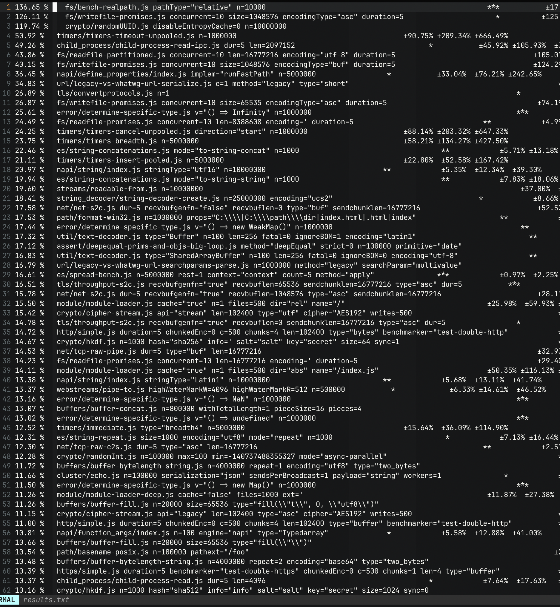

# S2306 赛题验证

Node.js 性能优化

本赛题只有一个提交： https://github.com/plctlab/rvspoc-s2306-node/pull/1

针对此提交进行一系列的 benchmark 验证。

## 说明

观察 PR 内容，所有 commit 基本都是围绕 backport 以及相关依赖的更新进行的，目测没有看到强针对 RISC-V 的相关优化。

## benchmark 流程

1. checkout PR 后，除 openssl 使用系统本身依赖外均使用 nodejs 内置依赖编译出二进制。
2. 使用脚本对编译出的二进制进行跑分，https://github.com/plctlab/rvspoc/tree/main/Docs/S2306/benchmark.sh
   * 由于单次跑分时间过长，仅跑了三次，得到「结果 1」
3. 下载官方原版 20.10.0 的源码包，并采用同样的方式编译出二进制
4. 对原版 20.10.0 使用同样的方式进行跑分，时间仅够跑一次，得到「结果 2」
5. 下载官方原版 21.7.1 的源码包，并采用同样的方式编译出二进制
6. 对原版 21.7.1 使用同样的方式基于 20.10.0 的 benchmark 集进行跑分，时间仅够跑一次，得到「结果 3」（仅做参考）（由于版本不同，一些 benchmark 条目是可能失败的，也可能是不合适的）
7. 使用程序对「结果 1」和「结果 2」；「结果 1」和「结果 3」，分别进行整合，以得出可以给 compare.R 进行分析的 csv 文件。
   * 程序可见目录 [makeComparableCSV](./_i/makeComparableCSV)
8. 使用脚本 [get-result.sh](./_i/get-result.sh) 得到针对每项跑分的结果。
9. 对两个结果进行排序

## 中间产物

[中间产物目录](./_i)

## 结果分析

排序后，相较于原始 20.10.0 版本编译出来的二进制，优化项目的排序示例如下图：

优化幅度从上到下依次递减。

针对优化幅度超过 20% 条目做简单说明：

* 136.65 %        `fs/bench-realpath.js pathType="relative" n=10000`
    * 相较于 21.7.1 版本，提升了 613.95 %
* 126.11 %        `fs/writefile-promises.js concurrent=10 size=1048576 encodingType="asc" duration=5`
    * 21.7.1 版本失败
* 119.74 %        `crypto/randomUUID.js disableEntropyCache=0 n=10000000`
    * 21.7.1 版本失败
* 50.92 %        `timers/timers-timeout-unpooled.js n=1000000`
    * 相较于 21.7.1 版本，提升了 231.47 %
* 49.26 %        `child_process/child-process-read-ipc.js dur=5 len=2097152`
    * 相较于 21.7.1 版本，提升了 935.65 %
* 43.86 %        `fs/readfile-partitioned.js concurrent=10 len=16777216 encoding="utf-8" duration=5`
    * 21.7.1 版本失败
* 40.15 %        `fs/writefile-promises.js concurrent=10 size=1048576 encodingType="buf" duration=5`
    * 21.7.1 版本失败
* 36.45 %        `napi/define_properties/index.js implem="runFastPath" n=5000000`
    * 相较于 21.7.1 版本，提升了 0.87 %
* 34.83 %        `url/legacy-vs-whatwg-url-serialize.js e=1 method="legacy" type="short"`
    * 相较于 21.7.1 版本，提升了 1.94 %
* 26.89 %        `tls/convertprotocols.js n=1`
    * 相较于 21.7.1 版本，下降了 2.58 %
* 26.87 %        `fs/writefile-promises.js concurrent=10 size=65535 encodingType="asc" duration=5`
    * 21.7.1 版本失败
* 25.61 %        `error/determine-specific-type.js v="() => Infinity" n=1000000`
    * 相较于 21.7.1 版本，提升了 913.26 %
* 24.49 %        `fs/readfile-promises.js concurrent=10 len=8388608 encoding=' duration=5`
    * 21.7.1 版本失败
* 24.25 %        `timers/timers-cancel-unpooled.js direction="start" n=1000000`
    * 相较于 21.7.1 版本，提升了 28.83 %
* 23.75 %        `timers/timers-breadth.js n=5000000`
    * 相较于 21.7.1 版本，下降了 5.31 %
* 22.46 %        `es/string-concatenations.js mode="to-string-concat" n=1000`
    * 相较于 21.7.1 版本，下降了 52.62 %
* 21.11 %        `timers/timers-insert-pooled.js n=5000000`
    * 相较于 21.7.1 版本，下降了 3.91 %
* 20.97 %        `napi/string/index.js stringType="Utf16" n=10000000`
    * 相较于 21.7.1 版本，下降了 2.36 %

更详细的内容，可见文件：

* [results.txt](./_i/results.txt) 对应从「结果 2」到「结果 1」的优化幅度。
* [results.21.txt](./_i/results.21.txt) 对应从「结果 3」到「结果 1」的优化幅度。

若有疑问，可以在上述 PR 内直接留言。
