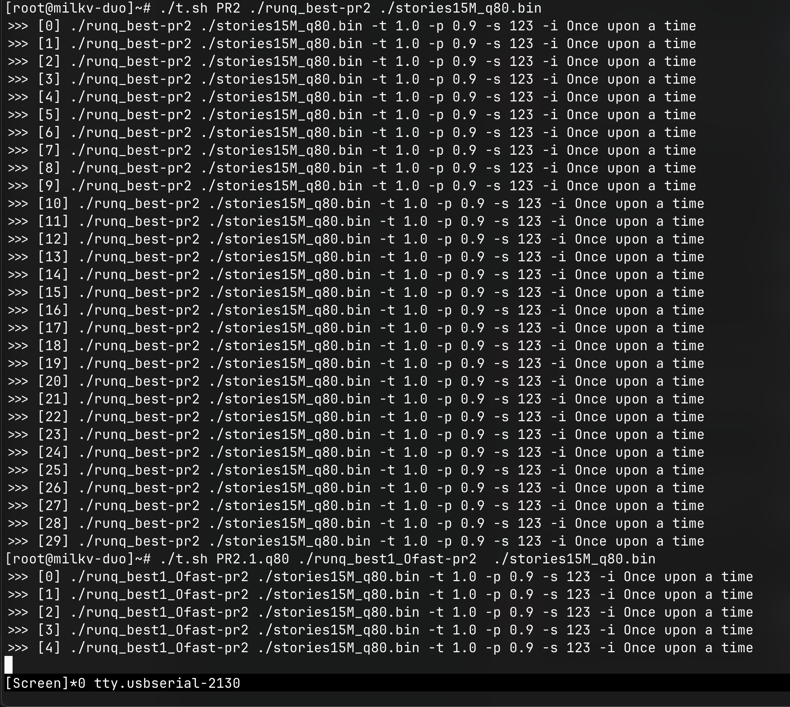

# S2311 赛题验证

**Baby LLaMA 2 on Duo 速度优化（儿童讲故事场景）**

* 若 PR 未指定系统，则使用默认系统： https://github.com/milkv-duo/duo-buildroot-sdk/tree/9e5b754ca67cf50ef8fcf69d94284d5ab701c18e 修改内存，去掉 ION 保留内存后，使用默认参数编译，使得可用内存达到 55.3M
* Toolchain： https://github.com/milkv-duo/duo-app-sdk/releases/tag/duo-app-sdk-v1.2.0
* 所有输出均重定向到文件，以达到更高的性能

## 额外要求

**最后得到结果后，需要给出源文件**

## 汇总表

未 int8 量化模型下（无 SWAP 分区/文件）：

| 标记 | tok/s （30 次均值） | 输出故事与原 llama2.c 输出是否一致 | 若故事不一致，语法错误数目，及 grammarly 评分 | 备注 |
|:--:|:--:|:--:|:--:|:--:|
|原 llama2.c|0.360350|-|-||
|PR1|0.360436|一致|-||
|PR2|无|||仅提供了 x86-64 的 binary |
|PR3|0.359744|一致|-||
|PR4|无|||未提供当前模型下的 binary |
|PR5|0.359931|一致|-||

int8 量化模型下：

| 标记 | tok/s (q80, no swap) （30 次均值） | tok/s (q80, with swap) （30 次均值） | 输出故事与原 llama2.c 输出是否一致 | 若故事不一致，语法错误数目，及 grammarly 评分 | 备注 |
|:--:|:--:|:--:|:--:|:--:|:--:|
|原 llama2.c||6.152599|-|-,97||
|PR1|无|无|-|-||
|PR2|失败|6.233969<br/>6.143955<br/>6.128583|不一致<br/>一致<br/>一致|0,100<br/>-<br/>-|根据提交者说明，对应 -Ofast<br/>-O3<br/>未知|
|PR3|失败|4.632194|不一致|0,99||
|PR4|**24.302522**|24.120992|不一致|0,98|++优化幅度明显，怀疑利用了 TPU|
|PR5|失败|9.141815|不一致|0,100||

TTS 说明

| 标记 | 说明 |
|:--:|:--:|
|PR1|无 TTS 相关说明|
|PR2|说明使用现成的 Flite 以生成音频文件|
|PR3|无 TTS 相关说明|
|PR4|无 TTS 相关说明|
|PR5|给出了 TTS 生成的二进制，但无额外说明|

* 详细的输出故事见下文

## 测试流程

1. 根据每个提交获取对应二进制（目前除 PR1 全是提交的二进制文件，无完整的原源代码）**得到二进制**
2. 使用 baby llama 2 官方指向的故事模型，转换成 int8 量化的模型 **得到 int8 量化后的模型**
    * 模型使用 https://huggingface.co/karpathy/tinyllamas/tree/main 下的 `stories15M.pt`
    * 转换使用
    ```bash
    python export.py stories15M_q80.bin --version 2 --checkpoint ./stories15M.pt
    ```
3. 使用脚本测试对应二进制所输出的内容。**产生故事内容及 tok/s**
    ```bash
    #!/bin/sh
    #
    set -e

    NAME="$1"
    BIN="$2"
    CPOINT="$3"
    TIMES=30
    OUTFILE=./$NAME.out.txt

    i=0
    while [ $i -lt $TIMES ]; do
        set -- $BIN $CPOINT '-t' 1.0 '-p' 0.9 '-s' 123 '-i' 'Once upon a time'
        echo ">>>" "[$i]" "$@"
        "$@" >>"$OUTFILE" 2>&1
        i=$((i+1))
    done
    ```
4. 根据 30 次的分数算均值。**得到均值**
    ```bash
    #!/bin/bash
    #

    file="$1"
    name="$2"

    grep 'achieved tok/s:' "$file" | awk -F' ' '{print $NF"\n"}' | grep -Ev '$[[:space:]]*^' >scores.dir/"$name".txt
    wc -l scores.dir/"$name".txt
    ```
    及
    ```bash
    #!/bin/bash
    #

    avr() {
        file="$1"
        exp=""
        ln=0

        while read -r line; do
            exp+="$line"
            exp+=" +"
            (( ln++ ))
        done <"$file"

        exp="${exp% +}"
        average=$(echo "scale=6; ( $exp ) / $ln" | bc)

        echo "${file%.txt}: $average" >>summary
    }

    while read -r line; do
        avr "$line"
    done <<<"$(ls -1 *.txt)"

    ```
5. 判断每次输出的故事是否一致，并得到每个结果输出的故事内容。**得到故事内容**
    ```bash
    #!/bin/bash
    #

    file="$1"
    out="$2"
    declare -a story tmp

    array_compare() {
        local arrayName1="$1" arrayName2="$2"

        if eval "test \${#$arrayName1[@]} -ne \${#$arrayName2[@]}"; then
            return 1
        fi

        eval "local length=\${#$arrayName1[@]}"
        for (( i=0; i<$length; i++ )); do
            if eval "test \"\${$arrayName1[$i]}\" != \"\${$arrayName2[$i]}\""; then
                return 1
            fi
        done

        return 0 
    }

    array_echo() {
        local arrayName="$1"
        eval "local length=\${#$arrayName[@]}"
        for (( i=0; i<$length; i++ )); do
            eval "echo \"\${$arrayName[i]}\""
        done
    }

    while read -r line; do
        if [[ "$line" =~ ^[[:space:]]*$ ]]; then
            tmp[$((${#tmp[@]}-1))]="${tmp[$((${#tmp[@]}-1))]%achieved tok/s:*}"
            if (( "${#story[@]}" > 0 )); then
                if ! array_compare story tmp; then
                    echo "Different story!" >&2
                    echo "Previous:" >&2
                    array_echo story >&2
                    echo "New:" >&2
                    array_echo tmp >&2
                    exit 1
                fi
            else
                for ((i=0; i<${#tmp[@]}; i++)); do
                    story[i]="${tmp[i]}"
                done
            fi
            tmp=()
        else
            tmp+=( "$line" )
        fi
    done <"$file"

    array_echo story >stories.dir/"$out".txt
    ```
6. 使用 `vim -d` 判断各个内容与原 llama2.c 得到的故事内容是否一致。
7. 使用 grammarly 辅助判断各个输出内容语法，并获取其评分辅助

## 验证中间产物

[中间产物目录](./i)

## 原 baby llama2 说明

使用 https://github.com/karpathy/llama2.c 仓库，在上述及赛题验收说明的条件下，使用如下命令生成的二进制求基线值：

```bash
riscv64-unknown-linux-musl-gcc -march=rv64gcv0p7_zfh_xtheadc -mabi=lp64d -mtune=c906 -Ofast -lm -o run-gcc-musl-Ofast-rv64gcv0p7_zfh_xthead run.c
riscv64-unknown-linux-musl-gcc -march=rv64gcv0p7_zfh_xtheadc -mabi=lp64d -mtune=c906 -Ofast -lm -o runq-gcc-musl-Ofast-rv64gcv0p7_zfh_xthead runq.c
```

### 输出故事内容

* 未 int8 量化模型
    ```
    Once upon a time, there was a little girl named Lily. One day, Lily and her mommy went to the park. They played on the swings and went down the slide. Suddenly, Lily's toy fell out of her pocket. She looked everywhere for it but couldn't find it.
    Lily's mommy told her not to worry and that they would get her a new toy. But then, a boy came over and said he saw the toy in the sandbox. He had taken it! Lily's mommy knew how to get it back, so she called the police.
    The police came and found the boy who had stolen Lily's toy. They returned it to her, but the boy was very scared and ran away. Lily's mommy explained to her that stealing is wrong and that it's important to always ask before taking something that belongs to someone else.
    ```
* int8 量化模型
    ```
    Once upon a time, there was a little girl named Lily. One day, Lily and her mommy went to the park. They played on the swings and went down the slide. Suddenly, Lily's favorite toy fell on the ground. She was very sad and started to cry.
    Her mommy asked, "What happened, Lily?"
    "My toy fell on the ground and now it's gone," Lily said.
    "Don't worry, we'll find it," her mommy said. They looked around the park, but they couldn't find the toy. Then, they saw a boy playing with a toy that looked just like Lily's. It was a gifted toy!
    Lily was so happy to have her toy back, but she knew it wasn't hers to keep. She said, "That's stupid! I want it back." Her mommy smiled and said, "I'm glad you found it, Lily. Let's go get it back." And they went home, happy and relieved.
    ```

## 每个 PR 说明

### PR1

https://github.com/plctlab/rvspoc-s2311-llama2/pull/1
  
* 提交者：Tomori0Nao
* 创建时间：2024-02-28T14:19:28Z
* 最后一次 commit 的时间（作参考）：2024-02-28T14:15:38Z

PR 改动：

* 提交者修改了 `run.c` 文件

验证：

1. 因 PR 未说明操作系统，故使用默认系统
2. 经测试内存占用未超过默认系统下的默认内存大小，故无需调整内存
3. `run` 二进制根据 PR 下 README.md 说明生成

#### 输出故事内容

* 未 int8 量化模型
    ```
    Once upon a time, there was a little girl named Lily. One day, Lily and her mommy went to the park. They played on the swings and went down the slide. Suddenly, Lily's toy fell out of her pocket. She looked everywhere for it but couldn't find it.
    Lily's mommy told her not to worry and that they would get her a new toy. But then, a boy came over and said he saw the toy in the sandbox. He had taken it! Lily's mommy knew how to get it back, so she called the police.
    The police came and found the boy who had stolen Lily's toy. They returned it to her, but the boy was very scared and ran away. Lily's mommy explained to her that stealing is wrong and that it's important to always ask before taking something that belongs to someone else.
    ```
* int8 量化模型
    ```
    无
    ```

### PR2

https://github.com/plctlab/rvspoc-s2311-llama2/pull/2

* 提交者：forcekeng
* 创建时间：2024-02-28T15:27:03Z
* 最后一次 commit 的时间（作参考）：2024-02-28T15:22:33Z

PR 改动很多

* 针对模型的生成/转换有额外的 C 文件
* 给出了运行程序的二进制文件，无源文件可用于编译/生成
* 针对未量化模型的二进制，架构错误（x86-64）故无法验证，但根据 README.md 的说明得知其主要针对 int8 量化的模型做的优化，且发现时已经过了最后截止日期，故未再向选手索要
* 最后使用直接给出的二进制进行测试

#### 输出故事内容

* 未 int8 量化模型
    ```
    无
    ```
* int8 量化模型（从上到下，分别对应上述汇总表格顺序）
    ```
    Once upon a time, there was a little girl named Lily. One day, Lily and her mommy went to the park. They played on the swings and went down the slide. Then, they sat down on a bench to rest.
    Lily's mommy had a secret treasure that she wanted to share with Lily. She said, "Lily, look what I found at the park. It's a secret treasure!" Lily was so happy and said, "Wow, mommy! That's a popular treasure! I'll share it with you!"
    They sat on the bench and ate the treasure. It was the most delicious treat they had ever tasted. Lily said, "This is the best day ever! I can't wait to tell my friends about it!"
    
    Once upon a time, there was a little girl named Lily. One day, Lily and her mommy went to the park. They played on the swings and went down the slide. Suddenly, Lily's favorite toy fell on the ground. She was very sad and started to cry.
    Her mommy asked, "What happened, Lily?"
    "My toy fell on the ground and now it's gone," Lily said.
    "Don't worry, we'll find it," her mommy said. They looked around the park, but they couldn't find the toy. Then, they saw a boy playing with a toy that looked just like Lily's. It was a gifted toy!
    Lily was so happy to have her toy back, but she knew it wasn't hers to keep. She said, "That's stupid! I want it back." Her mommy smiled and said, "I'm glad you found it, Lily. Let's go get it back." And they went home, happy and relieved.
    
    Once upon a time, there was a little girl named Lily. One day, Lily and her mommy went to the park. They played on the swings and went down the slide. Suddenly, Lily's favorite toy fell on the ground. She was very sad and started to cry.
    Her mommy asked, "What happened, Lily?"
    "My toy fell on the ground and now it's gone," Lily said.
    "Don't worry, we'll find it," her mommy said. They looked around the park, but they couldn't find the toy. Then, they saw a boy playing with a toy that looked just like Lily's. It was a gifted toy!
    Lily was so happy to have her toy back, but she knew it wasn't hers to keep. She said, "That's stupid! I want it back." Her mommy smiled and said, "I'm glad you found it, Lily. Let's go get it back." And they went home, happy and relieved.
    ```

### PR3

https://github.com/plctlab/rvspoc-s2311-llama2/pull/3

* 提交者：AliveGh0st
* 创建时间：2024-02-29T06:49:31Z
* 最后一次 commit 的时间（作参考）：2024-02-29T06:45:28Z

直接给出了对应的二进制文件。

#### 输出故事内容

* 未 int8 量化模型
    ```
    Once upon a time, there was a little girl named Lily. One day, Lily and her mommy went to the park. They played on the swings and went down the slide. Suddenly, Lily's toy fell out of her pocket. She looked everywhere for it but couldn't find it.
    Lily's mommy told her not to worry and that they would get her a new toy. But then, a boy came over and said he saw the toy in the sandbox. He had taken it! Lily's mommy knew how to get it back, so she called the police.
    The police came and found the boy who had stolen Lily's toy. They returned it to her, but the boy was very scared and ran away. Lily's mommy explained to her that stealing is wrong and that it's important to always ask before taking something that belongs to someone else.
    ```
* int8 量化模型
    ```
    Once upon a time, there was a little girl named Lily. One day, Lily and her mommy went to the park. They played on the swings and went down the slide. Then, they sat down on a bench to rest.
    Lily's mommy had a glass of water nearby. She wanted to pour some water into a cup to drink. But the cup was wet! It had a leak in it.
    Lily's mommy said, "Oh no! We need to dry the glass before we can have our drink." So they used some towels to dry the glass. After that, they drank the water and had a picnic. They laughed and played until it was time to go home.
    ```

### PR4

https://github.com/plctlab/rvspoc-s2311-llama2/pull/4
  
* 提交者：chamchamgo
* 创建时间：2024-02-29T13:26:45Z
* 最后一次 commit 的时间（作参考）：2024-02-29T13:44:35Z

给出了优化后编译的二进制。

#### 输出故事内容

* 未 int8 量化模型
    ```
    无
    ```
* int8 量化模型
    ```
    Once upon a time, there was a little girl named Lily. One day, Lily went to the park with her mommy. They saw a big, fluffy dog playing with a ball. Lily wanted to pet the dog, but her mommy said they had to stay quiet so the dog wouldn't bite.
    Suddenly, Lily saw a squirrel running across the fence. She ran after it, but it was too fast for her. Then, she saw a bowl of rice on the ground. She picked it up and said, "I'll eat this rice for dinner."
    As she was eating, a little boy came up to her and said, "Can I have some rice too?" Lily was so kind that she shared her rice with the boy. The boy was happy and said, "Thank you!" They became friends and played together in the park. When it was time to go home, Lily said goodbye to the boy and the dog. She was happy to have made a new friend and the dog was happy to have someone to play with.
    ```

### PR5

https://github.com/plctlab/rvspoc-s2311-llama2/pull/5

* 提交者：jcyao
* 创建时间：2024-02-29T14:11:22Z
* 最后一次 commit 的时间（作参考）：2024-02-29T14:40:00Z

给出了源码以及二进制，使用二进制进行了验证

又给出了 cpp 版本的 llama2，但需要额外转换模型，无适合的比较基础（偏离本题），未对其进行验证（说明上速度也更差）。

#### 输出故事内容

* 未 int8 量化模型
    ```
    Once upon a time, there was a little girl named Lily. One day, Lily and her mommy went to the park. They played on the swings and went down the slide. Suddenly, Lily's toy fell out of her pocket. She looked everywhere for it but couldn't find it.
    Lily's mommy told her not to worry and that they would get her a new toy. But then, a boy came over and said he saw the toy in the sandbox. He had taken it! Lily's mommy knew how to get it back, so she called the police.
    The police came and found the boy who had stolen Lily's toy. They returned it to her, but the boy was very scared and ran away. Lily's mommy explained to her that stealing is wrong and that it's important to always ask before taking something that belongs to someone else.
    ```
* int8 量化模型
    ```
    Once upon a time, there was a little girl named Lily. One day, Lily and her mommy went to the park. They played on the swings and went down the slide. Then, they sat down on a bench to rest.
    Lily's mommy had a secret treasure that she wanted to share with Lily. She said, "Lily, look what I found at the park. It's a secret treasure!" Lily was so happy and said, "Wow, mommy! That's a popular treasure! I'll share it with you!"
    They sat on the bench and ate the treasure. It was the most delicious treat they had ever tasted. Lily said, "This is the best day ever! I can't wait to tell my friends about it!"
    ```

## 验证过程示例


