# S2422 赛题验证（Llama 3 在 K230 上的优化实现）

## 概述

- PR1 使用了 llama.cpp 实现对 Q2 量化模型进行了尝试。
  * 选手选用了系统镜像 canmv_debian_sdcard_sdk_1.3.img
  * 分别采用
    1. XuanTie 工具链交叉编译
    2. OpenBLAS 加速
    3. riscv64-glibc-ubuntu-22.04-gcc-nightly-2024.08.03-nightly 工具链，并对 llama.cpp 实现打了 rvv 补丁

    最终方式 3 结果最优。
    ```bash
    $ time ./run3-1 -m ../Meta-Llama-3-8B.Q2_K.gguf -p "Once upon a time, " -n 10
    ...
    ...
    Once upon a time, 21 million years ago, I was a child in
    llama_print_timings:        load time =  436411.50 ms
    llama_print_timings:      sample time =      22.57 ms /    10 runs   (    2.26 ms per token,   443.01 tokens per second)
    llama_print_timings: prompt eval time =  154567.85 ms /     6 tokens (25761.31 ms per token,     0.04 tokens per second)
    llama_print_timings:        eval time = 1156768.66 ms /     9 runs   (128529.85 ms per token,     0.01 tokens per second)
    llama_print_timings:       total time = 1311824.77 ms /    15 tokens
    Log end

    real    29m17.170s
    user    3m56.171s
    sys     0m42.606s
    ```
- PR2 尝试自行编译 k230_sdk，使用 llama.cpp 实现对 Q2/Q4 量化模型进行了尝试，未提交额外的代码优化。
  * 根据提交的信息编译 k230_sdk 启动系统失败，考虑到未提交系统优化，为了方便比较，采用和 PR1 相同的系统镜像
  * PR2 同时尝试了 nncase，但未成功。
  * 采用了 XuanTie 工具链进行了交叉编译，参数上禁用了 OPENMP，最终结果为：
    ```bash
    $ time ./llama-cli -m ../Meta-Llama-3-8B.Q2_K.gguf -p "Once upon a time, " -n 10 -s 123
    ...
    ...
    Once upon a time, 16 years ago to be precise, I went to
    llama_print_timings:        load time =  474374.78 ms
    llama_print_timings:      sample time =      11.19 ms /    10 runs   (    1.12 ms per token,   893.50 tokens per second)
    llama_print_timings: prompt eval time =  384421.64 ms /     6 tokens (64070.27 ms per token,     0.02 tokens per second)
    llama_print_timings:        eval time = 1186821.28 ms /     9 runs   (131869.03 ms per token,     0.01 tokens per second)
    llama_print_timings:       total time = 1571887.51 ms /    15 tokens
    Log end

    real    34m15.751s
    user    16m57.180s
    sys     0m42.747s
    ```
- PR3 尝试了两种实现，分别是 llama3.c 和 llama.cpp，分别对 Q8 量化模型和 Q2/Q4 量化模型进行了尝试，由于直接给出了二进制文件，暂不清楚是否额外的代码优化。
  * 选手选用了系统镜像 canmv_debian_sdcard_sdk_1.3.img
  * 其中 llama3.c 较 llama.cpp 验证后效率更差（考虑模型量化的原因）。
  * 使用其提供的 llama.cpp 二进制验证后，Q2 量化模型总体更优，为了便于比较于其他 PR 比较，这里贴 Q2 的结果，Q4 结果可以查阅下文。
    ```bash
    $ time ./llama-cli-tune -m ../Meta-Llama-3-8B.Q2_K.gguf -p "Once upon a time, " -n 10   -s 123
    ...
    ...
    Once upon a time, 16 years ago to be precise, I went to
    llama_print_timings:        load time =  464347.33 ms
    llama_print_timings:      sample time =      11.64 ms /    10 runs   (    1.16 ms per token,   858.74 tokens per second)
    llama_print_timings: prompt eval time =  319711.81 ms /     6 tokens (53285.30 ms per token,     0.02 tokens per second)
    llama_print_timings:        eval time = 1172233.65 ms /     9 runs   (130248.18 ms per token,     0.01 tokens per second)
    llama_print_timings:       total time = 1496314.97 ms /    15 tokens
    Log end

    real    32m50.004s
    user    13m43.822s
    sys     0m43.854s
    ```

总体来说，

- PR1 提交了对代码的优化补丁， PR2、PR3 均未提交对代码的优化。
- PR1 成绩较 PR2 和 PR3 更加优秀。

---
---

本次验证使用的资源如下：

1. 硬件
   * 嘉楠 K230 开发板 V1.1
   * 64G SanDisk Micro SD 卡（A2）
2. 文件
   ```
   -rw-r--r-- 1 ryan ryan 3.0G  4月19日 03:34 Meta-Llama-3-8B.Q2_K.gguf
   -rw-r--r-- 1 ryan ryan 4.4G  4月19日 02:09 Meta-Llama-3-8B.Q4_0.gguf
   -rw-r--r-- 1 ryan ryan  24M  8月 9日 05:03 OpenBLAS-0.3.28.tar.gz
   -rw-r--r-- 1 ryan ryan 601M  8月13日 10:47 Xuantie-900-gcc-linux-6.6.0-glibc-x86_64-V2.10.1-20240712.tar.gz
   -rw-r--r-- 1 ryan ryan 1.7G 2024年 1月12日 canmv_debian_sdcard_sdk_1.3.img
   drwxr-xr-x 1 ryan ryan  480  8月13日 18:41 k230_sdk/
   drwxr-xr-x 1 ryan ryan 2.3K  8月13日 19:50 llama.cpp/
   drwxr-xr-x 1 ryan ryan  318  8月13日 15:56 llama3.c/
   -rw-r--r-- 1 ryan ryan 8.0G  8月 3日 10:56 llama3_8b_instruct_q80.bin
   -rw-r--r-- 1 ryan ryan 734M  8月 3日 11:05 riscv64-glibc-ubuntu-22.04-gcc-nightly-2024.08.03-nightly.tar.gz
   ```
   对应 sha256 校验值：
   ```
   99a4485e840c62296bc64c6b6440a32e083013a094416c0764756d49b4e84cc6  ./Meta-Llama-3-8B.Q2_K.gguf
   fa28655abd44b857ec15b659373693c5bcc258ca75312c3f53a516481508aca2  ./Meta-Llama-3-8B.Q4_0.gguf
   f1003466ad074e9b0c8d421a204121100b0751c96fc6fcf3d1456bd12f8a00a1  ./OpenBLAS-0.3.28.tar.gz
   15d91b6613bb92b4685c474972785a49b6f6ee9fbeefa1faef180e86a2f7e2f3  ./Xuantie-900-gcc-linux-6.6.0-glibc-x86_64-V2.10.1-20240712.tar.gz
   aaaff23d14b50924b4b25dc7bb2f56b31bfd404f40cdb6028f9eb0f5dedcce0a  ./canmv_debian_sdcard_sdk_1.3.img
   sha256sum: ./k230_sdk: Is a directory
   sha256sum: ./llama.cpp: Is a directory
   sha256sum: ./llama3.c: Is a directory
   f7a8ae39ecf018ab0e91842cedd59ad2a47fa8ed0dd8c4d8d9f0aa4073f45528  ./llama3_8b_instruct_q80.bin
   44ead75a8814ef43c4f08b13a05fb16dd132bfdcb7cc9bf09bdf0584824e1dc5  ./riscv64-glibc-ubuntu-22.04-gcc-nightly-2024.08.03-nightly.tar.gz
   ```

根据选手的说明文件进行每个 PR 的验证，验证过程如下：

## PR1

- 链接： https://github.com/rv2036/rvspoc-S2422-Llama3/pull/1
- 提交者： northstreet12

*以下三次验证过程在未使用 Swap 的情况下会失败，故开启了 swap。*

### 1. 解压系统镜像

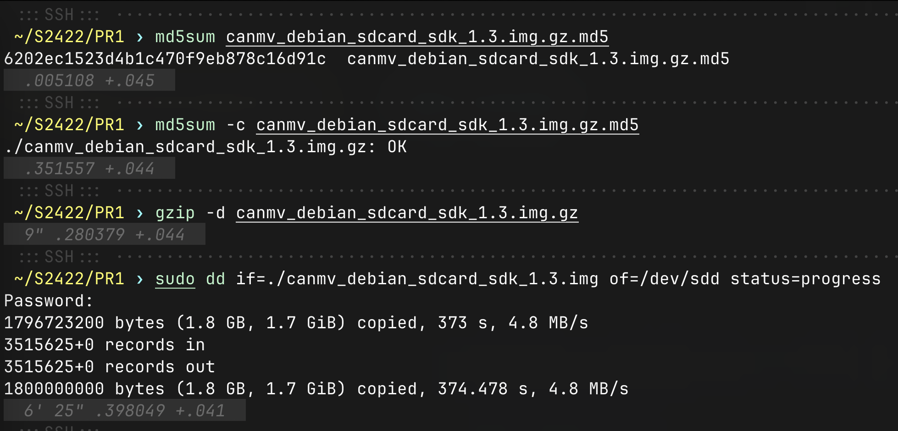

之后，

1. 使用 dd 将镜像烧录至 SD 卡
2. 启动至进入系统，并使用 minicom 通过串口确认/配置 SSHD 以方便通过 SSH 使用。

### 2. 编译选手所声明的 run1 二进制

- 交叉编译工具链： Xuantie-900-gcc-linux-6.6.0-glibc-x86_64-V2.10.1-20240712.tar.gz

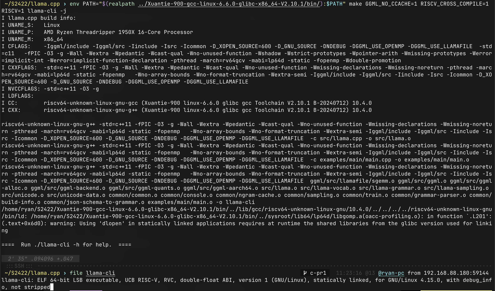

### 3. 将二进制上传 K230 后运行

- 对应模型数据文件 Meta-Llama-3-8B.Q2_K.gguf

模型加载过程中， CPU 及内存使用情况如下（一段连续时间内的最大值）：

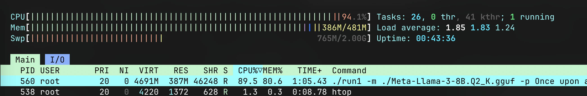

推理过程中， CPU 及内存使用情况如下（一段连续时间内的最大值）：

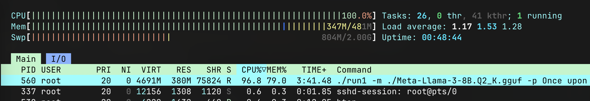

### 4. run1 二进制运行结果如下

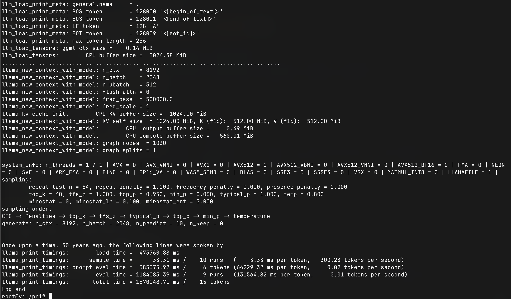

[result1.log](./PR1/4-result.log)

- **此次推理未出现乱码，推理时间过长以至于无法判断故事生成质量**
- **此次使用 llama.cpp 实现**
- 最终结果为：
  ```
  Once upon a time, 30 years ago, the following lines were spoken by
  llama_print_timings:        load time =  473760.88 ms
  llama_print_timings:      sample time =      33.31 ms /    10 runs   (    3.33 ms per token,   300.23 tokens per second)
  llama_print_timings: prompt eval time =  385375.92 ms /     6 tokens (64229.32 ms per token,     0.02 tokens per second)
  llama_print_timings:        eval time = 1184083.39 ms /     9 runs   (131564.82 ms per token,     0.01 tokens per second)
  llama_print_timings:       total time = 1570048.71 ms /    15 tokens
  ```

### 5. 编译安装 OpenBLAS 为选手所声明的 run2 二进制的编译作准备

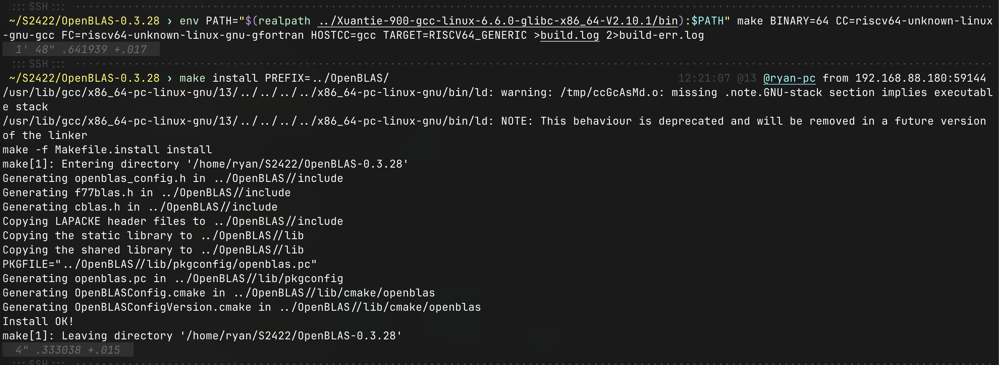

### 6. 编译选手所声明的 run2 二进制

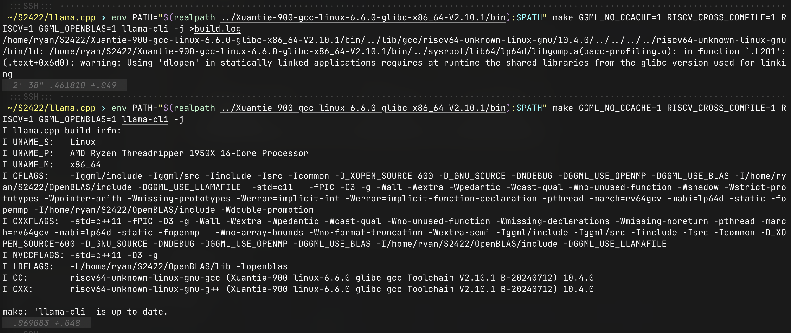

### 7. 将 run2 二进制上传 K230 后运行

- 对应模型数据文件 Meta-Llama-3-8B.Q2_K.gguf

推理过程中， CPU 及内存使用情况如下（一段连续时间内的最大值）：


### 8. run2 二进制运行结果如下

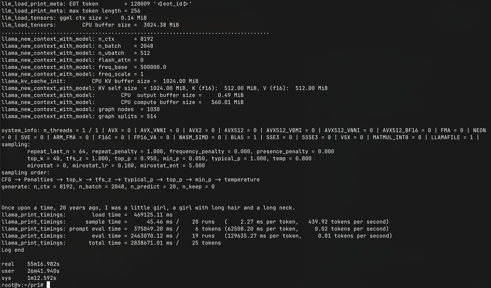

[result2.log](./PR1/8-result.log)

- **此次推理未出现乱码，推理时间过长以至于无法判断故事生成质量**
- **此次使用 llama.cpp 实现**
- 最终结果为：
  ```
  Once upon a time, 20 years ago, I was a little girl, a girl with long hair and a long neck.
  llama_print_timings:        load time =  469125.11 ms
  llama_print_timings:      sample time =      45.46 ms /    20 runs   (    2.27 ms per token,   439.92 tokens per second)
  llama_print_timings: prompt eval time =  375049.20 ms /     6 tokens (62508.20 ms per token,     0.02 tokens per second)
  llama_print_timings:        eval time = 2463070.12 ms /    19 runs   (129635.27 ms per token,     0.01 tokens per second)
  llama_print_timings:       total time = 2838671.01 ms /    25 tokens
  ```

### 9. 编译选手所声明的 run3 二进制

- 交叉编译工具链： riscv64-glibc-ubuntu-22.04-gcc-nightly-2024.08.03-nightly.tar.gz

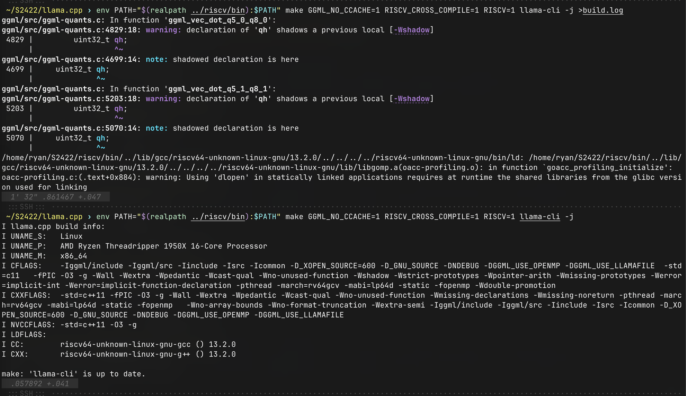

### 7. 将 run3 二进制上传 K230 后运行

- 对应模型数据文件 Meta-Llama-3-8B.Q2_K.gguf

推理过程中， CPU 及内存使用情况如下（一段连续时间内的最大值）：

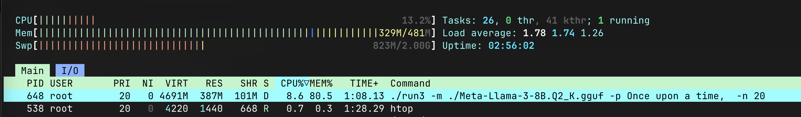

### 8. run3 二进制运行结果如下


[result3.log](./PR1/11-result.log)

此次推理出现乱码，推理时间过长，且确认无法生成正常故事

对 llama.cpp 应用选手的 [patch](https://github.com/user-attachments/files/16607707/ggml-quants.c.patch) 后，

重新编译 llama.cpp 后上传至 K230 进行验证，两次验证结果如下：

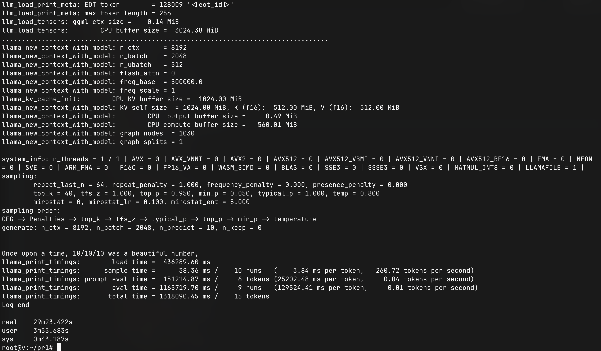

[result3-1.log](./PR1/11-result-patched.log)

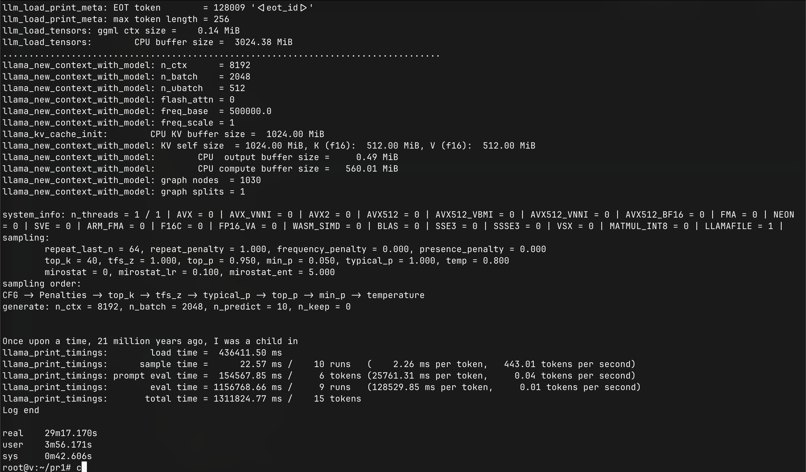

[result3-2.log](./PR1/11-result-patched-1.log)

- **此次推理未出现乱码，推理时间过长以至于无法判断故事生成质量**
- **此次使用 llama.cpp 实现**
- 最终结果为：
  ```
  Once upon a time, 21 million years ago, I was a child in
  llama_print_timings:        load time =  436411.50 ms
  llama_print_timings:      sample time =      22.57 ms /    10 runs   (    2.26 ms per token,   443.01 tokens per second)
  llama_print_timings: prompt eval time =  154567.85 ms /     6 tokens (25761.31 ms per token,     0.04 tokens per second)
  llama_print_timings:        eval time = 1156768.66 ms /     9 runs   (128529.85 ms per token,     0.01 tokens per second)
  llama_print_timings:       total time = 1311824.77 ms /    15 tokens
  Log end

  real    29m17.170s
  user    3m56.171s
  sys     0m42.606s
  ```

### 9. 结果

- 去除有乱码情况的 run3 二进制结果
- 取成绩稍好的 run3-1 二进制所生成的结果为 PR1 的最终结果
  ```
  Once upon a time, 21 million years ago, I was a child in
  llama_print_timings:        load time =  436411.50 ms
  llama_print_timings:      sample time =      22.57 ms /    10 runs   (    2.26 ms per token,   443.01 tokens per second)
  llama_print_timings: prompt eval time =  154567.85 ms /     6 tokens (25761.31 ms per token,     0.04 tokens per second)
  llama_print_timings:        eval time = 1156768.66 ms /     9 runs   (128529.85 ms per token,     0.01 tokens per second)
  llama_print_timings:       total time = 1311824.77 ms /    15 tokens
  Log end

  real    29m17.170s
  user    3m56.171s
  sys     0m42.606s

  ```
- **本次验证与选手提供的结果基本一致。**

## PR2

- 链接： https://github.com/rv2036/rvspoc-S2422-Llama3/pull/2
- 提交者： PeterXingke

### 1. 根据选手的声明制作系统镜像

完整的制作过程，见如下日志：

[log](./PR2/0-build.log)

### 2. 写入制作好的系统镜像

```
root@6f91b8a3c410:/home/ryan/S2422/k230_sdk# ls -lh output/k230_canmv_defconfig/images/
total 226M
drwxr-xr-x 1 root root  112 Aug 13 19:08 big-core
lrwxrwxrwx 1 root root   22 Aug 13 19:08 k230_canmv_sdcard__nncase_v2.8.3.img.gz -> sysimage-sdcard.img.gz
drwxr-xr-x 1 root root  506 Aug 13 19:08 little-core
-rw-rw-rw- 1 root root 465M Aug 13 19:08 sysimage-sdcard.img
-rw-rw-rw- 1 root root  61M Aug 13 19:08 sysimage-sdcard.img.gz
# dd ...
```

尝试启动系统失败，卡死在 uboot 交互界面后的 boot 命令后。

- 由于根据选手有限的描述修改的配置启动失败
- 考虑在选手并未提交对系统有性能优化修改的前提下
- 选择相同的系统更有利于比较

故，此处换选 canmv_debian_sdcard_sdk_1.3.img 进行验证。

### 3. 根据选手的说明准备并编译 llama.cpp 的二进制

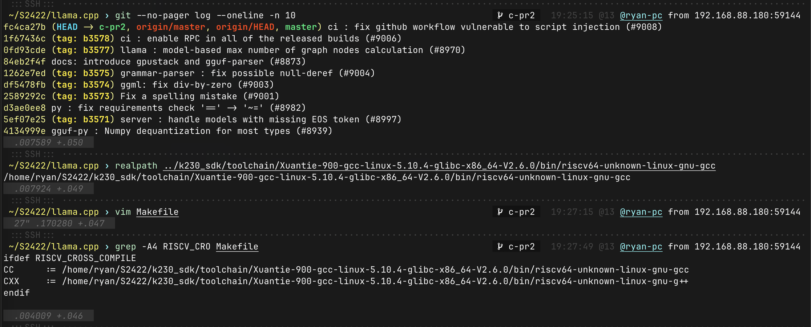
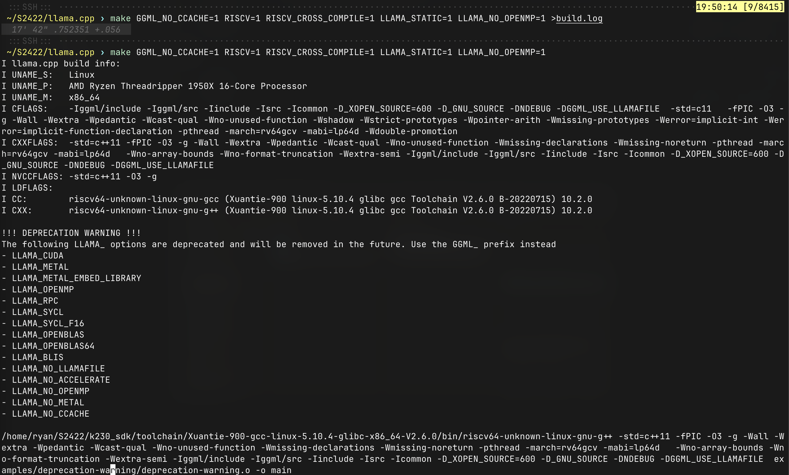
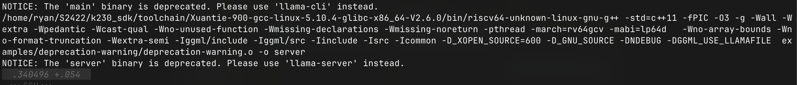
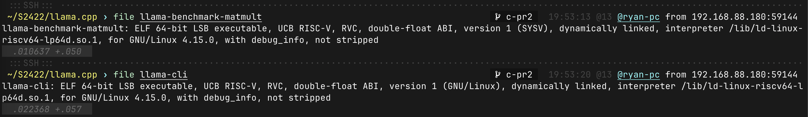

### 4. 上传二进制至 K230 开发板，并验证

1. Q2 量化模型推理过程中， CPU 和内存的使用率如下（一段连续时间内的最大值）：
   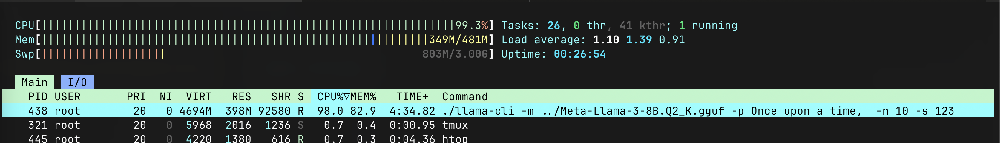
   * **此次推理未出现乱码，推理时间过长以至于无法判断故事生成质量**
   * **此次使用 llama.cpp 实现**
   * 最终结果为：
     ```
     Once upon a time, 16 years ago to be precise, I went to
     llama_print_timings:        load time =  474374.78 ms
     llama_print_timings:      sample time =      11.19 ms /    10 runs   (    1.12 ms per token,   893.50 tokens per second)
     llama_print_timings: prompt eval time =  384421.64 ms /     6 tokens (64070.27 ms per token,     0.02 tokens per second)
     llama_print_timings:        eval time = 1186821.28 ms /     9 runs   (131869.03 ms per token,     0.01 tokens per second)
     llama_print_timings:       total time = 1571887.51 ms /    15 tokens
     Log end

     real    34m15.751s
     user    16m57.180s
     sys     0m42.747s
     ```
     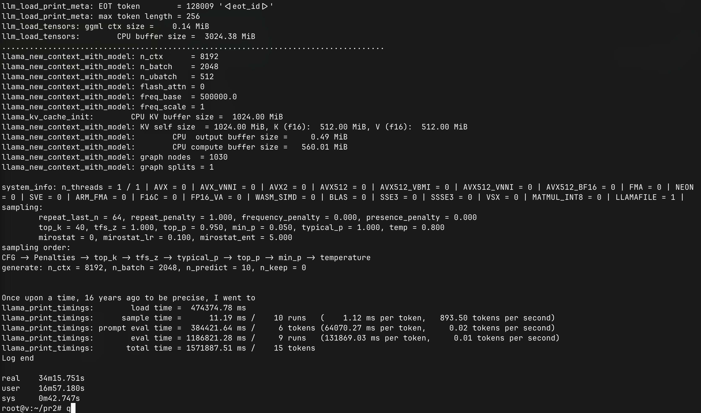 [result-q2.log](./PR2/5-llama.cpp.result-q2.log)
2. Q4 量化模型推理过程中， CPU 和内存的使用率如下（一段连续时间内的最大值）：
   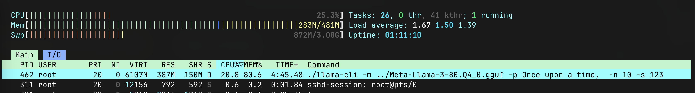
   * **此次推理未出现乱码，推理时间过长以至于无法判断故事生成质量**
   * **此次使用 llama.cpp 实现**
   * 最终结果为：
     ```
     Once upon a time, 1985 to be exact, I had a great
     llama_print_timings:        load time =  562059.99 ms
     llama_print_timings:      sample time =      13.38 ms /    10 runs   (    1.34 ms per token,   747.22 tokens per second)
     llama_print_timings: prompt eval time =  234700.01 ms /     6 tokens (39116.67 ms per token,     0.03 tokens per second)
     llama_print_timings:        eval time = 1677424.60 ms /     9 runs   (186380.51 ms per token,     0.01 tokens per second)
     llama_print_timings:       total time = 1912710.91 ms /    15 tokens
     Log end

     real    41m24.156s
     user    9m25.443s
     sys     0m58.469s
     ```
     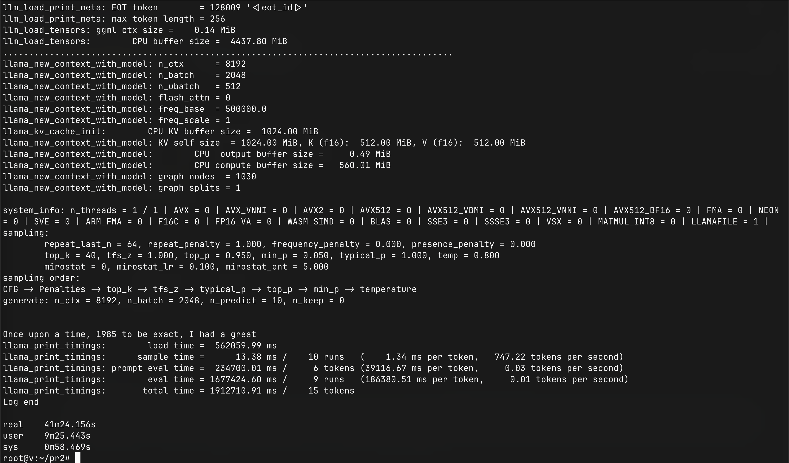 [result-q4.log](./PR2/7-llama.cpp.result-q4.log)

### 5. nncase 的尝试

选手尝试使用 nncase 完成部署，但最后未成功，详见： https://github.com/rv2036/rvspoc-S2422-Llama3/blob/6ecebb210c2d586c1e2b24966f9b4bb573ce1232/S2422-xdlddw-report.md#方法2使用nncase完成部署

### 6. 结果

采用稍优，且与其他 PR 有共性的 Q2 量化结果进行比较：

```
Once upon a time, 16 years ago to be precise, I went to
llama_print_timings:        load time =  474374.78 ms
llama_print_timings:      sample time =      11.19 ms /    10 runs   (    1.12 ms per token,   893.50 tokens per second)
llama_print_timings: prompt eval time =  384421.64 ms /     6 tokens (64070.27 ms per token,     0.02 tokens per second)
llama_print_timings:        eval time = 1186821.28 ms /     9 runs   (131869.03 ms per token,     0.01 tokens per second)
llama_print_timings:       total time = 1571887.51 ms /    15 tokens
Log end

real    34m15.751s
user    16m57.180s
sys     0m42.747s
```

**本次验证与选手提供的结果基本一致。**

## PR3

- 链接： https://github.com/rv2036/rvspoc-S2422-Llama3/pull/3
- 提交者： Sophia957

### 1. 确认使用由选手指定的系统镜像

确认使用选手指定的系统镜像 canmv_debian_sdcard_sdk_1.3.img 并烧录至 SD 卡。

### 2. 按照选手所声明的内容准备系统环境

1. 确认扩容了分区
2. 确认加载了 2G 的 SWAP

### 3. 验证实现 1: llama3.c

1. 选手提供了二进制 runq3-k230 和分词文件 tokenizer.bin，故直接使用
2. 确认使用选手声明的 llama3_8b_instruct_q80.bin 模型
3. 上传文件至 K230 进行推理
4. 推理过程中，内存和 CPU 的使用情况为（一段连续时间内的最大值）：
   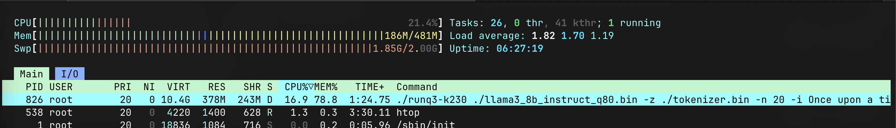
5. 经过漫长等待后，推理结果为：
   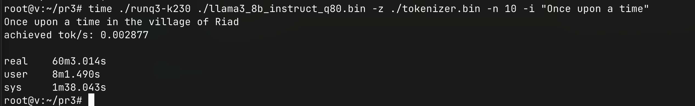


- **此次推理未出现乱码，推理时间过长以至于无法判断故事生成质量**
- **此次使用 llama3.c 实现**
- 最终结果为：
  ```
  root@v:~/pr3# time ./runq3-k230 ./llama3_8b_instruct_q80.bin -z ./tokenizer.bin -n 10 -i "Once upon a time"
  Once upon a time in the village of Riad
  achieved tok/s: 0.002877

  real    60m3.014s
  user    8m1.490s
  sys     1m38.043s
  ```

### 4. 验证实现 2: llama.cpp

1. 直接使用选手提供的二进制 llama-cli-tune
2. 尝试模型 Meta-Llama-3-8B.Q2_K.gguf
   1. 推理过程中，CPU 和内存使用情况为（一段连续时间内的最大值）：
      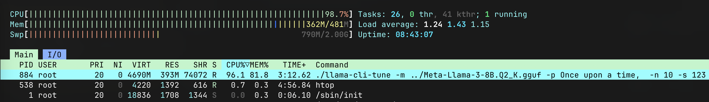
   2. 推理结果为：
      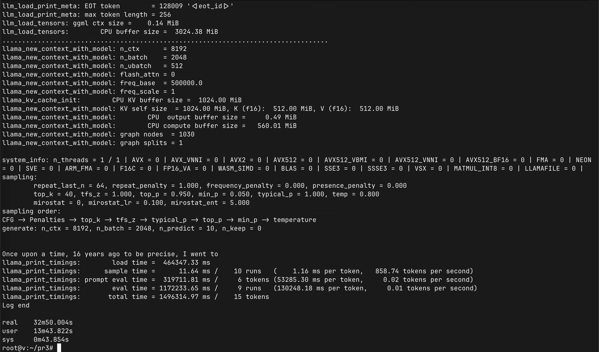
      [result-q2.log](./PR3/llama.cpp.result-q2.log)
      - **此次推理未出现乱码，推理时间过长以至于无法判断故事生成质量**
      - **此次使用 llama.cpp 实现**
      - 最终结果为：
        ```
        Once upon a time, 16 years ago to be precise, I went to
        llama_print_timings:        load time =  464347.33 ms
        llama_print_timings:      sample time =      11.64 ms /    10 runs   (    1.16 ms per token,   858.74 tokens per second)
        llama_print_timings: prompt eval time =  319711.81 ms /     6 tokens (53285.30 ms per token,     0.02 tokens per second)
        llama_print_timings:        eval time = 1172233.65 ms /     9 runs   (130248.18 ms per token,     0.01 tokens per second)
        llama_print_timings:       total time = 1496314.97 ms /    15 tokens
        ```
3. 尝试模型 Meta-Llama-3-8B.Q4_0.gguf
   - 推理结果为：
     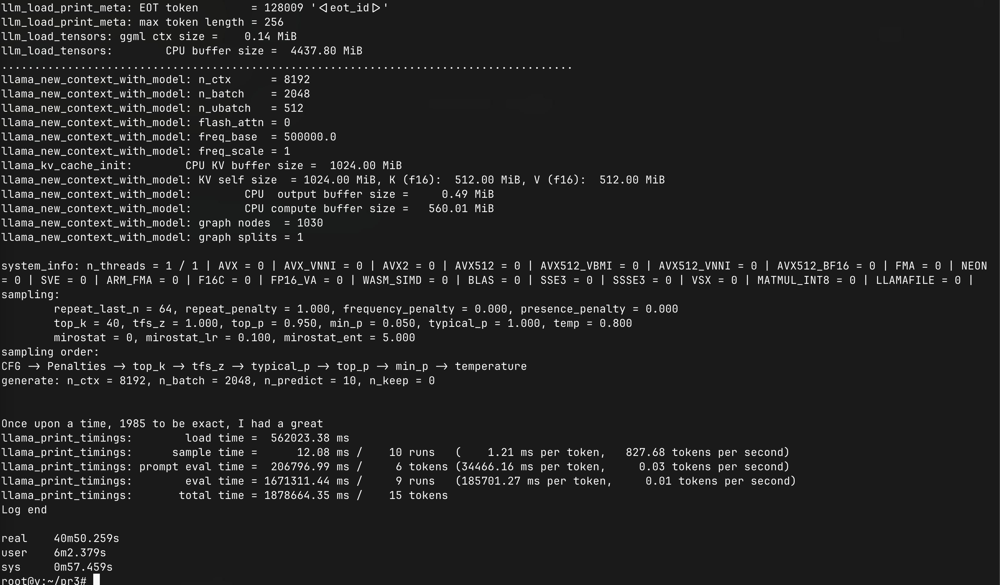
     [result-q4.log](./PR3/llama.cpp.result-q4.log)
     - **此次推理未出现乱码，推理时间过长以至于无法判断故事生成质量**
     - **此次使用 llama.cpp 实现**
     - 最终结果为：
       ```
       Once upon a time, 1985 to be exact, I had a great
       llama_print_timings:        load time =  562023.38 ms
       llama_print_timings:      sample time =      12.08 ms /    10 runs   (    1.21 ms per token,   827.68 tokens per second)
       llama_print_timings: prompt eval time =  206796.99 ms /     6 tokens (34466.16 ms per token,     0.03 tokens per second)
       llama_print_timings:        eval time = 1671311.44 ms /     9 runs   (185701.27 ms per token,     0.01 tokens per second)
       llama_print_timings:       total time = 1878664.35 ms /    15 tokens
       ```
       **注意：Q4 模型的结果无法与 Q2 模型的结果进行直接比较**

### 5. 结果

- 这里选择效果更好的 llama.cpp 实现
  - Q4 和 Q2 量化模型的推理表现接近，但 Q4 模型加载时间更长，总体 Q2 量化模型的表现稍好
- **本次验证与选手提供的结果基本一致。**
