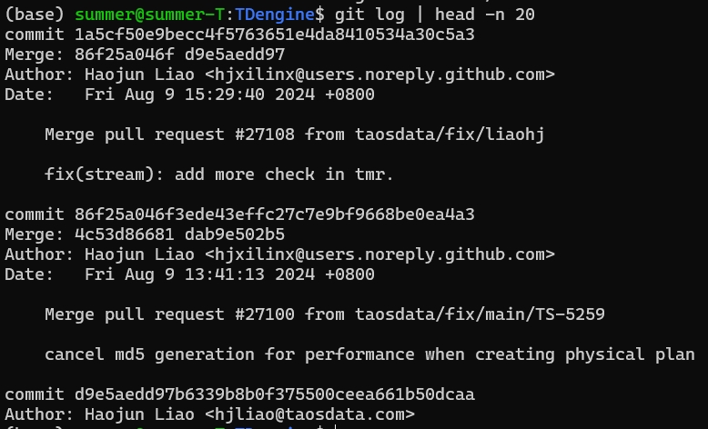
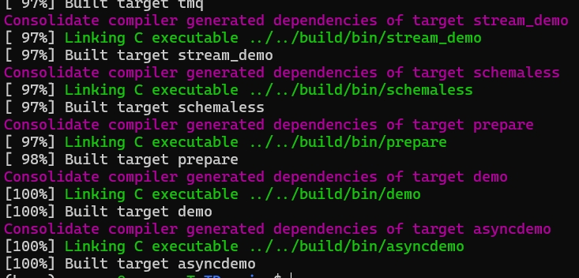
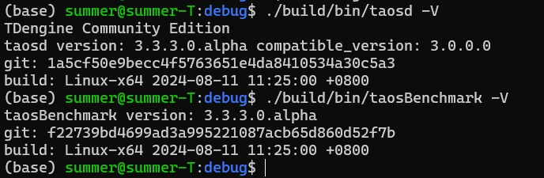
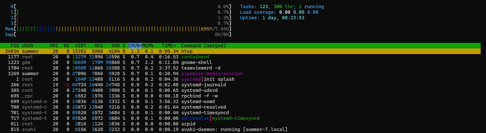
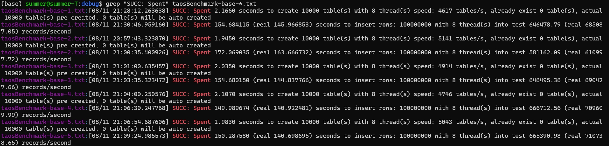
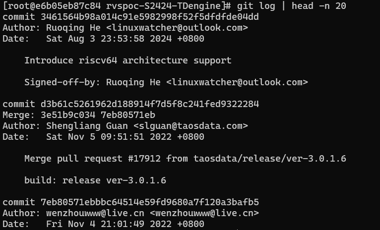
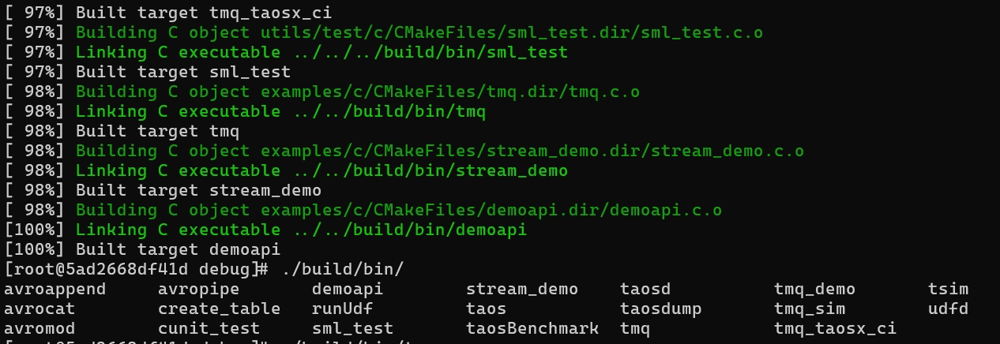
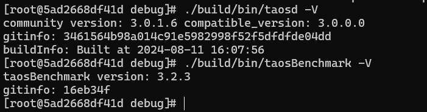
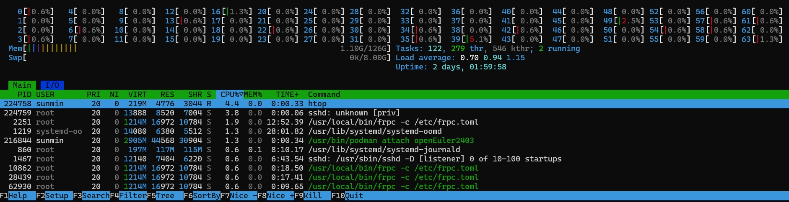
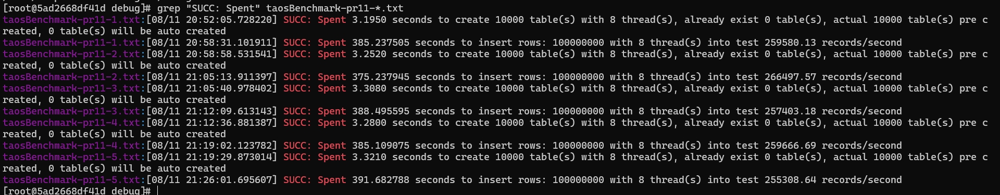

# TDengine 移植与优化赛题验证

- 验证思路及步骤

    - 用一台 x86_64 的机器作为参照平台，用一台 SG2042 作为目标平台
    - 测试前，确保参照平台和目标平台机器均处于空载状态
    - 两台机器的 TDEngine 都采用相同的参数部署到本地
    - 两台机器分别连续 5 次运行 taosBenchmark
    - 对两个平台的运行结果取均值

- 验证结果

|              | base (x86_64)                 | PR1 (SG2042)                 | 备注 |
| ------------ | -------------------- | -------------------- | -------------------- |
| 运行线程 | 8                   | 8                    |  |
| 建表 | 4894 tables/s                    | 3060   tables/s                 | 每秒创建的数据库表总数（8个线程累积） |
| 写数据       | 156.32 (s)                    |        385.152 (s)           |向数据库表写入测试数据总耗时 |


## 环境准备

### 测试环境

|              | base (x86_64)                | PR1                  | 
| ------------ | -------------------- | -------------------- |
| 操作系统 | Ubuntu 22.04                  | openEuler 24.03 (docker)                    | 
| 架构       | i5-4300U CPU @ 1.90GHz 四核                   | SG2042 64核                   | 
| 内存      | 8 GB                    |        128GB             |
| taosd 版本     |     3.3.3.0.alpha（2024-08-09）                |  3.0.1.6（2022-11-08）                   |
| taosBenchmark 版本     |     3.3.3.0.alpha                |  3.2.3                  |


### 性能测试

#### base 测试

- 下载源码
```
git clone git@github.com:taosdata/TDengine.git
```



- 准备依赖

```
sudo apt install -y gcc cmake build-essential git libssl-dev libgflags2.2 libgflags-dev libexpat1-dev libapr1-dev libaprutil1-dev libmxml-dev libgeos-dev libjansson-dev libsnappy-dev liblzma-dev libz-dev zlib1g pkg-config
```

- 编译
```
./build.sh
```


- 查看 tdengine 版本信息



- 确保机器处于空闲状态


- 运行数据库服务 taosd
```
cd debug
./build/bin/taosd -c test/cfg &
```

- 在同一个终端运行 taosBenchmark 测试并保存结果

```
for i in $(seq 1 1 5)
do
./build/bin/taosBenchmark -y  2>&1 | tee -a taosBenchmark-base-${i}.txt
sleep 20
done
grep "SUCC: Spent" taosBenchmark-base-*.txt 
```

- 测试结果详情见 report 文件夹

#### PR1 测试

- 准备 RISC-V openEuler 24.03 docker环境
```
wget https://repo.tarsier-infra.isrc.ac.cn/openEuler-RISC-V/testing/2403LTS-test/v1/24.03_docker_image.tar.gz
docker load -i 24.03_docker_image.tar.gz
docker run -itd --name openEuler2403 docker.io/jchzhou/oerv:24.03 /bin/bash
docker start openEuler2403
docker attach openEuler2403
```

`注意`: 以下操作在容器环境中执行

- 安装依赖
```
dnf install -y zlib-devel zlib-static xz-devel snappy-devel jansson jansson-devel pkgconfig libatomic libatomic-static libstdc++-static openssl-devel gcc gcc-c++ make cmake gflags
```

- 下载源码

```
git clone https://github.com/TimePrinciple/rvspoc-S2424-TDengine.git
cd rvspoc-S2424-TDengine/
```


- 编译

```
mkdir debug && cd debug
cmake .. -DCPUTYPE=riscv64 -DBUILD_TOOLS=true
cmake --build .
```



- 查看 tdengine 版本信息


- 确保机器处于空闲状态


- 开启数据库服务

```
./build/bin/taosd -c test/cfg &
```

- 在同一个终端运行 taosBenchmark 测试并保存结果
```
for i in $(seq 1 1 5)
do
./build/bin/taosBenchmark -y  2>&1 | tee -a taosBenchmark-pr1-${i}.txt
sleep 20
done 
grep "SUCC: Spent" taosBenchmark-pr1-*.txt
```

- 测试结果详情见 report 文件夹

