# 赛题「S2427 TiDB 在 2042 的移植与优化」的验证

## 概述

本赛题共收到 1 个 PR，

* 地址： https://github.com/rv2036/rvspoc-S2427-tidb/pull/1
* 队伍： Nests

1. 选手使用 tidb-server 进行了相关的编译和测试，未涉及到实际的代码优化。
2. 选手编译的相关二进制分别对应如下：
   * gcc-riscv64-linux-gnu 13.2.0 工具链 + 默认参数编译，这里标记为 `-default`
   * gcc-riscv64-linux-gnu 13.2.0 工具链 + `-mtune=thead-c906` 参数，这里标记为 `-thead-c906`
   * gcc-riscv64-linux-gnu 13.2.0 工具链 + `-march=rv64gcv_zfh_xtheadba_xtheadcondmov_xtheadmac` 参数，这里标记为 `-rv64gcv_zfh_xtheadba_xtheadcondmov_xtheadmac`
   * Xuantie-900-gcc-linux-6.6.0-glibc-x86_64-V2.10.1 交叉编译工具链 + `-march=rv64imafdcv0p7_zfh_xtheadc` 参数，这里标记为 `-xuantie-rv64imafdcv0p7_zfh_xtheadc`
3. 选手使用 SG2042 对外平台的跳板机对 TiDB 进行的测试，未将性能测试工具 sysbench 移植至 SG2042 上进行测试，而对外平台的跳板机至 SG2042 主机的带宽不高，性能瓶颈基本上依赖其带宽，故 PR1 提供的测试结果无法表明在未触及带宽瓶颈下的数据。
4. 针对选手提供的不同二进制编译参数，这里编译出对应的二进制，对其进行测试。

### 相关基础数据

| 测试项目      | 针对该测试的 TCP 包的内网环境最大接收速率 | 针对该测试的 TCP 包的内网环境最大发送速率 | 该测试下实际能达到的内网接收速率 | 该测试下实际能达到的内网发送速率 | vmstat 下是否发现出现性能瓶颈（包括客户端和服务端） |
|--------------|----------|-------------|-------------|-------------|----|
| Point Select | 220 Mbps | 79 Mbps     | 34.16 Mbps  | 11.83 Mbps  | 否 |
| Update Index | 101 Mbps | 79 Mbps     | 5.58 Mbps   | 4.32 Mbps   | 否 |
| Read Only    | 230 Mbps | 59-86 Mbps  | 105.52 Mbps | 4.22 Mbps   | 否 |

根据数据可知，测试环境下，不会遇到由 网络、CPU、内存、硬盘 而导致的性能瓶颈。

### 不同二进制的比较

在排除掉可能遇到的基于硬件的性能瓶颈后，得到的比较数据如下，

* tidb-server 使用参数 `-L error`，其余数值均默认。
* 基于 sysbench 配置
  ```
  mysql-host=192.168.2.163
  mysql-port=4000
  mysql-user=root
  mysql-password=
  mysql-db=sbtest
  time=600
  threads=12
  report-interval=10
  db-driver=mysql
  ```
* 根据下文的说明，这里取 12 线程数作为 sysbench 测试的配置

| 二进制 | Point Select 十分钟均值 | Update Index 十分钟均值 | Read Only 十分钟均值 |
|---|---|---|---|
| -default | 8674.30 tps | 2709.17 tps | 197.19 tps, 3155.06 qps |
| -thead-c906 | 8908.73 tps | 2780.97 tps | 193.70 tps, 3099.23 qps |
| -rv64gcv_zfh_xtheadba_xtheadcondmov_xtheadmac | 8730.74 tps | 2763.06 tps | 193.08 tps, 3089.23 qps |
| -xuantie-rv64imafdcv0p7_zfh_xtheadc | 8717.22 tps | 2738.49 tps | 194.90 tps, 3118.45 qps |

可以看到，几种方式编译的产物，数据并没有特别明显的差异。

### 总结

1. 选手使用 tidb-server 进行了相关的编译和测试，未涉及到实际的代码优化
2. 在对 sysbench 的线程数量提升到 20 及之后后，性能增长艰难（SG2042 为 64 线程的 CPU）
3. 虽然 tidb-server 正确识别到了主机的 64 线程，但其的实际运行的线程数量，很难超过 20（包括父进程及子进程）
4. 选手提供的多种编译方式下产生的二进制文件，互相之前没有明显的性能差异

---
> **以下是详细的测试过程和说明**

## 流程

1. 测定验证环境的性能瓶颈，确保测试在未达到网络、CPU、内存、磁盘性能瓶颈的情况下完成。
2. 验证不同二进制的在未触达性能瓶颈时的数据。

## 验证环境

* Pioneer Box (SG2042)
* AMD64 的额外物理机
  * 由于 sysbench 依赖 LuaJIT，而 LuaJIT 目前在 RISC-V 上未成功移植，故依赖 AMD64 物理机进行跑分
* 千兆内网

## 性能瓶颈测定

### 测定方式

* 取用 `-default` 二进制进行测定（只要有足够的瓶颈余量，即可判定其余二进制也不会撞性能瓶颈）
* 对 point_select, update_index 以及 read_only 的测试进行抓包，分析其 TCP 包大小，针对不同的大小进行 iperf3 测试获取在对应大小下此内网环境的流量能达到多少速率
* 对 point_select, update_index 以及 read_only 进行 1,4,8,12,16,20,24,28,32,36 线程的性能跑分
  * 这里的线程指的是 sysbench 同时发起 N 个对 TiDB 的连接，进行测试
* 针对每个线程下的状态，记录客户端以及服务端的 vmstat 数据，记录客户端 vnstat 的实时数据，记录 sysbench 的数据，并进行比较
* 判断内网带宽是否为瓶颈，判断 SG2042 是否存在瓶颈，最后获取一个比较合适的线程数做不同参数/TC 编译的二进制间的比较

_所有的数据保存在目录 [./bottleneck-determination](./bottleneck-determination/) 下_

### Point Select 性能瓶颈

#### 内网瓶颈
 
 从 TiDB 服务器收到的数据包基本为 265 bytes:

 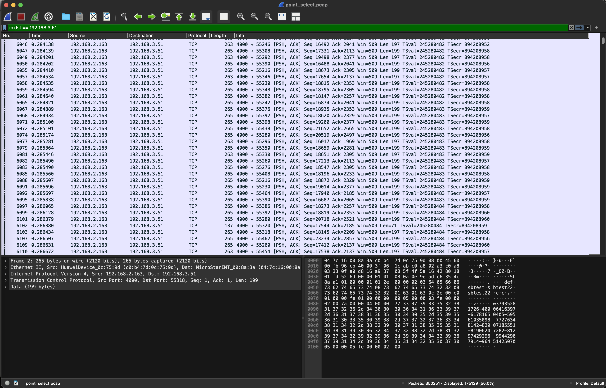

 使用该长度进行 iperf3 测试得到当前内网在该包长度下的最大速率为 220 Mbps 左右

 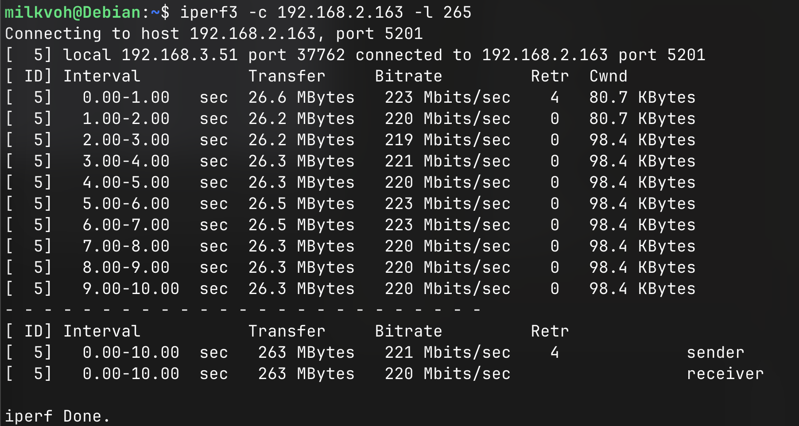

 发送到 TiDB 服务器的数据包基本为 90 bytes:

 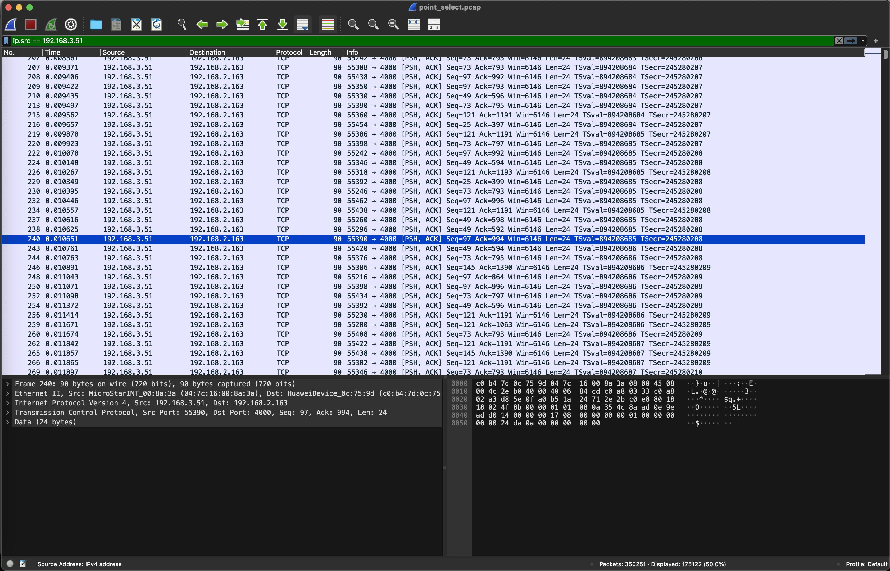

 使用该长度进行 iperf3 测试得到当前内网在该包长度下的最大速率为 79Mbps 左右

 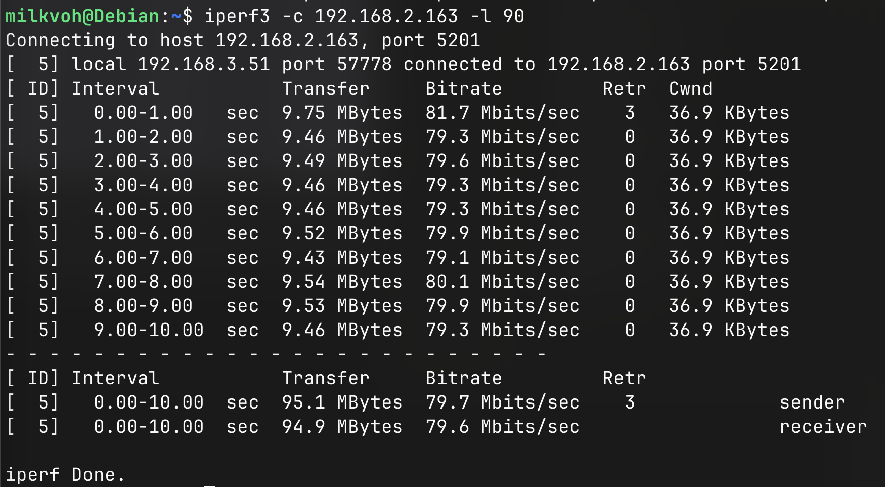

 #### 不同线程下的实际数据

 | Threads | Tps         | Max RX rate | Max TX rate | 
 |---------|-------------|-------------|-------------|
 | 1       | 1016.26     | 2.30 Mbps   | 874.03 kbps |
 | 4       | 3610.92     | 8.10 Mbps   | 2.80 Mbps   |
 | 8       | 6890.22     | 14.92 Mbps  | 5.17 Mbps   |
 | 12      | 8141.81     | 19.53 Mbps  | 6.72 Mbps   |
 | 16      | 10978.85    | 24.05 Mbps  | 8.29 Mbps   |
 | 20      | 13695.72    | 29.83 Mbps  | 10.28 Mbps  |
 | 24      | 14750.98    | 33.17 Mbps  | 11.44 Mbps  |
 | 28      | 14640.61    | 33.48 Mbps  | 11.53 Mbps  |
 | 32      | 15608.82    | 34.10 Mbps  | 11.73 Mbps  |
 | 36      | 15206.38    | 34.16 Mbps  | 11.83 Mbps  |

 \* _"Max RX rate" and "Rax TX rate" 指的是从客户端（即 AMD64 物理机）上获取的数据，下文同_

可以看到，从 20 线程开始，就没有太大的涨幅了，且确认不是内网网络性能瓶颈导致的，分析客户端和服务端的 vmstat 日志（已上传至对应路径）,

客户端：

```
...
 r  b 交换 空闲 缓冲 缓存   si   so    bi    bo   in   cs us sy id wa st gu
 2  0   2304 844568 5454756 24544352    0    0     0   104 27900 34262  1  4 95  0  0  0
 1  0   2304 845080 5454764 24544352    0    0     0    32 27307 33664  2  4 94  0  0  0
 1  0   2304 845080 5454764 24544352    0    0     0     0 26680 31480  1  4 94  0  0  0
 1  0   2304 845080 5454764 24544352    0    0     0   152 27586 34183  1  4 95  0  0  0
 1  0   2304 845080 5454764 24544352    0    0     0     0 28750 35215  2  4 94  0  0  0
 1  0   2304 845080 5454764 24544352    0    0     0     0 29783 37031  2  4 94  0  0  0
...
```

服务端：

```
...
 r  b   swpd   free   buff  cache   si   so    bi    bo   in   cs us sy id wa st
17  0   1280 21356444 2290392 99013760    0    0     0  1436 30868 3638 18  6 76  0  0
16  0   1280 21412384 2290392 99013768    0    0     0     4 32001 2739 18  6 76  0  0
19  0   1280 21460868 2290392 99013776    0    0     0    96 32603 2580 18  6 76  0  0
17  0   1280 21505772 2290392 99013792    0    0     0     4 32804 2912 18  6 76  0  0
16  0   1280 21567668 2290392 99013792    0    0     0     8 33772 2640 19  8 74  0  0
19  0   1280 21613756 2290396 99013800    0    0     0    20 33597 2740 18  6 76  0  0
...
```

可以看到客户端是相当空闲的，服务端对于一个有 64 线程的 SG2042 来说，也是相当空闲的，均没有 io 阻塞，内存均非常够用，所以这里考虑程序本身在 SG2042 上的性能问题。

查阅 TiDB 源码得知，其通过 GOMAXPROCS 来控制能使用的最大线程，默认设置 0 即自动获取当前 CPU 的最大可用线程。尝试使用 `-affinity-cpus` 来指定后可以得到 info 级别日志

```
-affinity-cpus 1,2

[2024/09/08 21:23:45.463 +08:00] [INFO] [main.go:420] ["cpu number less than maxprocs"] ["cpu number "=2] [maxprocs=64]
```

故判断程序本身已经正确识别到了总线程数，但实际的运行线程还是上不去（见上传的对应路径下的 htop 截图），故认为这里可能是一个优化点。

\* _本段说明，适用于所有测试，故只在此处说明一次。_

### Update Index 性能瓶颈

#### 内网瓶颈
 
 从 TiDB 服务器收到的数据包基本为 118 bytes:

 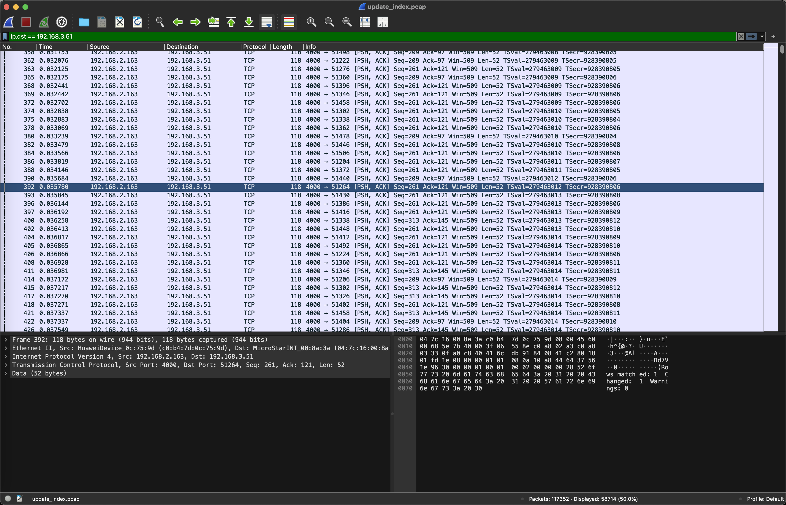

 使用该长度进行 iperf3 测试得到当前内网在该包长度下的最大速率为 101 Mbps 左右

 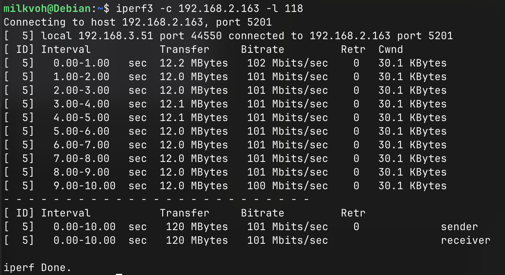

 发送到 TiDB 服务器的数据包基本为 90 bytes:

 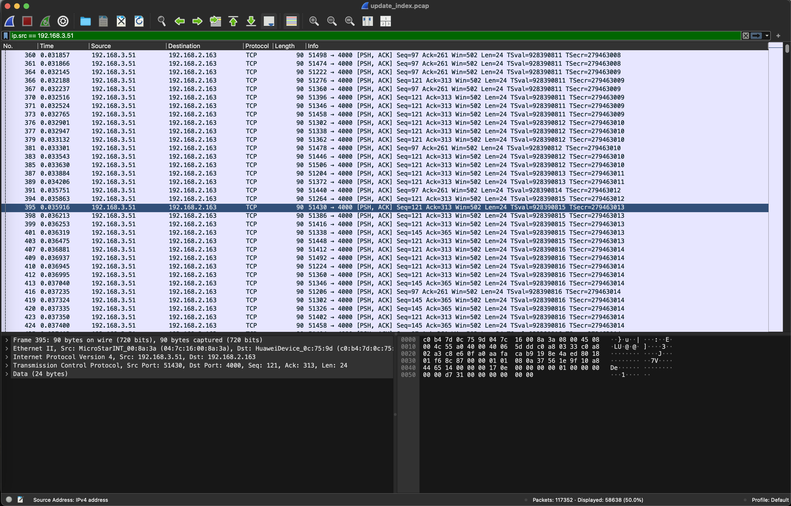

 使用该长度进行 iperf3 测试得到当前内网在该包长度下的最大速率为 79Mbps 左右

 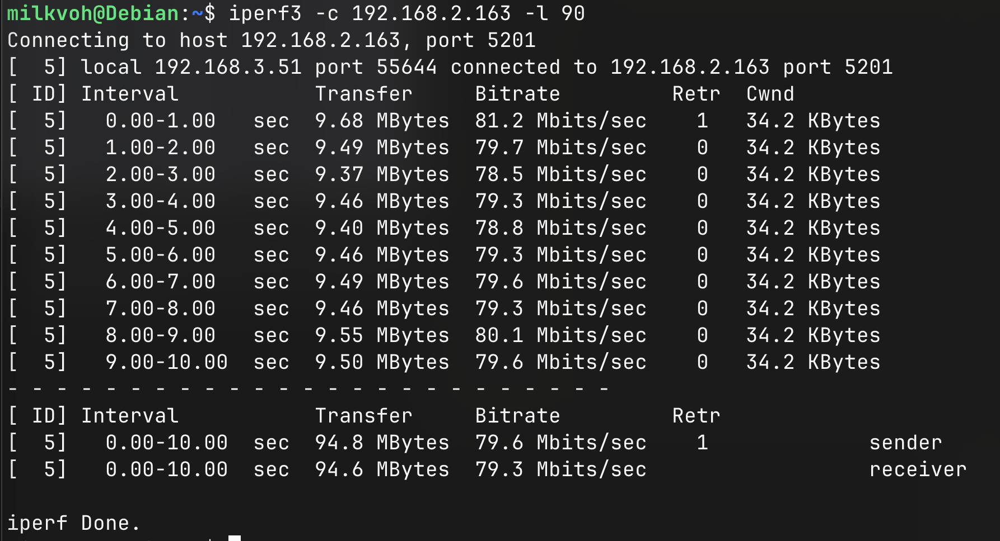

 #### 不同线程下的实际数据

 | Threads | Tps         | Max RX rate | Max TX rate | 
 |---------|-------------|-------------|-------------|
 | 1       |  338.82     | 456.54 kbps | 385.92 kbps |
 | 4       | 1088.91     | 1.18 Mbps   | 882.59 kbps |
 | 8       | 1771.63     | 1.96 Mbps   | 1.47 Mbps   |
 | 12      | 2692.69     | 2.81 Mbps   | 2.19 Mbps   |
 | 16      | 3503.29     | 3.84 Mbps   | 2.97 Mbps   |
 | 20      | 4490.00     | 4.59 Mbps   | 3.51 Mbps   |
 | 24      | 4865.77     | 5.25 Mbps   | 4.04 Mbps   |
 | 28      | 5082.86     | 5.50 Mbps   | 4.15 Mbps   |
 | 32      | 5184.70     | 5.62 Mbps   | 4.32 Mbps   |
 | 36      | 5215.36     | 5.58 Mbps   | 4.25 Mbps   |

 可以看到，从 20 线程开始，就没有太大的涨幅了，且确认不是内网网络性能瓶颈导致的，分析客户端和服务端的 vmstat 日志也没发现有 内存、磁盘、CPU 相关导致的瓶颈。

### Read Only 性能瓶颈

#### 内网瓶颈
 
 从 TiDB 服务器收到的数据包的长度参差不齐

 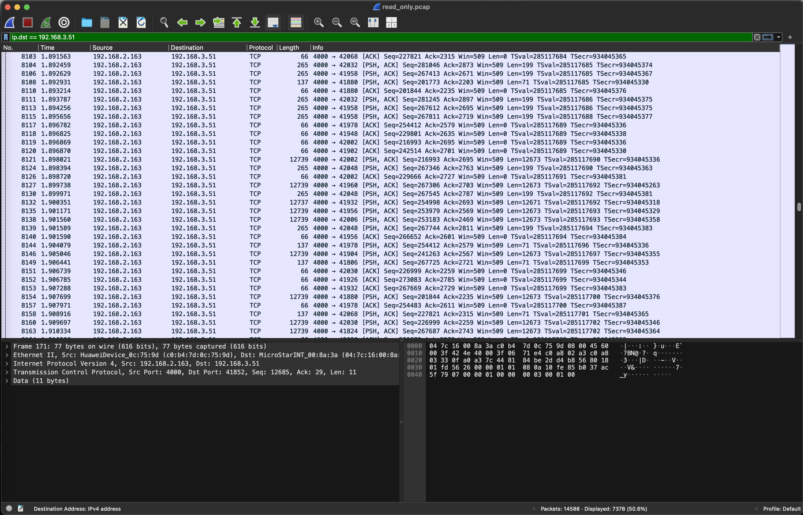

 将抓到的包提取仅接收部分，转成 K12 文本格式，并进行统计得到占比大于 2% 的包长度的数据如下：

 ```
 Total packets: 7378
All packets' lengths: {263: 1180, 265: 2530, 137: 403, 77: 756, 12739: 780, 66: 1275, 12737: 306, 139: 92, 1147: 1, 5305: 1, 127: 11, 9866: 5, 2939: 3, 2937: 2, 5666: 6, 7139: 5, 7137: 1, 5683: 1, 7066: 3, 5739: 3, 8466: 3, 2197: 1, 2533: 1, 4266: 1, 8539: 1, 10723: 1, 11266: 2, 1539: 2, 4337: 2}

length: 263, counts: 1180, percent: 0.1599
length: 265, counts: 2530, percent: 0.3429
length: 137, counts: 403, percent: 0.0546
length: 77, counts: 756, percent: 0.1025
length: 12739, counts: 780, percent: 0.1057
length: 66, counts: 1275, percent: 0.1728
length: 12737, counts: 306, percent: 0.0415
```

这里人工分成：

| Packet length | Bitrate   | Percent | Remarks |
|---------------|-----------|---------|---------|
| 265           | 220 Mbps  | 0.5028  | merge 263 into 265 |
| 137           | 68.8 Mbps | 0.0546  |
| 66            | 58.3 Mbps | 0.2753  | merge 77 into 66 |
| 12739         | 681 Mbps  | 0.1472  | merge 12737 into 12739 |

如果简单的对其进行按比例换算的话，得到 read only 测试下，内网的接收速率瓶颈在 **230 Mbps** 左右。

 发送到 TiDB 服务器的数据包基本都在 66 bytes - 100 bytes 之间:

 

 使用 66 bytes 长度进行 iperf3 测试得到当前内网在该包长度下的最大速率为 59Mbps 左右

 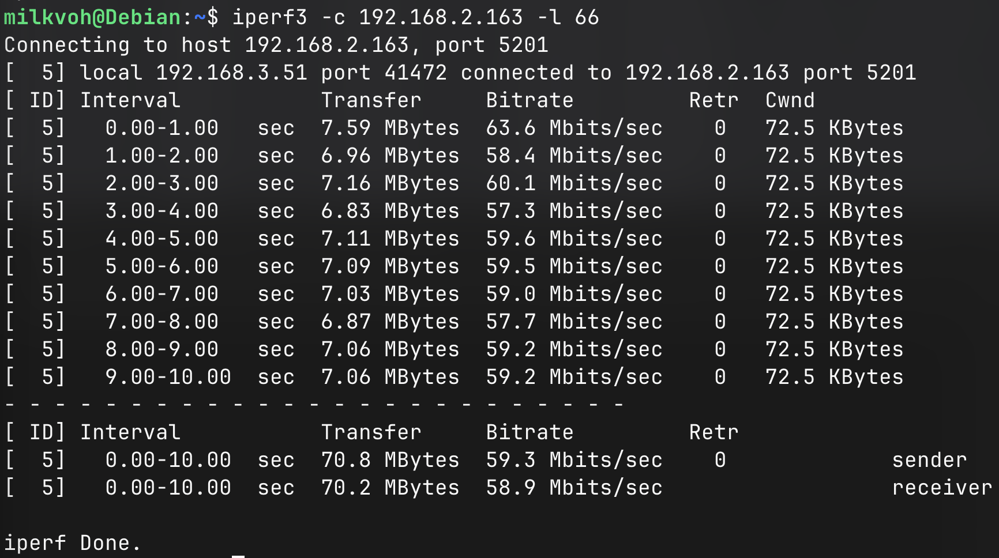

 使用 100 bytes 长度进行 iperf3 测试得到当前内网在该包长度下的最大速率为 86Mbps 左右

 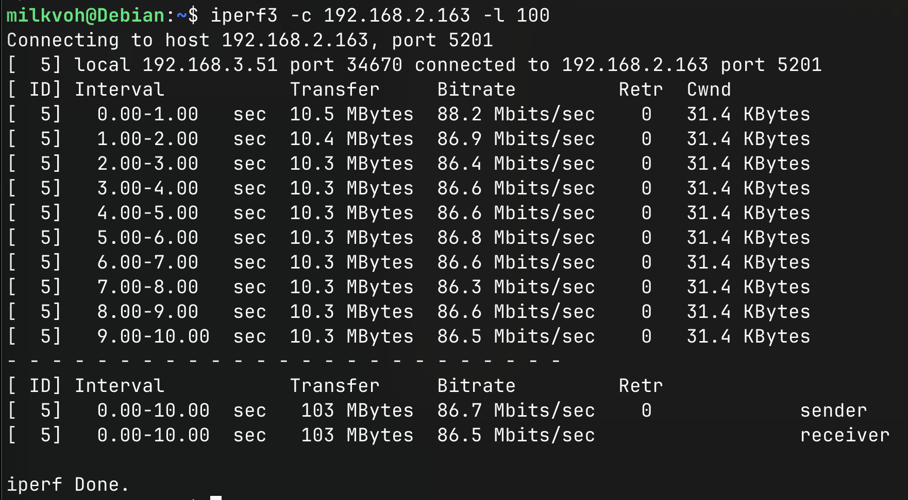

 #### 不同线程下的实际数据

 | Threads | Tps     | Qps     | Max RX rate | Max TX rate | 
 |---------|---------|---------|-------------|-------------|
 | 1       |  18.85  |  301.55 | 6.60 Mbps   | 370.51 kbps |
 | 4       |  68.37  | 1093.87 | 23.67 Mbps  | 1.04 Mbps   |
 | 8       | 133.87  | 2141.99 | 47.98 Mbps  | 1.96 Mbps   |
 | 12      | 184.49  | 2951.78 | 70.54 Mbps  | 2.84 Mbps   |
 | 16      | 251.20  | 4019.18 | 91.62 Mbps  | 3.60 Mbps   |
 | 20      | 255.51  | 4088.16 | 104.86 Mbps | 4.22 Mbps   |
 | 24      | 266.40  | 4262.35 | 103.27 Mbps | 4.10 Mbps   |
 | 28      | 271.74  | 4347.87 | 105.52 Mbps | 4.15 Mbps   |
 | 32      | 269.08  | 4305.28 | 105.43 Mbps | 4.18 Mbps   |
 | 36      | 272.03  | 4352.45 | 104.46 Mbps | 4.17 Mbps   |

 可以看到，从 20 线程开始，就没有太大的涨幅了，且确认不是内网网络性能瓶颈导致的，分析客户端和服务端的 vmstat 日志也没发现有 内存、磁盘、CPU 相关导致的瓶颈。

 ## 不同编译参数下的二进制的性能对比

选手对 TiDB 分别尝试了不同版本 Toolchain 的以及不同的参数编译的情况，这里对不同版本及参数所编译的结果进行测试。

根据上述对环境的瓶颈分析结果，这里选择使用 `--threads 12` 来对不同的二进制进行比较，以尽最大可能避免遇到 tidb-server 程序在 SG2042 上的瓶颈。

_所有的日志，均存放在当前文件夹下的 `point_select`, `update_index` 及 `read_only` 目录中。_

_所有的数据，都是在 prewarm 之后进行测试的，prewarm 时间大约 17 分钟。_

提取的数据见文章开头「概述」章节内。

## 异常

在整个测试过程中，遇到了多次 tidb-server Panic 的情况，详细的日志为：

```
runtime: traceback stuck. pc=0x4cbc040 sp=0x2411096708
stack: frame={sp:0x2411096708, fp:0x2411096708} stack=[0x2411090000,0x2411098000)
0x0000002411096608:  0x0000000000000000  0x0000000001baa9f8 <runtime.(*mspan).writeHeapBitsSmall+0x0000000000000068>
0x0000002411096618:  0x00000024104d7040  0x000000241067e008
0x0000002411096628:  0x00000024104d7040  0x000000241cbc7f80
0x0000002411096638:  0x000000241d490be0  0x0000000000000010
0x0000002411096648:  0x000000253885b200  0x00000024104fe190
0x0000002411096658:  0x0000000001bd09d4 <runtime.(*_panic).nextDefer+0x00000000000001dc>  0x0000000000000001
0x0000002411096668:  0x0000000000000018  0x0000000000000008
0x0000002411096678:  0x0000000001ba11e0 <runtime.mallocgc+0x0000000000000508>  0x0000003381a627a8
0x0000002411096688:  0x000000241cbc7ce0  0x0000000001bd08b4 <runtime.(*_panic).nextDefer+0x00000000000000bc>
0x0000002411096698:  0xc1af7f36428bfadf  0x00000278a02f7575
0x00000024110966a8:  0x0000000009ae89a0  0x0000002410bca1b1
0x00000024110966b8:  0x000000251233e720  0x0000000002d09a08 <github.com/pingcap/tidb/pkg/util/sqlexec.RecordSet.Close-fm+0x0000000000000000>
0x00000024110966c8:  0x0000000001ba15e8 <runtime.newobject+0x0000000000000038>  0x000000241d328230
0x00000024110966d8:  0x00000024110966b0  0x0000002942e30e00
0x00000024110966e8:  0x000000241d31ae40  0x0000000004d886d0 <github.com/pingcap/tidb/pkg/server.(*clientConn).executePreparedStmtAndWriteResult+0x00000
000000008d8>
0x00000024110966f8:  0x0018000100000610  0x0000000004d8b914 <github.com/pingcap/tidb/pkg/server.(*TiDBContext).ExecuteStmt+0x0000000000000064>
0x0000002411096708: >0x0000000004cbc040 <github.com/pingcap/tidb/pkg/session.(*session).ExecuteStmt.deferwrap1+0x0000000000000000>  0x0000000009ae0fa0
0x0000002411096718:  0x0000000000000000  0x0000000000000000
0x0000002411096728:  0x0000000004d88254 <github.com/pingcap/tidb/pkg/server.(*clientConn).executePreparedStmtAndWriteResult+0x000000000000045c>  0x0000
002410648508
0x0000002411096738:  0x00000000065edd88  0x000000251233e720
0x0000002411096748:  0x00000000066020d8  0x000000241d490be0
0x0000002411096758:  0x0000000004d8820c <github.com/pingcap/tidb/pkg/server.(*clientConn).executePreparedStmtAndWriteResult+0x0000000000000414>  0x0000
00000000000c
0x0000002411096768:  0x00000000054ca6c0  0x0000000000010001
0x0000002411096778:  0x0000000004d87a34 <github.com/pingcap/tidb/pkg/server.(*clientConn).executePlanCacheStmt+0x00000000000001cc>  0x000000251c6febe8
0x0000002411096788:  0x00000000065edd88  0x000000251233e720
0x0000002411096798:  0x00000000066020d8  0x000000241d490be0
0x00000024110967a8:  0x0000002400026701  0x0000000000000000
0x00000024110967b8:  0x0000000001bc7660 <runtime.mProf_Malloc+0x00000000000000c0>  0x0000000005036a60
0x00000024110967c8:  0x0000000006603ff8  0x0000000001baa410 <runtime.(*mspan).initHeapBits+0x0000000000000050>
0x00000024110967d8:  0x0000000000000000  0x0000000001babde0 <runtime.(*mcentral).grow+0x0000000000000078>
0x00000024110967e8:  0x00000024110967f8  0x000000241cfd3f80
0x00000024110967f8:  0x0000000000000010  0x0000000000000010
fatal error: traceback stuck

goroutine 0 gp=0x3f5c882000 m=8 mp=0x3f5c880008 [idle]:
time.Now()
        /home/debian/go1.22.7/src/time/time.go:1132 +0x20 fp=0x2411096298 sp=0x2411096290 pc=0x1c365e0
time.Now()
        /home/debian/go1.22.7/src/time/time.go:1132 +0x20 fp=0x24110962a0 sp=0x2411096298 pc=0x1c365e0
github.com/pingcap/tidb/pkg/session.(*session).ExecuteStmt(0x9ae0fa0, {0x0?, 0x0?}, {0x4d88254, 0x2410648508})
        /home/debian/rvspoc-S2427-tidb/pkg/session/session.go:2058 +0x448 fp=0x2411096708 sp=0x24110962a0 pc=0x4cbb330
github.com/pingcap/tidb/pkg/parser/ast.(*node).Text.func1()
        /home/debian/rvspoc-S2427-tidb/pkg/parser/ast/base.go:56 fp=0x2411096708 sp=0x2411096708 pc=0x1fd03a0
github.com/pingcap/tidb/pkg/session.(*session).ExecuteStmt.deferwrap1()
        /home/debian/rvspoc-S2427-tidb/pkg/session/session.go:2007 fp=0x2411096708 sp=0x2411096708 pc=0x4cbc040
runtime: traceback stuck. pc=0x4cbc040 sp=0x2411096708
stack: frame={sp:0x2411096708, fp:0x2411096708} stack=[0x3f5c884000,0x3f5c88c000)

fatal error: traceback stuck
panic during panic

goroutine 0 gp=0x3f5c882000 m=8 mp=0x3f5c880008 [idle]:
time.Now()
        /home/debian/go1.22.7/src/time/time.go:1132 +0x20 fp=0x2411096298 sp=0x2411096290 pc=0x1c365e0
time.Now()
        /home/debian/go1.22.7/src/time/time.go:1132 +0x20 fp=0x24110962a0 sp=0x2411096298 pc=0x1c365e0
github.com/pingcap/tidb/pkg/session.(*session).ExecuteStmt(0x9ae0fa0, {0x0?, 0x0?}, {0x4d88254, 0x2410648508})
        /home/debian/rvspoc-S2427-tidb/pkg/session/session.go:2058 +0x448 fp=0x2411096708 sp=0x24110962a0 pc=0x4cbb330
github.com/pingcap/tidb/pkg/parser/ast.(*node).Text.func1()
        /home/debian/rvspoc-S2427-tidb/pkg/parser/ast/base.go:56 fp=0x2411096708 sp=0x2411096708 pc=0x1fd03a0
github.com/pingcap/tidb/pkg/session.(*session).ExecuteStmt.deferwrap1()
        /home/debian/rvspoc-S2427-tidb/pkg/session/session.go:2007 fp=0x2411096708 sp=0x2411096708 pc=0x4cbc040
runtime: traceback stuck. pc=0x4cbc040 sp=0x2411096708
stack: frame={sp:0x2411096708, fp:0x2411096708} stack=[0x3f5c884000,0x3f5c88c000)

fatal error: traceback stuck
stack trace unavailable
```

暂未查明原因，原始日志可查阅本文件夹下匹配 `**/*error*` 的文件（保存了几个，但非全部）。
