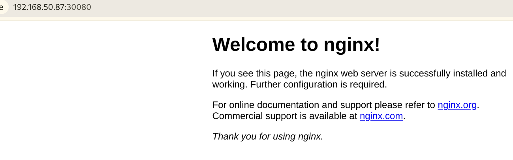

# K3s 的移植与优化

选手的提交时间：在比赛结束前的正常提交

选手的提交情况: 选手的思路是其他主机作为 k3s server, duo s 是从节点

验证的总结情况: 

通过补充描述 [追加验证](https://github.com/rv2036/rvspoc-S2428-k3s/pull/1#issuecomment-2344000917) 后得出结论:

~~**选手提供的 arm 镜像实现了 duos 上的 k3s 从节点服务，并能够启动简单的服务; 选手提供的 risc-v 二进制和步骤实现能够实现被主节点可探测到的 duos risc-v 从节点，但无法启动简单服务，可能描述中缺失了什么步骤**~~

**选手提供了 ARM 镜像以及 RISC-V 镜像，通过操作可以启动简单的 k3s 服务**


## 复现过程

### ARM 部分

#### 编译环境配置 

使用 podman 配置容器环境用于 milk-v duo s 的镜像编译:

```bash
sudo apt install podman -y 
podman pull ubuntu:22.04
git clone git@github.com:milkv-duo/duo-buildroot-sdk-v2.git
cd duo-buildroot-sdk-v2/
podman run -idt -v $(pwd):/home/work --name duo-buildroot-v2 ubuntu:22.04 
podman exec -it duo-buildroot-v2 bash
```

#### 进入容器后的环境配置:

```bash
apt update
apt install -y git pkg-config build-essential ninja-build automake autoconf libtool wget curl git gcc libssl-dev bc slib squashfs-tools android-sdk-libsparse-utils jq python3-distutils scons parallel tree python3-dev python3-pip device-tree-compiler ssh cpio fakeroot libncurses5 flex bison libncurses5-dev genext2fs rsync unzip dosfstools mtools tcl openssh-client cmake expect
cd /home/work
wget https://github.com/imguoguo/rvspoc-S2428-k3s/raw/master/arch/arm/cvitek_sg2000_milkv_duos_glibc_arm64_sd_defconfig -O build/boards/cv181x/sg2000_milkv_duos_glibc_arm64_sd/linux/cvitek_sg2000_milkv_duos_glibc_arm64_sd_defconfig
wget https://github.com/imguoguo/rvspoc-S2428-k3s/raw/master/arch/arm/memmap.py -O build/boards/cv181x/sg2000_milkv_duos_glibc_arm64_sd/memmap.py
wget https://github.com/imguoguo/rvspoc-S2428-k3s/raw/master/arch/arm/partition_sd.xml -O build/boards/cv181x/sg2000_milkv_duos_glibc_arm64_sd/partition/partition_sd.xml
ln -s /usr/bin/python3 /usr/bin/python
pip install ninja2
./build.sh milkv-duos-glibc-arm64-sd
```

**使用以上过程构建的镜像最后一个分区大小为 768M 而非 4G, 需要手动修改 device/milkv-duos-sd/genimage.cfg 的 root 分区** 

#### 镜像配置

挂载分区拷贝文件

```bash
mkdir -p rootfs fedora

sudo losetup -fP Fedora-Minimal-40-1.14.aarch64.raw
cp ~/path-to-image/xxxx.img milkv-duos-fedora-aarch64.img
sudo losetup -fP milkv-duos-fedora-aarch64.img

# 检查挂载位置，未挂载loop情况下，Fedora Minimal会位于 /dev/loop0，新编译的镜像会位于 /dev/loop1
lsblk

# 不重新格式化，可能会出现 the backing extfs filesystem is formatted without d_type support 的提示
# 选手这里是 2 我实际上是 3
sudo mkfs.ext4 -f /dev/loop1p3

sudo mount /dev/loop0p3 fedora
sudo mount /dev/loop1p3 rootfs

# 切换到rootfs目录删除掉所有原有的内容
pushd rootfs
sudo rsync -avhP ../fedora/ ./

# 复制内核内容 下述内容实际上在编译目录
sudo cp -r ../../linux_5.10/build/sg2000_milkv_duos_glibc_arm64_sd/modules/lib/modules/5.10.4-tag- /lib/modules/
popd

```

chroot 进入镜像后的配置，需要 qemu-user

```bash
sudo chroot rootfs

# 配置 dnf 并安装 docker
sed -e 's|^metalink=|#metalink=|g'     -e 's|^#baseurl=http://download.example/pub/fedora/linux|baseurl=https://mirrors.tuna.tsinghua.edu.cn/fedora|g'     -i.bak     /etc/yum.repos.d/fedora.repo     /etc/yum.repos.d/fedora-updates.repo
dnf update -y
dnf config-manager     --add-repo     https://mirrors.tuna.tsinghua.edu.cn/docker-ce/linux/fedora/docker-ce.repo
sed -i 's+https://download.docker.com+https://mirrors.tuna.tsinghua.edu.cn/docker-ce+' /etc/yum.repos.d/docker-ce.repo
dnf install tmux vim docker-ce docker-ce-cli containerd.io docker-buildx-plugin docker-compose-plugin
systemctl enable docker

# 安装 K3S
curl -sfL https://get.k3s.io | K3S_URL=https://example.com K3S_TOKEN=xxxxxxxx sh -s - --docker

# 设置默认密码
passwd
passwd

# SELINUX 设置
vim /etc/selinux/config
touch /.autorelabel

# 修改 Iptables 为 legacy
dnf install iptables-legacy
update-alternatives --config iptables

# 清理日志

# 清除bash相关日志内容
mv ./etc/resolv.conf_bak ./etc/resolv.conf
rm -rf ./root/.bash_*
echo > /var/log/dnf.log
echo > /var/log/dnf.rpm.log
echo > /var/log/dnf.librepo.log
echo > /var/log/hawkey.log

# 退出chroot
history -c && exit

# 卸载镜像
sudo umount rootfs
sudo losetup -D
```


#### 服务端安装 K3S server

```bash
# 服务端是一个 Debian trixie 环境

curl -sfL https://get.k3s.io | sh -s - --docker

# 获取 token 和 ip
sudo cat /var/lib/rancher/k3s/server/token


ip a
```

**使用 dd 命令烧写镜像并使用串口查看启动日志和登陆**

**尝试烧录并启动该镜像但进入了紧急模式, 怀疑是在 chroot 过程中没有挂载 proc, dev 等导致配置出错**

**重新使用选手已经做好的镜像进行验证**

```bash
shiptux@debian:~$ sudo kubectl get nodes
NAME         STATUS     ROLES                  AGE     VERSION
debian       Ready      control-plane,master   43h     v1.30.4+k3s1
debian-tb    NotReady   control-plane,master   2d13h   v1.30.4+k3s1
milkv-duos   Ready      <none>                 2d13h   v1.30.3+k3s1
```
****

**下发服务后，节点并没有任何变化，日志中出现磁盘不足的信息**

综合选手在 RISC-V 部分的描述，增加了 SWAP 和扩容根分区，正常出现 Nginx 界面


### RISC-V 部分

#### 编译环境配置

**类似于 ARM 部分的编译环境，仓库换成 duo-buildroot-sdk 而不是 v2 版本的**

编译过程此处略过不表，**有一样的分区大小的问题，但是通过同样的方式可以解决**

#### 镜像调整

```bash
mkdir -p arch-rootfs

sudo losetup -fP milkv-duos-sd-archlinux-riscv64.img

# 检查挂载位置，未挂载loop情况下，新镜像挂载后会位于 /dev/loop0
lsblk

# 不重新格式化，可能会出现 the backing extfs filesystem is formatted without d_type support 的提示
sudo mkfs.ext4 -f "/dev/loop0p3"

sudo mount "/dev/loop0p3" arch-rootfs

# 切换到rootfs目录删除掉所有原有的内容
pushd arch-rootfs
sudo tar -xvf ~/archriscv-latest.tar.zst .

# 复制内核内容
sudo cp -r ../../linux_5.10/build/cv1813h_milkv_duos_sd/modules/lib/modules/5.10.4-tag- /lib/modules/
popd

> ls -lha /dev/disk/by-uuid/ | grep loop
ac6e4cbc-d88a-4414-a355-c13d253767aa -> ../../loop0p3

# 将上面显示的UUID替换到下方
> vim etc/fstab
UUID=ac6e4cbc-d88a-4414-a355-c13d253767aa       /       ext4    defaults        0       0

```

chroot 后的配置 **dev 和 proc是为了安装包配置中需要**

```bash

sudo mount -vt proc proc arch-rootfs/proc
sudo mount --bind /dev  arch-rootfs/dev

sudo chroot arch-rootfs

# 直接 pacman 安装会出现 key 错误，参考 https://wxxxcxx.com/post/archlinux-missing-required-signature/ 重建了 key 此处略过

pacman -Syu tmux vim docker docker-compose sudo networkmanager less parted
systemctl enable docker NetworkManager.service


# 配置账号
useradd -G wheel -m k3s
passwd k3s
# k3s@233!
New password:
Retype new password:
passwd: password updated successfully

# 配置 sudo
# 取消 %wheel ALL=(ALL:ALL) ALL 的注释

vim /etc/sudoers

sudo wget https://github.com/imguoguo/rvspoc-S2428-k3s/raw/master/arch/riscv/k3s-agent.service.env -O arch-rootfs/etc/systemd/system/k3s-agent.service.env
sudo wget https://github.com/imguoguo/rvspoc-S2428-k3s/raw/master/arch/riscv/k3s-agent.service -O arch-rootfs/etc/systemd/system/k3s-agent.service
```

####  编译 k3s

**在基于 Fedora 的 SG2042 上构建 k3s 遇到了缺少 yq 和 lstat, 此处改为使用选手提供的二进制**

启动并登陆镜像后 首先通过 docker 

获取镜像

```bash
# 扩容大小

sudo parted  /dev/mmcblk0
resize2fs /dev/mmcblk0p3 
sudo resize2fs /dev/mmcblk0p3 
sudo dd if=/dev/zero of=/swapfile bs=1M count=4096
mkswap /swapfile 
sudo mkswap /swapfile 
sudo swapon /swapfile 
echo "/swapfile none swap defaults 0 0" >> /etc/fstab

sudo docker pull hub.oepkgs.net/fedorariscv/klipper-lb:v0.4.7
sudo docker tag hub.oepkgs.net/fedorariscv/klipper-lb:v0.4.7 rancher/klipper-lb:v0.4.7
sudo docker pull apeqo/pause:3.9

# 设置时间 否则会报错

date -s 
timedatectl set-time xxx

```

手动启动 k3s

`sudo k3s agent --server https://192.168.50.151:6443 --token "K10178b42f738db02550080fe32c75ae69c46f1d3f7028d0c1d1bc6c03fb897dbe0::server:20eff001a071ac638fe7cfdb9841ae71" --pause-image "apeqo/pause:3.9" --docker` 

连接已经在 arm 中配置好的 server

**可以获取到节点**

```bash
shiptux@debian:~/rvspoc-S2428-tmp$ sudo kubectl get nodes
NAME         STATUS     ROLES                  AGE     VERSION
archlinux    Ready      <none>                 83s     v1.30.2+k3s-0ee714d6-dirty
debian       Ready      control-plane,master   2d23h   v1.30.4+k3s1
debian-tb    NotReady   control-plane,master   3d17h   v1.30.4+k3s1
milkv-duos   NotReady   <none>                 3d17h   v1.30.3+k3s1

sudo kubectl label node archlinux arch=riscv
```

**可以打印出 services**

但无法通过 milkv-duos 的 ip 访问和 30081 端口访问到 httpd **从日志来看存在部分**
**切换为选手镜像测试，现象一致(选手镜像不自带 docker 镜像以及 k3s 二进制，需要手动复制）**

