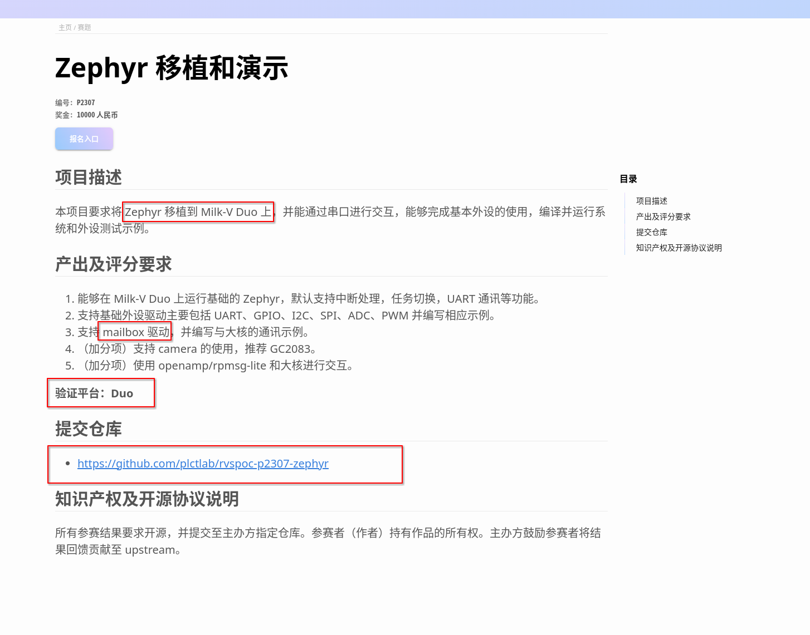

# Zephyr RISC-V 移植快速上手

## 前景提要:

本文是 [P2307 赛题讲解直播回放](https://www.bilibili.com/video/BV1264y1E7PJ) 的文字版。

**以下部分是本次直播后的一些观众提问。**

> Milk-v 是否支持 JTAG 调试？

Milk-v duo 支持 dalink 协议的调试器，可以通过 openocd 进行调试。
以下是 openocd 参考配置文件:

```
adapter driver cmsis-dap

adapter speed     2000

gdb_port 3333
telnet_port 4444

transport select jtag

set _CHIPNAME riscv
jtag newtap $_CHIPNAME cpu -irlen 5 -expected-id 0x00000000

set _TARGETNAME $_CHIPNAME.cpu
target create $_TARGETNAME riscv -chain-position $_TARGETNAME

init
sleep 1500
halt
```

> 是否起始地址一样就可以引导其他 RTOS？

是的。同时也推荐 [duo-toolbox](https://github.com/GeassCore/duo-toolbox) 项目，精简了 SDK,可以仅小核调试。

## 题目介绍



## Zephyr 是什么？

* 小尺寸内核
* 嵌入式系统
* 实时性系统
* 支持多种架构

### 所支持的架构:

* ARCv2 (EM and HS) and ARCv3 (HS6X)
* ARMv6-M, ARMv7-M, and ARMv8-M (Cortex-M)
* ARMv7-A and ARMv8-A (Cortex-A, 32- and 64-bit)
* ARMv7-R, ARMv8-R (Cortex-R, 32- and 64-bit)
* Intel x86 (32- and 64-bit)
* MIPS (MIPS32 Release 1 specification)
* NIOS II Gen 2
* RISC-V (32- and 64-bit)
* SPARC V8
* Tensilica Xtensa

### 仓库列表

* 主仓库: https://github.com/zephyrproject-rtos/zephyr
* SDK 和 开发工具: https://github.com/zephyrproject-rtos/sdk-ng
* Meta 工具: https://github.com/zephyrproject-rtos/west
* Zephyr 例程: https://github.com/zephyrproject-rtos/example-application
* Zephyr 开发环境的 Docker 镜像: https://github.com/zephyrproject-rtos/docker-image

## Duo 上如何运行实时操作系统?

Duo 本身是个双核的配置，大核运行 Linux 操作系统，小核运行了 RTOS,默认是 freertos.

### Duo 上通过 malibox 和小核通信点亮灯泡

> Duo 大核与小核间通信是通过 mailbox 机制实现的，最新的镜像已经在大核的 Linux 内核中添加了 mailbox 驱动，小核 FreeRTOS 代码中也实现了相关功能.

原始内容: [Duo 文档小型 RTOS 章节](https://milkv.io/zh/docs/duo/getting-started/rtoscore)

安装依赖的工具:

```BASH=
sudo apt-get install wget git make
```

获取 duo-examples 仓库源码：

```BASH=
git clone https://github.com/milkv-duo/duo-examples.git --depth=1
```

加载编译环境：

```BASH=
cd duo-examples
source envsetup.sh
```

进入 mailbox-test 目录编译

```BASH=
cd mailbox-test
make
```

编译成功后将生成的 mailbox_test 测试程序通过网口或者 USB网络(RNDIS) 等方式传送到 Duo 设备中，比如 USB 网络方式，Duo 的 IP 为 192.168.42.1，用户名是 root，密码是 milkv

```BASH=
$ scp mailbox_test root@192.168.42.1:/root/
```

在 Duo 上为 mailbox_test 程序添加可执行权限:

```BASH=
chmod +x mailbox_test
```

Duo 的默认固件大核 Linux 系统会控制 LED 闪烁，这个是通过开机脚本实现的，在测试该程序的时候，需要将 LED 闪烁的脚本禁用，在 Duo 的终端中执行:

```BASH=
mv /mnt/system/blink.sh /mnt/system/blink.sh_backup && sync
```

将 LED 闪烁脚本改名，重启 Duo 后，LED 就会变成常关状态。
在 Duo 串口终端中运行 ./mailbox_test 测试，输出如下:

```BASH=
[root@milkv-duo]~# ./mailbox_test 
RT: [507.950049]prvQueueISR
RT: [507.952485]recv cmd(19) from C906B, param_ptr [0x00000002]
RT: [507.958306]recv cmd(19) from C906B...send [0x00000004] to C906B
C906B: cmd.param_ptr = 0x4
RT: [511.965433]prvQueueISR
RT: [511.967867]recv cmd(19) from C906B, param_ptr [0x00000003]
RT: [511.973689]recv cmd(19) from C906B...send [0x00000004] to C906B
C906B: cmd.param_ptr = 0x3
```
灯的效果就是闪一下，然后关闭，程序退出后灯又会变成常关状态。

**蓝色的灯是这里受控的灯**
开启状态


关闭状态


## Zephyr 对 RISC-V 的支持情况

### 支持的 RISC-V 开发板 ( 及 FPGA) 列表

> 可以在 Zephyr 官方文档的 Supported Board -> RISC-V Boards 找到下面的内容

* Andes ADP-XC7K AE350
* BeagleV®-Fire
* ESP32-C3
* ESP32C3_LUATOS_CORE
* GigaDevice GD32VF103C-STARTER
* GigaDevice GD32VF103V-EVAL
* SiFive HiFive1
* SiFive HiFive1 Rev B
* SiFive HiFive Unleashed
* SiFive HiFive Unmatched
* ICE-V Wireless
* ITE IT82XX2 series
* ITE IT8XXX2 series
* LiteX VexRiscv
* Sipeed Longan Nano
* Microchip M2GL025 Mi-V
* Microchip mpfs_icicle
* NEORV32
* INTEL FPGA niosv_g
* INTEL FPGA niosv_m
* OpenTitan Earl Grey
* RISCV32 Emulation (QEMU)
* RISCV32E Emulation (QEMU)
* RISCV64 Emulation (QEMU)
* OpenISA VEGAboard
* SparkFun RED-V Things Plus
* M5Stack STAMP-C3
* Efinix Titanium Ti60 F225
* Telink TLSR9518ADK80D
* XIAO ESP32C3

### 对当前 RISC-V 架构的支持情况

| 功能/模块 | 状态 |
| -------- | -------- |
| PMP     | 支持     |
| ISA 扩展     | (RV32/64I(E)MAFD(G)QC)     |
| SMP     | 支持，但当前仅 QEMU 支持     |

### Zephyr 移植

可以在官方文档 hardware-support -> porting 找到更多内容


| Board | SoC | SoC series | SoC family | CPU core | Architecture |
| -------- | -------- | -------- | -------- | -------- | -------- |
| nrf52dk_nrf52832     | nRF52832     | nRF52     | Nordic nRF5   | Arm Cortex-M4    |ARM     |
| rv32m1_vega_ri5cy    | RV32M1     | (Not use)     | (Not use)     | RI5CY    |	RISC-V     |
| Milk-V Duo     | CV1800B    |   unknown    |  uknown     |  c906     | RISC-V   |

如果 SOC 还不支持 Zephyr, 那么需要先创建 zephyr/soc/<YOUR-ARCH>/<YOUR-SOC>。并参照其他目录下的配置文件，对此此 SOC 做出一些定义。
。
假设 SOC 已经在支持列表了:

直接创建板子文件夹: zephyr/boards/<ARCH>/plank，
plank 代指板子的名称:

```BASH=
boards/<ARCH>/plank
├── board.cmake
├── CMakeLists.txt
├── doc
│   ├── plank.png
│   └── index.rst
├── Kconfig.board
├── Kconfig.defconfig
├── plank_defconfig
├── plank.dts
└── plank.yaml
```

* plank.dts: 按照 SOC 的实际情况填写。devicetree 格式的硬件描述。其中声明了 SoC、连接器和任何其他硬件，如 LED、按钮、传感器或通信外设（USB、BLE 控制器等）。
    
* Kconfig.board, Kconfig.defconfig, plank_defconfig:  (Kconfig) 格式的软件配置。这为软件功能和外设驱动程序提供了默认设置。

以下是可选文件:
 
* board.cmake: 用于烧写和调试支持
* CMakeLists.txt: 如果在编译阶段需要添加其他文件可以通过 CMakeLists.txt.
* doc/index.rst, doc/plank.png: 板子的文档和照片。只有想要贡献到  Zephyr 项目的时候才需要。
* plank.yaml: YAML 文件 包含测试运行器使用的各种元数据。.

当完成这些所有的工作之后，循环编译 Zephyr 的 Samples 并烧写测试，直到达到预期的效果:
    
```BASH=
west build -b plank samples/hello_world
west flash
```

## 如何在已经移植的其他 RISC-V 开发板 (QEMU) 运行 Zephyr


| Host | Target |
| -------- | -------- |
| 开发机     | Zephyr 运行的平台 |

以下内容英文原始内容来自 [官方文档]
(https://docs.zephyrproject.org/latest/develop/getting_started/index.html#install-required-tools)

### 安装开发机所需要的依赖软件

Zephyr 当前对依赖的版本要求:

| Tool | Min. Version |
| -------- | -------- |
| CMake    | 3.20.5   |
| Python  | 3.8      |
|Devicetree compiler| 1.4.6 |


**安装**

```BASH=
sudo apt install --no-install-recommends git cmake ninja-build gperf \
  ccache dfu-util device-tree-compiler wget \
  python3-dev python3-pip python3-setuptools python3-tk python3-wheel xz-utils file \
  make gcc gcc-multilib g++-multilib libsdl2-dev libmagic1
```

**验证**

```BASH=
cmake --version
python3 --version
dtc --version
```

### 获取 Zephyr 并安装 python3 依赖

**安装 Python 虚拟环境**

```BASH=
sudo apt install python3-venv
```

**创建一个新的虚拟环境**

```BASH=
python3 -m venv ~/zephyrproject/.venv
```

**加载虚拟环境**

```BASH=
source ~/zephyrproject/.venv/bin/activate
```

进入这个环境后终端前会有个 .venv 的前缀，如果需要退出此环境的话执行 deactivate 命令即可.


**安装 west:**

```BASH=
pip install west
```

**获取 Zephyr 源码并初始化一个项目**

```BASH=
west init ~/zephyrproject
cd ~/zephyrproject
west update
```

**CMake 用户包注册(编译 Zephyr 应用的时候 CMake 就知道在这里加载一些样板代码了）**

```BASH=
west zephyr-export
```

**安装 Zephyr 的一些 Python 依赖**

```BASH=
pip install -r ~/zephyrproject/zephyr/scripts/requirements.txt
```

### 安装 Zephyr SDK

下载 Zephyr SDK

```BASH=
cd ~
wget https://github.com/zephyrproject-rtos/sdk-ng/releases/download/v0.16.4/zephyr-sdk-0.16.4_linux-x86_64.tar.xz
wget -O - https://github.com/zephyrproject-rtos/sdk-ng/releases/download/v0.16.4/sha256.sum | shasum --check --ignore-missing
```

解压:

```BASH=
tar xvf zephyr-sdk-0.16.4_linux-x86_64.tar.xz
```

推荐解压位置:

```BASH=
$HOME
$HOME/.local
$HOME/.local/opt
$HOME/bin
/opt
/usr/local
```

安装捆绑包

```BASH=
cd zephyr-sdk-0.16.4
./setup.sh
```

配置普通用户可以烧写板子
    
```
sudo cp ~/zephyr-sdk-0.16.4/sysroots/x86_64-pokysdk-linux/usr/share/openocd/contrib/60-openocd.rules /etc/udev/rules.d
sudo udevadm control --reload
```

### 在 QEMU 上运行 Zephyr 的 Samples

https://docs.zephyrproject.org/latest/samples/index.html#samples-and-demos
    
```BASH=
# 先加载 Python 虚拟环境
source ~/zephyrproject/.venv/bin/activate

# -p=always 构建前保持 build 文件夹原始。等同于先清理再构建，可以避免构建不同 Samples 的时候冲突。
# -b qemu_riscv64 指定开发板为 qemu risc-v 64。
# -t t 代表 target 。编译后运行
west build -p=always -b qemu_riscv64 -t run samples/userspace/syscall_perf/
```

#### Hello world
    
```BASH=
west build -p=always -b qemu_riscv64 -t run samples/hello_world
```
    
#### basic synchronization
    
```BASH=
west build -p=always -b qemu_riscv64 -t run samples/synchronization/
```

#### philosophers

```BASH=
west build -p=always -b qemu_riscv64 -t run samples/philosophers
```

#### shared_mem
    
```BASH=
west build -p=always -b qemu_riscv64 -t run samples/userspace/shared_mem/
```