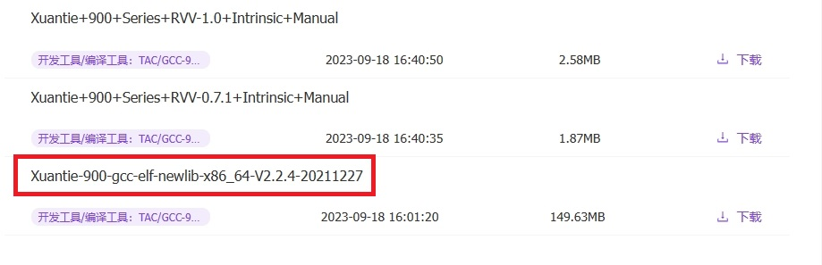
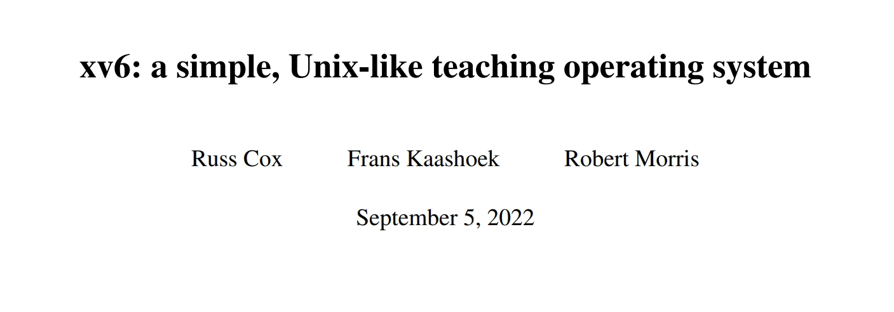
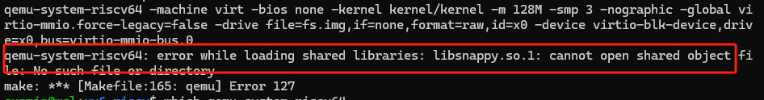
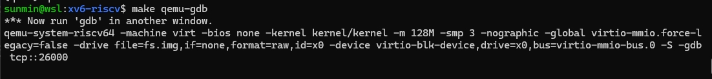
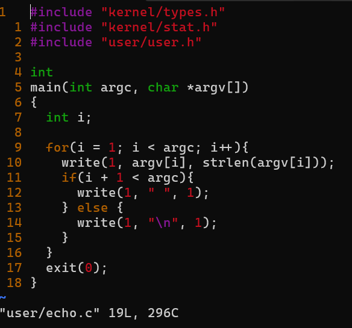
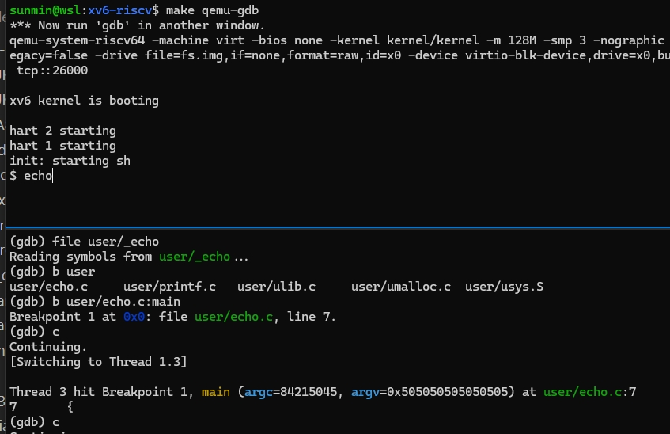

### RISC-V Software Porting and Optimization Championship P2308

## 赛事介绍

#### 官网：https://rvspoc.org/

#### FAQ：https://rvspoc.org/faq/

#### 工作邮箱：rvspoc@cyberlimes.cn

#### 讲解主题：Xv6 移植和演示

#### RVSPOC 组委会 孙敏
<br /><br /><br /><br /><br /><br /><br /><br /><br /><br /><br /><br /><br />

## P2308 赛题描述


本项目要求将 Xv6 移植到 Milk-V Duo 上，并能通过串口进行交互，能够完成基本外设的使用，编译并运行系统和外设测试示例。

## 产出及评分要求

1. 能够在 Milk-V Duo 上运行基础的 Xv6，默认支持中断处理，UART 通讯等功能。
2. 支持基础外设驱动主要包括 UART、GPIO、I2C、SPI、ADC、PWM 并编写相应示例。
3. （加分项）支持 mailbox 驱动，并编写与大核的通讯示例。

**验证平台：Duo**
<br /><br /><br /><br /><br /><br /><br />

## 内容介绍

* 硬件与开发环境准备

* Xv6 riscv 简介

* Xv6 riscv 开发板移植现状 

* Xv6 riscv on qemu

* 总结

<br /><br /><br /><br /><br /><br /><br />

## 环境准备

- WSL (Ubuntu 20.04) inside Win10 on X86_64

- Duo 开发板（64MB） + 串口线 （USB 转串口线）

- Xv6 riscv 源码 

- 工具链，需要下载带 ***newlib*** 字样的

https://www.xrvm.cn/community/download?id=4224193538625179648

- qemu-riscv64
https://www.xrvm.cn/community/download?id=4239362973702885376

## Xv6 riscv 简介



- 源码仓库
https://github.com/mit-pdos/xv6-riscv ~6000 lines of code

- 参考书籍
  https://pdos.csail.mit.edu/6.828/2023/xv6/book-riscv-rev3.pdf 114 pages
  https://github.com/riscv/riscv-isa-manual/releases/download/Ratified-IMAFDQC/riscv-spec-20191213.pdf

- 视频 链接
https://www.bilibili.com/video/BV1w94y1a7i8 17.5 hours

### 内核特性 （kernel space）


- 64 Bit RISC-V 
- SMP: Shared Memory Multiprocessor
- 进程： 行为（fork,wait）、状态（ready to run, running,waiting）、属性（page table,stack），仅支持硬件单线程
- 页表: 虚拟地址空间
- 文件、文件夹（ file descriptor）
- Pipes
- 多任务 （时间片），非 RTOS
- 21 个系统调用接口 (ecall）

### 外设

- UART
- 磁盘 Disk
- 时钟中断 PLIC + CLINT

### 内存管理

- one table per-process (uvm，kvm)
- :white_check_mark:  Sv39 (三级页表)  :x: Sv32 :x: Sv48 
- Page Size 4096 bytes
- :x: variable sized allocation

- 寻址范围 0~256 Gigabytes (2^38^ -1)


### 调度器

round robin : 顺序执行各个 runnable 进程
 


### 系统调用明细


### 应用程序 user space

应用程序

| 名称  | 简介                                 | 名称| 简介    |
| -------- | ----------------------------------- | ------------------- | ----------- |
| sh    | shell 程序                      |  cat             | 文本查看  |
| echo    | 控制台打印序                      |  grep             | 关键字搜索  |
| kill    | 终止进程                      |  ln             | 链接文件  |
| ls    |  查看文件列表                      |  mkdir             | 文件夹创建  |
| rm    | 删除文件                      |  wc             | 单词统计  |

### 缺失的特性

- 用户 ID，登录/退出
- 文件保护机制（rwx）
- 文件挂载
- 内存交换（swap）
- Sockets
- 进程间通信（sync)
- 常见的外设驱动 (RJ45,USB,RNDIS)
- 常见的应用程序 (cd,sleep)


### 启动流程

| 从底向上  | 源码                                 | 备注|程序运行级别|
| -------- | ----------------------------------- | ------------------- |------------------- |
|:arrow_double_up:| user/init.c user/sh.c | 打开串口设备，进入 shell 界面， |User Mode|
|:arrow_double_up:| kernel/main.c |初始化 kernel, 开启第一个用户进程（init）|Supervisor Mode|
|:arrow_double_up:| kernel/start.c |设定 stack pointer ，开启时钟中断| Machine Mode|
|:arrow_double_up:| kernel/entry.S |set up a stack so that xv6 can run C code, 虚拟地址不可用| Machine Mode|
|:arrow_double_up:| boot_loader | 把 kernel.bin 加载到物理地址 0x80000000|板级|
|:arrow_double_up:| 初始化 boot_loader||板级 |

#### init 进程(第一个用户态应用程序)

https://github.com/mit-pdos/xv6-riscv/blob/riscv/kernel/proc.c#L233


## Xv6 riscv on qemu

### qemu 环境准备

- 确保 qemu-riscv64 配置成功

```
qemu-riscv64 --version
```


- 确保 riscv-newlib 工具链配置成功
```
~/bins/Xuantie-900-gcc-elf-newlib-x86_64-V2.2.4/bin/riscv64-unknown-elf-gcc -v
```

### qemu-riscv64 虚拟串口

- qemu 模拟了一款串口芯片 16550
http://bitsavers.trailing-edge.com/components/national/_appNotes/AN-0491.pdf


- xv6 串口驱动

```
 kernel/console.c
 kernel/uart.c
```

- xv6 console 的输入，输出都是通过模拟串口实现的


### xv6 源码编译

* 获取 xv6-riscv  代码 
    ```
    git clone https://github.com/mit-pdos/xv6-riscv.git
    ```

* 指定交叉编译器路径


* 查看 xv6 qemu target


* 编译/运行 xv6 qemu

    ```
    make qemu -j1
    ```
    

* 根据报错提示安装依赖

    ```
    sudo apt install libsnappy-dev libdaxctl-dev libvdeplug-dev
    ```

* 解决编译报错或依赖缺失问题后，重新编译

### xv6-riscv hello world

* hello, world


* 退出 qemu 快捷键
```
 Ctrl + A  X
 ```

### 在 qemu 中调试 xv6

- 在第一个命令窗口开启 gdb server

```
    make qemu-gdb
```



- 在第二个命令窗口 attatch gdb

```
    ~/bins/Xuantie-900-gcc-elf-newlib-x86_64-V2.2.4/bin/riscv64-unknown-elf-gdb

    target remote localhost:26000
```
- 查看 ehco 程序源码



- 在 gdb 窗口里面设定调试代码及断点

```
#加载调试信息
file user/_echo

#设定断点
b user/echo.c:main

#继续执行
continue
```




- 调试 echo 应用程序


- 退出 qemu gdb

```
Ctrl + A C
#输入 quit 命令
quit
#敲击 Enter 键
Enter
```

## Xv6 riscv 开发板移植现状

### 开发板支持情况

1. K210

2. 某 D1 的开发板
https://github.com/michaelengel/xv6-d1/blob/main/README_D1.txt
https://multicores.org/slides/xv6-riscv.pdf

3. FPGA
 https://github.com/x653/xv6-riscv-fpga

4. :x: Milk-v Duo

### Xv6 riscv qemu 与 Duo 板载资源对比

| 名称  | qemu                                 | Duo| 备注    |
| -------- | ----------------------------------- | ------------------- | ----------- |
| CPU    | RV64 多核 (8)                      |  RV64 大核 + 小核核             |   |
| RAM    | 128 Mbytes                      |  64 Mbytes              |   |
|UART|串口   |  真实串口             |   |
|文件系统| Host 磁盘   |  SD 卡              |   |
|时钟 中断| 虚拟时钟，虚拟中断   |  物理时钟，真实中断             |   |
|SPI接口| :x:   |  :white_check_mark:              |   |
|TPU| :x:   |  :white_check_mark:              |   |
|GPIO,RJ45| :x:   |  :white_check_mark:              |   |
|USB、RNDIS| :x:   |  :white_check_mark:              |   |


### Duo 平台移植挑战

#### 基础功能
* UART
* DISK
* 时钟 PLL 中断 异常处理

#### Duo 特有功能

* 移植到大核还是小核
* 外设 GPIO， Spi 接口， SDcard  RJ45， USB
* 内存管理 MMU 脉冲宽度调制 (PWM)

### Duo 平台移植思路(参考)

- kernel (uart)

- system call

- user program

- 生成 SD Image 镜像

- 支持 dd、rufus 等工具刷写镜像到 SD 卡

- 测试 UART 双向通信

- 进一步移植 Duo 上的其它外设(加分项)

## 总结

https://github.com/plctlab/rvspoc-p2308-xv6-riscv/pull/1
