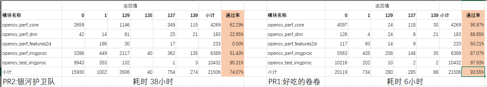
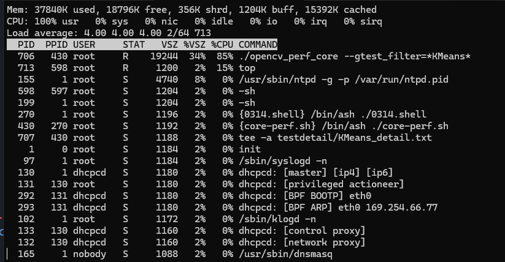

# S2309 选手产出验证

## 验证者:

孙敏 + Ryan

## 产出要求

- 通过 OpenCV 各模块的回归测试 (build/bin/opencv_test_*)。
- 正确运行 OpenCV 各模块的性能测试 (build/bin/opencv_perf_*) 并得到分数。
- 组委会将根据参赛作品的回归测试通过率和性能数据进行评分，两者将按照赛题评审委员会设定的加权比例计算出最终得分，得分最高的参赛者将获得胜利。

## 当前提交

https://github.com/plctlab/rvspoc-s2309-opencv/pull/1 好吃的卷卷 

https://github.com/plctlab/rvspoc-s2309-opencv/pull/2 银河护卫队

## 验证结果

注意，针对 opencv_test_gapi 模块，由于基准测试结果的数据总数有问题；且 pr1 没有提供  模块的二进制，这个模块的测试结果不建议用做评估

### 第一轮测试

- 测试结果明细位于
 https://github.com/plctlab/rvspoc/tree/main/Results/Verifications/S2309/round1/resultAll.xlsx

- 主要模块
    ```
    opencv_test_gapi 
    opencv_test_core
    opencv_perf_imgproc
    opencv_perf_core
    opencv_test_dnn
    opencv_perf_video
    opencv_perf_features2d
    ```

- 测试结果统计
我们按照模块的包含的用例总数进行降序排序，重点看优化幅度一项，优化幅度大于 10% 且用例总数大于 125 个的模块做了加粗效果。图表左侧列出了 OpenCV 模块名称，底部蓝色背景区域的数据表示基准测试、PR1 和 PR2 的总体通过率（过滤了 opencv_test_gapi 模块的结果数据）。最底部一栏列出了三组测试的总体耗时情况。

    


### 第二轮测试

- 测试结果明细位于
 https://github.com/plctlab/rvspoc/tree/main/Results/Verifications/S2309/round2/resultAll.xlsx

    注意！第二轮测试，只选了一个模块用于回归测试，侧重于性能测试
- 测试模块
    ```
    opencv_perf_imgproc
    opencv_perf_core
    opencv_perf_features2d
    opencv_perf_dnn
    opencv_test_imgproc
    ```

- 测试结果
    


## 验证步骤

### 硬件准备

Duo 开发板 * 3
class10 sd卡 * 2,基准测试用 sd卡 * 1


### 软件及工具准备

- SD 卡烧录工具
- 基准测试用 sd 镜像 * 1, pr1 作者提供的镜像 * 1，pr2 作者提供的镜像 * 1
- 选手预编译好的 opencv 库以及二进制程序
- 限制进程只能在一段时间内运行的应用程序，timelimit(v1.9.2)源码


### 测试总思路

opencv 的回归测试和性能测试，基于 gtest，按照运算复杂度，可以拆分成如下，三个维度：
- 以模块为单位: 逐模块测试，会导致卡死
- 以 testsuites 为单位：逐个测试，也会导致长时间无响应，尤其是性能测试
- 以 testcase 为单位，逐个测试,能够在预期时间内完成，且不会死机
    
为了尽可能保证测试的可重复性，考虑到两个 PR 用到的 opencv 版本与赛题直播讲解的可能存在不一致; 以及在 Duo 上测试会出现无响应，死机等等不可预测事件
- 我们打算在 Duo 上输出用做基准测试的 OpenCV4.8.1 （https://github.com/opencv/opencv/archive/refs/tags/4.8.1.tar.gz） 的所有的用例，保存到一个inputAll.csv(https://github.com/plctlab/rvspoc/tree/main/Results/Verifications/S2309/round1/inputAll.csv) 文件，总计54625个用例
- Duo 上根据这个 csv 文件逐个测试里面的用例，每个用例耗时最多不超过 15 秒，测试结果保存到 outputAll.csv
- 最差的情况，跑完整个用例需要 9.5 天左右


- inputAll.csv 简介
字段1：模块名称
字段2：testsuite 名称
字段3：testcase 名称

    

- outputAll.csv 简介
文件首末，保存了测试的启动及完成时间
字段1：模块名称
字段2：testsuite 名称
字段3：testcase 名称
字段4：测试是否通过

    


### 基准测试

在基准测试的Duo上做以下操作

- 把赛题讲解用到的 opencv 4.8.1 的二进制及 so 库拷贝到 Duo 的 /root/bin 和 /root/lib 路径

- 获得所有的测试用例
```
#!/bin/ash

export LD_LIBRARY_PATH='/root/lib/:$LD_LIBRARY_PATH'

for t in opencv_perf_gapi opencv_test_features2d opencv_test_ml opencv_test_calib3d opencv_test_highgui opencv_test_stitching opencv_test_core opencv_test_flann opencv_test_imgcodecs opencv_test_objdetect opencv_test_video opencv_test_dnn opencv_test_gapi opencv_test_imgproc opencv_test_photo opencv_test_videoio opencv_perf_calib3d opencv_perf_core opencv_perf_dnn opencv_perf_features2d opencv_perf_imgcodecs opencv_perf_imgproc opencv_perf_objdetect opencv_perf_photo opencv_perf_stitching opencv_perf_video opencv_perf_videoio

do

echo "$t"
./bin/$t --gtest_list_tests --gtest_output=xml:"$t".xml

done
```

- 在 PC 上把 xml 中的所有用例解析到 inputAll.csv,并且上传到 Duo
- 用 Duo 的工具链编译 timelimt，然后把二进制文件拷贝到 /root/timelimit
- 在 Duo 上逐个测试 inputAll.csv 中的用例，每个用例限定15秒超时，测试脚本 是testAll.sh
https://github.com/plctlab/rvspoc/tree/main/Results/Verifications/S2309/round1/base/testAll.sh

- 脚本会把测试的开始及结束时间打印到 outputAll.csv 的开头和结尾

#### 第一轮测试结果

    注意！基准测试只做了一轮，pr1 和 pr2 做了两轮

    https://github.com/plctlab/rvspoc/tree/main/Results/Verifications/S2309/round1/outputAll-base.csv

### pr1 验证

- 参照选手的说明 
https://github.com/nihui/rvspoc-s2309-opencv/blob/rvspoc/opencv-duo-test/README.md

- 烧录选手提供的 Duo img镜像

- 把选手提供的二进制拷贝到 Duo 的 /root/

- 把测试脚本testAll.sh,timelimit 和i nputAll.csv 拷贝到 /root/

- 键一个软连接，确保 timelimit 能够运行
```
 ln -s /lib/ld-musl-riscv64v0p7_xthead.so.1 /lib/ld-musl-riscv64xthead.so.1
```
- 测试脚本testAlls.sh
https://github.com/plctlab/rvspoc/tree/main/Results/Verifications/S2309/round1/pr1/testAll.sh

#### 测试结果

##### 第一轮结果

https://github.com/plctlab/rvspoc/tree/main/Results/Verifications/S2309/round1/pr1/outputAll-pr1.csv

注意：在统计第一轮的结果时，pr2 尚未测完，只好强制终止了 pr2 的测试，统计结果时，base，pr1，pr2的数据均截至到这个用例
```
opencv_test_gapi,FluidTiledParallel8x10/TiledComputation,Test/42,0
```

注意！！！pr1 没有提供 opencv_test_gapi 模块对应的二进制

##### 第二轮结果

- 第二轮测试时，我们把输出保存到了一个文本文档
```
./testAll.sh 2>&1 | tee -a log.tx
```
- 测试用例，测试 log, 测试结果与测试统计位于
https://github.com/plctlab/rvspoc/tree/main/Results/Verifications/S2309/round2


### pr2 验证

- 源码获取
```
git clone -b 4.x --depth 1 git@github.com:ParadosBoy/rvspoc-s2309-opencv.git
```
- 测试指南
```
sunmin@wsl:rvspoc-s2309-opencv$ cat 测试指南.txt
1.开启swap
!!!选手说swap空间的1024M，实际是256M
mkswap /dev/mmcblk0p3
#swapon命令，重启后就失效了，需要注意
swapon /dev/mmcblk0p3
2.上传 opencv 二进制文件，运行库并配置环境变量
scp -r lib.tar root@192.168.42.1:/root/
在 Duo 上解压
tar -xvf lib.tar
3.把运行脚本 testAll.sh,timelimit 及其所需文件到开发板
4.从开发板下载运行结果到本地
```

- 烧录镜像
```
cd rvspoc-s2309-opencv/提交内容/系统镜像
cat milkv-duo_part_a* > s2309-pr2.img

```

- 上传测试程序脚本及库，并且赋予可执行权限
```
cd rvspoc-s2309-opencv/提交内容/测试程序
scp opencv_* root@192.168.42.1:/root/
scp ../OpenCV\ 运行库/lib.tar  root@192.168.42.1:/root/
```

- 确保 timelimit 能够运行
```
 ln -s /lib/ld-musl-riscv64v0p7_xthead.so.1 /lib/ld-musl-riscv64xthead.so.1
```

- 设定好系统时间 （可选）

```
date -s '2024-03-18 14:54:11'
```

- 执行 ash 脚本
https://github.com/plctlab/rvspoc/tree/main/Results/Verifications/S2309/round1/pr2/testAll.sh


- 测试过程截图




#### 测试结果

##### 第一轮结果

注意：在统计第一轮的结果时，pr2 尚未测完，只好强制终止了 pr2 的测试，统计结果时，base，pr1，pr2 的数据均截至到这个用例
```
opencv_test_gapi,FluidTiledParallel8x10/TiledComputation,Test/42,0
```
https://github.com/plctlab/rvspoc/tree/main/Results/Verifications/S2309/round1/pr2/outputAll-pr2.csv

##### 第二轮结果

- 第二轮测试时，我们把输出保存到了一个文本文档
```
./testAll.sh 2>&1 | tee -a log.tx
```
- 测试用例，测试 log, 测试结果与测试统计位于
https://github.com/plctlab/rvspoc/tree/main/Results/Verifications/S2309/round2
