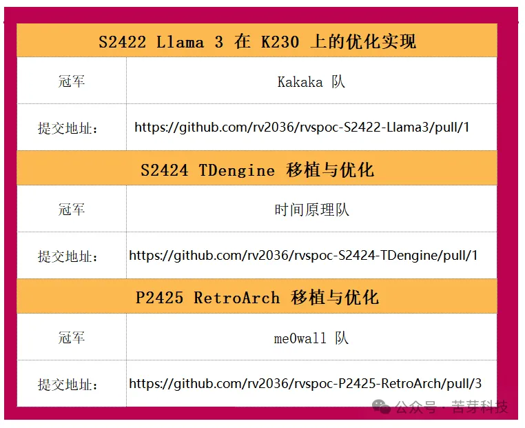

经过紧张刺激的一个月比赛、20天严谨的结果验证和专家评审，以及7天的验证结果公示后，我们终于迎来了第二届 RISC-V 软件移植及优化锦标赛基础赛的冠军揭晓时刻。

经过层层筛选，基础赛获得冠军的队伍为：

我们向所有冠军队伍表示最热烈的祝贺，并对他们在竞赛中展现的专业精神和团队协作表示最深的敬意。

请冠军队伍留意组委会的邮件，我们将与您沟通奖金发放的具体事宜。这份荣誉和奖励是你们辛勤付出的证明，也是对你们技术实力的肯定。

同时，提醒所有参赛选手，加长赛也即将进入尾声。请您抓紧时间提交最终成果，把握最后的机会。

---

原文：https://mp.weixin.qq.com/s/5ULWN3RwjLhSL-FOkRnLmg
