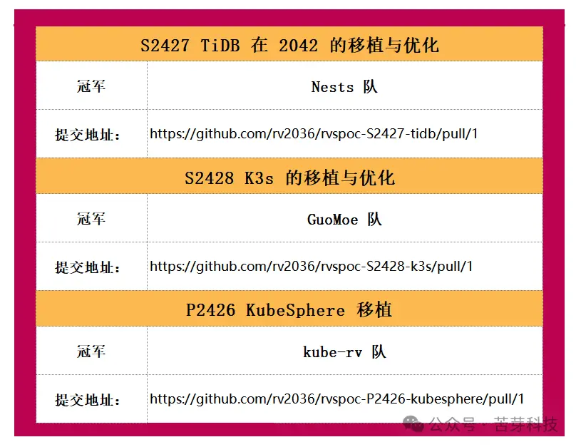

经过一个月激烈的角逐、15 天严谨的结果验证和专家评审、以及 7 天的公示，终于迎来了第二届 RISC-V 软件移植及优化锦标赛加长赛的冠军揭晓时刻。

经过公正的评选，最终获得加长赛冠军的队伍是：

我们向所有冠军队伍表示最热烈的祝贺。请冠军队伍注意查收组委会的邮件，我们将与您联系沟通奖金发放的具体事宜。这份荣誉和奖励是对你们辛勤努力的肯定，也是对你们技术实力的认可。

随着冠军的诞生，本届锦标赛加长赛也画上了圆满的句号。感谢所有参赛队伍的参与，感谢评委和工作人员的辛勤付出。让我们共同期待下一届锦标赛的到来，继续在技术的道路上探索和前行。

---

原文：https://mp.weixin.qq.com/s/oFHkYKs3isbhXCpYtoleyg
