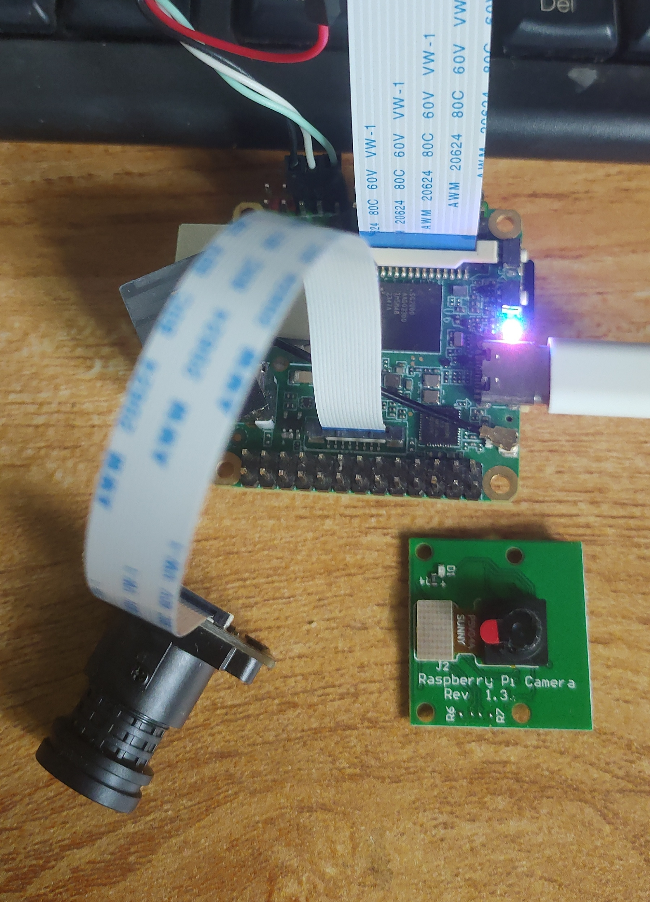

# 基于 V4L2 的 RISC-V 架构摄像头驱动开发


## 赛题要求


[P2501赛题详情链接](https://rvspoc.org/P2501/)

## 验证结果

|      产出验证        | [PR1](https://github.com/rv2036/rvspoc-P2501-v4l2/pull/1)   |     备注         | 
| ------------ | -------------------- | ------------------- |
| 实现 V4L2 驱动 | Y                   | 仅实现了一个驱动框架 |
| 功能测试       | N                    | 能否基于 V4L2 API 获取摄像头预览数据 |
| 文档撰写      | Y                    |用于辅助验证赛题成果 |
| 性能优化      | N                    | |
| 提交时间是否有效         | Y  | 2025-07-01,18:59, GMT+8|
| 验证平台         | DuoS |摄像头模组：GC2083 + OV5647（树莓派CSI接口） |


## 验证步骤

- 准备开发板与外设
  包括 DuoS 开发板、Type-C 数据线、GC2083 和 OV5647 模组、串口线


- 准备 docker 编译环境


- 准备最新源码
    ```bash
    git clone https://github.com/milkv-duo/duo-buildroot-sdk-v2.git
    cd duo-buildroot-sdk-v2
    git submodule update --init --recursive
    ```
- 开启 v4l2 支持


- 编译镜像
    ```
    ./build.sh milkv-duos-musl-riscv64-sd
    duo@479a605c5064:/home/work/duo-buildroot-sdk-v2$ ls -lth out/
    -rw-rw-r-- 1 duo duo 899M Jul  4 11:42 milkv-duos-musl-riscv64-sd_2025-0704-1142.img
    ```

- 编译 sg2000_video_debug.ko
    ```
    source build/envsetup_milkv.sh
    cd sg2000_video
    duo@479a605c5064:/home/work/duo-buildroot-sdk-v2/sg2000_video$ VERBOSE=1 make clean && make
    make -C /home/work/duo-buildroot-sdk-v2/linux_5.10/build/sg2000_milkv_duos_musl_riscv64_sd M=/home/work/duo-buildroot-sdk-v2/sg2000_video modules clean
    make[1]: Entering directory '/home/work/duo-buildroot-sdk-v2/linux_5.10/build/sg2000_milkv_duos_musl_riscv64_sd'
    CLEAN   /home/work/duo-buildroot-sdk-v2/sg2000_video/Module.symvers
    make[1]: Leaving directory '/home/work/duo-buildroot-sdk-v2/linux_5.10/build/sg2000_milkv_duos_musl_riscv64_sd'
    rm -rf modules.order
    make -C /home/work/duo-buildroot-sdk-v2/linux_5.10/build/sg2000_milkv_duos_musl_riscv64_sd M=/home/work/duo-buildroot-sdk-v2/sg2000_video modules
    make[1]: Entering directory '/home/work/duo-buildroot-sdk-v2/linux_5.10/build/sg2000_milkv_duos_musl_riscv64_sd'
    CC [M]  /home/work/duo-buildroot-sdk-v2/sg2000_video/sg2000_video_debug.o
    MODPOST /home/work/duo-buildroot-sdk-v2/sg2000_video/Module.symvers
    CC [M]  /home/work/duo-buildroot-sdk-v2/sg2000_video/sg2000_video_debug.mod.o
    LD [M]  /home/work/duo-buildroot-sdk-v2/sg2000_video/sg2000_video_debug.ko
    make[1]: Leaving directory '/home/work/duo-buildroot-sdk-v2/linux_5.10/build/sg2000_milkv_duos_musl_riscv64_sd'
    ```
    

- 刷写镜像

    

- 接入 GC2083 摄像头，上电开机


- 拷贝 sg2000_video_debug.ko 到开发板


- 确保 .ko 文件完整性


- 安装驱动模块并且尝试从驱动获取相机数据
    ```
    [root@milkv-duo]~# insmod sg2000_video_debug.ko
    [root@milkv-duo]~# v4l2-ctl --list-devices
    SG2000X Camera (platform:sg2000x sg2000x.0):
            /dev/video0

    [root@milkv-duo]~# v4l2-ctl -d /dev/video0 --all
    Driver Info:
            Driver name      : sg2000x
            Card type        : SG2000X Camera
            Bus info         : platform:sg2000x sg2000x.0
            Driver version   : 5.10.4
            Capabilities     : 0x85200001
                    Video Capture
                    Read/Write
                    Streaming
                    Extended Pix Format
                    Device Capabilities
            Device Caps      : 0x05200001
                    Video Capture
                    Read/Write
                    Streaming
                    Extended Pix Format
    Priority: 2
    Format Video Capture:
            Width/Height      : 640/480
            Pixel Format      : 'YUYV' (YUYV 4:2:2)
            Field             : None
            Bytes per Line    : 1280
            Size Image        : 614400
            Colorspace        : sRGB
            Transfer Function : Default (maps to sRGB)
            YCbCr/HSV Encoding: Default (maps to ITU-R 601)
            Quantization      : Default (maps to Limited Range)
            Flags             :
    Framebuffer Format:
            Capability    :
            Flags         :
            Width         : 0
            Height        : 0
            Pixel Format  : ''
            Bytes per Line: 0
            Size image    : 0
            Colorspace    : Default
    [root@milkv-duo]~# v4l2-ctl --device=/dev/video0 --list-formats-ext
    ioctl: VIDIOC_ENUM_FMT
            Type: Video Capture

            [0]: 'YUYV' (YUYV 4:2:2)
            [1]: 'MJPG' (Motion-JPEG, compressed)
    [root@milkv-duo]~# v4l2-ctl --device=/dev/video0 --get-fmt-video
    Format Video Capture:
            Width/Height      : 640/480
            Pixel Format      : 'YUYV' (YUYV 4:2:2)
            Field             : None
            Bytes per Line    : 1280
            Size Image        : 614400
            Colorspace        : sRGB
            Transfer Function : Default (maps to sRGB)
            YCbCr/HSV Encoding: Default (maps to ITU-R 601)
            Quantization      : Default (maps to Limited Range)
            Flags             :
    [root@milkv-duo]~# v4l2-ctl --set-fmt-video=width=240,height=240,pixelformat=YUYV
    [root@milkv-duo]~# v4l2-ctl --device=/dev/video0 --stream-mmap=0 --stream-count=1 --stream-to=output-240x240.raw
    <
    [root@milkv-duo]~#
    ```

- 转换 raw 数据到 jpg
    ```
    Desktop> scp -O root@192.168.42.1:~/output-240x240.raw .
    root@192.168.42.1's password:
    output-240x240.raw          100%  113KB   3.7MB/s   00:00
    Desktop> ffmpeg -pix_fmt yuyv422 -s 240x240 -i output-240x240.raw result-240-240.jpg
    ```
    [output-240x240.raw](./output-240x240.raw)

-  result-240-240.jpg 图片如下

    


- 更换树莓派摄像头 OV5647，重复以上步骤，得到的 `result-240-240.jpg` 与 GC2083 的数据相同
