## RISC-V 软件移植及优化挑战赛（RISC-V Software Porting and Optimization Challenge ）

### RVSPOC 2026 赛题讲解

#### 讲解人：RVSPOC 2026 组委会-孙敏

#### 讲解主题：移植 KleidiCV 到 RISC-V 架构并使用 RVV 进行加速

#### 日期：2026.05.29

#### 讲解回放：https://www.bilibili.com/video/BV1DkEY6tEP6/

<br /><br /><br /><br /><br /><br /><br />

--- 

## 内容大纲

- 题目背景
  
- 赛题描述

- SIMD / RVV 演示

- 从源码编译 OpenCV/kleidicv（native+cross）

- OpenCV 回归测试以及性能测试

- 参考链接

---

## 题目背景

- 计算机视觉场景特点
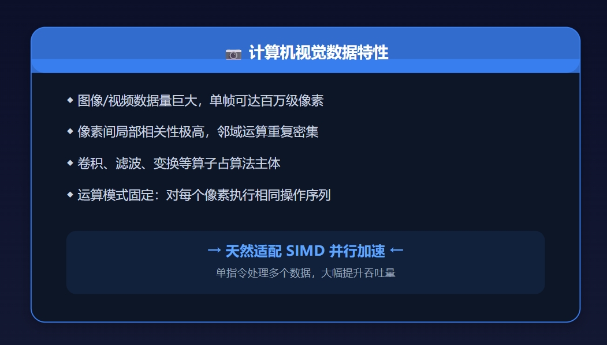

- OpenCV ARM平台现状：完整的优化
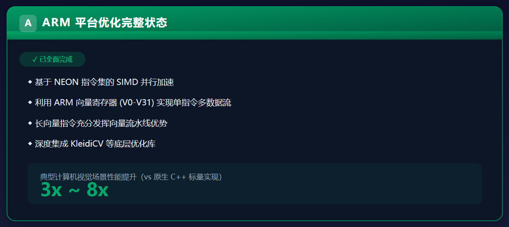

- OpenCV RISC-V 当前基准：原生的纯 C++ 标量实现，循环嵌套，逐像素处理，无法发挥多核和向量流水线优势。
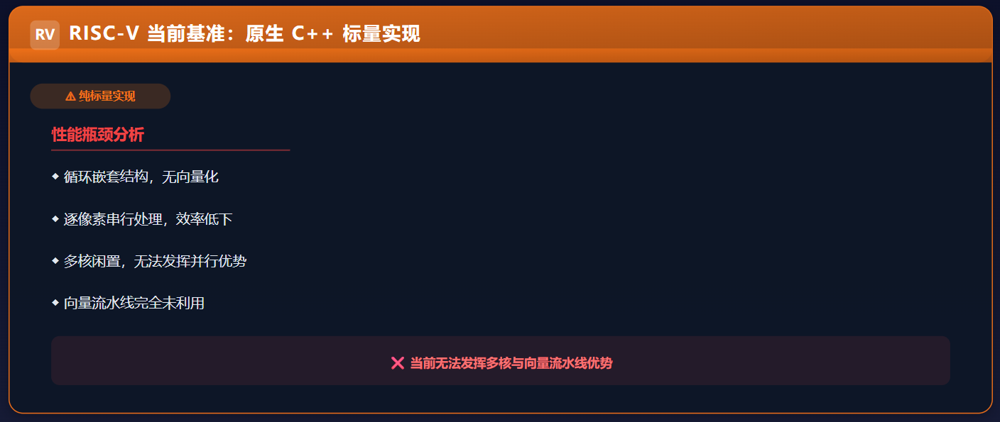

- OpenCV RISC-V 优化目标：通过分析数据依赖，利用 RVV 寄存器（如 v0-v31）和长向量指令（如 vle8.v, vadd.vv），实现单指令多数据（SIMD）的并行计算（非常符合计算机视觉场景）。
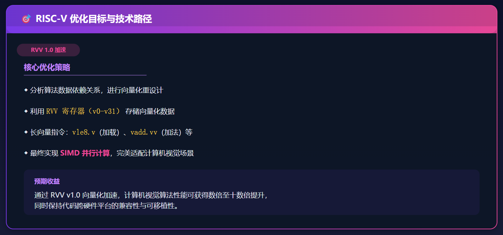

## 赛题定位

题目链接: https://rvspoc.org/P2601
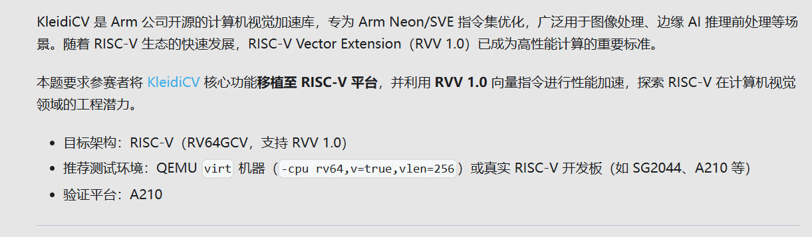

- 适配目标
  KleidiCV (版本号 26.03)所有面向 ARM 平台的算子
- 优化对象
  基础算子（如：Resize 缩放、Gaussian Blur 高斯滤波、Sobel 边缘检测、颜色空间转换等
- 核心任务
将针对传统架构优化的 KleidiCV 算子或 OpenCV HAL 接口，移植（Porting）到 RISC-V 架构上，并利用 RVV (RISC-V Vector Extension) 进行硬件级向量化加速。

```
[计算机视觉应用代码] -> 调用 cv::cvtColor() (颜色空间转换)
                        |
                        v
         [OpenCV 核心框架 (HAL 接口层)]
                        |
       (检测到当前环境为 ARMv9 架构且集成了 KleidiCV)
                        |
                        v
         [KleidiCV 优化算子 (使用 SVE2 指令)]
                        |
                        v
         [ARM Cortex-A 处理器硬件直接执行]
```

## 从源码编译/运行

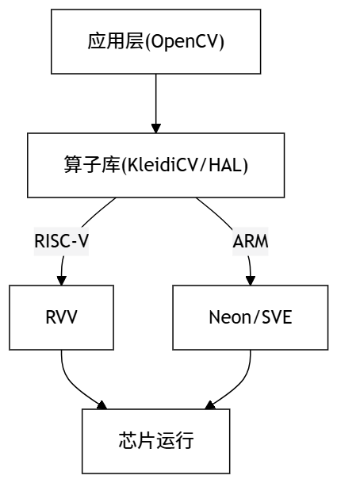

### 编译环境准备

- if target == AArch64
    ```
    #可以直接通过 Native 方式编译
    gcc -march=native -Q --help=target | grep -E "sve|simd|neon"
    ```
- if target == RISC-V 64
  
    推荐 RISC-V 交叉编译（以 GCC 为例，需支持 RVV 1.0）
    ```
    sunmin@wsl:~$ which riscv64-unknown-linux-gnu-gcc
    /home/sunmin/riscv/bin/riscv64-unknown-linux-gnu-gcc
    sunmin@wsl:~$ riscv64-unknown-linux-gnu-gcc -march=rv64gcv -dM -E - < /dev/null | grep riscv_vector
    311:#define __riscv_vector 1
    ```

### 测试平台

- AArch64 : 支持 Neon/SVE的开发板
- RISC-V 64 : 支持RVV 1.0的开发板、qemu-riscv64、qemu-system-riscv64
  
**注意**
qemu 的版本需要足够新（eg. 版本号 > 9.x.x），确保完整支持RVV 1.0
```
sunmin@wsl:~$ qemu-riscv64 --version
qemu-riscv64 version 9.0.2 (v9.0.2)
Copyright (c) 2003-2024 Fabrice Bellard and the QEMU Project developers
```
qemu环境依赖额外的软件包以及工具链的sysroot
```
sudo apt-get install qemu qemu-user qemu-user-static binfmt-support
sudo update-binfmts --enable qemu-riscv64
```

### SIMD/向量优化演示

完整源码：[brightness.cpp](brightness.cpp)

- 标量版本 分支预测带来的性能瓶颈
```
void brightness_scalar(const uint8_t* src, uint8_t* dst, int N, uint8_t val) {
    for (int i = 0; i < N; ++i) {
        int temp = src[i] + val;
        // 标量必须手动做饱和截断，产生条件分支
        if (temp > 255) {
            dst[i] = 255;
        } else {
            dst[i] = static_cast<uint8_t>(temp);
        }
    }
}
```
- neon simd 固定 128 位步长、硬件级饱和加法，以及残差（Tail）处理

**注意**
ARM SVE 已经克服了残差问题

```
#include <arm_neon.h>

void brightness_neon(const uint8_t* src, uint8_t* dst, int N, uint8_t val) {
    int i = 0;
    // Neon 寄存器是固定的 128 位，一张图一次能处理 16 个 8 位像素
    uint8x16_t v_val = vdupq_n_u8(val); 

    // 主循环：每次处理 16 个像素
    for (; i <= N - 16; i += 16) {
        uint8x16_t v_src = vld1q_u8(&src[i]);
        // vqaddq_u8 是带饱和的加法（Saturating Add），超过 255 自动变 255
        uint8x16_t v_dst = vqaddq_u8(v_src, v_val);
        vst1q_u8(&dst[i], v_dst);
    }

    // 【残差处理】：Neon 必须用标量把最后不够 16 字节的尾巴处理掉
    for (; i < N; ++i) {
        int temp = src[i] + val;
        dst[i] = (temp > 255) ? 255 : temp;
    }
}
```

- rvv VLA（向量长度无关）设计，无需手动编写残差循环
```
#include <riscv_vector.h>

void brightness_rvv(const uint8_t* src, uint8_t* dst, int N, uint8_t val) {
    int i = 0;
    // N 是总像素数，vl 是硬件当前单次循环实际能处理的像素数（动态调整）
    for (size_t vl; N > 0; N -= vl, src += vl, dst += vl) {
        // vsetvl_e8m8 动态计算当前最优的 vl 长度，自动处理尾部残差！
        vl = __riscv_vsetvl_e8m8(N); 
        
        // 加载向量
        vuint8m8_t v_src = __riscv_vle8_v_u8m8(src, vl);
        // RVV 的饱和加法函数，直接传入纯量 val，硬件在内部做向量+纯量饱和加
        vuint8m8_t v_dst = __riscv_vsaddu_vx_u8m8(v_src, val, vl);
        // 存储向量
        __riscv_vse8_v_u8m8(dst, v_dst, vl);
    }
}
```

- 图像增强效果图
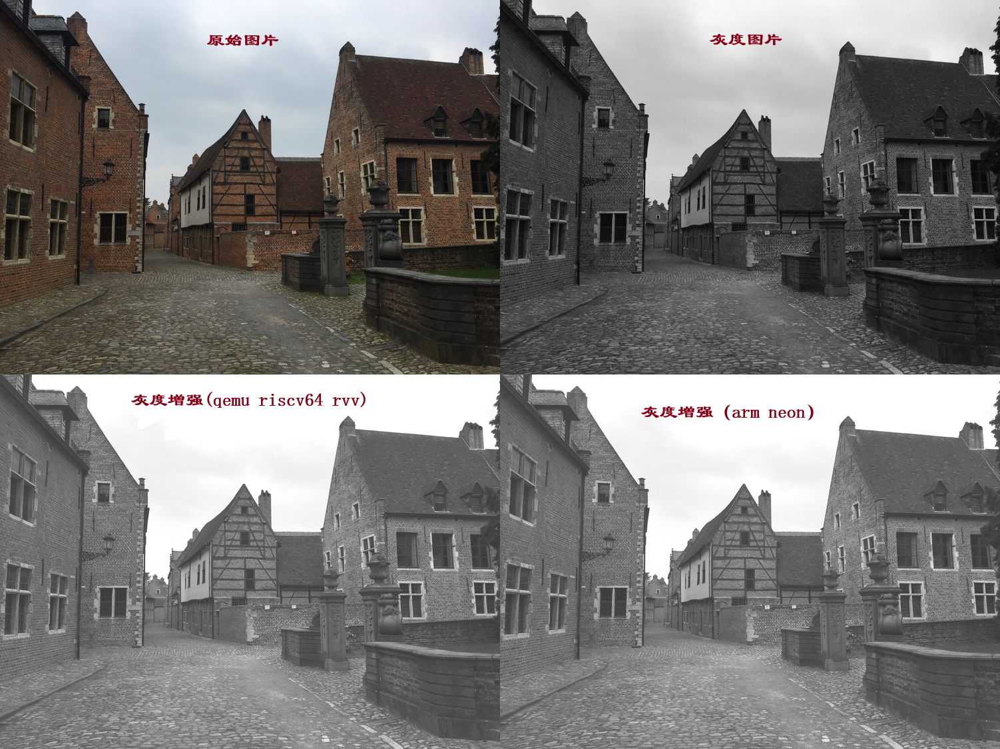

### 源码获取
```
git clone https://gitlab.arm.com/kleidi/kleidicv.git
git tag --list
#切换到 tag 26.03
git checkout 26.03
git branch
* (HEAD detached at 26.03)
  main
#下载 opencv 4.13.0 的源码
https://github.com/opencv/opencv/archive/refs/tags/4.13.0.tar.gz

#下载 opencv 测试集
https://github.com/opencv/opencv_extra/archive/refs/tags/4.13.0.tar.gz
export OPENCV_TEST_DATA_PATH=/home/pi/KleidiCV/opencv_extra/testdata/
```

### Native 编译

- 源码文件夹结构
  ```
  pi@raspberrypi:~/KleidiCV $ ls
  build-kleidicv  build-opencv  kleidicv  opencv-4.13.0  opencv_extra
  ```

- 编译 opencv 
  ```
  cd ~/KleidiCV && mkdir build-opencv && cd build-opencv
  #指定配置（可选）
  cmake /home/pi/KleidiCV/opencv-4.13.0/ \
  -DCMAKE_TOOLCHAIN_FILE=../cmake/xxx-toolchain.cmake \
  -DCMAKE_BUILD_TYPE=Release

  #编译特定 target
  make kleidicv
  #编译默认的 target
  make -j4
  ```
  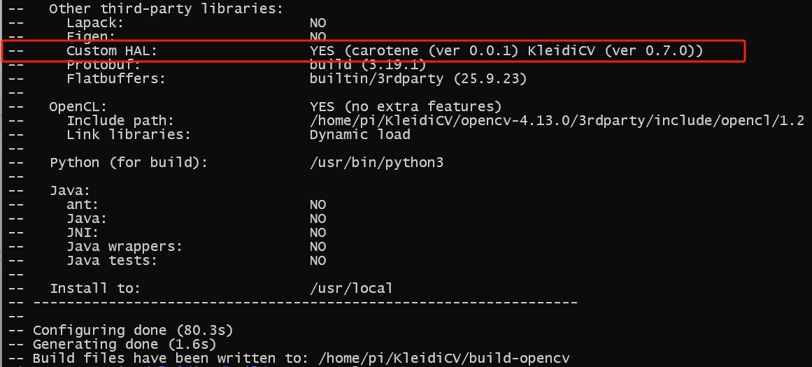
  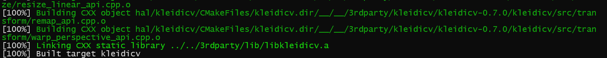

- 指定 OpenCV 中 kleidicv 的路径 KLEIDICV_SOURCE_PATH
  ```
  cd /home/pi/KleidiCV
  mkdir build-kleidicv263 && cd build-kleidicv263
  cmake -S ../opencv-4.13.0/ \
    -DWITH_KLEIDICV=ON \
    -DKLEIDICV_SOURCE_PATH=/home/pi/KleidiCV/kleidicv \
    -DCMAKE_INSTALL_PREFIX=/home/pi/KleidiCV/install-kleidicv263 \
    -DCMAKE_BUILD_TYPE=Release \
    -DBUILD_PERF_TESTS=ON
  make install -j4
  ```
  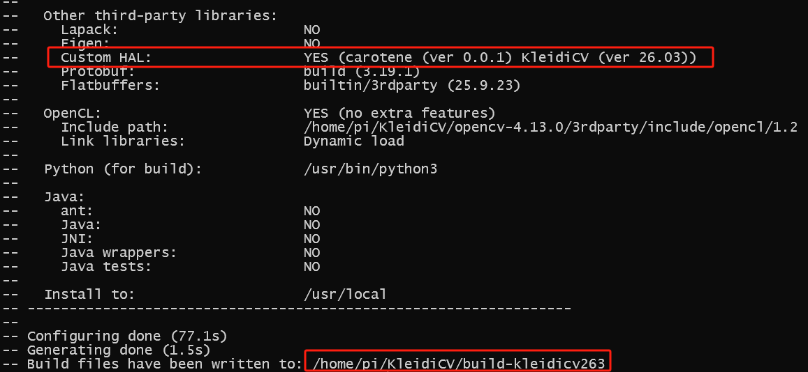

- 单独编译 kleidicv
  ```
  cd /home/pi/KleidiCV
  mkdir build-kleidicv-only && cd build-kleidicv-only
  cmake -S ../kleidicv/ -B .  -DCMAKE_BUILD_TYPE=Release   -DKLEIDICV_BENCHMARK=ON
  make -j4
  make kleidicv-benchmark
  ./benchmark/kleidicv-benchmark --image_width=1280 --image_height=720
  ```
  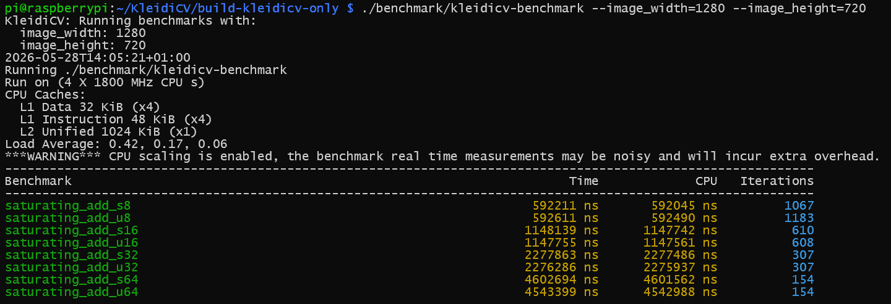

### 交叉编译 opencv 4.13.0

  ```
  #准备相同的源码
  git clone -b 4.13.0 git@github.com:opencv/opencv.git
  cd opencv
  mkdir build && cd build
  #定义工具链路径
  export RISCV_ROOT_PATH=/home/sunmin/riscv/
  cmake -D CMAKE_TOOLCHAIN_FILE=../platforms/linux/riscv-gnu.toolchain.cmake ..
  #编译一个
  make -j4 opencv_test_core  
  ```
  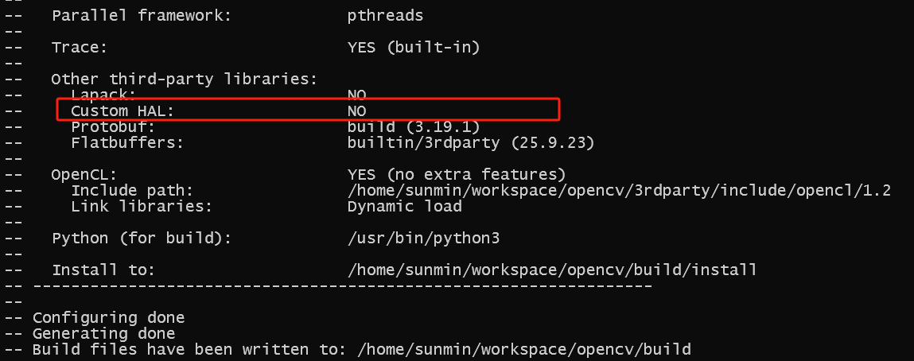

### 运行回归测试

如果是AArch架构的，可以在本地直接运行；如果目标架构是RISC-V，可以将编译好的可执行文件推送到 RISC-V 板端（或通过 QEMU）运行。


测试对象:
**`opencv_test_core`** **`opencv_test_imgproc`** **`opencv_test_imgcodecs`**

- 在 AArch64 开发板本地运行 
    ```
    #再次检查 OPENCV_TEST_DATA_PATH
    pi@raspberrypi:~/KleidiCV/build-opencv $ ls $OPENCV_TEST_DATA_PATH/perf
    1280x1024.png  512x512.png  clean_regex.py   cudafeatures2d.xml  cudastereo.xml   objdetect.xml  video
    1680x1050.png  640x512.png  clean_unused.py  cudafilters.xml     cudawarping.xml  optflow.xml    videoio.xml ...

    #执行 core 模块测试
    ./bin/opencv_test_core
    ```
    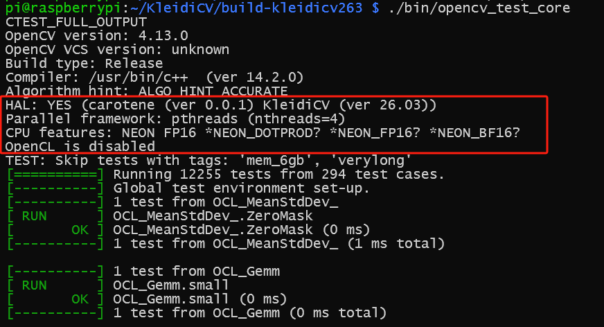
- 将测试程序传送到目标 RISC-V 开发板
    ```
    scp ./bin/opencv_test_core root@riscv-board:/root/
    ssh root@riscv-board "chmod +x opencv_test_core && ./opencv_test_core"
    ```
- 在 X86 的 qemu 环境执行 opencv 回归测试
    ```
    qemu-riscv64 --version
    qemu-riscv64 \
    -L /home/sunmin/riscv/sysroot/ \
    -E LD_LIBRARY_PATH=./lib \
    -E OPENCV_TEST_DATA_PATH=/path/to/opencv_extra/testdata \
    ./bin/opencv_test_core 
    #备注：qemu 环境也支持 gtest 语法 ，eg. --gtest_filter=Core_Math.*
    ```
    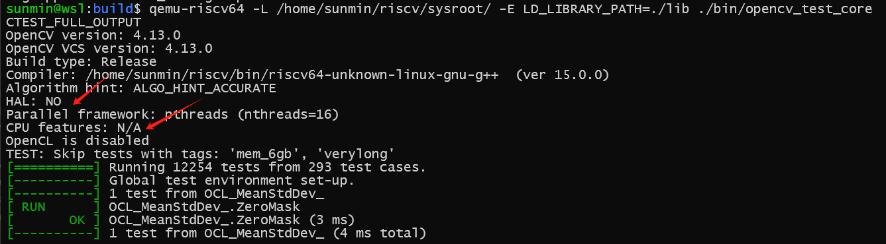

### 在开发板运行性能测试

- ARM开发板
  ```
  pi@raspberrypi:~/KleidiCV/build-kleidicv263 $ ./bin/opencv_perf_imgproc
  ```
  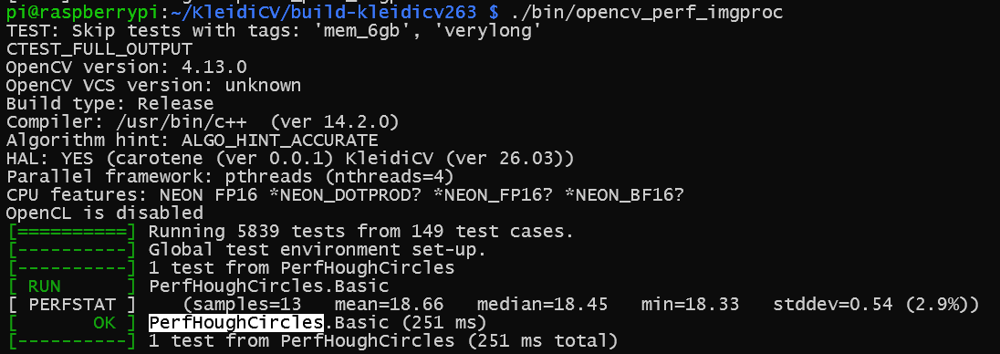

- RISC-V 开发板

  ```
  scp ./bin/opencv_perf_imgproc root@riscv-board:/root/
  ssh root@riscv-board "chmod +x opencv_perf_imgproc && ./opencv_perf_imgproc"
  ```
- 更多 gtest 用法(适合集成到Python/Shell)
  ```
  #运行、把输出保存到文件  
  ./opencv_perf_imgproc 2>&1 | tee -a opencv_perf_imgproc.log
  #过滤用例、保存到 xml
  ./opencv_test_core  --gtest_list_tests --gtest_filter="*Spectrums*" --gtest_output=xml
  ```

- 调用关系
以 opencv_perf_imgproc.PerfHoughCircles 为例

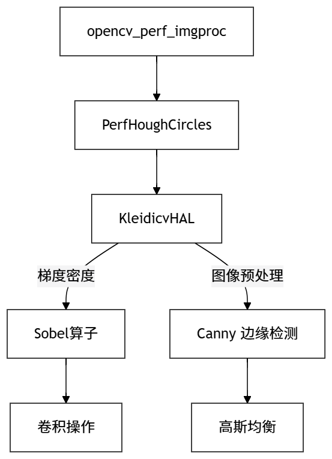

## 参考链接

- [opencv 4.13.0](https://github.com/opencv/opencv/archive/refs/tags/4.13.0.tar.gz)
- [opencv_extra 4.13.0](https://github.com/opencv/opencv_extra/archive/refs/tags/4.13.0.tar.gz)
- [RISC-V 软件移植及优化锦标赛 S2309 演示](https://github.com/rv2036/rvspoc/blob/main/archives/2023/Docs/S2309/S2309.md)
- [RVV Intrinsic 接口在线查看](https://doc.nucleisys.com/tools/intrinsic_viewer/rvv/index.html)