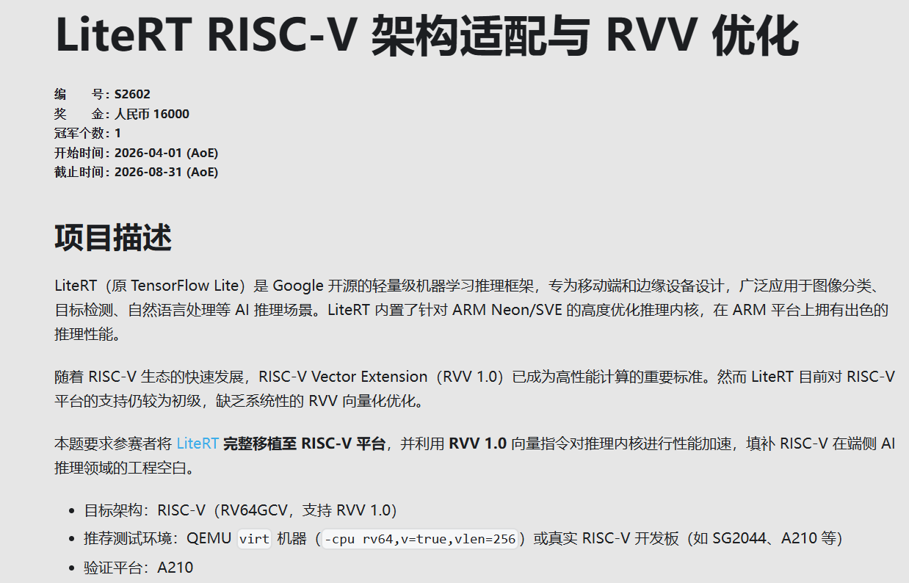
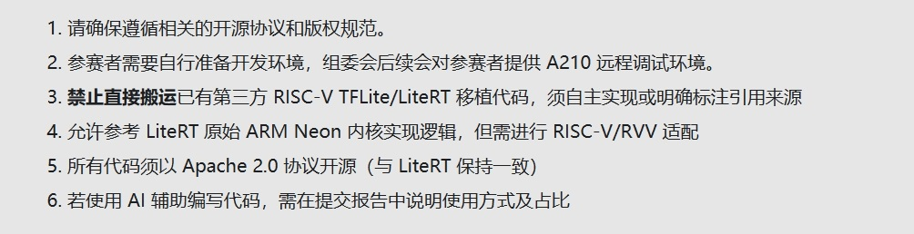
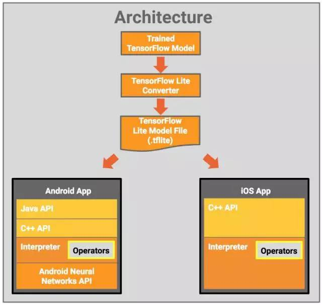
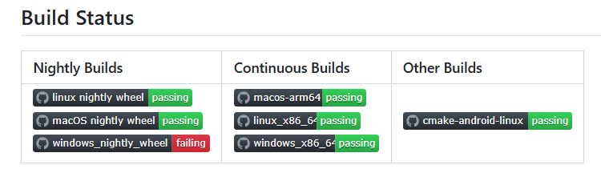
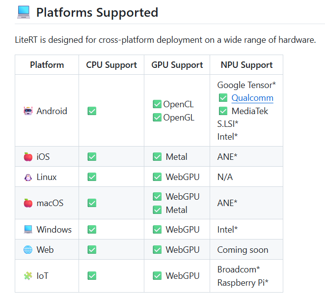
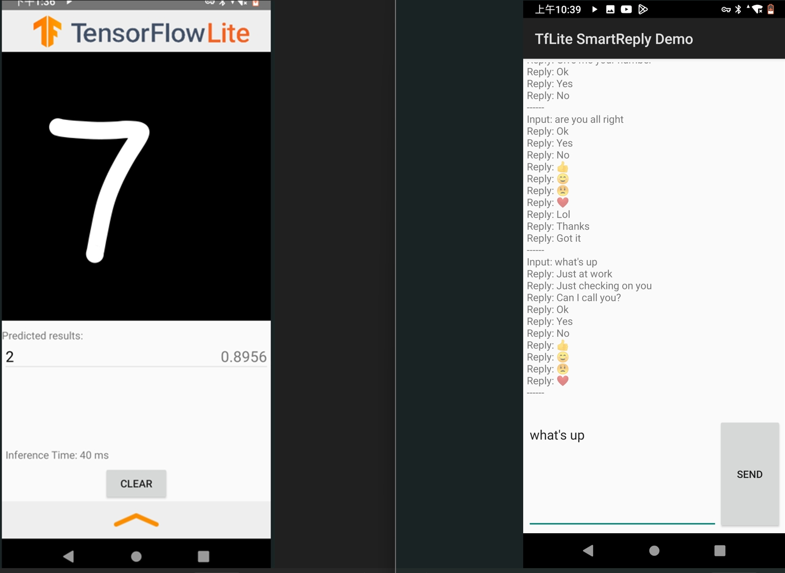
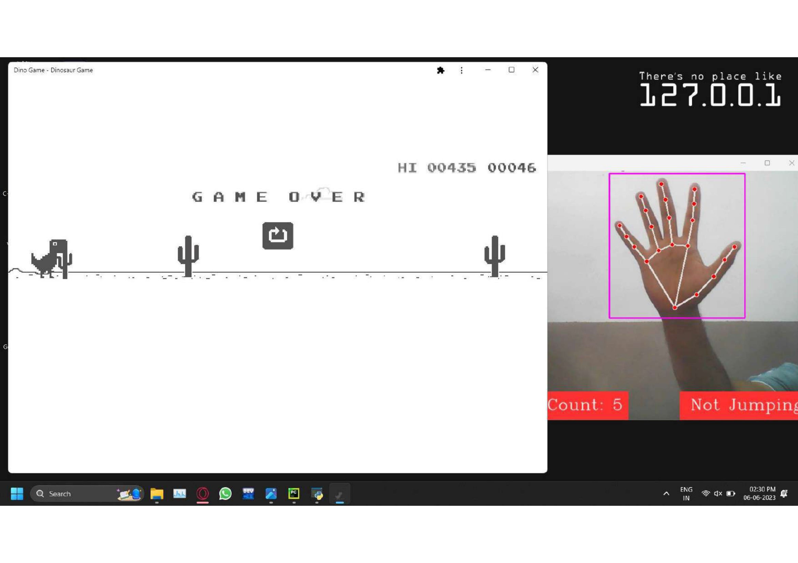
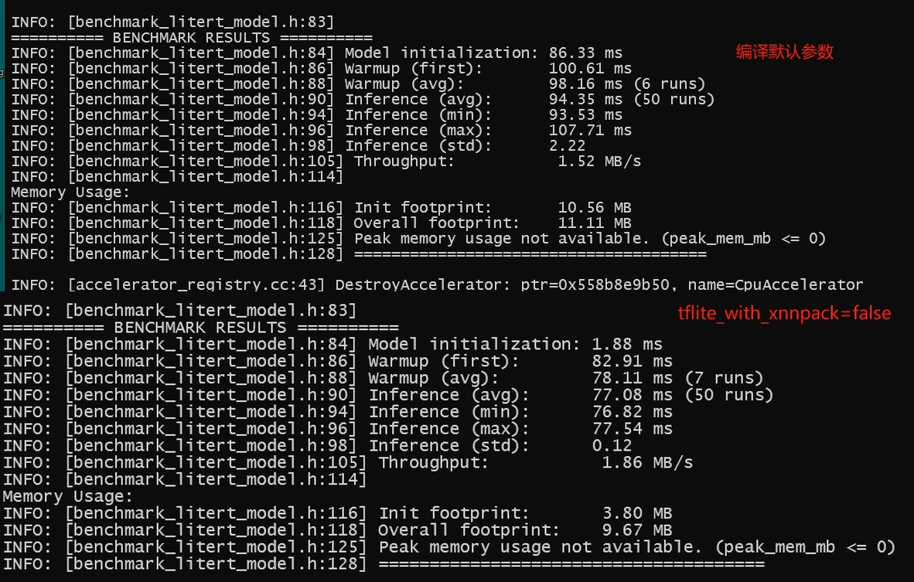

## RISC-V 软件移植及优化挑战赛（RISC-V Software Porting and Optimization Challenge ）

### RVSPOC 2026 赛题讲解

#### 讲解人：RVSPOC 2026 组委会-孙敏

#### 讲解主题：LiteRT RISC-V 架构适配与 RVV 优化

#### 日期：2026.05.22

<br /><br /><br /><br /><br /><br /><br />

--- 

## 内容大纲

- 挑战赛简介

- 赛题描述

- LiteRT 简介

- 在 AArch64/Linux平台树莓派 4B 编译 LiteRT

- 在 X86/Linux容器环境编译 LiteRT

- 性能测试以及内核回归测试

- 总结

--- 

## 挑战赛简介

- 官方网站 https://rvspoc.org/
- FAQ
- 工作邮箱：rvspoc@kubuds.cn

##  赛题描述

- 项目描述
- 评审要求
- 提交说明
  


### 开发环境

| 编译方式               | 验证方式              |
| ---------------- | --------------- |
| riscv64-linux-gnu-gcc | QEMU/RISC-V 开发板           |
| native 编译 | RISC-V开发板/ X86 / ARM     |
| 基于 qemu-system-riscv64 的 native 编译（BR2_PACKAGE_QEMU_SYSTEM） | qemu/RISC-V 开发板 |


### 注意事项



---

## LiteRT 适配/优化流程


### LiteRT 介绍

`LiteRT, successor to TensorFlow Lite. is Google's On-device framework for high-performance ML & GenAI deployment on edge platforms, via efficient conversion, runtime, and optimization.`

`LiteRT（TensorFlow Lite 的继任者）是 Google 面向边缘平台的高性能机器学习和生成式 AI 部署框架，通过高效的模型转换、运行时执行和优化技术，实现设备端（On-device）部署`



### 适配状况




### 内核/后端

LiteRT的内核后端 有四个，Reference kernel是纯CPU实现；Optimized kernel可以加neon/rvv；XNNPACK可以加neon/rvv；还有Ruy和Gemmlowp
| 后端               | 作用              |
| ---------------- | --------------- |
| Reference kernel | 纯参考实现           |
| `Optimized kernel` | CPU SIMD优化      |
| `XNNPACK`          | 高性能 CPU backend |
| Ruy              | GEMM backend    |
| Gemmlowp         | INT8 backend    |


## 如何训练一个 .tflite 模型

**提示！**
如果从源码编译 tensorflow，需要搭建一个完整的 tensorflow 开发环境
也可以通过 Python 虚拟环境直接安装 tensorflow 和 keras 包

- 准备样本数据（包括原始数据和对应标签）

- 模型训练

- 将模型转换到 .tflite

```
import tensorflow as tf
import numpy as np
import gzip
import urllib.request
import os

from tensorflow.python import keras

tf.keras = keras

def load_mnist_manual():
    base_url = "https://storage.googleapis.com/cvdf-datasets/mnist/"
    files = {
        'train_images': ('train-images-idx3-ubyte.gz', 16, 'images'),
        'train_labels': ('train-labels-idx1-ubyte.gz', 8, 'labels'),
        'test_images': ('t10k-images-idx3-ubyte.gz', 16, 'images'),
        'test_labels': ('t10k-labels-idx1-ubyte.gz', 8, 'labels')
    }
    data = {}
    for name, (filename, header_bytes, dtype) in files.items():
        url = base_url + filename
        print(f"Downloading {url}...")
        urllib.request.urlretrieve(url, filename)
        with gzip.open(filename, 'rb') as f:
            f.read(header_bytes)
            if dtype == 'images':
                data[name] = np.frombuffer(f.read(), dtype=np.uint8).reshape(-1, 28, 28, 1)  # ← 改为 4D
            else:
                data[name] = np.frombuffer(f.read(), dtype=np.uint8)
        os.remove(filename)
    return (data['train_images'], data['train_labels']), (data['test_images'], data['test_labels'])

# 加载数据（已经是 4D: [N, 28, 28, 1]）
(train_images, train_labels), (test_images, test_labels) = load_mnist_manual()
train_images = train_images.astype(np.float32) / 255.0
test_images = test_images.astype(np.float32) / 255.0

# 构建模型：输入改为 (28, 28, 1)
model = tf.keras.Sequential([
    tf.keras.layers.Input(shape=(28, 28, 1)),  # ← 4D 输入（需要根据应用程序的需求，修改）
    tf.keras.layers.Flatten(),                  # 自动展平为 784
    tf.keras.layers.Dense(128, activation='relu'),
    tf.keras.layers.Dropout(0.2),
    tf.keras.layers.Dense(10)
])

model.compile(optimizer='adam',
              loss=tf.keras.losses.SparseCategoricalCrossentropy(from_logits=True),
              metrics=['accuracy'])

model.fit(train_images, train_labels, epochs=5, batch_size=32, verbose=1)

# 转换 TFLite
converter = tf.lite.TFLiteConverter.from_keras_model(model)
tflite_model = converter.convert()

with open('mnist_model.tflite', 'wb') as f:
    f.write(tflite_model)

print("4D 模型已保存：mnist_model.tflite")
print("模型输入形状:", converter.get_input_arrays())

#用法
./bazel-bin/tensorflow/lite/tutorials/mnist_train
```

## TensorFlow Lite 运行演示

- 基于手机 App
  

- 基于 Python 脚本
  

- 基于 Linux Shell
  
---

## 从源码编译

- 获取源码
   
    ```
    git clone https://github.com/google-ai-edge/LiteRT.git
    git checkout v2.1.4
    ```

- 在 AArch64/Linux 平台树莓派 4B 编译 LiteRT

    ```
    Bazel build //litert/tools:benchmark_model
    ```

---

- 在 X86/Linux 容器环境编译 LiteRT

    ```
    smin@p70:~/disk/LiteRT/docker_build$ ./build_with_docker.sh --use_existing_image

    [1 / 1] no actions running
    INFO: Found 1 target...
    Target //litert/runtime:compiled_model up-to-date:
    bazel-bin/litert/runtime/libcompiled_model.a
    bazel-bin/litert/runtime/libcompiled_model.pic.a
    bazel-bin/litert/runtime/libcompiled_model.so
    INFO: Elapsed time: 19.097s, Critical Path: 0.28s
    INFO: 1 process: 1 internal.
    INFO: Build completed successfully, 1 total action
    Build completed successfully!

    # 进入容器环境
    docker run --rm -it --user 1000:1000 -e HOME=/litert_build -e USER=smin -v /home/smin/disk/LiteRT:/litert_build litert_build_env bash

    # 手动编译 benchmark_model
    ubuntu@752d044847bf:~$ bazel build //litert/tools:benchmark_model  --define=tflite_with_xnnpack=false

    ```

---

## 运行 benchmark_model (性能测试)

```
#高性能模式，减少噪声
echo performance | sudo tee /sys/devices/system/cpu/cpu*/cpufreq/scaling_governor
#关闭 xnnpack
bazel build //litert/tools:benchmark_model --define=tflite_with_xnnpack=false
#aarch64 平台 默认开启了 xnnpack
bazel build //litert/tools:benchmark_model
./bazel-bin/litert/tools/benchmark_model --graph=models/mobilenet_v1_1.0_224.tflite
#指定 INT8 量化模型
bazel run //litert/tools:benchmark_model -- --graph=$(pwd)/models/mobilenet_v1_1.0_224_quant.tflite --use_gpu=true
```



**提示！**

本次比赛不限定后端，但是需要确保准确

---

## 运行内核回归测试（准确性测试）

- 查看 Neon 相关的代码
    ```
    cd tflite/kernels
    find . -type f \( -name "*neon*" -o -name "*arm*" -o -name "*aarch64*" \) | sort
    ```


- 编译目标
//tensorflow/lite/kernels

- 测试模块：
  - conv_test
  - depthwise_conv_test
  - fully_connected_test
  - mul_test
  - add_test

    ```
    bazel build //tflite/kernels:conv_test
    ./bazel-bin/tflite/kernels/conv_test
    ./bazel-bin/tflite/kernels/conv_test | less
    bazel test //tflite/kernels:conv_test
    ```

---

## 参考链接

- gnu toolchain 
- qemu
- rvv intrinsic 文档
- 提交状态
- [tflite安卓应用示例](https://github.com/tensorflow/examples/tree/master/lite/examples/smart_reply/android)
- [Playing_with_Computer_Vision](https://github.com/alok-ahirrao/Playing_with_Computer_Vision)

- [A210文档中心](https://developer.zhcomputing.com/zh/docs/A210/)
 
