## RISC-V 软件移植及优化挑战赛（RISC-V Software Porting and Optimization Challenge ）

### RVSPOC 2026 赛题讲解

#### 讲解人：RVSPOC 2026 组委会-孙敏

#### 讲解主题：Redis K/V 存储引擎的 RVV 向量化优化

#### 日期：2026.06.24

<br /><br /><br /><br /><br /><br /><br />

--- 

## 内容大纲

- Redis 简介
  
- 赛题描述

- 搭建开发环境

- 从源码编译 Redis

- 回归测试以及性能测试

- 参考链接

--- 

## Redis 简介

诞生于 Web 生态，是一个开源的高性能键值对存储系统高并发中间件。

- 纯内存读写： Redis 的绝大部分操作都在内存中完成，读写延迟通常在微秒级别。

- 单线程模型： 核心的网络 IO 和键值读写是由单线程关联事件驱动（Reactor 模型）完成的。完全避免了多线程频繁上下文切换带来的 CPU 耗损。

- 丰富的数据结构：String、Hash、List...

- 支持持久化：RDB（快照）、AOF（日志） 

- 现有优化：ARM（NEON/SVE），X86（AVX2），原子操作优化、内存分配器(jemalloc)优化等。


## 赛题描述

- 项目描述
- 评审要求
- 提交说明

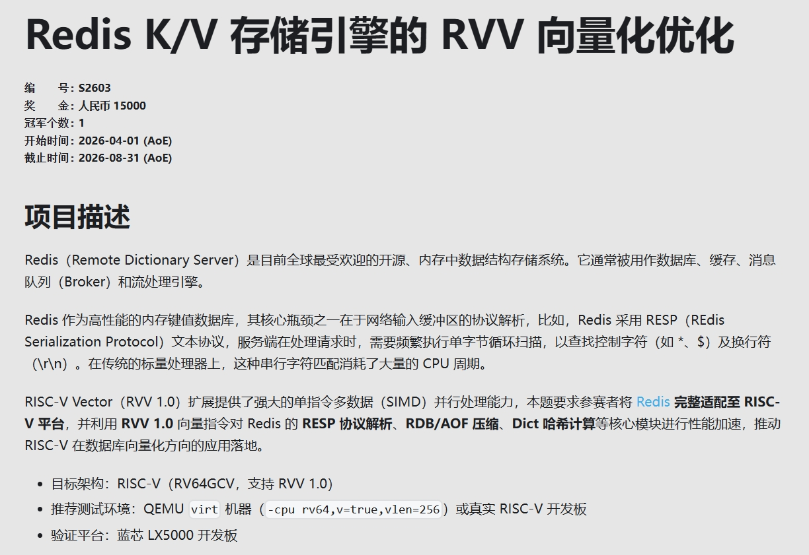
https://rvspoc.org/S2603

### 开发环境

| 编译方式               | 验证方式              |
| ---------------- | --------------- |
| 交叉编译环境 | RISC-V 开发板  |
| 基于 RISC-V 平台的 native 编译 | RISC-V开发板     |
| 基于 qemu-system-riscv64 的 native 编译 | qemu 模拟环境 |

#### 交叉编译环境

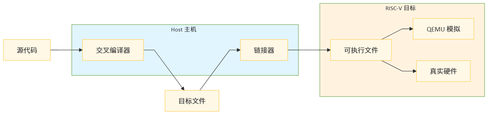

- 通过包管理器获取基础开发组件
    ```
    sudo apt install cmake make pkg-config
    ```
- 从社区下载 riscv-gnu 工具链
  https://github.com/riscv-collab/riscv-gnu-toolchain
  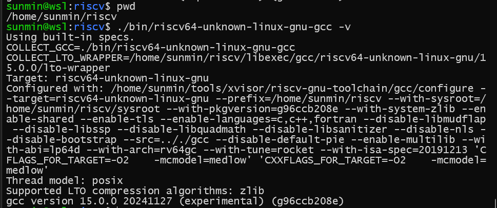
  
#### RISC-V 平台的 native 编译环境

  

- 能运行 Linux

- 从包管理器获取基础开发组件
    ```
    #CentOS、Fedora、openEuler
    yum install make cmake gcc libc-dev g++ ...
    #Debian 系
    sudo apt install make cmake gcc libc-dev g++ ...
    ```
- 确保硬件支持 rvv 1.0
    ```
    # 用编译器宏判断版本
    cat > check_version.c << 'EOF'
    #include <stdio.h>
    int main() {
    #ifdef __riscv_vector
        #if __riscv_v_intrinsic >= 1000000
            printf("RVV 1.0+\n");
        #else
            printf("RVV 0.7.1 or older\n");
        #endif
    #else
        printf("No RVV\n");
    #endif
        return 0;
    }
    EOF
    gcc -march=rv64gcv -o check_version check_version.c
    ./check_version
    ```

#### qemu-system-riscv64 环境


- Host 环境：推荐基于 X86 的Linux
    ```
  $ cat /etc/issue
  Ubuntu 22.04.5 LTS \n \l
  $  apt search qemu-system
  ```
  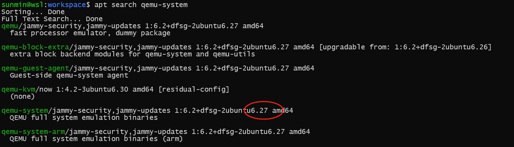

- 安装基础开发组件、qemu 编译依赖
    ref: https://github.com/qemu/qemu/blob/master/docs/devel/build-environment.rst
    ```
    sudo apt install -y make cmake gcc libc-dev g++ \
    bison flex gettext texinfo patch wget python3 python3-venv \
    unzip rsync build-essential ninja-build \
    meson-build git device-tree-compiler \
    autoconf automake libevent-dev \
    zlib1g-dev libssl-dev libboost-all-dev
    ```

- 从源码编译 qemu
    ```
    git clone https://gitlab.com/qemu-project/qemu.git
    cd qemu
    git checkout v10.2.0
    mkdir build
    cd build
    ../configure --target-list="riscv64-softmmu" \
    --enable-fdt --disable-kvm --disable-xen \
    --disable-werror --enable-capstone
    make -j16
    ./qemu-system-riscv64 --version
    ```
    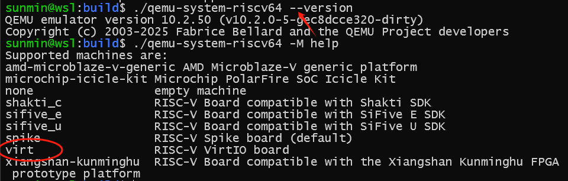

- 准备 Guest 镜像
  ```
  xz -d ubuntu-24.04.4-preinstalled-server-riscv64.img.xz
  qemu-img resize -f raw ubuntu-24.04.4-preinstalled-server-riscv64.img +40G
  ```

- 启动脚本
   默认用户名： ubuntu
   默认密码： ubuntu
    ```
    $ chmod+x ubuntu-24.04.4.sh
    $ cat ubuntu-24.04.4.sh
    #!/bin/bash
    /home/sunmin/workspace/qemu/build/qemu-system-riscv64 \
    -cpu rva23s64 \
    -machine virt,acpi=off -m 6G -smp cpus=4 \
    -nographic \
    -kernel /usr/lib/u-boot/qemu-riscv64_smode/uboot.elf \
    -device virtio-net-device,netdev=net0 \
    -device virtio-rng-pci \
    -netdev user,id=net0,hostfwd=tcp::2228-:22,hostfwd=tcp::6379-:6379 \
    -drive file=ubuntu-24.04.4-preinstalled-server-riscv64.img,format=raw,if=virtio \
    -d guest_errors \
    -D $(pwd)/qemu-system-riscv64_debug.log
    ```
    确保模拟器内部的 ssh 服务正常开启
    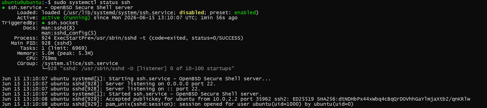

- 在模拟器内部安装基础开发组件
    ```
    #从Host端，连接到模拟器内部
    ssh -p 2228 ubuntu@localhost
    #有4个模拟CPU
    $ cat /proc/cpuinfo | grep processor
    #支持rvv
    $ cat /proc/cpuinfo | grep isa
    $ sudo apt install -y make cmake gcc libc-dev g++ git ...
    ```
    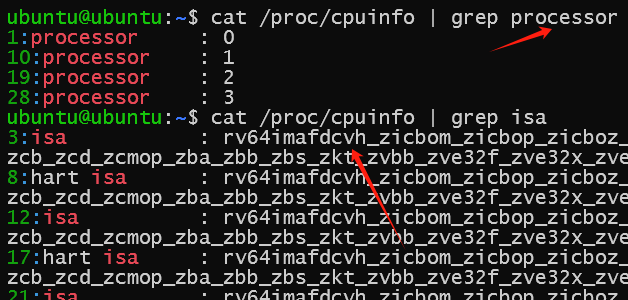

### 从源码编译 Redis 与 memtier_benchmark

交叉编译、qemu模拟环境、开发板 Native 编译方法类似！

- 准备源码
  ```
   git clone redis
   cd redis
   git checkout tag

   git clone https://github.com/redis/memtier_benchmark.git
   cd memtier_benchmark
   git checkout 2.4.1
  ```

- 编译 Redis
  ```
    export BUILD_TLS=yes
    export BUILD_WITH_MODULES=yes
    export INSTALL_RUST_TOOLCHAIN=yes
    export DISABLE_WERRORS=yes
    make -j "$(nproc)" all
  ```
  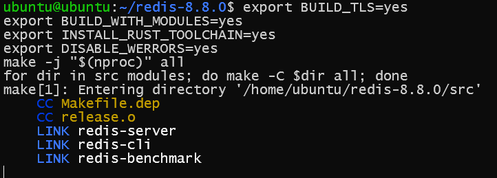

- 编译 memtier_benchmark
  ```
  $ cd memtier_benchmark
  $ autoreconf -ivf
  $ mkdir build && cd build
  $ ../configure && make -j $(nproc)
  $ ./memtier_benchmark --version
  ```
  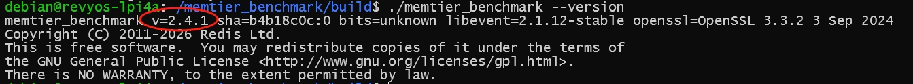


### Redis 回归测试

  ```
    cd redis-8.8.0
    make test
  ```
| 测试环境    |  成功率   | 特点    |
| --- | --- | --- |
|  qemu 模拟器（4核、Ubuntu 24.04）   | 149/149    |  偏慢   |
|  RISC-V 开发板(荔枝派4A Debian)   |  24/149   |  测试不完整   |
|  ARM(树莓派4 Debian)   |  149/149   |  测试完整通过   |

  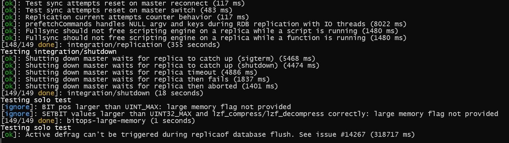
  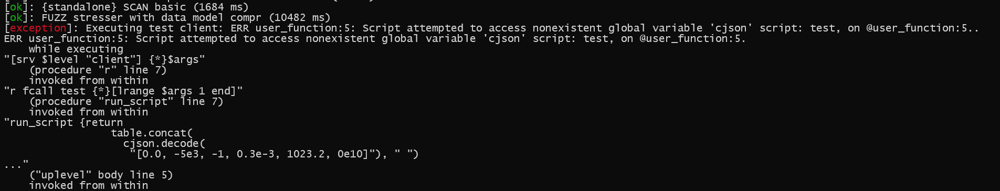
  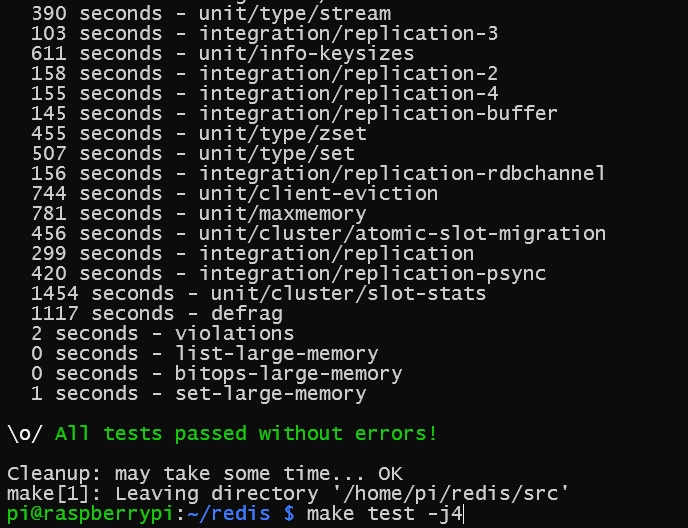

### Redis 性能测试

注意！优先推荐在真实的开发板进行性能测试。

- 开启高性能模式
    ```
    $ echo performance | sudo tee /sys/devices/system/cpu/cpu*/cpufreq/scaling_governor
    $ cat /sys/devices/system/cpu/cpu*/cpufreq/s
    caling_governor
    performance
    performance
    performance
    performance
    ```
- 绑核开启 redis-server
    ```
    $ taskset -c 0-1 ./src/redis-server
    ```
- 绑核开启 memtier_benchmark
    ```
    $ taskset -c 2 ./build/memtier_benchmark \ 
    -s 127.0.0.1 -p 6379 --protocol=redis
    ```
- redis-cli 查看处理日志
  注意！仅作调试，benchmark 测试期间需保持关闭，以免影响性能
    ```
    $ ./src/redis-cli
    127.0.0.1:6379> MONITOR
    ```
    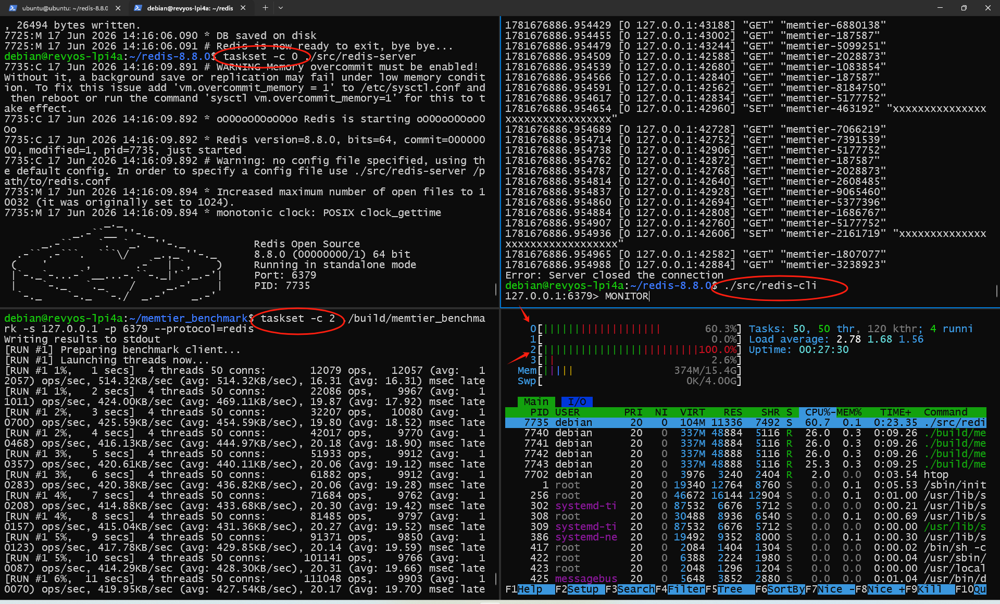

- 测试结果
    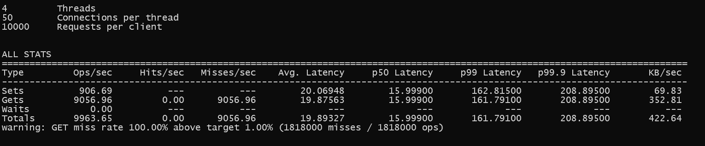

### 参考链接

- gnu toolchain https://github.com/riscv-collab/riscv-gnu-toolchain/releases/download/2026.06.06/riscv64-glibc-ubuntu-22.04-gcc.tar.xz
- rvv intrinsic 文档 https://github.com/riscvarchive/riscv-v-spec/releases/tag/v1.0
- Qemu 模拟环境搭建 https://documentation.ubuntu.com/hardware-support/boards/how-to/ubuntu_supported/qemu-riscv/
 
